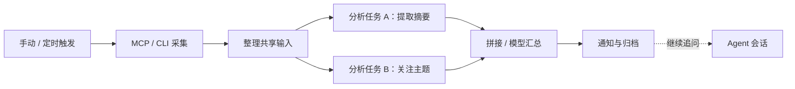

# WorkFLowWeave

**把重复的采集、分析和通知，编织成可复用的 AI 工作流。**

OpenCode Go首充优惠没了，很多大模型额度都改为了15$，Agent就这样因为钱包关起门来吗？

但是或许，我们可以借助WorkFlow的力量，把你的需求固定下来，让你的钱包起死回生


通过 MCP 工具或 CLI 命令获取内容，让多个模型从不同角度分析，按需汇总，再将结果发送给你。流程结束后，可以围绕这次结果继续与 Agent 对话。

如果你每天都让 Agent 搜索相同主题、整理新闻、生成简报，不妨把已经确定的步骤保存下来：程序负责触发与执行，模型负责摘要、分析和判断。每个分析任务都可以选择自己的模型与提示词。

> 项目处于开发阶段，当前包版本为 `0.1.0`。仓库、Python 包与命令行仍使用 `LogAgent` / `logagent` 命名。

[快速开始](#快速开始) · [创建第一个工作流](#创建第一个工作流) · [配置与数据](#配置与数据) · [开发与文档](#开发与文档) · [待补充信息](#待补充信息)

## 为什么使用

许多日常任务的来源、时间和处理步骤早已明确，却仍在每次执行时重新让 Agent 规划。WorkFLowWeave 将这些步骤固定为工作流，让过程可以检查、复用和按计划运行；需要进一步调查时，再进入 Agent 会话。

- **固定流程重复运行**：配置一次来源、处理步骤和通知渠道，之后手动运行或按计划触发。
- **按任务选择模型**：摘要、主题筛选和复杂分析分别配置模型，把更强的模型用在需要它的环节。
- **保留过程与结果**：查看采集、分析、汇总和通知的运行记录，围绕当次归档继续追问。

这样可以减少重复规划与选择工具的模型调用。实际成本仍取决于输入长度、模型、分析分支和运行频率，项目尚未提供统一的成本对比数据。

## 工作方式

以下以每日新闻简报为例；新闻与搜索能力由你接入的 MCP 服务或 CLI 工具提供。



同一份采集输入交给各分析任务，任务完成后按配置汇总和通知。Agent 在独立会话中读取运行结果，可以继续讨论或调用工具补充查询。

适合从以下任务开始，具体内容取决于你配置的来源和提示词：

| 场景 | 采集内容 | 分析与输出 |
| --- | --- | --- |
| 每日新闻简报 | 新闻、搜索结果、订阅更新 | 提取摘要、筛选关注主题、发送简报 |
| 项目动态跟踪 | 发布记录、开发日志、更新信息 | 整理变更、分析影响、通知关键进展 |
| 日志与定期巡检 | CLI 输出或已接入的日志来源 | 提取异常、归纳问题、保留运行记录 |

## 当前能力

| 能力 | 可以做什么 |
| --- | --- |
| 触发与调度 | 手动、指定时间、Cron 和后端固定间隔计划；界面提供单次、每小时、每天、每周及自定义 Cron |
| 数据采集 | 执行 MCP 工具、CLI `argv` / `shell` 命令；保留 Collector 插件来源支持 |
| 输入处理 | 生成原始表示、ISON、TOON、ZON、Markdown 或 CSV 输入，配置总输入、单项与字段 token 限额 |
| 并行分析 | 每项分别选择模型与提示词，支持工作流共享提示词和单项覆盖 |
| 结果汇总 | 按配置拼接分析结果，或调用模型生成汇总 |
| 运行管理 | 查看实时进度和阶段内容，取消、中断续跑或从指定阶段重跑 |
| 通知与对话 | 文件、邮件通知和 QQ 接入；Web Agent 会话及从运行结果继续追问 |
| 管理与扩展 | Vue 管理界面、FastAPI API、命令行客户端，以及目录式插件发现与重载 |

使用时需要了解的当前边界：

- **恢复需要有效 checkpoint 和必要材料**；从阶段重跑会继续执行后续步骤，包括通知。
- **QQ 适配器已有实现，真实平台联调仍待完成**；邮件和 QQ 等外部渠道需要各自的服务配置。
- **Agent 作为工作流分析任务尚未实现**；当前工作流分析是明确的模型请求，结果追问在独立 Agent 会话中完成。

更完整的实现状态和设计差距见 [项目近况与架构](docs/project-status-and-architecture.md)。

## 快速开始

当前提供从源码启动的方式，需要同时运行 Python 后端和前端开发服务。

### 1. 准备环境

- Python **3.11+** 与 [uv](https://docs.astral.sh/uv/getting-started/installation/)。
- Node.js **22.12+** 与 npm，满足当前前端锁定依赖的要求。
- Git；实际使用 MCP 或 CLI 来源时，还需要安装对应服务或命令。

```bash
git clone https://github.com/striiiiiing/LogAgent.git
cd LogAgent
uv sync --group dev
```

### 2. 启动后端

首次生成系统配置；如果已有 `config.json`，直接执行启动命令。

```bash
uv run logagent config-example --output config.json
uv run logagent start --config config.json
```

后端默认监听 `http://127.0.0.1:4300`。保持终端运行，另开终端启动前端。

### 3. 启动前端

```bash
cd frontend
npm ci
npm run dev
```

打开 **http://localhost:3000**。前端默认将 `/api` 请求代理到后端 `4300` 端口。

### 4. 检查服务

```bash
curl -i http://127.0.0.1:4300/api/health
curl -i http://localhost:3000/api/health
```

两次请求都应返回 JSON 健康报告；正常可用时 HTTP 状态为 `200`。如果返回 `503`，按报告中的组件诊断排查；前端返回代理错误时，先检查后端是否运行及端口是否一致。API 交互文档位于 **http://127.0.0.1:4300/docs**。

## 创建第一个工作流

1. **添加来源**：在资源管理中配置 MCP 服务和工具来源，或添加后端可执行的 CLI 命令。
2. **配置模型**：添加 `OpenAI Compatible API` 服务，填写 `base_url`、模型名称及凭据。
3. **选择通知渠道**：新资源库提供 `default_file` 本地文件渠道，也可以配置邮件等外部渠道。
4. **创建工作流**：绑定来源，添加分析任务，分别选择模型和提示词，按需启用汇总，设置通知和运行计划。
5. **手动运行**：在运行记录中检查采集、分析和最终结果。需要深入讨论时，从当次运行结果创建 Agent 会话。

新资源库的来源列表为空，需要自行添加；默认文件通知写入 `data/notifications.txt`。选择其他 `data_dir` 后，通知文件随之调整。

### 先验证一次采集

可以先验证来源，再配置模型。下面的示例需要后端环境中存在 `uname` 命令，适用于提供该命令的 Linux / macOS / WSL 环境。

将以下内容保存为仓库根目录的 `source.json`：

```json
{
  "id": "host_info",
  "call": {
    "kind": "cli",
    "mode": "argv",
    "executable": "uname",
    "argv": ["-a"]
  }
}
```

保持后端运行，在仓库根目录执行：

```bash
uv run logagent resource save sources source.json --create --api-url http://127.0.0.1:4300
uv run logagent collect host_info --api-url http://127.0.0.1:4300
```

第一条命令创建来源，第二条返回采集结果 JSON；成功时 `status` 为 `success`，原始结果包含主机信息。重复创建同名来源会报错，修改已有来源可使用 `--replace` 替换 `--create`。

这里显式指定 `--api-url`，因为当前 CLI 默认地址仍为 `http://127.0.0.1:8000`。也可以设置环境变量 `LOGAGENT_API_URL=http://127.0.0.1:4300`。不依赖 API 服务的采集示例见 [examples/collect.py](examples/collect.py)。

## 配置与数据

| 位置 | 用途 |
| --- | --- |
| `config.json` | 系统配置：监听地址、数据目录、插件目录、并发上限及主密钥配置 |
| `data/resources.json` | 来源、MCP 服务、模型、渠道和工作流等资源 |
| `data/workflows.sqlite3` | 工作流 checkpoint 与业务归档 |
| `data/agents/` | Agent 工作区、运行记录、checkpoint 和渠道状态 |
| `plugins/` | 具体 Collector 与通知 / QQ / Test 渠道插件 |

以上为默认数据位置；系统配置中的相对路径以 `config.json` 所在目录为基准。凭据支持环境变量引用或受保护的加密值，备份与迁移时需要同时保留资源、运行数据和对应的原主密钥。

MCP 支持 stdio、Streamable HTTP 和 SSE。CLI 命令在**后端所在环境**执行；stdio MCP 同样需要后端能够找到其可执行文件。自定义 `plugin_dir` 时，需要将所用插件包放入该目录，插件发现和启停方式见 [插件说明](plugins/README.md)。

修改后端端口后，通过前端 `API_TARGET` 指向相同地址，例如：

```bash
# 在 frontend/ 中执行，替换为实际后端地址
API_TARGET=http://127.0.0.1:8000 npm run dev
```

其他开发环境问题见 [前端 README](frontend/README.md)。

## 开发与文档

后端使用 Python、FastAPI、LangGraph 和 SQLite，前端使用 Vue 3、TypeScript、Element Plus 和 Vite。工作流与独立 Agent 共享模型、MCP、资源和渠道能力。

```text
src/logagent/   后端：采集、工作流、AI、Agent、渠道、配置与 API
frontend/      管理界面与前端测试
plugins/       具体采集器与渠道适配器
examples/      独立调用示例
tests/         后端测试
openspec/      提案、设计、行为契约与实施任务
docs/          项目状态与架构说明
```

| 文档 | 内容 |
| --- | --- |
| [项目近况与架构](docs/project-status-and-architecture.md) | 模块职责、当前实现、设计演进与尚未完成的验收 |
| [前端开发](frontend/README.md) | 代理配置、代码组织、验证命令与环境排查 |
| [插件说明](plugins/README.md) | 插件目录、能力名称和启停配置 |
| [测试导航](tests/README.md) | 按模块运行测试、网络依赖和 60 秒硬超时 |
| [OpenSpec 导航](openspec/README.md) | 产品需求、设计与实施记录 |
| [独立采集示例](examples/collect.py) | 不启动 API 服务，直接运行一个 CLI 来源 |

后端检查示例，在仓库根目录执行：

```bash
timeout 60s uv run pytest tests/config tests/collection -q
uv run ruff check src/logagent
```

前端检查，在 `frontend/` 中执行：

```bash
npm test
npm run typecheck
npm run build
```

部分 AI 测试会调用真实兼容服务，完整测试分组、依赖和浏览器验收要求以 [测试导航](tests/README.md) 为准。提交问题时，请附上复现步骤、运行环境和相关错误信息；提交改动时，说明行为变化及验证结果。

## 后续方向

后续希望让 **Agent 成为工作流的分析任务**：对需要补充搜索、多步调查或动态工具调用的环节，让 Agent 完成分析，再将结果交回工作流汇总和通知。

这一方向来自 [最初提案](openspec/changes/archive/configurable-collection-analysis-workflow/proposal.md)。该提案还记录了按分析任务选择来源、效果评估和画布式编排等方向；这些属于后续规划，具体范围与优先级仍需确认。

## 待补充信息

以下是尚未确认或缺少公开材料的信息，最后一列留给维护者逐项填写。`P0` 优先确认，`P1` 补齐使用与验证材料，`P2` 完善协作入口；填写后可将内容整理到对应章节。

| 优先级 | 信息项 | 当前情况与填写提示 | 你的填写 |
| --- | --- | --- | --- |
| P0 | 正式名称 | 标题沿用现有 `WorkFLowWeave`；仓库、界面、包和 CLI 使用 `LogAgent`。请确认最终名称、大小写及是否更名。 | — |
| P0 | 许可证 | 仓库尚无 `LICENSE` 文件。请确认许可证名称、版权持有人及年份。 | — |
| P0 | 发布状态 | 包版本为 `0.1.0`，项目仍在开发。请确认推荐使用的版本 / commit、稳定性说明及发布计划。 | — |
| P1 | 产品演示 | 仓库已有界面验收截图。请补充一条完整场景的当前版本截图、GIF、视频或演示地址。 | — |
| P1 | 完整示例工作流 | 当前提供单次 CLI 采集示例。请补充可导入的简报 / 巡检工作流、所需资源及预期输出。 | — |
| P1 | 已验证环境 | 已明确运行时依赖。请补充已测试的操作系统、Python / Node.js 版本及最低 CPU / 内存要求。 | — |
| P1 | 模型兼容清单 | 后端支持 OpenAI 兼容 API。请列出实际验证过的服务、模型及能力限制。 | — |
| P1 | MCP 接入示例 | 已支持三种传输。请补充实际验证过的 MCP 服务、安装方式和工具来源配置。 | — |
| P1 | 渠道联调结果 | 已有文件、邮件和 QQ 实现；真实 QQ 联调待完成。请补充配置步骤、测试平台与限制。 | — |
| P1 | 部署与升级 | 本文提供源码开发启动；仓库没有 Docker / Compose 配置。请补充已验证的常驻部署、升级、数据备份及恢复步骤。 | — |
| P1 | 成本与效果 | 尚无统一对比数据。请提供同一任务的模型、输入、运行频率、调用次数、token / 费用及质量对比。 | — |
| P2 | 贡献与反馈 | 尚无独立贡献规范。请确认问题反馈入口、PR 流程、沟通渠道及安全问题报告方式。 | — |
| P2 | 路线图 | 已有 Agent 分析任务等设计方向。请确认近期优先级、验收目标和预计版本，或注明暂无时间承诺。 | — |

</details>
