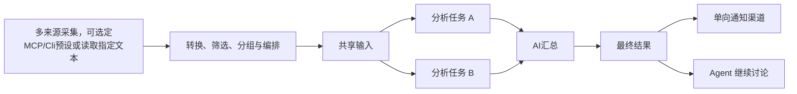

# WorkFLowWeave

**轻量、低成本的个人 AI 助手框架，把重复的采集、分析和通知，编织成可复用的 AI 工作流。**

> OpenCode Go首充优惠没了，很多大模型额度都改为了15$，这不是近乎原价吗，Agent就这样因为钱包关起门来吗？
>
> 但是或许，我们可以借助WorkFlow的力量，把需求固定下来，让钱包起死回生

## 为什么使用

许多日常任务的来源、时间和处理步骤早已明确，却仍在每次执行时重新让 Agent 规划。WorkFLowWeave 将这些步骤固定为工作流，让过程可以检查、复用和按计划运行；需要进一步调查时，再进入 Agent 会话。

- **固定流程重复运行**：配置一次来源、处理步骤和通知渠道，之后手动运行或按Cron触发。
- **按任务选择模型**：摘要、主题筛选和复杂分析分别配置模型，把更强的模型用在需要它的环节。
- **保留过程与结果**：查看采集、分析、汇总和通知的运行记录，围绕当次归档继续追问。

这样可以减少重复规划与选择工具的模型调用。实际成本仍取决于输入长度、模型、分析分支和运行频率，项目尚未提供统一的成本对比数据。

## 截图展示


## 功能特性



### Workflow

各阶段可按需配置或跳过。

- **采集器设置**：基于 MCP 工具或 CLI 命令或读取指定文件组合多个采集器实例，配置字段选择、过滤、排序和分组；处理规则可以保存为“采集器”，在各个工作流中复用，并按需选择。
- **转换、裁剪与编排**：检测采集结果并转换输入格式，默认使用原始表示，也支持 ISON、TOON、ZON、Markdown 和 CSV；可配置整个采集阶段及单个采集器的总输入、单项与字段 token 限额。采集内容按配置顺序传递到后续环节，可以把重要内容放在开头或结尾。
- **分析任务**：每项可独立选择模型或 Agent 模式，并配置差异提示词。支持工作流共享系统提示词与输入模板，以及单项覆盖；共享提示词和采集输入有利于同一模型复用 prompt cache，具体命中取决于模型服务的缓存策略与请求前缀。结果按任务声明顺序传递到后续环节。
- **汇总**：可以选用模型或 Agent 进行汇总，通过 `$input` 将采集输入带入汇总。复用分析任务的模型、系统提示词和输入前缀，有利于命中模型服务的 prompt cache。
- **Agent 任务**：开启 Agent 模式后，可选择工具完成多步分析，首轮结果进入工作流，后续对话保留在关联会话中。全部采用 Agent 时，形成 Orchestrator + 隔离子代理的拓扑架构。
- **手动与定时运行**：保存工作流后，可手动运行、指定时间单次触发或设置 Cron；后端也支持固定间隔计划。支持并发限制、来源超时，以及失败、缺失、空结果等处理策略。
- **展示、查看历史与恢复**：采用 SSE 及时展示运行结果，保存配置快照、采集内容、分析和最终结果，按阶段查看运行历史；可配置备份范围与保留期限，支持取消、基于 checkpoint 恢复和从指定阶段重跑。

### Agent

- **结果续接**：独立创建对话，或从指定的工作流运行、分析任务结果继续追问；会话绑定原来源，并携带工作流结果、MCP 或 CLI 调用描述及参数，便于继续调用相关工具。
- **文件工作区**：通过 `AGENTS.md` 维护系统提示词，使用 `Memory/`、`History/` 和 `Artifacts/` 保存记忆、历史与产物，原始事件与执行 checkpoint 分开保存。
- **按需调用工具**：默认提供 `mcp`、`read`、`write`、`grep`、`shell` 五个工具。通过固定的 `mcp` 入口按需发现工具、读取 Schema 并调用，避免将全部工具 Schema 常驻模型上下文；工具可以独立启停。按需加载的设计借鉴了 pi-mcp-adapter，适用于接入大量工具。
- **分支与上下文管理**：支持从已完成轮次创建分支、编辑用户输入后分支，以及上下文压缩；提供 `/new`、`/resume`、`/workflow`、`/compact`、`/append`、`/fork` 命令。
- **流式交互**：通过 SSE 展示回复和工具执行状态，支持取消及断线续传；Shell 可使用 Linux bubblewrap 沙箱，开关和网络设置由 Agent 配置控制。

### 插件与渠道

插件以 `plugin.json` 声明类型和 Python 入口，由配置模块统一发现并注册；一个插件可以提供多个同类能力。

| 类型        | 用途                          | 当前能力                                                                                                    |
| ----------- | ----------------------------- | ----------------------------------------------------------------------------------------------------------- |
| `channel` | 工作流通知与平台对话接入      | Email、文件、QQ、微信（[corespeed-io/wechatbot](https://github.com/corespeed-io/wechatbot)）、飞书、Telegram |
| `tool`    | 为 Agent 提供可配置的工具能力 | `mcp`、`read`、`write`、`grep`、`shell`                                                           |

- Email 和文件渠道提供工作流通知
- QQ、微信、飞书和 Telegram 同时提供通知和 Agent 对话接入
  - 微信必须先由用户发送消息建立上下文，且每个上下文最多回复 10 条，因此不建议作为单向通知渠道
  - 每个双向渠道实例可绑定一个 Agent 会话，绑定的对话仍可通过 Web 查看；工作流通知无需绑定 Agent 会话。

### 交互

- **Web 管理界面**：配置采集器实例、处理模板、AI 服务与模型、通知渠道和工作流，使用纵向分步表单完成编排。
- **运行结果浏览**：查看历史运行、各阶段内容、错误原因与通知回执；支持可读报告、过程展开和时间筛选。
- **API 与 CLI**：FastAPI 提供资源管理、采集、触发、恢复、取消与只读运行查询；Typer CLI 调用同一 HTTP API，便于脚本集成。
- **日常使用**：支持明暗主题、移动端布局、健康诊断与显式配置重载；AI 配置可被工作流和 Agent 共用。

## 快速开始

可以直接拉取已发布的 Docker 镜像部署，也可以从源码分别启动 Python 后端和前端开发服务。

### docker启动

```bash
docker compose pull
docker compose up -d
```

打开 **http://localhost:3000**。数据保存在命名卷中；停止、更新、备份、微信登录和源码构建方式见 [Docker 启动说明](docs/docker.md)。

### 直接启动

### 1. 准备环境

```bash
git clone https://github.com/striiiiiing/WorkFLowWeave.git
cd WorkFLowWeave
uv sync --group dev
```

### 2. 启动后端

首次生成系统配置；如果已有 `config.json`，直接执行启动命令。

```bash
uv run workflowweave config-example --output config.json
uv run workflowweave start --config config.json
```

保持终端运行，另开终端启动前端。

### 3. 启动前端

```bash
cd frontend
npm ci
npm run dev
```

### 4. 检查服务

```bash
curl -i http://127.0.0.1:4300/api/health
curl -i http://localhost:3000/api/health
```

两次请求都应返回 JSON 健康报告；正常可用时 HTTP 状态为 `200`。如果返回 `503`，按报告中的组件诊断排查

### 创建第一个工作流

#### 通过Web创建

1. **添加来源**：在资源管理中配置 MCP 服务和工具来源，或添加后端可执行的 CLI 命令。
2. **配置模型**：添加 `OpenAI Compatible API` 服务，填写 `base_url`、模型名称及凭据。
3. **选择通知渠道**：新资源库不预置通知渠道；启用并配置包内提供的 Email、文件、QQ、微信、飞书或 Telegram 插件，也可以从用户插件目录导入自定义插件。
4. **创建工作流**：绑定来源，添加分析任务，分别选择模型和提示词，按需启用汇总，设置通知和运行计划。
5. **运行**：在运行记录中检查采集、分析和最终结果。需要深入讨论时，从当次运行结果创建 Agent 会话。

新资源库的来源和通知列表为空，需要自行添加。文件渠道使用 `file` 能力并将可读日志追加到你配置的路径。

#### 通过文件创建

也可以把配置写成 JSON，通过 CLI 导入。下面以已配置好的来源 `my_source`、AI 服务 `my_ai` 和模型 `my_model` 为例，将它们替换为自己的资源 ID 和模型名，保存为 `workflow.json`：

```json
{
  "id": "daily_briefing",
  "name": "每日简报",
  "sources": ["my_source"],
  "analyses": [
    {
      "id": "summary",
      "ai": "my_ai",
      "model": "my_model",
      "user_prompt": "整理输入中的重点，生成一份简短的中文简报。"
    }
  ]
}
```

保持后端运行，在仓库根目录执行：

```bash
export WORKFLOWWEAVE_API_URL=http://127.0.0.1:4300
uv run workflowweave resource save workflows workflow.json --create
uv run workflowweave run daily_briefing
```

Docker 完整部署改用 `http://localhost:3000`。运行命令返回运行 ID，结果在 Web 的运行记录中查看；此例不设置定时或通知。修改 JSON 后，用 `--replace` 代替 `--create` 重新导入。

来源、模型和渠道也使用 `resource save` 导入，资源类型分别为 `sources`、`ai`、`channels`，先导入依赖，再导入工作流。完整配置与导入步骤见[业务工作流示例](examples/workflows/business-scenarios/README.md)。

## 创建邮箱通知渠道

创建 Email 渠道所需的字段见 [SMTP 配置说明](src/workflowweave/plugins/channel/README.md#email-与文件)。邮箱服务的开通入口与教程：

- Gmail：[应用专用密码](https://support.google.com/mail/answer/185833?hl=zh-Hans)
- QQ 邮箱：[帮助中心](https://service.mail.qq.com/)
- 163 邮箱：[SMTP 开通教程](https://blog.csdn.net/weixin_40475396/article/details/78693408)

## 配置与数据

| 位置                                   | 用途                                                                                                                      |
| -------------------------------------- | ------------------------------------------------------------------------------------------------------------------------- |
| `config.json`                        | 系统配置：监听地址、数据目录、插件目录、并发上限及主密钥配置                                                              |
| `data/resources.json`                | 来源、MCP 服务、处理模板、模型、渠道和工作流等资源                                                                        |
| `data/workflows.sqlite3`             | 工作流 checkpoint 与业务归档                                                                                              |
| `data/agents/`                       | Agent 工作区、运行记录、checkpoint 和渠道状态                                                                             |
| `src/workflowweave/plugins/channel/` | Email、文件、QQ、微信（[corespeed-io/wechatbot](https://github.com/corespeed-io/wechatbot)）、飞书和 Telegram 内置渠道插件 |

以上为默认数据位置；系统配置中的相对路径以 `config.json` 所在目录为基准。凭据支持环境变量引用或受保护的加密值，备份与迁移时需要同时保留资源、运行数据和对应的原主密钥。

插件通过 `plugin.json` 的 `entry.backend` 指定入口，并导出 `plugin.register(api)`；包内默认插件位于 `src/workflowweave/plugins/channel/`，用户导入插件位于 `plugin_dir`。唯一的 `plugin_dir/config.json` 管理两类插件启停；用户插件不得覆盖内置插件 ID。Docker 可独立挂载用户插件目录。

MCP 支持 stdio、Streamable HTTP 和 SSE。CLI 命令支持 `argv` 和 `shell` 模式，在**后端所在环境**执行；stdio MCP 同样需要后端能够找到其可执行文件。平台依赖与配置见 [通知插件说明](src/workflowweave/plugins/channel/README.md)。

修改后端端口后，通过前端 `API_TARGET` 指向相同地址，例如：

```bash
# 在 frontend/ 中执行，替换为实际后端地址
API_TARGET=http://127.0.0.1:8000 npm run dev
```

其他开发环境问题见 [前端 README](frontend/README.md)。

## 应用场景举例

工作流不必都采用同一种结构。下面用三个例子，分别说明什么时候适合先压缩再分析、拆分调查后汇总，以及按职责独立产出。

### LLMs as a lossy compressor：以新闻研判为例

**信息很多，但下游关注的问题比较明确时，可以先让轻量模型筛选和压缩，再交给较强模型研判。** 例如，新闻 MCP 取得带摘要、时间和链接的条目后，Luna 按业务目标保留关键事实、数字、来源和不确定性，Sol 只阅读这些压缩卡片，不再接收原始输入。

这里把 LLM 当作有损压缩器：减少交给下一阶段的内容，同时接受部分细节被舍弃。新闻源也可以换成日志或审计记录；关键是按下游问题决定保留什么，而不是只追求摘要更短。压缩不能补回来源本就缺失的正文，也可能遗漏重要信息。

思路参考 [Highlight-Then-Summarize](https://arxiv.org/html/2609.31382v1) 和 [Less Context, Better Agents](https://arxiv.org/html/2606.10209)。这些参考用于说明上下文选择的动机，不代表本项目复现了论文方法或取得了相同效果。

### fan-out / fan-in：以股票分析为例

**一个问题需要从多个角度调查，最后又需要一份综合结论时，可以先拆分任务，再汇总结果。** 例如，分析一只股票时，将经营财务、估值行情和风险事件分别交给三个 Luna Agent，通过 MCP 查找各自需要的证据，再由 Sol 汇总共识、分歧、数据截止时间和证据缺口。

这就是 fan-out / fan-in：前者拆分调查职责，后者合并各分支的结果。它适合各方向可以分别调查、最终仍需综合判断的任务；分支不必使用相同的模型或提示词。示例使用 NVDA 展示流程，标的可以替换，输出不构成投资建议。

### 任务分工（无 fan-in）：以 GitHub issue 为例

**需要的是几份用途不同的结果，而不是一份统一结论时，完成分工后就可以直接输出。** 例如，同时读取一个新 issue 和仓库 README：一个任务让较强模型判断业务影响、严重度和修复必要性，另一个任务让轻量 Agent 通过 GitHub 官方 MCP 调查相关代码、评论和关联 PR，分析技术根因。

前一份回答“是否值得修、优先级多高”，后一份回答“问题可能出在哪里”。两项任务分别使用共享输入，两份结果独立保留，不设置 fan-in，省去没有必要的汇总调用；需要继续调查时，再从对应结果进入 Agent 会话。

配置文件见[业务工作流示例](examples/workflows/business-scenarios/README.md)，实际运行结果与限制见[验证记录](docs/business-scenarios-validation-20261007.md)。

## 技术栈

| 层次           | 技术                                                            | 职责                                     |
| -------------- | --------------------------------------------------------------- | ---------------------------------------- |
| 后端与接口     | Python 3.11+、asyncio、FastAPI、Uvicorn、Typer                  | 异步采集、服务接口与命令行               |
| 工作流与 Agent | LangGraph、LangChain、OpenAI 兼容 API                           | 流程执行、checkpoint、模型调用与工具调用 |
| 配置与存储     | Pydantic、JSON Schema、JSON、SQLite、SQLModel                   | 配置校验、资源持久化与运行存档           |
| 前端           | Vue 3、TypeScript、Vue Router、Element Plus、Tailwind CSS、Vite | 管理界面、工作流编辑与 Agent 对话        |
| 开发与验证     | uv、pytest、Ruff、Vitest、Playwright                            | 依赖管理、静态检查、单元与浏览器测试     |

## 环境要求

| 依赖           | 要求                                                                                                          |
| -------------- | ------------------------------------------------------------------------------------------------------------- |
| Python         | **3.11+**，使用 [uv](https://docs.astral.sh/uv/getting-started/installation/) 安装依赖与运行后端         |
| Node.js / npm  | **Node.js 22.22.2+（22.x）或 24.15.0+（24.x）**，使用 `npm ci` 按前端锁文件安装；本次实测 24.15.0     |
| 模型服务       | 使用分析或 Agent 时，需要可访问的 OpenAI 兼容 API；Agent 工具调用需要模型支持 tool calling                    |
| Shell 沙箱     | Agent 的默认 Shell 沙箱需要 Linux、`bubblewrap`（`bwrap`）及可用的用户命名空间；可在 Agent 设置中显式关闭 |
| 外部采集与通知 | 按所用插件准备服务、可执行程序或凭据；邮件通知需要 SMTP 服务                                                  |

### 实测摘要（2026-10-08）

- **轻负载部署**：在 2 vCPU、1,608 MiB 内存、无 swap 的服务器上，原生和 Docker 的前后端部署均通过健康检查与真实 CLI 采集；负载阶段应用工作集峰值分别为 **148.7 / 187.0 MiB**，不含操作系统和 Docker 守护进程。两组分别完成 4,170 / 3,963 次请求，无失败。
- **业务编排**：在 512 MiB、无 swap 的隔离应用预算下，100 条记录的小输入测试完成 **56 次工作流、72 次文件通知**；

以上是短时测试，不代表真实模型、多轮 Agent 或长期运行的容量保证。

详细环境、采样数据和复现方式：[部署测量](artifacts/deployment-20261008/README.md#latest-four-mode-measurements) · [业务压测](artifacts/backend-business-pressure-20261008/README.md) · [只读 API 压测](artifacts/backend-pressure-20261008.json)。

## 开发与文档

后端使用 Python、FastAPI、LangGraph 和 SQLite，前端使用 Vue 3、TypeScript、Element Plus 和 Vite。工作流与独立 Agent 共享模型、MCP、资源和渠道能力。

```text
src/workflowweave/   后端：采集、工作流、AI、Agent、渠道、配置与 API
frontend/      管理界面与前端测试
src/workflowweave/plugins/  内置通知与双向对话渠道适配器
plugin_dir/   用户导入的插件（运行时配置目录）
examples/      独立调用示例
tests/         后端测试
openspec/      提案、设计、行为契约与实施任务
docs/          项目状态与架构说明
```

| 文档                                                                                           | 内容                                           |
| ---------------------------------------------------------------------------------------------- | ---------------------------------------------- |
| [项目近况与架构](docs/project-status-and-architecture.md)                                       | 模块职责、当前实现、设计演进与尚未完成的验收   |
| [前端开发](frontend/README.md)                                                                  | 代理配置、代码组织、验证命令与环境排查         |
| [通知插件说明](src/workflowweave/plugins/channel/README.md)                                     | 六个渠道的目录、依赖、能力与微信登录步骤       |
| [Workflow Agent 实施记录](openspec/changes/port-workflow-agent-task-execution-current/tasks.md) | Agent 分析与汇总、工具隔离、会话关联和验证边界 |
| [测试导航](tests/README.md)                                                                     | 按模块运行测试、网络依赖和 60 秒硬超时         |
| [OpenSpec 导航](openspec/README.md)                                                             | 产品需求、设计与实施记录                       |
| [独立采集示例](examples/collect.py)                                                             | 不启动 API 服务，直接运行一个 CLI 来源         |

OpenSpec 中的提案和设计说明目标与行为约束，实施与验收状态以对应任务记录为准。

后端检查示例，在仓库根目录执行：

```bash
timeout 60s uv run pytest tests/config tests/collection -q
uv run ruff check src/workflowweave
```

前端检查，在 `frontend/` 中执行：

```bash
npm test
npm run typecheck
npm run build
```

部分 AI 测试会调用真实兼容服务，完整测试分组、依赖和浏览器验收要求以 [测试导航](tests/README.md) 为准。提交问题时，请附上复现步骤、运行环境和相关错误信息；提交改动时，说明行为变化及验证结果。

## 许可证

本项目采用 [MIT 许可证](LICENSE)。
