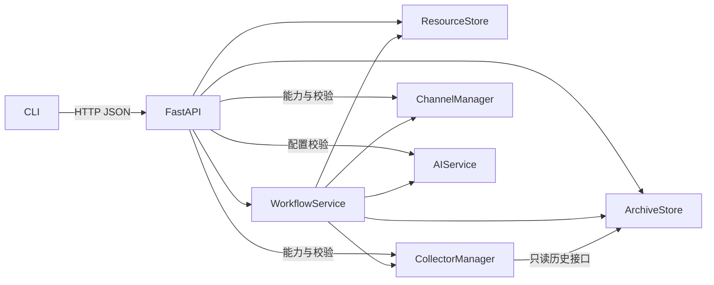

# LogAgent 模块通信与公共接口

## 1. 适用范围与文档关系

本文是项目级的模块协作契约，约定谁调用谁、传入什么、返回什么，以及配置、状态、错误和生命周期由谁负责。各模块实现前先遵守本文，再细化模块内部设计。

产品范围以 [总体提案](openspec/changes/configurable-collection-analysis-workflow/proposal.md) 为准；架构背景和版本计划见 [总体设计](openspec/changes/configurable-collection-analysis-workflow/design.md)。七个模块各自的 proposal/design/tasks 位于 [模块目录](openspec/changes/configurable-collection-analysis-workflow/modules/README.md)。接口调整须同步本文、受影响模块设计及契约测试，不能只修改某一个调用方。

当前配置和存档模块已实现；采集模块为本次实施范围；AI、Channel、Workflow、API/CLI 接口属于后续实施约定。文档中的签名不表示对应功能已经交付。技术选型 ADR 继续留待后续讨论。

## 2. 通信方式与依赖方向

首版运行在单个 Python 进程。内部模块通过依赖注入后的 Python 方法直接调用；需要等待的操作使用 async/await。CLI 的业务操作通过 HTTP 调用 API，API 调用内部应用服务。模块不通过 HTTP 回调同进程的其它模块，也不交换磁盘文件路径来代替公共接口。



| 模块 | 接收的依赖与输入 | 提供给其它模块的能力 | 状态归属 |
| --- | --- | --- | --- |
| configuration | 系统配置路径、资源模型 | 配置读写、引用检查、Setter 展开、确定快照 | 可复用资源，不保存本次执行状态 |
| archive | 根目录、快照、备份策略、阶段结果 | session 记录、内容存取、完整性和恢复材料 | 管理记录、内容索引及过期标记 |
| collectors | 已展开 SourceConfig、只读存档接口、日志路径 | 单来源校验与 CollectionResult | 一次调用的独立 Collector 实例 |
| ai | 独立 AIConfig、共享文本、提示词、工具上下文 | AnalysisResult | 一次分析及其有限工具调用 |
| channels | 独立 ChannelConfig、Notification | DeliveryResult、通知实例生命周期 | 平台实例与在途投递 |
| workflow | 上述五个模块、Workflow 定义 | 校验、触发、调度、取消和恢复 | 运行任务、并发额度、阶段推进 |
| interaction | 由应用装配的上述服务 | HTTP API、薄 CLI、启动关闭 | 应用生命周期和协议转换 |

Collector 不调用 Workflow、AI 或 Channel；AI 不重新解析 ResourceStore；Channel 不查询 Archive 或决定恢复；Archive 不调用任何执行模块。每次运行的停止/跳过策略、共享输入编排和最终业务状态只由 Workflow 决定。

## 3. 公共数据、配置和错误

公共模型唯一来源为 [logagent/models.py](logagent/models.py)，禁止各模块另建同名但字段不同的 DTO。模型跨 JSON 边界时使用 `model_dump(mode="json")`，读回使用对应模型校验；插件的自由 JSON 字段只允许有限数值、字符串键对象、数组和标量。

| 类型 | 跨模块用途 |
| --- | --- |
| SystemConfig | 已解析的资源、插件、日志路径及服务并发上限 |
| SourceConfig / SetterTemplate | 来源类型、来源选项、Setter 与来源失败策略 |
| AIConfig / AnalysisTask / FanInConfig | 可复用模型配置、分支提示词及可选汇总配置 |
| ChannelConfig / Notification | 固定通知目标及带 session_id/output_id 的确定正文 |
| WorkflowDefinition / WorkflowSnapshot | 可重复配置与某次运行完整确定的配置副本 |
| CollectionResult | source_id、六类状态、items/text、原始/处理后计数、error/metadata |
| AnalysisResult | task_id、状态、text、error、usage 和 elapsed_ms |
| DeliveryResult | output_id/channel_id、状态、attempts 和 error |
| SessionRecord | 状态、阶段、摘要、回执、错误、索引、缺失原因、recoverable/output_frozen |

ResourceStore 校验公共结构和引用；Collector/AI/Channel 校验各自的业务语义；Workflow 组合校验全部依赖。调用方不得将“JSON 可解析”作为业务配置有效的依据。

Workflow 触发时读取完整 WorkflowSnapshot，来源 Setter 已展开，资源全部按 ID 索引，环境变量仍保存名称引用。执行阶段只接收该快照的独立值，恢复只读取原 session 的快照，不能重新解析最新模板或修改旧快照。返回对象不得暴露跨调用共享的可变结果缓存。

调用错误使用 [LogAgentError](logagent/errors.py)：`code/message/details`。校验错误包含字段路径和可修正原因，禁止夹带原始凭据、完整日志、任意异常堆栈或第三方异常中的秘密。字段路径相对于本次输入，例如 Collector 的 `options.items` 或 `setters.group_by`；Workflow/API 再添加来源列表或资源前缀。

| 事件 | 模块返回方式 | API 约定 |
| --- | --- | --- |
| 配置无效或能力未声明 | 抛 VALIDATION_ERROR 等校验错误，不执行来源 | 422 |
| 资源/session 不存在 | 抛 NOT_FOUND | 404 |
| 重复创建、状态冲突、必要存档不可用 | 抛 CONFLICT / ARTIFACT_UNAVAILABLE 等明确错误 | 409 |
| 全局执行容量不足 | Workflow 抛容量错误 | 429 |
| 管理记录或底层存储不可用 | 抛 CONFIG_UNAVAILABLE / ARCHIVE_UNAVAILABLE | 503 |
| 已接受执行后的来源、模型、投递失败 | 返回带 error 的领域结果，Workflow 保存 session | 查询业务状态，不把触发请求伪装成执行成功 |
| 调用方取消执行 | 传播 CancelledError，由任务拥有者记录和回收 | 取消入口等待状态保存后返回 |

`success/empty/filtered_empty/missing/failed/timeout` 是采集状态。模型与通知使用各自公共枚举，不能把来源的 empty 用于隐藏故障。normal empty 不附造假的失败原因。

## 4. 配置与存档接口（已实现）

```python
async def load_system_config(path: str | Path) -> SystemConfig: ...

class ResourceStore:
    def __init__(self, root, *, base_dir=None): ...
    async def save(self, kind, model, *, mode="upsert"): ...
    async def get(self, kind, resource_id): ...
    async def list(self, kind): ...
    async def delete(self, kind, resource_id) -> None: ...
    async def resolve(self, definition: WorkflowDefinition) -> WorkflowSnapshot: ...
    async def snapshot(self, workflow_id: str) -> WorkflowSnapshot: ...

class ArchiveStore:
    def __init__(self, root): ...
    async def create(self, workflow_id, snapshot: WorkflowSnapshot, backup: BackupPolicy) -> SessionRecord: ...
    async def get(self, session_id) -> SessionRecord: ...
    async def list(self, workflow_id=None, limit=100) -> list[SessionRecord]: ...
    async def update(self, session_id, **changes) -> SessionRecord: ...
    async def save_artifact(self, session_id, name, content) -> bool: ...
    async def load_artifact(self, session_id, name) -> dict: ...
    async def availability(self, session_id) -> dict: ...
    async def mark_interrupted(self) -> list[SessionRecord]: ...
    async def expire(self) -> dict: ...
```

实现入口分别为 [config.py](logagent/config.py) 和 [archive.py](logagent/archive.py)。Resource kind 固定为 `sources/setters/ai/channels/workflows`；save 的 mode 为 `create/replace/upsert`，存在性检查和写入共用锁。相对系统路径以系统配置文件目录为基准，插件自有选项不被通用资源层擅自改写。

Archive 的 limit=None 表示不限制条数，默认按创建时间和 ID 倒序。availability 返回 `available/missing_artifacts/recoverable`，expire 返回 `sessions/artifacts/errors`。update 只应用传入字段；列表合并由 Workflow 串行汇总，不能用旧副本覆盖其它分支。Store 管理的 ID、时间、索引和恢复标记不可由调用方直接修改。

| artifact 名称 | 唯一正文结构 |
| --- | --- |
| snapshot | WorkflowSnapshot 的 JSON 形式 |
| collection | `{"shared_input": str, "results": list[CollectionResult]}` |
| analysis | `{"order": list[str], "results": list[AnalysisResult], "events": list[dict]}` |
| final | `{"outputs": list[Notification], "fan_in": AnalysisResult 或 null}` |

每个 session 始终保留管理记录，正文受 BackupPolicy 控制；save_artifact 返回 False 只表示关闭或排除备份。正文原子落盘后再提交索引，文件存在本身不代表成功备份。读取同时核验版本、结构、哈希和长度；未提交索引的孤立正文不能当作成功结果或“从未产生过结果”的恢复依据。

缺失原因保留 `disabled/out_of_scope/not_created/missing/expired/corrupt/write_failed`。首次观察到 expired 时持久化标记，不能因时钟回退或重启使已过期内容重新可用；created/running 的活动内容不被清理。Archive.mark_interrupted 只将此前遗留 running 标记为 interrupted；Workflow 在接收新任务之前另行处理未被队列接管的 created。

## 5. 采集与插件接口（本次实施）

入口统一从 `logagent.collectors` 导出；插件可从 `logagent.collectors.base` 和 `logagent.collectors.setters` 导入基础类型。

```python
class BaseCollector:
    name: str
    description: str
    options_model: type[BaseModel]
    setters_model: type[BaseModel]
    fields: tuple[str, ...]
    count_unit: str = "items"

    def fields_for(self, options: BaseModel) -> tuple[str, ...]: ...
    async def collect(self, options, setters, context: CollectionContext) -> list[dict]: ...
    def count(self, items: list[dict]) -> int: ...
    def format_item(self, item: dict) -> str: ...

class CollectorManager:
    def __init__(self, *, include_builtins=True, registry=None): ...
    def register(self, collector: type[BaseCollector]) -> None: ...
    def discover(self, path, plugin_config=None) -> list[ErrorInfo]: ...
    def describe(self) -> list[dict]: ...
    def validate(self, source: SourceConfig) -> None: ...
    async def collect(self, source: SourceConfig, context: CollectionContext) -> CollectionResult: ...
```

每次 collect 创建独立的无参数 Collector 实例，向它传递已校验的 options/setters 模型副本。register 接收具体类；options_model/setters_model 使用拒绝未知字段的 Pydantic 模型。fields_for 是纯校验钩子，用于 Mock 这类由 options 声明字段的来源；固定来源直接返回 fields。count 和 format_item 是同步纯函数，不允许在其中再次采集或调用网络。

CollectionContext 包含 `archive/log_path/workflow_id/session_id` 和本次调用的 `metadata`。archive 仅约定 `get/list/load_artifact/availability` 读取接口，测试可注入替代读取器；没有资源写入或 Workflow 触发入口。Manager 为每次调用复制上下文元数据，Collector 写入的预算/截取诊断进入 CollectionResult.metadata，不修改其它并发调用的上下文。

describe 每项固定包含 `name/description/options_schema/setters_schema/fields/dynamic_fields/count_unit/plugin`，返回独立 JSON 值；Manager.diagnostics 返回独立的发现错误列表。CollectorRegistry 管理注册类及描述，提供 `register/get/describe/discover`；`get(name)` 返回类或 None。

插件入口固定为 `register(registry)`。registry.plugin_config 为该文件配置副本；同目录同名 JSON 是默认配置，discover 的显式覆盖按不带 `.py` 的文件名索引。逐文件暂存所有声明，入口结束并通过全部检查后一次提交；损坏 JSON、导入错误、无效声明、重复名称使该文件全部撤销。发现和注册属于启动装配，接口为同步；应用在工作线程中执行可能阻塞的插件发现。首版不热加载。

处理顺序为：原始计数 → 过滤 → 稳定排序 → 有序字段投影及剔除无内容条目 → 分组/格式化 → 处理后计数。通用 Setter 为 `fields/filters/sort_by/descending/group_by`，只有 setters_model 声明的项才能使用；自定义声明由插件处理。动态字段必须依据本次 options 校验，不能通过扫描原始来源来完成保存前校验。

format_item 默认生成保留字段顺序的紧凑 UTF-8 JSON，条目之间用单个换行连接；分组保持组首次出现及组内排序，group_by 不要求该字段出现在输出 fields。计数使用同一 count_unit，分组数不能代替条目数。字段为空列表时明确清空投影，空字典及仅有空白文本的投影不产生成功正文。

历史只读终态 session，先过滤 Workflow/时间/last_n，再按阶段展开完整记录，最后应用 token 预算与 Setter。时间为 `[since, until)`，last_n 按 session 次数；`utf8_bytes` 对 Setter 前的默认记录文本及连接换行计费。metadata 返回计数器、预算占用及截取事实；任何必要阶段缺失或损坏都返回 missing/failed，不能丢弃该 session 后冒充完整成功。

日志来源只读取指定 max_bytes 尾部及 max_lines 完整行，跨 UTF-8 边界的半行和未结束尾行丢弃。超时覆盖本次校验、来源等待、Setter 和格式化；外部取消传播。线程文件读取由 run_io 跟踪至结束后释放，取消后不会交付成功结果。

## 6. AI、Channel 与 Workflow 接口（待后续实现）

```python
class AIService:
    def validate(self, config: AIConfig) -> None: ...
    async def execute(self, config: AIConfig, prompt: str, input_text: str,
                      *, task_id: str, context=None) -> AnalysisResult: ...

class ChannelManager:
    def register(self, channel) -> None: ...
    def discover(self, path, plugin_config=None): ...
    def describe(self): ...
    def validate(self, config: ChannelConfig) -> None: ...
    async def start(self, configs=()) -> None: ...
    async def stop(self) -> None: ...
    async def publish(self, configs, notifications) -> list[DeliveryResult]: ...

class WorkflowService:
    async def validate(self, definition: WorkflowDefinition) -> None: ...
    async def save(self, definition: WorkflowDefinition, *, mode="upsert") -> WorkflowDefinition: ...
    async def trigger(self, workflow_id: str) -> SessionRecord: ...
    async def wait(self, session_id: str) -> SessionRecord: ...
    async def resume(self, session_id: str) -> SessionRecord: ...
    async def cancel(self, session_id: str) -> SessionRecord: ...
    async def shutdown(self) -> None: ...
```

AI.execute 接收完整共享输入和任务提示词，工具仅从本次配置允许的注册表集合中选择；validate 不访问远程模型。HTTP 客户端由应用创建并注入，AI 不另起后台调度器。

NotificationChannel 继承 BaseChannel 的 async start/stop，提供 async publish(notification)；平台发布成功返回，失败抛平台错误，由 Manager 转成每个 output/channel 组合的 DeliveryResult。Manager 依次按输出及 Channel 顺序调用，禁用实例为 skipped 且零次尝试。不能按 Channel ID 缓存并复用后来改变的目标配置。

Workflow.save 完成整体验证后透传 mode 给 ResourceStore.save，保持 HTTP POST=create、PUT=replace 的原子存在性语义。trigger 接受运行后立即返回记录，wait 等待已接受任务；取消 wait 本身不取消运行，cancel/shutdown 才拥有终止运行的权限。

Workflow 按 `collect → analyze → aggregate → notify → finish` 推进。采集/分析并发受 Workflow 的额度控制，结果始终按声明顺序汇总，增量存档先在汇总锁内合并。分支失败以领域结果保留，不能覆盖其它成功结果或重新执行原始来源来补齐历史输入。

通知前先保存确定 final，再持久化 output_frozen。备份关闭时允许使用本次内存结果发送，但不能声称后续可恢复。冻结后只能补投失败或尚未发送组合；已保存 success 或 delivery_uncertain=true 的回执保留原样并跳过，不在同一 session 自动或显式恢复重投这些组合。服务端可能接收但回执尚未落盘的窗口不承诺恰好一次投递。

recoverable 是存档层对材料的保守判断，Workflow 还要检查具体待办和并发运行权。重试分析需要原快照、原共享输入与成功分支正文；继续汇总只在使用 `$input` 时需要采集正文；补发只需要原快照、冻结 final 和回执。成功分析或模型 fan-in 的材料丢失，不能通过重跑该模型替代。

## 7. API、CLI 与生命周期（待后续实现）

`create_app(config_path) -> FastAPI` 只创建应用和 lifespan，导入模块不得触发采集、调度或通知。API 路由复用内部服务和公共模型；CLI 的 serve 启动应用，其它业务命令发送 HTTP JSON。

| HTTP 入口 | 内部调用 |
| --- | --- |
| POST /api/{kind}、PUT /api/{kind}/{id} | 业务校验后 ResourceStore.save(mode=create/replace)；Workflow 通过 WorkflowService.save 透传模式 |
| GET/DELETE /api/{kind}/{id}、GET /api/{kind} | ResourceStore.get/delete/list |
| GET /api/plugins | CollectorManager/ChannelManager 的 describe 和发现诊断 |
| POST /api/workflows/{id}/run | WorkflowService.trigger，202 返回 session 与 Location |
| GET /api/sessions、GET /api/sessions/{id} | ArchiveStore.list/get |
| GET /api/sessions/{id}/artifacts/{name} | ArchiveStore.load_artifact，name 为固定枚举 |
| POST /api/sessions/{id}/resume、/cancel | WorkflowService.resume/cancel |

启动顺序：读取 SystemConfig → 初始化日志和 Store → 在接收任务前处理遗留运行 → 发现并注册插件/工具 → 装配 Collector、AI、Channel、Workflow → 启动 Channel 和调度器 → 服务就绪。同步磁盘、导入和 schema 计算在异步入口中移交工作线程；存档与资源操作使用公共 run_io，不遗留取消后继续越过锁的写入。

关闭顺序：停止接收和调度 → Workflow.shutdown 取消并回收运行 → Channel.stop 回收实际在途投递 → 关闭共享 HTTP 客户端和日志。每个 create_task 都归属明确服务并被 await 回收；HTTP 断开不取消已接受的 Workflow。首版单 worker，不声称提供跨进程锁、文件事务或共享运行队列。

## 8. 契约验证与实施边界

跨模块测试同时验证输入类型、独立副本、字段路径、缺失材料、输出顺序、超时/取消和故障隔离。插件测试使用临时文件与离线替代依赖；历史测试使用 ArchiveStore 的真实落盘和读取，不调用原始采集或模型。

本次先提交本设计及采集模块实现、测试和模块 proposal/design/tasks，完成该模块后停止。后续 AI、Channel、Workflow、交互各模块继续逐个验收提交。每次实施以真实测试结果更新 [总任务表](openspec/changes/configurable-collection-analysis-workflow/tasks.md)，不因接口已写入文档提前勾选实现任务。
