# OpenSpec 交互与存储逻辑

> 本文以 `openspec/` 中的 OpenSpec 为第一真相，代码只用于说明当前实现如何承载规范。代码可能落后于规范，因此“规范要求”和“当前代码佐证”分开描述。本文只做分析，不修改 `proposal.md`、`design.md` 或 `task.md`。

## 1. 结论与边界

系统把“能力声明”“资源配置”“运行快照”“执行事实”“长期业务归档”“对外观察”分成不同层次：

- **渠道能力**描述插件能做什么；**渠道实例**保存账号、目标和启用状态。
- **双向渠道**接收对话输入并绑定一个 Agent session；**单向渠道**只负责 Workflow 通知，不创建 Agent session。
- **Agent checkpoint**用于继续执行图；Agent JSONL 事件用于用户可见事实；workspace 文件是用户/Agent 主动维护的长期内容；artifact 保存大型原始工具结果。
- **Workflow checkpoint**是执行恢复权威；`SessionStore` 是不可变业务事实归档；SSE 只观察已经提交的业务快照。
- **前端写操作**统一进入 WebChannel；Agent 事件来自唯一 JSONL；Workflow SSE 传完整 `SessionRecord` snapshot，前端按业务版本替换视图。

总体数据流如下：

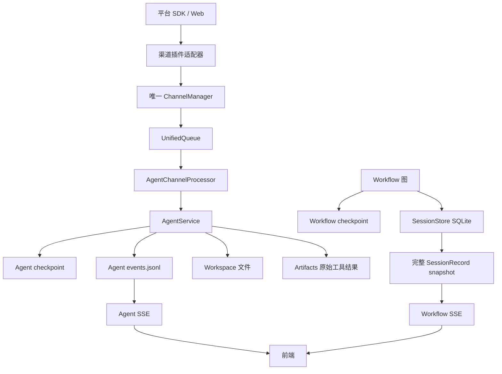

## 2. 渠道交互逻辑

### 2.1 渠道能力、实例和绑定

渠道能力与实例分离。插件注册的是能力（例如 `conversation`、`notification` 和配置 schema），资源文件保存的是实例配置。相同能力可以有多个实例，每个实例独立绑定；一个实例最多绑定一个当前 Agent session。绑定是渠道侧的持久化路由状态，不是 Agent session 的渠道属性。

Agent session 不保存 `channel_id`，系统也没有全局默认渠道。绑定关系属于渠道实例一侧，绑定、改绑和解绑不会改变 Agent session 本身。未绑定的双向实例收到普通消息时必须明确报告未绑定，不自动创建 session，也不从历史 session 猜默认目标。

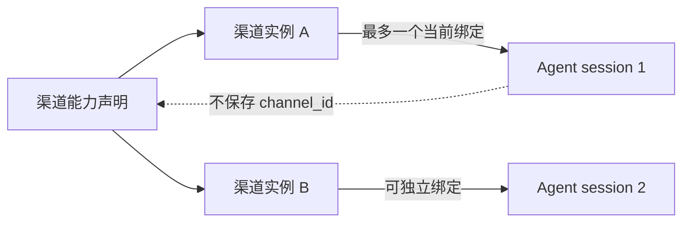

`/resume <session_id>` 是显式恢复/绑定入口。绑定入口只出现在支持 `conversation` 的实例页面；Email、file 等单向实例不提供 Agent 对话绑定。绑定后仍可从 Web 查看同一个 session、历史和事件，不复制出第二个 Web 对话。

绑定的存储和并发规则也属于业务逻辑：服务启动时从渠道 SQLite 的 `instance_bindings` 表加载到加锁内存缓存；接收路由和出站绑定检查读取缓存，不为每次消息查询 SQLite。改绑时先在锁内更新缓存，再串行持久化；持久化失败要回滚到旧 session，并让绑定 revision 继续前进，使旧在途输入/输出不能重新获得资格。请求去重、操作状态和发送回执同样保存在渠道 SQLite，但对话正文仍只在 Agent 事件日志中。

### 2.2 入站消息与顺序消费

双向输入必须经过同一个 Manager 和统一队列，HTTP 路由、QQ 适配器和测试适配器不能绕过队列直接调用 Agent：

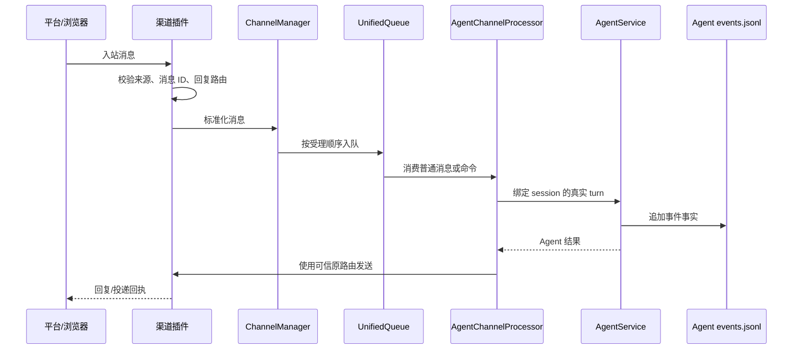

同一对话的普通消息按受理顺序消费，并等待当前活动轮次结束。`stop` 走独立取消通道，可以越过等待中的普通消息；`append`、`compact` 等命令在既有安全边界执行，不制造虚假轮次。不同渠道可以指向同一个 Agent session，但同一 session 同时最多一个活动模型轮次。

请求状态必须拆开表达：

```text
入队 accepted  !=  Agent turn started/completed  !=  平台 delivery succeeded
```

因此，队列尚未让 Agent 准入前，HTTP 不返回缺少 `turn_id` 的伪成功；队列满时明确拒绝（Web/test 为 429）。Agent 已完成但平台拒绝或确认丢失时，保留 Agent 完成事实，并单独报告 `failed` 或 `uncertain` 的发送回执，不自动重发。

### 2.3 原路回复和改绑安全边界

入站消息持久化以下身份：渠道实例、账号配置版本、来源对话身份、消息 ID 和可信 reply route。Agent 出站前再次确认实例仍绑定产生该输出的 session，绑定 revision 仍匹配，并使用入站保存的 reply route。

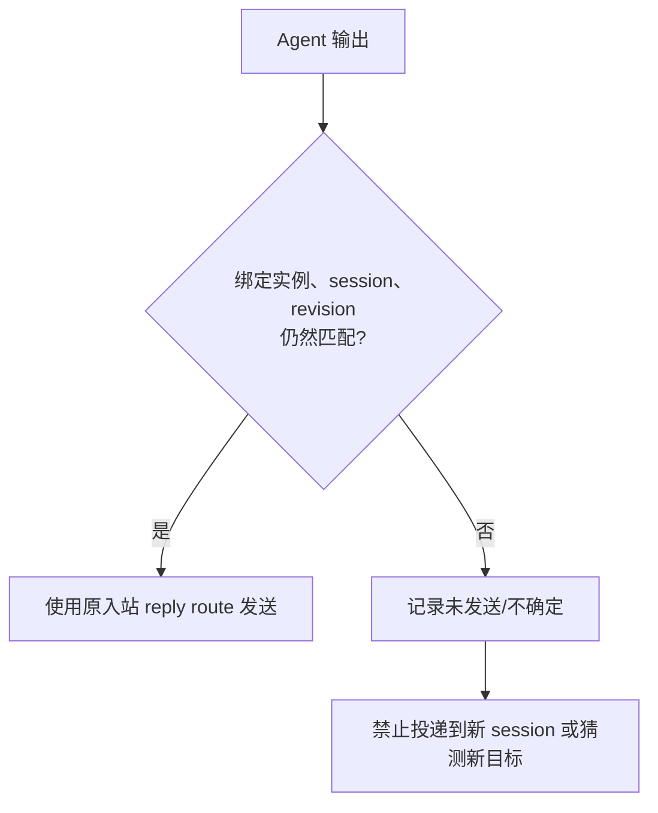

解绑、改绑或账号更新不会把旧输出转投新目标。在途请求仍使用原 session、实例和地址；尚未开始执行的旧账号输入要明确中断。相同 `request_id` 的相同内容复用原回执，不重复执行或发送；相同 ID 的不同内容返回 `request_conflict`。

## 3. 双向与单向渠道的业务逻辑

### 3.1 能力矩阵

| 插件 | `conversation` | `notification` | 业务用途 |
|---|---:|---:|---|
| Email | 否 | 是 | Workflow 通知 |
| file | 否 | 是 | Workflow 通知/文件输出 |
| QQ | 是 | 是 | Agent 对话、Workflow 通知 |
| wechat_openclaw | 是 | 是 | Agent 对话、Workflow 通知 |
| Feishu | 是 | 是 | Agent 对话、Workflow 通知 |
| Telegram | 是 | 是 | Agent 对话、Workflow 通知 |

能力矩阵表达“插件能做什么”，不等于某个实例当前已经启用、已认证或已绑定。

### 3.2 双向渠道

双向渠道具备两条相互独立的路径：

1. **入站 conversation 路径**：平台消息经过来源校验、ChannelManager、统一队列，进入该实例当前绑定的 Agent session。
2. **出站 notification 路径**：Workflow 或其他已授权模块按一次运行快照调用插件 `send`，只发送，不进入入站队列，不调用 Agent，也不要求启用 Agent 接收循环。

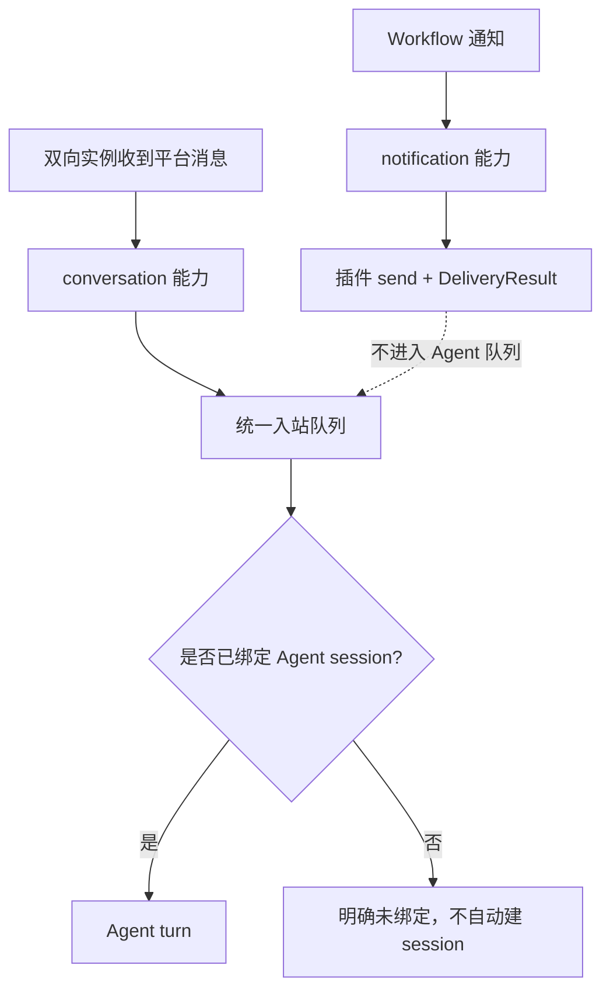

同一实例收到多个好友或群的消息，仍进入同一绑定 session；每条消息的来源、消息 ID 和回复地址分别保留。Workflow 向 QQ、飞书、Telegram、微信等双向渠道发送通知时，不需要绑定 Agent session。

### 3.3 单向渠道

Email、file 等只声明 `notification` 的实例：

- 只能作为 Workflow 输出目标；
- 不创建 Agent session；
- 不进入 Agent 入站队列；
- 不启动 Agent 接收循环；
- 按当前 Workflow snapshot、发送预算和 `DeliveryResult` 记录结果。

系统不承诺外部平台“恰好一次”投递。确认丢失必须显示 `uncertain`，禁止因为不确定而自动重发。通知正文来自运行时冻结的 output ID；同一输出发往多个渠道时，各渠道共享同一份冻结正文，intent/receipt 不复制正文。

## 4. 注册、渠道、资源和工具逻辑

### 4.1 插件注册生命周期

插件通过 `plugin.json` 声明元数据、能力和依赖。默认适配器在包内 `workflowweave/plugins/channel/<plugin>/` 发现，用户导入的插件在 `plugin_dir` 发现；`main.py` 只同步调用注册 API，不创建第二个 ChannelManager，也不保存另一份 Agent session 状态。

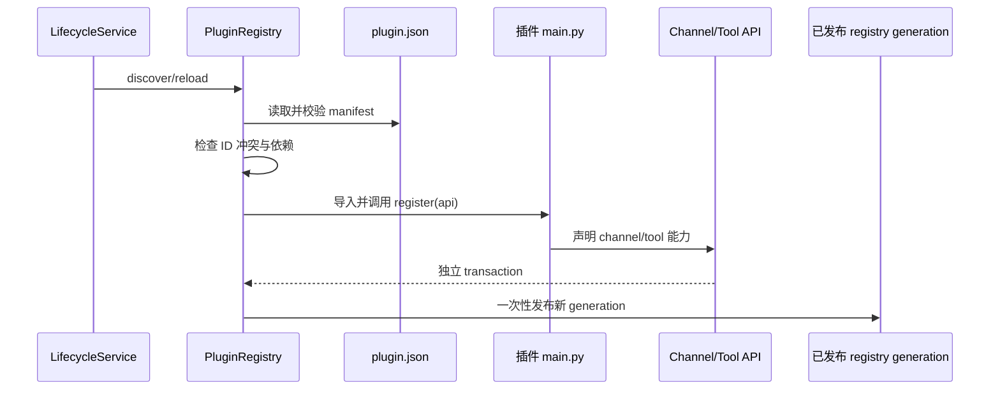

注册规则：

- `ChannelPluginApi.register_channel` 注册渠道能力；`ToolPluginApi.register_tool` 注册工具能力。
- 一个插件必须同步提供 `plugin.register(api)`，只提交声明并返回 `None`。
- 每个插件使用独立 transaction；失败插件不把半成品发布到 registry，缺少依赖只影响该插件。
- disabled 插件不导入、不注册；冲突 ID 显式报错。
- Channel、Tool registry 分开维护，发现/reload 由锁保护；成功发布递增 generation。
- `/api/plugins` 将两类 registry 的公开能力合并给前端；生命周期 reload 由 `/api/reload?scope=resources|plugins` 触发。

### 4.2 资源配置存储

渠道、Workflow、source、MCP server 和 AI 统一保存在 `data/resources.json` 的一个 published view 中。`ResourceStore` 的核心逻辑是“候选值解析 -> 全量依赖校验 -> 一次发布”：

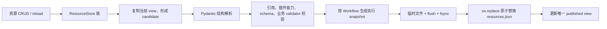

关键约束：

- 新/变更资源必须引用当前可用的插件能力；已保存但暂时不可用的旧资源可被读取，快照不会重新检查插件可用性。
- source 可引用 setter、MCP server 和调用覆盖；校验时解析有效调用，但保存时保留模板引用，避免产生第二份来源真相。
- Workflow 执行前从同一锁内的资源视图构造 `WorkflowSnapshot`，冻结 sources、channels、AI、MCP server 和 overrides；运行期间不重新读取全局配置。
- `save_many` 对相互依赖的资源一次校验和发布；删除仍被引用的资源返回 `reference_conflict`。
- 临时文件写入后 `flush`、`fsync`，再 `os.replace`；失败显式报告 `storage_failed`，不静默降级。

### 4.3 工具注册和 Agent 顶层工具

Agent 保持五个稳定顶层入口：

| 顶层工具 | 逻辑 |
|---|---|
| `plugin` / MCP 网关 | 发现并调用 MCP 能力 |
| `read` | 读取 workspace 或允许的资源 |
| `write` | 写入 workspace 内容 |
| `grep` | 在允许范围搜索 |
| `shell` | 按安全边界执行命令 |

MCP 工具由固定代理按需发现，避免每增加一个来源就增加模型顶层 schema。Channel 不暴露为任意 Agent `send` 工具；Agent 回复必须走绑定的可信路由，Workflow 通知必须走通知链路。

工具开关写入插件目录下的 `config.json`，采用临时文件与 `os.replace` 原子替换。Agent 不维护第二份“工具启用状态”，从而避免 registry、Agent 和配置文件三处状态不一致。

## 5. Agent 模块的存储逻辑

这里的 Agent 重点是存储边界，而不是 Agent 产品功能。Agent 使用 LangGraph 1.x，但 checkpoint、事件、workspace、artifact 和查询元数据各自承担不同责任。当前代码中 Workflow 的分析节点仍调用指定模型，Agent 主要作为结果追问/继续对话的独立会话；两者不共用 checkpoint，也不把 Workflow 归档当作 Agent 的执行恢复材料。

### 5.1 五类持久化对象

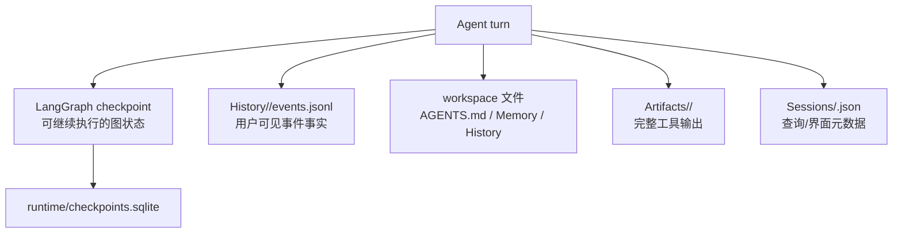

默认目录：

```text
data/agents/
├── workspace/
│   ├── AGENTS.md
│   ├── Memory/YYYY-MM-DD.md
│   └── History/<session_id>.md
└── runtime/
    ├── checkpoints.sqlite
    ├── Sessions/<session_id>.json
    ├── History/<session_id>/events.jsonl
    ├── Artifacts/<session_id>/
    └── Catalog/
```

`Runtime/self.json` 是按当前 session/turn/branch 动态解析的逻辑只读文件，不是共享的 `current.json`。`AGENTS.md` 在 turn 开始时捕获，turn 中途修改只影响后续 turn；Memory 和 History 由普通 `read`/`write`/`grep` 维护，不使用向量数据库，也没有独立 memory 工具。

### 5.2 事件日志和恢复

事件 JSONL 是用户可见执行事实的唯一来源。每个 session 有独立日志和锁；事件 ID 单调递增，追加时写入、flush、`fsync`，支持 `after` 游标重放。启动检查文件完整性、JSON 合法性和 ID 连续性，损坏直接报错。

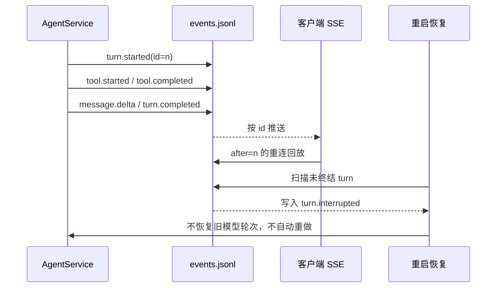

工具调用使用稳定 key 和参数 digest 去重。已完成调用重复到达时复用原结果；副作用调用在恢复时无法确认结果则标为 `outcome_unknown`，禁止自动重执行。read/grep/只读 MCP 工具可并发；write/shell 对同一 workspace 独占。

### 5.3 Workspace 与 Artifact

workspace 与 runtime 分离：runtime 路径只读，文件路径禁止 `..` 和 symlink 路径穿越。ArtifactStore 先保存完整工具输出，再按字节/token预算返回 preview；超过预算返回 `output_limit_exceeded` 或 artifact 引用，不能用截断内容冒充完整结果。

因此 Agent 的一句话存储模型是：

> checkpoint 保存“可继续执行的图状态”，JSONL 保存“用户可见事实”，workspace 文件保存“长期协作内容”，Artifacts 保存“大型原始输出”，Sessions JSON 保存“查询元数据”。

## 6. Workflow 模块的存储逻辑

Workflow 将执行恢复、业务归档和对外观察严格分层。

### 6.1 三层存储

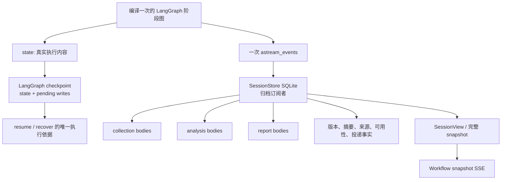

默认 Workflow 数据库为 `data/workflows.sqlite3`，禁止 `:memory:`，因为 Workflow 必须可恢复。checkpoint 的 `thread_id` 与 `session_id` 相同，metadata 中 `sessionID` 也必须一致；运行使用 `astream_events`、`stream_mode=["updates", "checkpoints"]` 和同步 durability。

### 6.2 checkpoint 是恢复权威

执行所需的真实内容保存在 state、checkpoint 和 pending writes 中。节点只读取必要 state、调用能力并返回结果，不直接读取/写入 SessionStore，也不能用外部正文引用替代 state 内容。恢复时以父图 checkpoint 和已提交 writes 为准，不能用当前资源配置覆盖旧运行，也不能从长期业务归档猜执行位置。

进程中断时：

- 已持久化成功的独立来源/分析任务可以在原 `execution_epoch` 续跑时复用；未完成任务继续执行。
- 原 checkpoint、必要配置或正文缺失时显式报告恢复材料缺失，不用当前配置重新采集补齐。
- 主动阶段重跑创建新的 `execution_epoch`，追加新业务版本，旧版本不覆盖。

### 6.3 SessionStore 是不可变业务归档

`SessionStore` 保存 `session_headers`、`session_entries`、checkpoint source、collection/analysis/report bodies、prompt versions、result provenance 和 epoch retention 等结构。业务事实只能追加：

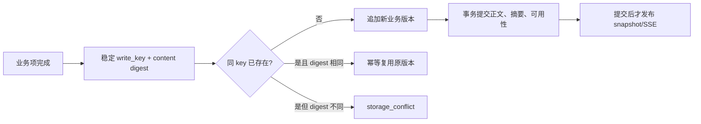

相同稳定业务 key 重复提交且内容相同，复用原版本；内容不同则返回 `storage_conflict`。`checkpoint_id` 不是业务版本。采集、分析、最终报告分别归档并独立读取，不保存一个包含全部上游正文的全量运行对象。

归档提交前不发布可读正文；归档失败时显式报告并保留源数据，阻止清理，不把已有业务结果改写成业务失败。统一 storage API 为 HTTP、Agent 和内部订阅提供相同的 session/version 查询语义。

### 6.4 保留策略

| 数据类别 | 默认保留 |
|---|---:|
| checkpoint | 7 天 |
| collection 正文 | 30 天 |
| analysis 正文 | 永不过期 |
| final/report 正文 | 永不过期 |

`BackupPolicy` 独立管理四类期限和正文开关。关闭某类正文备份时，执行仍保存必要 checkpoint；长期归档保留必要摘要、版本、来源索引和 `not_saved`/可用性事实，但不通过共享 prompt 或 checkpoint 绕过开关。正文到期后删除正文，保留 entry、digest、来源索引和 `expired` 状态；不能用新轮次正文替代旧版本，也不能从 checkpoint 重新公开已过期正文。

### 6.5 ProgressHub 与快照观察

一次 Workflow 执行只产生一次 `astream_events`。存储订阅者根据 tags、metadata.sessionID、execution epoch 和稳定业务身份，选择 fan-out、fan-in、aggregate、逐渠道发送等必要业务边界归档和推送；不把初始化、排序或每个内部 chain 调用广播为业务完成。

前端仍收到完整 `SessionRecord` snapshot：服务端先注册观察者，再查询首帧，之后只发送更高业务 version；客户端按更高 version 替换当前 snapshot。观察者队列容量 64，空闲心跳 15 秒；终态 snapshot 发出后关闭连接。断线重连重新查询最新完整 snapshot，不使用 Workflow `Last-Event-ID` 重放持久事件，也不重新执行 Workflow。

## 7. 前后端交互逻辑

### 7.1 Agent/Web 命令和事件

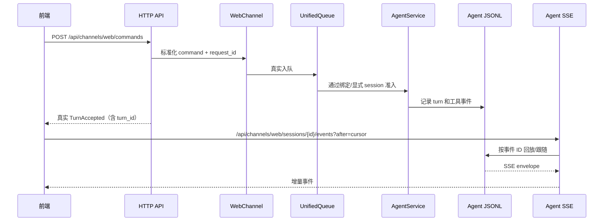

前端的 message、append、stop、compact、fork、workflow 等写操作统一走 command channel。旧 `/api/agents/...` 写接口只是兼容投影，也必须进入同一个 WebChannel 和 session 队列。HTTP 等到真实 Agent 准入后再返回 `turn_id`，不把“已入队”冒充“模型已启动”。

Agent SSE 支持 `after` 和 `Last-Event-ID`；事件 ID 来自 Agent JSONL。断线不会取消已受理 turn，重连从游标后的事件恢复。终态 session 会补发剩余事件再结束流。

### 7.2 Workflow REST 与 Snapshot SSE

主要 REST 接口：

```text
GET  /api/sessions
GET  /api/sessions/{id}
GET  /api/sessions/{id}/phases/{stage}
POST /api/workflows/{id}/run
POST /api/sessions/{id}/resume
POST /api/sessions/{id}/recover
POST /api/sessions/{id}/cancel
```

Workflow SSE 为：

```text
/api/sessions/{session_id}/events
```

它传输完整 snapshot，而不是 Agent 式增量事件。前端连接后校验 session、version、status、artifact availability 和 progress，只接受更高业务 version。断线重新获取最新完整 snapshot；连接异常与 Workflow 失败分别表达，离页释放观察资源但不取消后台执行，取消必须由用户显式操作。

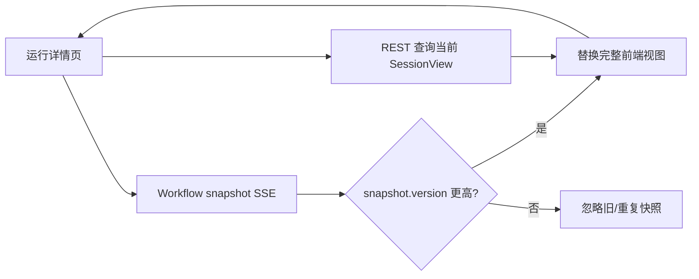

### 7.3 渠道绑定和资源 API

双向实例页面使用：

```text
GET /api/channels/{id}/conversation
PUT /api/channels/{id}/conversation
GET /api/agents/sessions
```

页面初始显示未绑定；单向实例不显示绑定入口。资源配置通过 `/api/channels`、`/api/workflows`、`/api/sources`、`/api/mcp_servers`、`/api/ai` 等 API 进入 `ResourceStore`，前端不保存第二份 Workflow 正文。开发环境由共享 HTTP client 和 Vite `/api` 代理连接后端。

## 8. OpenSpec 与当前代码的关系

### 8.1 规范优先的阅读顺序

本分析主要依据以下 OpenSpec：

- `openspec/changes/bind-duplex-channel-conversations/specs/channel/spec.md`
- `openspec/changes/bind-duplex-channel-conversations/specs/frontend/spec.md`
- `openspec/changes/redesign-agent-channel-manager/specs/channel/spec.md`
- `openspec/changes/redesign-agent-channel-manager/design.md`
- `openspec/changes/add-notification-channel-plugins/specs/notification-plugins/spec.md`
- `openspec/changes/archive/add-file-centric-agent/specs/agent-runtime/spec.md`
- `openspec/changes/archive/add-file-centric-agent/specs/agent-interface/spec.md`
- `openspec/changes/redesign-workflow/specs/workflow-stream-execution/spec.md`
- `openspec/changes/redesign-workflow/specs/workflow-checkpoint-resume/spec.md`

当规范和实现不一致时，应先按规范判断目标行为，再把代码差异记录为实现缺口；不能因为现有代码能运行就推导出新的业务契约。OpenSpec 中历史 task 的勾选状态也不等于当前代码已经验收。

### 8.2 当前代码佐证位置

| 主题 | 代码位置 | 可观察事实 |
|---|---|---|
| 插件发现和注册 | `src/logagent/config/registry.py` | 分离 collector/channel/tool registry、manifest 校验、独立 transaction、generation |
| 资源配置和快照 | `src/logagent/config/store.py` | 单一 view、依赖校验、Workflow snapshot、原子发布 `resources.json` |
| 渠道绑定和回执 | `src/logagent/channel/bindings.py`、`manager.py` | `channels.sqlite3` 保存绑定、请求和投递回执；实例绑定启动时进入内存缓存，路由读取缓存 |
| Agent 执行与恢复 | `src/logagent/agent/service.py` | LangGraph SQLite checkpoint、启动时标记未终结 turn 为 interrupted |
| Agent 事实日志 | `src/logagent/agent/events.py` | JSONL 锁、连续 ID、fsync、游标重放、outcome_unknown |
| Workspace/Artifact | `src/logagent/agent/workspace.py`、`artifacts.py` | 路径边界、runtime 分离、完整输出后 preview |
| Workflow 执行 | `src/logagent/workflow/execution/runner.py` | `data/workflows.sqlite3`、thread/session 对齐、astream_events、同步 durability |
| Workflow 归档 | `src/logagent/workflow/storage/facts.py`、`models.py` | 追加事实、write_key 幂等、digest 冲突、分类正文 |
| Workflow 视图/保留 | `src/logagent/workflow/storage/sessions.py`、`retention.py` | 只读 SessionView、snapshot 组装、分层默认期限 |
| HTTP/SSE | `src/logagent/interaction/channel_routers.py`、`agent_routers.py`、`sse.py` | WebChannel 命令投影、Agent 游标事件、Workflow snapshot 观察 |
| 前端 API | `frontend/src/modules/agents/api/`、`runs/api/`、`resources/` | command channel、两类 EventSource、资源和绑定请求 |

这些位置是实现佐证，不是新的规范来源。若代码当前尚未完全满足 OpenSpec，应在实现变更中补齐，而不是修改本文的规范结论来迁就代码。

当前代码已经提供了上述持久化骨架，但不能把“表存在”直接视为所有场景都已验收。例如真实 QQ 平台联调、重启后不确定投递、绑定失败回滚和完整 Workflow 在线过期检查，仍应以对应 OpenSpec 场景和测试证据逐项核对。

## 9. 当前明确限制

1. 外部平台的投递确认可能丢失，因此只能给出 `uncertain`，不能宣称恰好一次，也不能自动盲重发。
2. Workflow SSE 只保证最新完整 snapshot 的观察，不提供 Agent 式持久增量事件重放；历史正文按固定业务版本查询。
3. checkpoint 到期或删除后，仍在归档保留期内的业务正文可读，但不能从该 checkpoint resume，也不能从归档猜执行起点。
4. 关闭某类正文备份后，执行 checkpoint 仍可能包含该内容的运行副本；长期查询必须尊重 `not_saved`/过期边界，不能绕过策略公开正文。
5. 渠道绑定只决定双向入站路由；Workflow 单向发送使用运行快照和通知目标，不需要改变 Agent session 的渠道属性。
