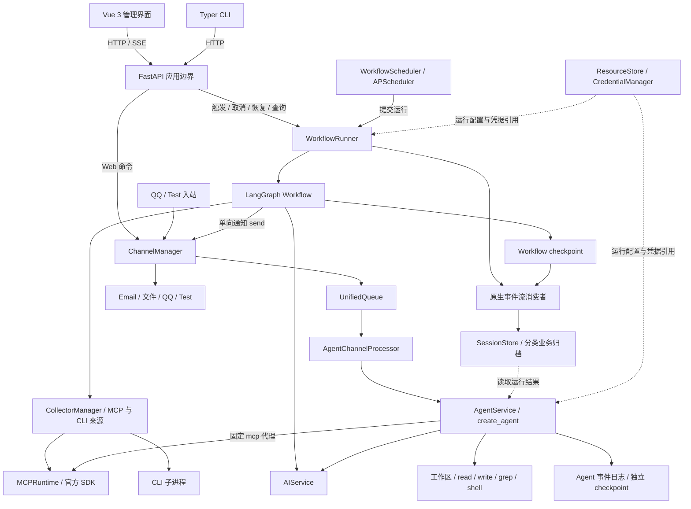

# 项目近况与架构

核对日期：2026-09-30。本文描述当前工作区，包版本仍为 `0.1.0`，不代表这些改动都已发布或完成验收。产品起点来自[最初已归档的提案](../openspec/changes/archive/configurable-collection-analysis-workflow/proposal.md)与[设计](../openspec/changes/archive/configurable-collection-analysis-workflow/design.md)，架构则结合后续 OpenSpec、实施记录和当前源码核对。

阅读时区分三种状态：源码已有的能力、最新设计要求但尚未收敛的能力、仍待完成的验证。旧设计中的目标目录、早期测试结果和版本安排，都不能直接当作当前实现状态。

## 1. 项目近况

最初目标是用可配置、费用可控的 Workflow 承担固定触发、固定来源的重复任务，并允许围绕结果继续讨论。这一定位仍然成立：搜索、获取新闻、定时执行和通知交给工具与程序；摘要、分类及复杂判断按分析任务选择模型。

当前实现已超出最初首版的后端 Workflow 范围，同时仍在进行架构收敛。

| 最初目标或边界                     | 当前情况                                                                                      |
| ---------------------------------- | --------------------------------------------------------------------------------------------- |
| 固定触发、多来源采集               | 已有手动运行与 APScheduler 调度；持久化计划统一为 `schedule`，支持 `at/every/cron`            |
| Collector 插件与 Setter 配置       | 新建来源采用 MCP/CLI `call` 契约；旧 Collector 仅留有限兼容路径，不再作为新来源的主要扩展方式 |
| 一份共享输入、多模型分析、可选汇总 | 已实现逐项并行分析、分层提示词、声明顺序与可选模型 fan-in                                     |
| session 备份、查询和失败恢复       | 已拆分执行 checkpoint 与长期业务归档，增加执行轮次、分类正文、提示词索引和独立保留期          |
| 单向通知                           | 保留独立发送路径，并实现并行通知分支、持久化意图与回执                                        |
| 后续轻量 Agent 与双向渠道          | 已有文件工作区 Agent、结果追问、Web/QQ/Test 接入与统一入站队列                                |
| 前端后续实现                       | 已有 Vue 管理界面；正式路由使用 `app/pages/modules/shared` 架构                               |
| Workflow 分析任务使用 Agent        | **仍是后续计划**；当前分析任务调用指定模型，结果追问运行在独立 Agent 会话中                   |

最近的工程重点是 Workflow 原生事件流与四部分拆分、MCP schema-first、统一渠道队列，以及资源配置和模型发现体验。调度重构已有完整任务验证记录；Workflow、MCP、FastAPI 和部分前端变更仍存在未完成或未收敛的验收项，具体见第 8 节。FastAPI 应用边界与原生 SSE 的方案二实现已撤回，该 change 保持未完成。

## 2. 当前整体架构

当前是 **ApplicationLifecycle 负责装配的异步模块化单体**。固定 Workflow 与对话 Agent 并列运行，共享 AI、MCP、资源与 Channel 能力；两者各自拥有执行状态、持久化和对外实时协议。前端是 Vue 3 SPA，CLI 主要通过 HTTP 调用后端。



图中表示业务调用方向；这些进程级服务由 ApplicationLifecycle 装配和启停，FastAPI lifespan 委派其 start/shutdown，并非通过内部 HTTP 串联。模块间仍采用构造注入和直接服务调用，尚未改成“所有模块都经过 `interaction/api`”的架构。

### 当前仍由 ApplicationLifecycle 装配

依据：[当前生命周期实现](../src/logagent/lifecycle/service.py)与[HTTP app factory](../src/logagent/interaction/app.py)。[FastAPI 设计](../openspec/changes/centralize-fastapi-lifecycle-sse/design.md)属于待重新实施的方案。

| 当前文件 | 职责 |
| --- | --- |
| [service.py](../src/logagent/lifecycle/service.py) | 进程资源装配、启动/关闭、reload 与健康准入 |
| [services.py](../src/logagent/lifecycle/services.py) | ApplicationServices 共享服务引用 |
| [app.py](../src/logagent/interaction/app.py) | create_app、路由与异常处理注册；lifespan 委派 lifecycle |
| [dependencies.py](../src/logagent/interaction/dependencies.py) | Depends 获取 lifecycle 与共享服务 |
| [routers.py](../src/logagent/interaction/routers.py) / [agent_routers.py](../src/logagent/interaction/agent_routers.py) / [channel_routers.py](../src/logagent/interaction/channel_routers.py) | Workflow、Agent 和 Web Channel 的 HTTP/SSE 边界 |

方案二实现已撤回，独立 ApplicationLifecycle 保留。单次 Workflow run、Agent turn、MCP call 和 SSE subscriber 仍由对应服务或生成器管理。ApplicationServices 中的共享服务是进程级实例，Depends 获取它们并不会使其成为请求级对象。

## 3. Workflow：图、执行、事件流、存储

依据：[最新 Workflow 设计](../openspec/changes/redesign-workflow/design.md)、[原生事件流实施任务](../openspec/changes/redesign-workflow/tasks/2026-09-28-native-events-layout/task.md)与[当前源码](../src/logagent/workflow/)。

| 当前目录    | 实际分工                                                       | 主要入口                                                                                                                                                                                                                                     |
| ----------- | -------------------------------------------------------------- | -------------------------------------------------------------------------------------------------------------------------------------------------------------------------------------------------------------------------------------------- |
| `graph`     | 五阶段父图、逐项子图、局部节点、state 与 reducer               | [workflow.py](../src/logagent/workflow/graph/workflow.py)、`subgraph/collect`、`analyze`、`aggregate`、`notify`                                                                                                                              |
| `execution` | 触发、任务生命周期、取消、恢复、阶段重跑、调度与维护           | [runner.py](../src/logagent/workflow/execution/runner.py)、[recovery.py](../src/logagent/workflow/execution/recovery.py)、[scheduler.py](../src/logagent/workflow/execution/scheduler.py)                                                    |
| `stream`    | 消费原生执行事件，派生已提交事实与可读进度                     | [checkpoints.py](../src/logagent/workflow/stream/subscriptions/checkpoints.py)、[progress.py](../src/logagent/workflow/stream/subscriptions/progress.py)                                                                                     |
| `storage`   | 事务、事实去重与业务版本、正文归档、session/报告查询及保留策略 | [facts.py](../src/logagent/workflow/storage/facts.py)、[reports.py](../src/logagent/workflow/storage/reports.py)、[sessions.py](../src/logagent/workflow/storage/sessions.py)、[retention.py](../src/logagent/workflow/storage/retention.py) |

这里列的是实际实现。设计目标中出现的 `stream/publisher.py` 和 `storage/analysis.py` 当前并不存在，不能据此推断已建立额外发布服务或分析查询层。

### 一次运行怎样推进

父图版本为 `workflow-runtime-v4`，主流程为 `collect → analyze → aggregate → notify → finish`，另有 deferred `cleanup` 节点。失败或空结果策略可提前进入 finish。

1. **触发与冻结配置**：手动调用或调度器提交给 `WorkflowRunner`，建立 session 和 `execution_epoch`，使用当次资源与提示词快照。
2. **采集**：逐来源执行 MCP 或 CLI，保留原始结果、错误与执行事实，再由 Workflow 进行内容处理。工具获取内容与模型输入表示分开。
3. **共享输入**：统一生成 `none/ison/toon/zon/md/csv` 视图，应用总输入、单项及字段 token 限额；目前所有分析分支接收完整共享输入。
4. **并行分析**：每项选择模型和提示词，按稳定 ID 合并结果。完成顺序可以不同，最终声明顺序保持稳定。
5. **汇总**：按配置拼接输出或进行独立模型调用。关闭模型 fan-in 不强制增加一次 AI 请求；复用分析项模型只复用模型选择。
6. **通知**：各目标独立执行 `intent → receipt`，在持久化意图屏障后发送。确定回执可复用，无法确认投递的调用不自动重放；不承诺外部投递恰好一次。
7. **完成与清理**：记录终态，按归档交接条件清理子图 checkpoint；长期查询读取业务归档。

当前 `run_graph()` 使用 `graph.astream_events(version="v2", subgraphs=True, stream_mode=["updates", "checkpoints"], durability="sync")`，通过 `metadata.sessionID` 与 `configurable.thread_id` 关联运行。事件消费者利用已提交 checkpoint 和 pending writes 派生归档，并发布可读进度；没有新增外部 broker 或第二套持久化 Workflow 事件日志。

### 调度与提示词的最新边界

[统一调度设计](../openspec/changes/unify-workflow-scheduling/design.md)将 `WorkflowDefinition.schedule` 作为唯一持久化计划：`null` 表示手动，非空为 `at/every/cron`。APScheduler 使用内存作业，启动时从资源重建，回调调用 Runner，不复制图执行逻辑。MCP 健康监控另有独立计划，不是第二份 Workflow 调度配置。

[分层提示词设计](../openspec/changes/layer-workflow-prompts/design.md)与当前分析实现采用 Workflow 共享 `system_prompt/input_prompt`、单项覆盖及差异 `user_prompt`。`null` 继承共享值，显式空字符串覆盖为空。消息顺序是系统提示、包含输入的 HumanMessage、非空差异 HumanMessage；fan-in 默认按 `$input` 加分析项声明顺序组装。

### 恢复与归档不是同一件事

中断续跑依据 LangGraph 官方 checkpoint 的执行位置及内容；业务归档负责固定版本的历史读取，不反向推断图该从哪一步执行。阶段重跑创建新 `execution_epoch`，并继续后续阶段，包括通知。checkpoint 有效、必要材料可用与报告仍可读取，是不同条件。

[存储模型](../src/logagent/workflow/storage/models.py)已分开 `session_headers/session_entries`、checkpoint 来源索引、采集/分析/报告正文、提示词版本、结果追溯关系和轮次保留记录。checkpoint 可含执行所需正文；关闭长期备份不能解释成禁止任何正文进入 checkpoint。

| BackupPolicy 类别 | 当前默认   |
| ----------------- | ---------- |
| checkpoint        | 7 天       |
| 采集正文          | 30 天      |
| 分析正文          | 不自动过期 |
| 最终报告          | 不自动过期 |

四类保留期独立设置，不要求大小顺序。`enabled/snapshot/collection/analysis/final` 控制长期归档范围，不等同于关闭执行 checkpoint。活动执行和归档交接会影响实际删除时机；长期在线到期触发及完整分类保留验收仍在 [Workflow 任务 13.7](../openspec/changes/redesign-workflow/tasks.md)的未完成范围内。

## 4. 采集与 MCP：当前能力和设计差距

[CollectorManager](../src/logagent/collection/manager.py)仍沿用这个类名，但新来源执行契约已是 MCP/CLI。CLI 支持 `argv` 和 `shell`，保留 stdout、stderr 与退出码；MCP 保留原始协议结果，输入转换由 Workflow 负责。旧 Collector/Setter 不应继续作为当前架构的主干。

[MCPRuntime](../src/logagent/mcp/runtime.py)与[transport](../src/logagent/mcp/transport.py)基于官方 SDK，支持 stdio、SSE 和 Streamable HTTP，已有按配置版本的目录缓存、`server/discover` 优先探测及 `tools/list` 兼容、JSON Schema 校验，以及 `phase/result_known` 记录。`_meta.logagent_count` 仅接受非负整数；缺失或非法为 `count_unavailable`，不从正文猜测业务条数，也不自动向模型输入追加计数。

[MCPHealthMonitor](../src/logagent/mcp/monitor.py)已接入应用生命周期。自动检查默认关闭，启用后的默认周期为 30 分钟；这不等于最新 MCP 设计中的连接保活、重连和退避机制都已实现。

结合[采集 MCP/CLI 契约](../openspec/changes/collect-from-mcp-and-cli/proposal.md)、[Cursor 导入设计](../openspec/changes/support-cursor-mcp-config/design.md)及[最新 schema-first 设计](../openspec/changes/redesign-mcp-schema-first/design.md)，目前仍有以下差距：

| 最新设计要求                                      | 当前源码状态                                                                                                                         |
| ------------------------------------------------- | ------------------------------------------------------------------------------------------------------------------------------------ |
| Cursor 原始服务名作为 ID，分离 `display_name`     | [MCPServerConfig](../src/logagent/models.py)仍使用旧 `ID` 字符集约束，尚无独立服务显示名；导入界面存在不代表任意合法名称都已支持     |
| `mcp call` 不套用文件工具的 `read/exclusive` 调度 | [MCPGateway.execution](../src/logagent/agent/gateway.py)仍返回 `read`，工具包装仍通过 `ToolScheduler`，尚未符合新边界                |
| keep-alive、单飞重连、有界退避                    | 当前连接主要随 load/call 建立，已有健康检查不能替代整套连接管理契约                                                                  |
| Workflow 同时交接 MCP 调用描述和 CLI 指令         | [SessionView.mcp_binding](../src/logagent/workflow/storage/sessions.py)主要保存 MCP 来源、服务、工具及参数；CLI 指令交接尚未完整形成 |

因此 MCP 应描述为“已有可用基础能力，schema-first 重设计尚未完成”，不能把最新 design 的全部内容列为已实现特性。

## 5. Agent 与 Channel

### 独立 Agent 运行时

当前[AgentService](../src/logagent/agent/service.py)负责 session、turn、cancel、branch、工作区、MCP 绑定及运行资源快照；[Agent 图](../src/logagent/agent/graph.py)使用 LangChain `create_agent`，底层由 LangGraph 执行。模型通过 `AIService.lease` 获取，ContextMiddleware 管理摘要与上下文预算。

内置工具是 `read/write/grep/shell/mcp`。固定 `mcp` 代理支持按需列目录、搜索、读取 schema 和调用，避免把所有工具 schema 常驻模型上下文；当前还保留 `status/load` 操作。大结果与 schema 可通过 ArtifactStore 保存。

默认 Agent 数据分为 `data/agents/workspace` 和 `data/agents/runtime`：用户文件与记忆属于工作区，运行时保存 `History/<session>/events.jsonl`、artifacts 和独立的 `checkpoints.sqlite`。Agent 的事件日志与 Workflow 业务归档不是同一套存储，也不共用恢复位置。

从运行结果继续讨论时，Agent 读取关联 session 的归档，并获得当次 MCP scope 和来源调用描述；由 Agent 决定是否补充查询，不自动重新执行原采集。旧 Agent 设计中的 Collector PluginGateway 已被固定 MCP 代理取代。

### 统一渠道入站，独立 Workflow 通知

依据：[最新 ChannelManager 设计](../openspec/changes/redesign-agent-channel-manager/design.md)与[当前 ChannelManager](../src/logagent/channel/manager.py)。

Web、QQ、Test 的对话输入都经 `ChannelManager → UnifiedQueue → AgentChannelProcessor → AgentService`。Manager 拥有入站队列、渠道消费与发送任务、回执及启停；AgentService 拥有模型轮次、工具执行、取消和事件日志。`unified_queue_manager.py` 当前仅为 `UnifiedQueue` 的别名，并不存在额外的独立队列服务。

队列协调普通消息、命令、会话切换与 stop；平台对话身份和 Agent session 身份分开。渠道绑定与请求/发送回执保存于 `data/agents/channels.sqlite3`，对话正文仍在 Agent 原事件日志。请求完成、平台接受发送与用户实际读到消息是不同事实。

Workflow 通知调用 `ChannelManager.send`，不进入 Agent 入站队列、不创建或切换 Agent 会话。Email 与文件渠道提供通知；QQ/Test 可提供通知和对话；Web 当前提供对话及 Agent SSE，不是任意 Workflow 通知的接收面板。QQ 使用官方 Bot Gateway/REST，目前的协议和 Manager 闭环证据来自模拟网络，真实平台仍待联调。

具体适配器实现在 [plugins/](../plugins/README.md)：邮件、文件通知、QQ/Test 各自作为 channel 插件，mock/logs/history 各自作为 Collector 插件，由 PluginRegistry 统一发现。核心 channel/collection 模块只保留通用运行机制与应用 Web 入口；配置插件目录为空时不会自动补注册这些适配器。

## 6. 两种 SSE 协议

后端使用 [自定义 SSE 编码与 StreamingResponse](../src/logagent/interaction/sse.py)，前端共享 [eventSource.ts](../frontend/src/shared/api/eventSource.ts) 的连接机制。传输复用不改变业务协议。

| 项目       | Workflow 运行流                       | Agent / Web 对话流                                                    |
| ---------- | ------------------------------------- | --------------------------------------------------------------------- |
| 路径       | `/api/sessions/{session_id}/events`   | `/api/channels/web/sessions/{session_id}/events`，以及兼容 Agent 路径 |
| 数据源     | 已提交业务事实形成的 SessionRecord    | Agent 原始事件日志                                                    |
| 数据形态   | `snapshot` 事件，每次完整快照         | 带 `id/session_id/turn_id/type/at/data` 的增量事件                    |
| 顺序依据   | SessionRecord 的业务 `version`        | 递增事件 ID；`turn_id` 隔离轮次                                       |
| 重连       | 读取最新完整 snapshot；不回放中间快照 | 用 `after/Last-Event-ID` 回放游标后的事件                             |
| 客户端归并 | 只接纳更高版本，忽略旧快照            | 按游标去重、投影消息和工具事件                                        |

连接断开只释放 subscriber，不取消共享 Workflow 或已受理 Agent 请求。心跳与帧编码仍由 interaction SSE 实现处理，响应传输由 StreamingResponse 承担；任务取消仍通过业务操作执行。

## 7. 前端架构

依据：[已归档前端架构设计](../openspec/changes/archive/design-frontend-architecture/design.md)、[实施设计索引](../openspec/changes/archive/refactor-frontend-architecture/design.md)与[当前 bootstrap](../frontend/src/app/bootstrap.ts)、[router](../frontend/src/app/router.ts)。

```text
frontend/src/
  app/       装配、路由、布局、应用样式
  pages/     路由入口与跨模块流程组合
  modules/
    resources/  来源、MCP、模型、渠道及凭据配置
    workflows/  定义、绑定、提示词、计划和唯一编辑草稿
    runs/       运行查询、动作、snapshot 与报告展示
    agents/     会话、事件、命令、分支、文件和设置
    system/     健康、插件、重载和诊断
  shared/    Axios、EventSource、异步原语、Schema 与基础 UI
```

`app/bootstrap.ts` 创建并注入模块 API；模块内部按 `api/model/composables/ui/public.ts` 分工，纯模型与展示不直接承担网络请求。`workflows` 可使用 `resources` 的公开契约；资源使用位置、运行结果续接 Agent 等跨模块流程由 pages 组合，`runs` 与 `agents` 不互相深入依赖。

当前使用 Axios、Vue Router、本地查询组合函数、Ajv、Element Plus 等，没有引入 Pinia 或第三方 Query 全局缓存。Workflow 的 [useSession](../frontend/src/modules/runs/composables/useSession.ts)按更高 snapshot version 更新；Agent 按事件 cursor 投影。仓库还保留一些旧 `views/components/domain/api` 文件，正式路由已指向新 pages，不能把旧目录当作最新主架构。

最近的资源与交互修复涉及模型发现、多选与手动候选、MCP 命令诊断、非 JSON 模型列表错误、从最新 Workflow 结果继续对话和 reasoning 展示；自动化证据与真实浏览器验收状态仍需分别看任务记录。

## 8. OpenSpec 演进与未完成项

以下是架构演进关系，不是发布版本表。后续变更取代了旧设计的部分边界，因此“已归档”不能解释为原设计所有内容仍然适用。

| OpenSpec                                                                                                                                             | 对当前架构的影响                                                   | 状态判断                                                                       |
| ---------------------------------------------------------------------------------------------------------------------------------------------------- | ------------------------------------------------------------------ | ------------------------------------------------------------------------------ |
| [最初 Workflow](../openspec/changes/archive/configurable-collection-analysis-workflow/design.md)                                                     | 固定任务、共享输入、多模型、可选汇总、单向通知、结果追问的产品起点 | 产品方向延续；模块和采集契约已演进                                             |
| [文件工作区 Agent](../openspec/changes/archive/add-file-centric-agent/design.md)                                                                     | 文件工具、对话事件、分支、独立 checkpoint                          | 多项已在 Agent 源码实现，后续 MCP/渠道设计继续修订边界                         |
| [前端重构](../openspec/changes/archive/refactor-frontend-architecture/design.md)                                                                     | pages 组合、业务模块、公开契约、Axios 与状态所有权                 | 正式路由及模块结构已落地                                                       |
| [ChannelManager 重设计](../openspec/changes/redesign-agent-channel-manager/design.md)                                                                | Web/QQ/Test 统一队列与唯一 Agent 处理端口                          | 实施记录有 179 项回归通过；真实 QQ 未联调                                      |
| [Workflow 重设计](../openspec/changes/redesign-workflow/design.md)                                                                                   | 原生事件、四部分边界、checkpoint 恢复、分类归档                    | 代码已拆分；13.7–13.9 仍有未完成或明确排除的验收范围                           |
| [统一调度](../openspec/changes/unify-workflow-scheduling/design.md)                                                                                  | schedule 唯一持久化配置、APScheduler 内存重建                      | 任务已有自动化、构建及浏览器验证记录                                           |
| [分层提示词](../openspec/changes/layer-workflow-prompts/design.md)                                                                                   | 共享默认、单项覆盖、独立 fan-in 请求                               | 配置与分析代码已有实现；任务 3.1 验收仍未勾选                                  |
| [MCP/CLI 采集](../openspec/changes/collect-from-mcp-and-cli/proposal.md)                                                                             | 原始调用与输入转换分离，Workflow/Agent 共用 MCP                    | 执行契约已在源码采用；后续 schema-first 尚未全部满足                           |
| [Cursor 导入](../openspec/changes/support-cursor-mcp-config/design.md) / [MCP schema-first](../openspec/changes/redesign-mcp-schema-first/design.md) | 原始身份、按需 schema、计数与错误事实、声明式交接                  | 有导入、目录和调用实现；根任务清单未完成，第 4 节列出实际差距                  |
| [FastAPI 生命周期与 SSE](../openspec/changes/centralize-fastapi-lifecycle-sse/design.md)                                                             | 唯一应用装配、lifespan、app.state、原生 SSE                        | 实现已撤回；实施任务 1.1–1.9 全部未完成                    |
| [剩余前端问题](../openspec/changes/resolve-remaining-frontend-issues/design.md)                                                                      | 草稿模型发现、Workflow 续接、reasoning 展示                        | 有实现与自动化记录；真实浏览器验收 3.2 未完成                                  |
| [原子批量资源](../openspec/changes/add-atomic-resource-batch/design.md)                                                                              | ResourceStore 候选视图、全量引用校验与原子发布                     | 是配置存储能力，不是新增 Workflow 执行层或独立 HTTP 协议                       |
| [远端部署与插件兼容](../openspec/changes/remote-workflow-deployment-plugin-compat/design.md)                                                         | 部署、来源包兼容和成对 token 测量                                  | 有远端健康/资源/插件记录；完整 Workflow/SSE、Agent-MCP 与 AxonHub 指标仍待验证 |

这里引用的测试数量来自对应历史任务记录，本次文档整理没有重跑这些测试，也不能用这些记录证明当前整个未提交工作区已通过回归。尤其是 [Workflow 任务](../openspec/changes/redesign-workflow/tasks.md)保留了真实浏览器未取得 run/SSE 证据的边界，[远端任务](../openspec/changes/remote-workflow-deployment-plugin-compat/tasks.md)也明确尚未完成原始 token/cache 成对测量，因此当前不能宣称统一降本比例或部署全链路验收完成。

### 后续计划：Agent 进入 Workflow

最初提案的后继计划已经提出“Workflow 的分析任务可以采用 Agent 而非单个模型”，初始设计将其列为 v0.3 方向；这是历史规划，不是当前发布承诺。

当前 Workflow 的分析节点是明确的模型请求，Agent 在 Workflow 之外围绕结果继续对话。后续目标是让需要补充搜索、多步调查或动态工具调用的分析任务交给 Agent，并把结果返回 Workflow 汇总和通知。固定采集和确定步骤继续由程序与工具执行，强模型及 Agent 自主判断用于需要它们的环节。

按分析任务分别选来源、效果评估和画布式编排也仍是初始提案记录的长期方向，具体实施以之后确认的设计为准。
