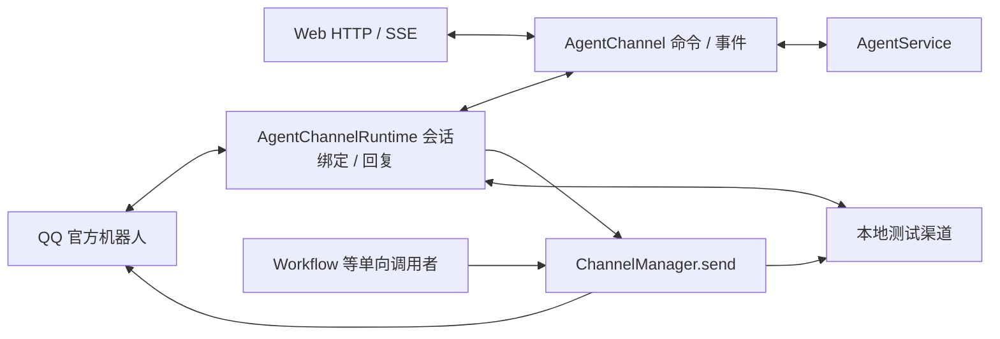

# Agent 双向渠道设计

> 历史方案：用户于 2026-09-24 要求按 QwenPaw ChannelManager 重新设计。当前方案见 [ChannelManager 重设计](../redesign-agent-channel-manager/design.md)，实施以其新任务为准；本文件保留用于解释上一版代码与验证记录。

## 边界

用户本轮授权新增双向渠道设计及实施，并明确前端必须走同一渠道，双向模块仅绑定 Agent。此变更新建独立设计，扩展旧 Channel 设计保留的 conversation 能力，不改写旧 proposal/design。

AgentChannel 只调用 AgentService；读取 Workflow 历史是 Agent 的上下文导入功能，不将 Workflow 注册为双向消息消费者。渠道不能启动 Workflow 或改变工作区。Web 的对话创建、普通消息、命令、停止、追加、分支及 SSE 都通过该入口；原 Agent HTTP 端点保留为兼容投影，不保留第二份解析。

## 能力与实例

沿用 ChannelType/ChannelConfig/ChannelManager。`notification` 声明支持 `send(notification, options)`；`conversation` 声明支持 `start_receiving(handler)`、`stop_receiving()`、`reply(notification, address, options)`。QQ 与 test 同时声明两种能力。普通 send 目标仅来自实例配置；reply 目标是传输入站时固定的 ChannelAddress，模型正文、metadata 不能改投递目标。

ChannelConfig 新增 `agent_enabled=false`，表示是否将此资源入站接到 Agent，仅在 enabled=true 且声明 conversation 时有效。默认关闭是为保持现有资源单向行为，避免把仅配置发送的账号自动启为接收端。此开关不参与实例身份；接收与单向发送共享同一个按快照绑定的常驻实例。Web 作为固定 HTTP/SSE 入口由应用装配，不要求额外渠道资源。

接收只提交命令并返回受理结果，不等待模型完成。异步最终回复由运行时持有任务，失败进入可查询诊断与日志；停止接收、重载及关闭先停止入站，再回收回复任务，最后释放适配器。发送沿用 ChannelConfig.timeout 的单次总预算与 DeliveryResult，不增加自动发送重试。

## 信封、会话及优先级

AgentCommand 使用 `{channel, session, priority, request_id, text}`；Web 可显式指定 action，避免普通消息里的斜线被误判为命令。QQ/test 输入归一化为 InboundMessage 和不可由模型指定的地址（kind、target、sender、message_id）。私聊和群聊按渠道资源身份、聊天类型、目标、发送者隔离 Agent 会话。相同群内不同发送者不共享上下文。

绑定与处理回执保存在 Agent 运行目录下 SQLite，所有值使用参数查询。`/new`、`/resume`、`/fork` 更新该外部对话的当前绑定；外部 `/resume` 只能恢复此对话创建/绑定过的会话，防止跨用户访问。进程恢复沿用绑定，不把最新会话误认作当前外部会话。首次普通消息自动创建 Agent 会话；重复平台 request_id 不重复执行或自动重发，内容冲突明确失败。已登记但未完成的入站请求在重启后报告结果未知，不冒充成功或盲目重放。

`/stop` 直接取消当前 Agent 会话，绕过同一会话的普通准入锁及模型等待。一般命令及对话复用 Agent 现有安全边界与单轮运行规则；忙碌时显式返回 session_busy，`/append` 在模型边界处理。不再实现第二套 Agent 执行队列。

Web 使用原生事件重放与 SSE；QQ/test 默认每轮只发送最终文本、取消或失败结果，避免按 token 触发 QQ 频控。回复固定原始地址与原消息 id，切换当前会话不改变已开始轮次的回复目标。

## QQ 与本地测试渠道

参考旁边 QwenPaw `src/qwenpaw/app/channels/qq/channel.py` 的官方 QQ Bot token、Gateway、C2C/群聊及频道路由。采用 asyncio WebSocket 和 httpx，避免线程与事件循环混合。认证使用 app_id 和 Credential 引用的 client_secret，不保存明文密钥。实现心跳、ACK、断线重连及可恢复会话；平台明确拒绝、无法确认送达和认证失败保持可观察。

test 渠道提供内存 inject/出站记录，以及 HTTP 注入与结果读取，用于本地开发和自动化测试。消息仍经过真实会话绑定、AgentService 和 ChannelManager；测试时只替换模型和网络，不伪造业务成功。test 的单向 send 记录配置目标，reply 记录入站地址，两者均可验收。

## 验证

按目标单测、静态检查、构建、最小烟测顺序；后端单次测试命令硬超时 60 秒。覆盖 Web/QQ/test 共用入口、双向仅 Agent、Workflow 单向兼容、多轮与重启绑定、重复/冲突消息、跨人隔离、停止优先级、资源更新禁用、发送失败、Gateway 协议及关闭。没有真实 QQ 凭据时以本地协议模拟验证，明确保留真实平台联调限制。
