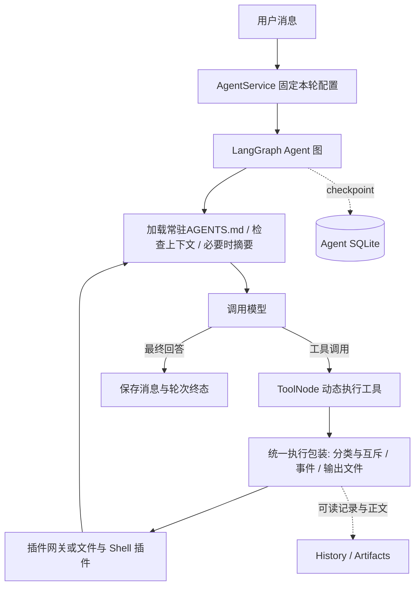

# Agent 模块设计

本次是设计稿；用户已授权新增 Agent 设计，尚未实施。需求范围见 [proposal.md](proposal.md)，前端分解见 [frontend.md](frontend.md)，核对来源见 [references.md](references.md)。默认值均为本项目建议，不冒充 Claude Code、Codex 或 LangChain 的固定限制。

## 1. 结论与边界

采用 **LangChain `create_agent` 构建的 LangGraph 图 + 现成摘要中间件 + 几个小工具 + 普通文件工作区**。

Agent 是与 Workflow 并列的模块。Workflow 继续执行预先定义的采集/分析/通知阶段；Agent 根据问题循环调用同一批基础能力。

它可以尽可能复用Workflow模块相关的东西，这个版本是复用采集器和渠道

首版是单服务进程、一个 Agent 工作区、多个会话；ReAct框架，可多轮对话。没有子 Agent、向量记忆、MCP 服务、定时 Agent、后台 Shell 会话或插件市场。网页搜索暂时不实现

记忆模块的原则是，不添加新的工具，一切交给模型。压缩采用token到达上限时自动执行，该版本不采用自适应策略，压缩统计的颗粒度为message，而非是更细的


---


这里和 WorkFlow 的交互是复用 WorkFlow 最后输出的对象，作为 `{input}` 插入上下文的前面。这也是其核心功能——继续讨论某次 WorkFlow 的分析结果。Agent 保存来源 WorkFlow session ID，也可以绑定其他已配置的 AI。

双向的渠道应该提供 `{channel, session, priority}` 指令信封；`stop` 的优先级最高并独立进入取消通道，然后是一般指令，最后是普通对话。

一般的指令应该要有个/new和/resume，可以参考qwenpaw和CC-Connect，但是这里的dir不该可以修改。这里应该要有查看/workflow的历史记录，还有从某个session的结果中继续，还有个快捷按钮，直接从最新的开始

`/compact` 和 `/append` 在模型下一次返回后的安全边界处理：前者压缩截至该边界的上下文，后者把文本作为下一条用户消息追加；运行中不再返回旧设计的 409。

/fork，并且基于/fork这些来实现树形的对话历史，借鉴Pi Agent，这便于实现类似于chatGPT那种可编辑输入内容的选项的方案。但是模型输出用户无法修改，这类似于Reponse接口对分支的设计

指令的解析可能会采用Typer，可能采用直接解析，这取决于哪个代码实现更加复杂，需要维护的对象更多

WorkFlow的执行不会让AI Agent的对话被切换，用户不会希望自己对话着，然后突然历史上下文就变了

## 2. 当前可复用的边界

| 现有能力 | 复用方式与必要调整 |
| --- | --- |
| `PluginRegistry`、只读注册视图 | 继续作为唯一插件发现入口；扩展 `kind=tool` 与 `register_tool`，不另建插件扫描器。 |
| `options_schema`、`setters_schema`、`schema.py` | Schema 提供给plugin工具，作为执行的依据<br />目前的方案限制在collector里，不对渠道进行扩展——理由是用户可能会更期望指定渠道，且我也没有看到多少MCP让Agent自己选择渠道投递 |
| `ResourceStore` 的来源/渠道/模型配置 | 复用已有账号与默认参数。 |
| `CollectorManager.collect` | 为Agent提供如此服务：Agent提供参数，然后该模块按照要求进行执行，采用Cli的包装，Cli则是对HTTP的包装，以便于Agent也可采用Bash方式执行 |
| `ChannelManager.send` | 用于双向交流 |
| AI Provider、凭据、模型参数、连接生命周期 | 抽出公共模型借用入口；现有 `AIService.execute` 保持单次文本分析。 |
| LangGraph SQLite checkpointer | 复用官方实现，Agent 使用独立数据库/命名空间，不读写 Workflow 的内部 checkpoint；保存 thread 的创建时间与最后更新时间，不能按链上中间记录清理。 |
| FastAPI、Vue、Schema 表单、报告组件 | 增加独立 Agent HTTP/SSE 与页面，复用现有基础设施。 |

当前 `AIService._result` 的文本结果约束不能直接用于 Agent。模型抽象已经存在，必要变更应在同一个 AI 模块内完成，避免 Agent 再维护一套凭据与连接代码；Workflow 使用明确禁止 tools 的文本入口，Agent 使用允许 tool calling 的入口。

所以直接修改`AIService._result`的设计，那个约束只是对于前版本的，但是如果可以，这里应该要拆分出来，理应提供一个限制不执行Tools的AI方案，以便于WorkFlow的设计

LangGraph直接采用原生的Message会带来长执行下的存储问题，所以需要定期清理，显然，最后一次的都是有用的，但是大模型-工具这样的交替可不一定有用了。中间应该设计定期清理的策略，Pi Agent的方案不错，但是移植的成本太大了，可能可以看一看Codex的方案

## 3. 图与模型接入

### 3.1 使用现成 Agent 图

`langchain.agents.create_agent` 返回可编译执行的 LangGraph Agent 图。采用它已有的模型/工具循环、ToolNode、消息 reducer、流式事件和 checkpointer；不再手写一份 ReAct 调度循环。



用户提到的 push 对应 LangGraph 的动态任务调度，公开接口为 `Send`，不是一个负责网络推送的节点。标准 Agent 工具分发直接使用框架能力；不为体现 push 再包一层自定义图。前端推送使用 SSE，与 `Send` 是两个不同边界。

注入的中间件限于三个职责：

1. **上下文装配**：每轮开始读取当前 `AGENTS.md`，固定该轮的系统提示、工具定义与 Token 预算；活动轮中不改变提示词前缀。
2. **`SummarizationMiddleware`**：使用现成摘要、历史裁剪和消息对齐逻辑。
3. **工具执行包装**：通过 `wrap_tool_call`/异步对应接口，统一分类、读写调度、取消、记录与结果文件化；插件不自行实现这一套。

实现时固定中间件顺序并验证：工具结果先完成外置和裁剪；固定系统提示不参与历史摘要，不因压缩消失。存储错误、未知异常、取消必须传播，不能用一个广泛的 ToolNode catch-all 把所有异常转成「执行成功」。已知参数/插件失败可返回结构化 ToolMessage，由模型修正参数。

同时，采用pydantic对返回的结果尽可能的转换格式，失败才会报错，以便于更好的兼容性

前端的对话可以采用LangGraph提供的前端组件

### 3.2 共享模型入口

在 AI 模块增加公开的异步模型借用入口，概念契约如下：

```python
async with model_runtime.lease(config, model=model_id, streaming=True) as chat_model:
    graph = create_agent(model=chat_model, tools=enabled_tools, ...)
    async for event in graph.astream(turn_input, config=thread_config):
        await publish(event)
```

`AIService.execute` 和 Agent 都使用该入口，凭据解析、配置验证、连接租约及错误脱敏只实现一次。图装配依赖注入 `BaseChatModel`，不导入 `ChatOpenAI` 具体实现。图按轮装配并恢复同一 thread 的 checkpoint；模型租约覆盖整轮 astream，而不只覆盖图创建。Provider 工厂显式支持流式参数，不能保留当前固定的 disable_streaming=True 后期待上层自动启用。

模型调用超时继续取 `AIConfig.timeout`；增加可配置的流式无活动超时，默认 300 秒，仅针对上游模型长时间无任何事件，不把 SSE 心跳算作模型活动。现有默认总时限为 600 秒；二者分别防止完全停滞与无限请求。Agent 模型重试只允许发生在本次请求尚未向外发布文本/工具调用时；已发布增量后失败要明确结束，不重复拼接答案。工具尤其是发送、写入和 Shell 不挂自动重试中间件。

### 3.3 依赖升级是先决任务

仓库锁文件已经包含 LangChain/LangGraph 1.x（当前记录为 `langchain 1.4.2`、`langgraph 1.2.12`、`langgraph-checkpoint 4.2.0`、`langgraph-checkpoint-sqlite 3.1.1`）；实施仍以锁文件验证的稳定组合为准，不能把旧版本限制写回设计。

实施第一步在隔离环境验证 LangGraph 1.x、对应 checkpoint/sqlite、LangChain 和 langchain-openai 的兼容版本，并加入读写锁依赖 aiorwlock，提交同一份锁文件。

现有数据库允许破坏性更新；升级必须在 Workflow 数据库副本上回归，不能以新建空库掩盖迁移问题。

同时，我只会1.x的LangGraph，所以必须更新，同时尽可能使用最新的版本的特性，否则我无法进行code review

## 4. 工具保持少量，插件按需发现

### 4.1 默认五个工具

| 工具 | 参数概要 | 执行类别 | 作用 |
| --- | --- | --- | --- |
| `plugin` | `action=list/schema/call, target?, arguments?, query?, cursor?` | 按 action 与目标声明解析 | 列出 Collector、按需读取调用 Schema、单次调用一个 Collector。Agent 先 list，再 schema，最后 call，以降低 token 开销；不暴露任意 Channel 发送。 |
| `read` | `path, offset?, limit?` | read | 读文本片段；路径为目录时分页列项。 |
| `write` | `path, mode, content, old_text?, expected_hash?` | exclusive | 新建/覆盖、追加或精确替换一段文字。 |
| `grep` | `pattern, path?, glob?, limit?` | read | 使用 ripgrep 查文本/文件，返回路径、行号和小片段。 |
| `shell` | `command, cwd?, timeout?` | exclusive | 单次 Shell，返回退出码与有限输出，完整 stdout/stderr 文件化。 |

`write.mode=replace` 要求 old_text 恰好匹配一次，零次或多次都报错；不做模糊替换，不自建补丁语言。覆盖采用同目录临时文件和原子替换。read 返回 hash，后续编辑可携带 expected_hash；前端保存必须携带版本条件。

目录浏览合并进 read，文件搜索合并进 grep；Runtime 信息文件由 read 按需读取，没有专用 memory/history/list_dir/send/compact/runtime 工具。工具参数 Schema 保持短小，已禁用工具完全不进入模型 tools 数组。

这借鉴 Claude Code 的 Read/Write/Edit/Grep/Bash 分类，以及 Codex 的短工具描述、搜索与 Shell/补丁能力；五工具集合是本项目自己的取舍，不宣称与它们内部工具列表一致。记忆文件主要是短 Markdown，因此首版采用简单写入/精确替换，不引入专门代码补丁执行器。

Collector 的 CLI/HTTP 仍提供给运维和 Shell 使用，但 Agent 直接调用同一应用服务，避免 Shell 持写锁后再访问本机 HTTP 造成死锁；关闭 Shell 不影响 Collector。

### 4.2 一个Tools网关

示例中的 ID 仅表示形状，不假定仓库已配置这些账号：

```json
{"action":"list","query":"日志"}
{"action":"schema","target":"sources:app-logs"}
{"action":"call","target":"sources:app-logs","arguments":{"options":{"max_lines":100},"setters":{"levels":["ERROR"]}}}
```

- list 默认只返回启用且可调用的实例 ID、描述和读/写类别，分页；不附所有 Schema，也不把资源账号配置放入 system prompt。
- schema 返回目标的**调用参数 Schema**、类型说明和参数默认值的安全视图。Schema 来自注册声明；options 仅允许现有 `x-logagent-workflow=true` 字段，Setter 复用 setters_schema。内部用「调用层」解释这个历史注解，不再新增另一个内容相同的 `x-logagent-agent` 注解。
- 新增公共 `call_options_schema(schema, fixed_options)` 投影，保留 `$defs`、本地 `$ref` 和类型约束；剔除实例层属性及其 required 条目，调用层已有固定值的字段不再强制模型重复提供。实例固定值只暴露允许且非敏感的调用默认值。该函数不等于现有 resource_options_schema，后者用于资源保存、required 处理方向不同。完整配置合并后仍按原 Schema 校验，Agent 不复制跨字段业务规则。
- call 查目标 Collector 实例的本轮快照，合并本次参数并调用 CollectorManager 一次。连接、凭据、文件目标等实例层字段不能通过 arguments 覆盖。Channel 的发送仍由绑定的双向路由或 Workflow 触发，不能通过 plugin 选择目标。
- options 按已固定实例值 → 本次显式键覆盖，复杂值整体替换；Setter 沿用现有模板展开规则与显式空列表语义。不在每次调用时重新套当前插件默认值。
- 从 ResourceStore 中抽出公共的调用配置解析函数供 Workflow 与 Agent 共用；不能由 Agent 调用 `_source` 私有方法，或重新实现另一份合并、凭据和路径校验。
- 参数错误返回字段路径和简短原因；不重复回传完整 Schema。插件内部异常保留可读错误和诊断文件引用，不把异常当作空采集结果。

采集器的 `success/empty/filtered_empty/missing/failed/timeout` 原样保留。一次 call 只调用一次 CollectorManager，没有隐含重采、发送队列或后台循环。Manager 自己的连接生命周期不属于模型工具数量。

采用修改交互模块，直接提供按参数调用的Cli/HTTP接口，如此可以减少后继的运维成本

### 4.3 工具也注册为插件

扩展现有插件 kind 联合类型，新增 `tool`；`api_version=1` 的已有 collector/channel 契约保持有效。`kind=tool` 的入口只提供 `register_tool`，继续遵守单插件事务发布、名称冲突、禁用不导入和只读视图规则。

这项扩展须同时覆盖 PluginConfiguration、注册临时集合与 owners、注册视图、CapabilityDescription/DiscoveryReport、`GET /api/plugins`、生命周期 reload 和前端 DTO，不能只改 PluginKind 的 Literal。`execution` 存在于能力声明与捕获后的只读描述；对已有 Collector 缺失此字段时只为 Agent 调度赋默认 exclusive，不改变 Workflow 既有并发语义。

工具声明最小包含：`name`、短 `description`、`input_schema`、`execution=read|exclusive`、异步 `invoke(arguments, context)`。owner 从注册过程获得，不由工具重复填写；超时及输出预算从统一运行配置注入。

plugin 网关本身由一个内置 tool 插件注册；read/write/grep/shell 各有一个内置 tool 插件。其稳定插件 ID 为 agent_plugin、agent_read、agent_write、agent_grep、agent_shell，首次均启用，设置路径形如 `plugins/config.json: tool.agent_shell.enabled`。

当前内置 Collector/Channel 是直接注入，实际上不受该 enabled 文件过滤；实施必须为**新内置 tool 插件**增加同一 Registry 内的懒加载描述记录，先检查 enabled，再导入入口并走同一注册事务，而非沿用未过滤的内置对象列表。外部插件不得覆盖这些 ID；已有 Collector/Channel 内置启停语义不在此顺手改写。不把 enable 状态再复制一份到 Agent 配置；外部 tool 插件使用相同目录 manifest，不新建工具发现系统。

网关的 list/schema 为 read；Collector call 类别来自真实目标。Collector 新增可选执行声明，未声明时为 exclusive，现有明确只读的 logs/history/mock 可声明 read；不能因为名字叫采集器就允许有副作用的第三方插件并发执行。分类由服务端解析，模型不能传 `read_only=true` 自行降级。Channel 只走绑定的输入/输出路由，不加入 Agent plugin 网关。

为限制提示词增长，既有 Collector/Channel 始终经一个 plugin 工具调用，数量增长不增加顶层工具 Schema。未来的普通工具插件只在启用时加入；配置页直接显示实际工具数量与定义 Token 估算，不再自建一套延迟工具注册协议。

## 5. 读并发、写独占

采用按固定工作区作用域的调度器，复用 `aiorwlock.RWLock` 与 `asyncio.Semaphore`，不自行实现公平读写锁；模型生成、等待用户和跨会话普通对话不持工具锁。

- 同一固定工作区内的 Agent 会话及前端文件操作共享一个工具读写锁：read 持读锁，exclusive 持写锁。读并发数默认 4；写容量固定为 1，写运行期间也不启动读取，避免读到半次 Shell 修改。不同工作区各自调度，不互相串行。
- 锁只围绕实际工具/文件操作，不围绕模型生成或等待用户。服务端的事件追加使用独立的短文件提交锁，不递归进入工具写锁，避免工具运行时记账死锁。
- semaphore 在读锁之前获取，避免空等并发槽占用读锁；写取消、超时或异常均在 finally 释放。等待状态对前端可见。
- Shell 一律 exclusive，不尝试解析 `grep ... && rm ...` 判断安全；shell 内的并发进程也不能在调用结束后遗留，退出/取消时清理进程树。
- ToolNode 同一轮工具调用只表示可独立执行，返回顺序不代表实际副作用顺序；本设计不承诺写请求按 JSON 数组顺序生效。存在前后依赖的调用应分为两个模型步骤，提示词中明确这一点。
- 此规则约束 Agent 发起的操作和 Agent 文件 API，不声称锁住外部编辑器、既有 Workflow 或插件私自启动的线程。Channel 自身跨 Workflow/Agent 的实例 send_lock 继续生效。

调用重复由稳定 `(session_id, turn_id, tool_call_id)` 识别；已经完成的调用返回原记录，不能再执行。此规则在沙箱关闭时仍成立。

当然，这里应该更多的讨论，分析Claude Code和Codex的方案，感觉还是不大行，因为如果是所有的Agent 会话共享，那么多个Agent同时工作就不大容易了

## 6. 简单且可关闭的沙箱

### 6.1 首版实现选择

配置只设 `sandbox.enabled` 与 `sandbox.network` 两个开关，默认分别为 true、false。首版用 Linux/WSL2 的 **bubblewrap** 提供 Shell 进程隔离；不增加容器调度、域名代理、审批规则或命令分类器。Claude Code 同样在 Linux 使用 bubblewrap，但本项目不复刻其完整权限系统。

- 文件工具与前端文件 API 共用 `WorkspaceBackend`，规范化路径、拒绝 `..` 越界，并使用目录句柄相对打开/禁止符号链接跟随，防止 resolve 后再打开产生路径竞态；不把单纯字符串前缀判断当作隔离。
- Shell 通过参数数组启动 bubblewrap，再由受限进程执行 `/bin/sh -lc command`。command 是工具的明确执行内容；cwd、挂载路径和超时不能拼接进 shell 字符串。
- 沙箱内只可见只读程序运行目录、可写工作区、只读 Catalog/History 记录/Artifacts，以及独立 tmp、proc、dev。禁止 `--bind / /` 或默认挂载宿主 home、配置、主密钥、Docker socket。
- 使用独立进程命名空间、`--new-session`、父进程退出联动及进程树取消；子进程环境从最小允许集合构造，不继承服务端全部环境变量与 API key。
- network=false 采用网络命名空间禁网；true 允许 Shell 使用宿主网络，不做细粒度域名控制。可调用的 Collector/Channel 使用自身服务端连接，不受 Shell 网络开关限制。

没有 bubblewrap、平台不支持或创建隔离失败时，Shell 返回 `sandbox_unavailable`，不降级为主机执行。用户可以关闭 sandbox 或关闭 Shell 插件；read/write/grep 仍能按文件边界工作。

### 6.2 关闭的确切含义

`sandbox.enabled=false` 时，Agent 文件工具和 Shell 按宿主进程权限运行；相对路径仍相对工作区，绝对路径可以指向工作区外。取消/超时、读写锁、工具插件启停和必要的输入结构校验继续有效。前端文件浏览 API 始终仅服务该工作区，不因沙箱关闭变成任意主机文件浏览端点。

沙箱设置是用户配置，不允许模型通过 tool 参数自行关闭。没有额外逐次审批流程。

这个沙箱只隔离 Agent 提供的文件/Shell 工具。现有 Collector/Channel 是可信 Python 扩展，继续在服务进程中执行；tool 插件也是可信扩展。它们没有恶意代码隔离保证。若未来需要执行不可信插件，必须另立进程隔离设计，不能把本设计包装成整套 Python 沙箱。

## 7. 一切尽量可读的文件

### 7.1 布局与所有权

路径以下为建议布局；大写名称与用户指定概念一致，常驻说明的规范文件名统一为 `AGENTS.md`。

```text
data/agents/
├── config.json                    # Agent 模型、预算、沙箱、时区等配置
├── workspace/
│   ├── AGENTS.md                   # 常驻指令，普通可编辑文件
│   ├── Memory/
│   │   └── YYYY-MM-DD.md           # Agent 自行记录的每日记忆
│   └── History/
│       └── <session_id>.md         # Agent 自行整理、可继续改写的历史笔记
└── runtime/
    ├── checkpoints.sqlite         # LangGraph 官方执行状态，不暴露为可写工具文件
    ├── Sessions/<session_id>.json # 各会话持久化的只读元数据
    ├── Catalog/<generation>/      # 从同代 registry 生成的只读目录与 Schema
    ├── Artifacts/<session_id>/     # 工具原始输出与诊断
    └── History/<session_id>/
        ├── events.jsonl           # 原始对话/调用/状态事件
        └── summaries/             # 已提交的压缩摘要及所覆盖的事件范围
```

WorkspaceBackend 将 runtime 的只读内容映射到逻辑路径 `Runtime/self.json`、`Runtime/Sessions/<session_id>.json`、`Runtime/Catalog/`、`Runtime/Artifacts/` 和 `Runtime/History/<session_id>/`；Shell 沙箱使用对应只读挂载。`History/<session_id>.md` 与 `Runtime/History/<session_id>/events.jsonl` 分属可编辑笔记与执行事实。它们都可读，但只有笔记由 Agent 随意重写，避免编辑历史导致已经发送的通知被重新执行。

`Runtime/self.json` 是一个**按 Agent 会话上下文解析的只读逻辑文件**，不是共享工作区中的单个 `current.json`。每个 Agent turn 的 `WorkspaceBackend` 都绑定自己的 `session_id`、`branch_id` 和本轮快照；多个会话同时运行时读取同一个逻辑路径仍分别得到各自内容，不会互相覆盖。该文件包含当前 `session_id`、`turn_id`、`branch_id`、来源 Workflow session、模型、工具 generation 和工作区标识。模型需要自己的 ID 时固定执行 `read("Runtime/self.json")`；提示词只告知这个路径，不把运行元数据复制成第二份事实。`Runtime/Sessions/<session_id>.json` 面向已知 ID 的历史/界面查看，不能替代 `self.json` 的会话作用域。

这不是第二套文件系统协议：模型仍只看路径并用 read/grep；映射在一个 WorkspaceBackend 内完成。Catalog 是可删除再生成的物化视图，唯一事实来源仍是 registry；Agent 不能靠改目录 JSON 注册能力。

沙箱关闭意味着 Shell 有能力破坏 runtime 文件；不承诺在同一宿主权限下保护执行记录。运行恢复遇到损坏明确失败，不根据可编辑笔记猜测事实。

### 7.2 AGENTS、记忆与历史

- `AGENTS.md` 在每个新 turn 开始时完整加载为稳定系统上下文，位于摘要区之外；活动 turn 捕获的内容不在中途变化，文件修改从下一轮或新分支生效，压缩不能删掉。首版只支持工作区根文件，不加递归 import、嵌套覆盖和多套别名解析。
- 默认模板只写职责、五工具使用方式、`Runtime/self.json` 的读取方式、当前日期/工作区路径约定、按需回忆及值得保留时写 Memory/History。动态时间放在短运行上下文中，避免整段稳定提示词每轮变化。
- Memory 是纯文本的，所以采用系统默认的时区，也可以采用配置文件指定的，后者如果有优先级更高。这里便于Agent读取，否则用户可能不是很能理解
- Agent 根据任务主动 read/grep Memory 与 History，用 write 保存。运行时不代替模型生成每日记忆，不建立向量索引，不自动把全部历史或过去 N 天全文塞进上下文。
- 自动压缩摘要属于运行时上下文，不自动写进每日 Memory。Memory 是模型判断后的长期记录；摘要是当前会话继续执行所需的短期状态。
- 关闭 read/write/grep 后，相应行为明确不可用。关闭 write 只代表不注册该工具；Shell 仍开启时仍能写文件。全部文件写能力关闭时，模型不再被提示必须保存记忆；已存在 AGENTS 的核心加载仍然工作。
- 采集文本、文件正文和历史笔记均作为数据读取，不因为文件内出现指令就提升成系统规则。只有指定 AGENTS 进入常驻指令位置。

每个 turn 使用提示词模板替换短运行块，将 Agent session、branch、来源 Workflow session、当前日期和工作区路径放在 AGENTS.md 前后；它们不改变工具定义。这样能让模型看到来源，也不会每轮重建稳定前缀。

这个采用提示词替换，

### 7.3 原始事实与 checkpoint

事件文件保存用户/助手消息、工具参数、结果引用、开始/结束与错误；内容按既有凭据规则脱敏，不写 API key。完整结果先写 Artifacts，再发布引用。用户可通过通用文件工具查自己的历史，不增加 history 工具。

LangGraph state 保存**受预算约束的当前消息、摘要、轮次 ID 与文件引用**，直接沿用 create_agent 的消息模型；不会保存每份完整采集正文。这里明确不照抄 Workflow 的「state 只有阶段引用」结构，因为那会迫使 Agent 重写框架消息恢复；也不把 checkpointer 当作给前端展示的业务历史 API。

SQLite 是执行恢复的例外，用户相关正文仍有文本文件可读。事件是原始事实，checkpoint 是执行位置，Markdown 笔记是可编辑认识；三者职责不同，禁止互相反向覆盖。

## 8. 自动压缩与 Token 预算

### 8.1 三层上下文

| 层 | 内容 | 加载与淘汰 |
| --- | --- | --- |
| 常驻 | 核心说明、AGENTS、启用工具的短 Schema | 每次请求包含，不参与摘要。 |
| 活跃 | 最近用户消息、模型回答、有限工具结果、历史摘要 | 保留完整消息/工具调用组，必要时压缩。 |
| 文件 | 原始采集、完整 Shell 输出、旧事件、Memory、历史笔记和详细插件 Schema | 按需 read/grep，不默认加载。 |

工具结果统一先产生短结构：`status`、`summary/preview`、`artifact_path`、`truncated`、必要业务计数。默认预览至多约 2,000 tokens，read/grep 同样受上限约束；超过就返回可继续分页读取的位置，不静默截断并伪称完整。完整正文写文件不消耗模型上下文，但仍有磁盘预算：单次输出默认 16 MiB；Shell 等流式生产者达到上限立即停止，普通非流式插件在返回后检查序列化大小，超限明确 `output_limit_exceeded` 并记录已保存字节与部分输出，不把部分结果当完整成功。该预算不声称限制可信插件内部的内存分配。

系统提示词绝不修改，为了用户更好的命中提示词前缀

这里需要参考Codex

### 8.2 压缩阈值

默认用户上下文为 200,000 tokens，到达 90%（180,000）后自动压缩；压缩后保留最近约 40,000 tokens 的完整消息组。该阈值是本项目默认，不宣称是模型或 Claude Code 的固定限制；本版本不采用自适应策略，按完整 message 粒度统计。

### 8.3 复用 LangChain 摘要

采用 `langchain.agents.middleware.SummarizationMiddleware`，由上式转成显式 `trigger=("tokens", 180000)`、`keep=("tokens", 40000)`。计数器优先使用模型 tokenizer，未知时使用框架估算并在 UI 标注估算；实际 usage 用于观测和校准，不能冒充预先精确计数。

这里有两处重要的框架适配，不能只填几个阈值就算完成：

1. 官方中间件只计算 state.messages，不自动计算之后注入的 system/AGENTS/tools。context.py 的薄包装在**每次模型请求前**读取 AGENTS、计算 P/B，并用该次预算构造官方中间件、委托其公开 abefore_model；不要在多会话间修改一个共享中间件的私有阈值。压缩结果发布前再次检查完整请求预算。
2. 核验时官方 `trim_tokens_to_summarize` 默认仅 **4,000 tokens**，还存在裁剪异常后取最近 15 条的 fallback。设置 **`trim_tokens_to_summarize=None`**，使用官方提供的「不裁剪摘要输入」选项，避免重要早期内容在摘要之前就被丢掉；摘要模型收到完整待压缩前缀。调用前按摘要模型容量检查完整序列化提示，不够则明确失败。这解决用户提到的「默认限制太小」，不需要重写摘要算法或修改第三方私有方法。

摘要默认使用当前模型，也可选择已有资源中的其他模型。如果摘要模型装不下待摘要消息，明确配置错误，不盲目发送或自写递归压缩器；同模型只作为缓存友好的默认，不保证必然命中缓存。

自定义 summary_prompt 要求保留：当前目标、明确约束、确认事实及文件引用、已完成/结果未知的副作用、未完成事项、下一步。不搬运长工具正文。模型摘要本身不能保证逐字保留所有发送事实；当前轮与未解决副作用的短状态块从原始事件确定性生成，位于活跃运行上下文，历史完整回执在文件中，恢复/去重决策始终查事实记录。新摘要替代旧摘要与对应历史前缀，保留最近完整消息组；ToolMessage 必须与 tool_call_id 成组，不能留下孤立调用。
这里可的summary_prompt可以参考Codex等公开信息，如果没有找到，这里将去抓取几份综合分析

每次普通模型请求之前至多压缩一次；摘要后重新计算。仍超预算则返回 `context_budget_exceeded` 并附大项占用，不循环摘要、不用截断冒充成功。没有可摘要前缀时，手动压缩为空操作；自动预算不足则报错，不接受框架占位字符串作为有效摘要。失败保留原消息和旧摘要，当前轮明确结束；不能吞掉摘要异常继续发送超限请求。

压缩成功保存可读摘要与被覆盖事件范围，再提交新上下文，发 `context.compacted`；聊天历史文件与 UI 的旧消息不删除。通过管理 API 手动压缩复用同一逻辑，不增加模型工具。

借鉴 Claude Code 的工具输出管理、自动摘要、常驻说明和文件记忆；不照抄其精确阈值。Codex 的 Responses 专用 compaction 与本项目当前 Chat Completions 兼容层不同，这里不把 `/responses/compact` 当作通用压缩服务

## 9. 会话、执行记录与重启

### 9.1 少量运行概念

- session_id：长期对话，对应 LangGraph thread；thread 元数据保存 `created_at`、`updated_at` 和 `last_checkpoint_at`。
- turn_id：一次用户输入到最终回答/失败/取消。
- tool_call_id：模型一次工具调用，与 turn_id 共同构成稳定执行键。

AgentService 持有任务句柄，HTTP 断开不取消运行；每会话一轮准入锁，跨会话可以同时生成与读取。状态使用 idle/running/completed/failed/cancelled/interrupted；completed 是最近一轮完成，会话仍可继续。

一轮开始从同一个 ResourceStore 视图捕获 AI、启用实例与插件 generation；该轮的工具 ID 集合、tools 数组、Catalog 目录和 Manager 视图全部来自同代快照。session 不永久冻结启停配置，下一轮重新捕获；旧 generation 目录只作为历史证据。每轮完成后更新 thread 的 `updated_at`，不按单个 checkpoint 做删除。

AgentService 加入 ApplicationServices，由 lifecycle 在 Registry/Manager/ResourceStore 就绪后装配；shutdown 先停止 Agent 准入并取消/等待活动轮，再关闭共享 AI/Channel 与 Agent checkpointer。插件重载同时协调 Workflow 与 Agent 准入；存在活动 Agent 轮次时，在任何卸载和发布前明确返回 busy，并恢复原准入状态。先结束或由用户停止后重载，不能在调用过程中换实现或关闭旧渠道。重载失败仍按原事务规则恢复，普通资源更新只影响下一轮。

### 9.2 不伪造恰好一次

工具运行前将带稳定 key 的 `tool.started` 事件持久化；写入/渠道/Shell 必须在记录提交后才执行。完成时先保存正文与结果事件，再允许图推进。再次看到已有完成事件时复用结果，不重做副作用；同 key 参数不同是明确冲突。

events.py 在单进程短提交锁内原子执行「查 key/参数摘要 → 占用调用 → 追加并 fsync started」。不持该提交锁执行外部 I/O，重复的活动 key 加入同一任务等待，已有完成 key 直接读结果；工具读写锁另行控制不同 key 的并发。索引与任务表是可重建内存视图，启动从 JSONL 构建；不新增第二个事实数据库。仅末尾未完整换行的部分记录可在明确诊断后隔离，文件中间损坏或冲突必须使该会话不可继续，不能跳过坏行猜状态。

进程崩溃可能发生在「外部动作完成」与「完成事件落盘」之间，文件与 checkpoint 也没有跨存储事务。启动把活动轮标记 interrupted，**不自动续跑图的 pending 工具任务**。存在 started 无 completed 的副作用记为 outcome_unknown；渠道沿用 delivery_uncertain，不自动补发，文件/Shell 也不自动重做。

用户下一次发消息时，先对照事件确认已完成/未知结果，再对未配对工具调用补入明确的 interrupted/outcome_unknown 结果并提交干净的上下文边界，最后接收新消息与执行摘要，不调用旧 pending task。实施必须验证这条框架恢复路径；不能只重放 UI 事件就宣称图已恢复。缺少/损坏 checkpoint 返回明确不可继续状态，可阅读文件或另开会话，不猜测历史重建执行。

当前 SQLite saver 不能安全删除链上任意中间 checkpoint，因此清理不按单条记录进行。线程默认保留；只有整条 thread 同时满足显式保留策略、创建时间和最后更新时间均超过保留期、没有活动轮次、没有分支引用且没有 Artifact 引用时，才允许删除。压缩和 fork 只改变上下文投影或创建分支，不删除旧链。

事件 JSONL 是持久化事件的唯一正文来源；会话列表从事件头/终态派生，可建可丢弃的内存索引，不新增会话 SQLModel 正文表。逐 token 写盘不必要，流增量合并成小块；关键开始、完成和终态先落盘再推 SSE。遇到存储故障停止新工具，不能继续执行只靠内存记账。

## 10. HTTP 与流式协议

独立前缀 `/api/agents`，不改变现有 Workflow runs DTO。配置/文件写 API 是给 UI 的管理接口，不自动变成模型工具。

| 接口 | 用途 |
| --- | --- |
| `GET/POST /api/agents/sessions` | 列表/创建会话；创建固定工作区和所选模型引用。 |
| `GET /api/agents/sessions/{id}` | 元信息、最近轮状态、上下文预算与可继续状态。 |
| `POST /api/agents/sessions/{id}/messages` | `{request_id, text}`，接收成功返回 202 与 turn_id；同 request_id 相同内容复用结果，冲突返回 409。 |
| `POST /api/agents/sessions/{id}/cancel` | 停止当前轮；已停止时返回当前状态。 |
| `POST /api/agents/sessions/{id}/compact` | 空闲时手动压缩；运行中排队到下一次模型返回边界。 |
| `GET /api/agents/sessions/{id}/events` | SSE；支持 Last-Event-ID / after 游标回放。 |
| `GET /api/agents/files` | 工作区逻辑路径的分页列表。 |
| `GET/PUT /api/agents/file` | 分页读取/显式保存；PUT 携带 path、content 和 If-Match。 |
| `GET/PUT /api/agents/config` | 读取/保存模型预算、沙箱与时区等设置；启动下一轮时生效。 |
| `GET /api/agents/tools` | 实际工具、所属插件、执行类别、Schema 与启用状态。 |

工具插件开关使用现有插件配置存储的同一写入服务/重载入口；若当前仅有 reload，则补充通用插件 enabled 配置 API，不让 `/api/agents/config` 再持有一份 enabled 列表。

事件信封：`{id, session_id, turn_id, type, at, data}`；id 是会话内单调序号，SSE 的 id 与文件事件 id 相同。最低事件集：`turn.started`、`message.delta`、`message.completed`、`command.queued`、`tool.queued`、`tool.started`、`tool.completed`、`file.changed`、`context.compacted`、`turn.completed`、`turn.failed`、`turn.cancelled`、`turn.interrupted`。工具失败包含在 tool.completed 的明确 status/error 中，不产生无意义第二份完成状态。

SSE 回放与实时订阅在同一事件游标上接续，按 ID 去重，不能先读完文件再无保护地订阅而漏事件。心跳不入历史、不增加模型 Token。慢客户端断开后可续传；不能因为一个浏览器读得慢拖住 Agent 的工具执行。

前端流程及组件复用详见 [frontend.md](frontend.md)。

## 11. 模块划分与实施顺序

新增 `src/logagent/agent/`，先保持少量模块：

| 文件 | 单一职责 |
| --- | --- |
| `service.py` | 会话/轮次准入、任务持有、取消、配置快照。 |
| `graph.py` | create_agent 装配与框架状态配置，不实现具体工具。 |
| `context.py` | 常驻文件装配、预算、摘要中间件配置。 |
| `tools.py` | 工具声明转换、统一执行包装与读写调度。 |
| `gateway.py` | 将网关参数连接到公共资源解析与既有 Manager。 |
| `workspace.py` | 普通文件和只读映射、输出文件化、路径/版本边界。 |
| `sandbox.py` | bubblewrap/关闭模式的单次进程运行。 |
| `events.py` | JSONL 提交、查询、去重与 SSE 订阅。 |

文件工具实现放入随包分发的 tool 插件；核心只消费注册视图。涉及 config/AI 的公共抽取留在原模块，不为了 Agent 建第二套配置解析器或模型连接池。

顺序为：依赖兼容验证 → 注册/模型公共接入 → plugin 单次采集闭环 → 文件与调度/沙箱 → 记忆与压缩 → HTTP/SSE 与前端 → 重启/并发/旧 Workflow 回归。每一步只完成本设计范围；详细实施与默认值依据见 [tasks.md](tasks.md)。

## 12. 取舍与限制

- create_agent 比自写 StateGraph 少维护循环和摘要衔接，但需要升级现有依赖；以旧 Workflow 回归和数据库副本验证控制风险。
- 五个工具比为每个插件注册函数省定义 Token；首次未知调用多一次基于类型读取 Schema 和一次 Schema 读取，已知 Schema 的后续调用可直接 call。
- 工作区级读写锁会限制共享目录的写吞吐，但不同会话的模型生成和读取可以并行；真正需要并行编辑时再引入独立工作区。
- 文件化使正文可检查、可搜索，运行恢复仍依赖官方 checkpoint；不承诺纯手改 Markdown 能恢复执行。
- bubblewrap 只支持首版目标平台且依赖宿主内核；不可用时显式报错，关闭模式是真正宿主执行，不模拟沙箱成功。
- 记忆由模型自己写，不能保证每个事实都会被记住；UI 可编辑且原始事件可检索。目标是小工具与可读文件，不建立第二个自动记忆管理系统。
- 运行时绝不改变工具，非压缩绝不改变历史上下文提示词，否则会导致prompt cache失效
  - 用户可以自己创造分支，但是不代表用户可以直接修改上下文，相当于树上多了个链而已
- 所有的提示词用户都可便捷修改，比如AGENTS.md或者压缩用的提示词
- 各种存储标注时间，以便进行清理
