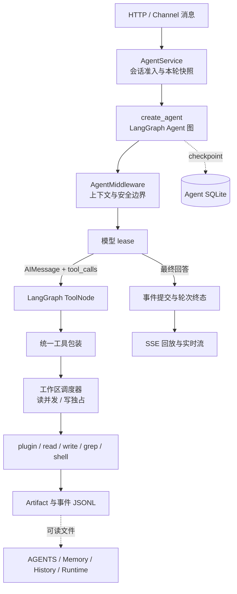

# Agent 模块设计

本文是本变更的技术设计基线。`proposal.md` 说明变更目标；`frontend.md` 说明页面和客户端拆分；`references.md` 记录外部框架与产品资料；`tasks.md` 记录默认值的依据和实施验收。本文中的默认值是本项目选择，不表示 Claude Code、Codex 或 LangChain 的固定限制。

## 1. 目标和边界

Agent 与 Workflow 并列。Workflow 继续按预先定义的采集、分析和通知阶段运行；Agent 面向用户问题，通过有限的工具循环继续调查、解释一次 Workflow 的结果，或读取工作区中的资料。

首版采用 LangChain `create_agent` 生成的 LangGraph 图，复用框架已有的模型循环、ToolNode、消息 reducer、流式事件和 checkpointer。Agent 不自写 ReAct 状态机，也不为了使用 LangGraph 的 `Send` 再包一层网络推送节点。`Send` 是图内动态任务分发；浏览器推送是独立的 SSE 事件流。

首版支持一个或多个固定工作区、每个工作区多个会话、每个会话同一时间一轮运行。工作区路径由服务配置决定，模型和用户不能通过 Agent 工具把它改成任意宿主目录。调度器按工作区分片，因此不同工作区不会因为共享一个进程级锁而互相串行。

首版不包含子 Agent、向量数据库、MCP 服务、定时 Agent、后台 Shell 会话、插件市场和网页搜索。以后增加搜索也必须以可关闭的工具插件加入，不能偷偷增加顶层工具。

Agent 与 Workflow 的关系有三个规则：

1. 从 Workflow 历史运行创建 Agent 时，最终输出对象作为 `{input}` 注入该会话的首个上下文，并保存来源 Workflow session ID。
2. Agent 可以选择其他已配置的 AI 模型；来源 Workflow、模型绑定和当前会话是不同字段。
3. Workflow 后续完成新运行时，只更新可选的历史列表，不替换正在进行的 Agent 上下文。

渠道消息使用 `{channel, session, priority}` 信封。`stop` 走独立取消通道并拥有最高优先级，其次是 `/new`、`/resume`、`/workflow`、`/compact`、`/append`、`/fork` 等命令，最后是普通对话。Channel 仍是一次一次的输入或投递操作；Agent 不把所有已配置 Channel 暴露成模型可任意选择的发送工具。

## 2. 不能被破坏的不变量

- Collector、Channel、Schema、凭据解析、模型租约和插件发现各自只有一个公共入口；Agent 只做适配，不复制业务规则。
- 一个 `plugin.call` 只调用一次目标 `CollectorManager`；不隐含重采、后台队列或工具级自动重试。
- 顶层工具数量不随 Collector 数量增长；默认模型工具固定为 `plugin`、`read`、`write`、`grep`、`shell`，其他工具只能通过可关闭插件注册。
- 读操作可以并发，exclusive 操作一次只能有一个；模型生成和等待用户不持工具锁。
- 完整工具输出进入 Artifact 文件，模型只收到有限预览和文件引用；截断必须明确标注。
- `AGENTS.md` 是常驻规则，Memory 和可编辑 History 是普通文件；运行时不替模型自动写日记，也不把 Markdown 笔记当执行事实。
- 事件 JSONL 是实际运行事实，LangGraph checkpoint 是执行位置，Markdown 是可编辑认识。三者不能互相猜测或覆盖。
- 外部副作用没有跨文件、数据库和外部服务的原子事务。崩溃后未知结果必须显式保留，不能自动重做以伪造恰好一次。
- 压缩不能拆开 `AIMessage(tool_calls)` 与对应 `ToolMessage`，不能删除常驻 `AGENTS.md`，不能因为压缩删除聊天历史文件。

## 3. 总体架构



`AgentService` 在一轮开始时捕获同一个 ResourceStore 视图：模型、启用的工具插件、Collector 实例快照、Catalog generation、工作区和预算。图执行期间不切换这组依赖；插件 reload 和资源变更只影响下一轮。

图使用独立的 Agent checkpoint 数据库或命名空间，不读取 Workflow 的内部消息状态。每个会话对应一个 LangGraph thread；分支从指定 checkpoint 建立新 thread 或新 branch 元数据，父分支保持只读。

### 3.1 LangGraph 和 middleware 的职责

直接使用 `langchain.agents.create_agent`，不自建 `model`、`tools`、`compact`、`append` 图节点。自定义 middleware 只做三类工作：

1. `before_model`/异步对应入口在模型请求边界读取本轮捕获的 `AGENTS.md`、运行上下文和命令队列，并委托官方 `SummarizationMiddleware` 完成摘要。
2. `wrap_tool_call`/异步对应入口把工具调用交给统一包装器，负责执行类别、工作区锁、取消、Artifact、事件和结构化结果。
3. 必要时在安全边界返回公开的 `jump_to="model"`，继续同一图的模型循环；只使用通过 `can_jump_to` 声明过的跳转目标。

工具循环遵循框架协议：模型产生带 `tool_calls` 的 `AIMessage` 后进入 ToolNode；所有对应 `ToolMessage` 完成后才回到下一次模型调用。`/compact` 和 `/append` 不能在未配对的工具调用中间改写消息。

命令队列在 `before_model` 的安全边界消费。活动工具组完成后，`/compact` 先压缩可安全裁剪的消息前缀，`/append` 再追加 `HumanMessage`；追加内容需要继续生成时，middleware 返回已声明的 `jump_to="model"`。如果模型已经给出最终回答，AgentService 在同一轮的后续安全 continuation 中消费队列，不通过外部并发 `update_state` 插入正在运行的 thread。`stop` 则取消当前轮并等待工具包装器释放资源。

`graph.update_state` 只用于运行完成、暂停或 fork 后建立新 checkpoint。HTTP 命令处理器不能并发修改正在执行的同一 thread；这会与图自身的 checkpoint 写入产生竞态。

### 3.2 模型入口

AI 模块提供公开的异步模型租约，Workflow 的文本分析和 Agent 共用凭据、连接生命周期、超时和错误脱敏：

```python
async with model_runtime.lease(
    config,
    model=model_id,
    streaming=True,
) as chat_model:
    graph = create_agent(
        model=chat_model,
        tools=enabled_tools,
        middleware=middleware,
        checkpointer=agent_checkpointer,
    )
    async for event in graph.astream(input_state, config=thread_config):
        await publish(event)
```

图依赖 `BaseChatModel` 和注入的工具，不导入具体 Provider。模型租约覆盖整轮执行，而不是只覆盖图创建。Workflow 保留只允许文本结果的旧入口；Agent 使用允许 tool calling 和流式输出的入口。

模型总超时沿用 `AIConfig.timeout`；流式无活动超时默认 300 秒，只统计模型或工具的实际事件，不把 SSE 心跳算作活动。已有总时限默认 600 秒。模型只允许在尚未发布文本或工具调用时重试；已经发布增量后失败，必须结束为明确错误，不能重新拼接答案。工具、Shell、写文件和外部投递不使用通用自动重试。

## 4. 复用现有模块

| 现有能力 | Agent 的用法 |
| --- | --- |
| `PluginRegistry`、注册事务、只读视图 | 增加 `kind=tool` 和 `register_tool`；所有内置和外部工具都走同一发现、启停、owner 冲突和 reload 流程。 |
| Schema、`options_schema`、`setters_schema`、`schema.py` | 从注册声明派生调用 Schema；使用公共调用配置解析，不由 Agent 访问私有 `_source` 或复制校验。 |
| `ResourceStore` | 捕获模型、Collector 实例、Channel 绑定和本轮固定值；凭据、连接字段、文件目标不能由模型覆盖。 |
| `CollectorManager.collect` | `plugin.call` 的唯一执行入口；保留原有状态 `success`、`empty`、`filtered_empty`、`missing`、`failed`、`timeout`。 |
| `ChannelManager` | Workflow 通知和绑定渠道的输入/输出路由；一次投递一次调用，`delivery_uncertain` 不自动重发。 |
| AI provider/runtime | 复用模型租约、凭据和连接错误处理；Agent 不维护第二套 Provider 工厂。 |
| LangGraph checkpoint | 只保存 Agent 执行状态和当前消息，使用独立命名空间；不把 checkpoint 当用户可编辑历史 API。 |
| FastAPI、Vue、Schema/报告组件 | 增加独立 Agent API 和页面，复用既有 DTO、表单、Markdown、报告与生命周期装配。 |

## 5. 工具面：少量顶层工具，插件按需启用

### 5.1 默认工具

| 工具 | 主要参数 | 类别 | 作用 |
| --- | --- | --- | --- |
| `plugin` | `action=list\|schema\|call`、`target`、`arguments`、`query`、`cursor` | 按目标声明 | 发现 Collector、读取调用 Schema、单次调用一个 Collector。 |
| `read` | `path`、`offset`、`limit` | `read` | 读取文本片段；路径是目录时分页列出条目。 |
| `write` | `path`、`mode`、`content`、`old_text`、`expected_hash` | `exclusive` | 新建、覆盖、追加或唯一精确替换文本。 |
| `grep` | `pattern`、`path`、`glob`、`limit` | `read` | 调用 ripgrep，返回路径、行号和有限片段。 |
| `shell` | `command`、`cwd`、`timeout` | `exclusive` | 执行一次 Shell；stdout/stderr 完整保存为 Artifact。 |

目录浏览合并到 `read`，文件搜索合并到 `grep`，记忆、历史、压缩和 Runtime 信息不增加专用工具。关闭工具插件后，工具不进入下一轮的 tools 数组；模型提交旧工具名时返回明确的 unavailable 错误。

`write.mode=replace` 要求 `old_text` 恰好匹配一次；零次、多次、hash 不匹配和路径越界都失败。覆盖采用同目录临时文件和原子替换。文件 API 与 Agent 工具使用同一 WorkspaceBackend、版本条件和调度器。

### 5.2 Collector 网关

模型按 `list → schema → call` 使用网关：

```json
{"action":"list","query":"日志","cursor":null}
{"action":"schema","target":"sources:app-logs"}
{"action":"call","target":"sources:app-logs","arguments":{"options":{"max_lines":100},"setters":{"levels":["ERROR"]}}}
```

- `list` 只返回启用且可调用的实例 ID、描述、执行类别和分页游标，不返回账号、凭据或所有 Schema。
- `schema` 返回注册声明派生的调用参数 Schema。公共 `call_options_schema(schema, fixed_options)` 保留 `$defs`、本地 `$ref`、类型约束和合法非敏感默认值，剔除实例层字段及其 `required` 条目。
- `call` 读取本轮实例快照，合并固定实例值和本次显式调用值，执行完整原 Schema 校验后调用 `CollectorManager` 一次。连接、凭据、文件目标等实例层字段不可覆盖。
- Setter 继续使用现有模板展开和显式空列表语义；复杂 options 整体替换，不在每次调用时重新套当前插件默认值。
- 参数错误返回字段路径和短原因；插件异常保留可读错误和诊断文件引用，不伪造成空结果。

Collector 的执行类别由服务端声明决定。未声明的 Collector 默认 `exclusive`；明确只读的 logs/history/mock 才能声明 `read`。模型不能传 `read_only=true` 自行降级。Collector 的 CLI/HTTP 仍供运维使用，Agent 直接调用同一应用服务，避免 Shell 持写锁后访问本机 HTTP 造成死锁。

### 5.3 工具插件

工具插件沿用现有 manifest、Registry、enabled 配置、注册事务和生命周期 reload。首批内置插件为 `agent_plugin`、`agent_read`、`agent_write`、`agent_grep`、`agent_shell`；它们先检查 enabled，再懒加载入口。工具声明最小包含 `name`、短 `description`、`input_schema`、`execution=read|exclusive` 和异步 `invoke(arguments, context)`。

Channel 不进入 `plugin` 网关。未来搜索、数据库查询或其他额外能力都作为可关闭的 `kind=tool` 插件加入；插件启停状态只有 Registry 配置这一份来源，不在 Agent 配置中复制。

## 6. 工作区、记忆和历史文件

每个固定工作区有一个用户可读的根目录和一个运行时目录：

```text
<workspace>/
├── AGENTS.md
├── Memory/
│   └── YYYY-MM-DD.md
├── History/
│   └── <session_id>.md
└── Runtime/                         # 逻辑只读映射
    ├── Catalog/<generation>/
    ├── Artifacts/<session_id>/
    └── History/<session_id>/
        ├── events.jsonl
        └── summaries/

<agent-data>/
└── checkpoints.sqlite               # LangGraph 执行状态
```

`WorkspaceBackend` 统一实现逻辑路径、目录分页、hash、If-Match、原子替换、精确替换和只读 Runtime 映射。文件工具和前端文件 API 都通过它；不能为前端另建一套路径安全逻辑。工具读取和写入使用目录句柄与禁止符号链接跟随，避免只做字符串前缀检查。

`AGENTS.md` 在每个新 turn 开始时完整读取并固定到该 turn 的 system prompt 前缀，压缩不能删除；活动 turn 中对它的修改从下一轮或新分支生效。首版只支持工作区根文件，不递归加载其他 AGENTS 或实现多套覆盖规则。

模型按需使用普通 `read`、`grep` 和 `write`：

- `Memory/YYYY-MM-DD.md` 是按配置 IANA 时区命名的每日记忆，运行时不自动生成内容。
- `History/<session_id>.md` 是模型可以整理的历史笔记。
- `Runtime/History/.../events.jsonl`、`summaries/`、`Artifacts/` 是事实和完整输出，只读。
- 文件正文中的指令是数据；只有 `AGENTS.md` 进入常驻规则位置。

自动摘要属于短期执行状态，不自动写入 Memory。关闭 `write` 后模型不能通过 Agent 工具保存记忆；关闭 `shell` 不影响 Collector；关闭所有写能力后仍可加载已有 AGENTS。

## 7. 调度、并发和简单沙箱

### 7.1 工作区级调度

每个工作区一个 `aiorwlock.RWLock` 和一个读 `Semaphore`：

- `read` 操作先取得默认容量为 4 的读槽，再持读锁；多个独立读取可以并发。
- `exclusive` 操作持写锁，容量固定为 1；写期间不启动其他读取或 exclusive 操作。
- Shell、write、前端保存和未声明只读的 Collector 都是 exclusive。
- 锁只覆盖实际工具 I/O；模型生成、SSE 推送和等待用户不持锁。取消、超时、异常均在 `finally` 释放。
- ToolNode 可以并行调度独立工具调用，包装器负责把读操作并行化、把写操作串行化；不承诺同一批多个写调用按数组顺序生效。需要顺序的动作必须由模型拆成多轮。

不同工作区使用不同调度器；同一工作区的不同会话共享文件和锁，这是共享 Memory/AGENTS 的明确代价。会话之间的模型生成仍可并行。

工具执行前以 `(session_id, turn_id, tool_call_id)` 占用稳定调用键并落盘 `tool.started`。已完成调用复用结果；相同 key 不同参数返回冲突；活动中的相同 key 共享任务等待，不重复执行。

### 7.2 可关闭的 Shell 沙箱

配置只有 `sandbox.enabled` 和 `sandbox.network` 两个开关，默认 `true`、`false`。Linux/WSL2 首版使用 bubblewrap 执行单次命令，不实现容器编排、命令审批、域名代理或后台 Shell。

沙箱开启时，Shell 只看到必要的只读程序目录、可写工作区、只读 Catalog/History/Artifacts、独立 tmp、proc 和 dev；不挂载宿主 home、密钥、Docker socket 或整个根目录。环境变量从最小允许集合构造，不能继承服务端全部凭据。`network=false` 使用网络命名空间禁网，`true` 只表示允许宿主网络，不提供域名级控制。

命令以参数数组启动，cwd 和挂载路径不拼接进命令字符串；使用 new session、父进程退出联动和进程树清理。bubblewrap 缺失、平台不支持或隔离创建失败时返回 `sandbox_unavailable`，绝不静默降级到主机执行。

`sandbox.enabled=false` 的含义是 Shell 按服务进程权限执行；相对路径仍以工作区为基准，但 Shell 可能访问工作区外的宿主路径。文件 API 仍只暴露逻辑工作区。沙箱只约束 Agent 的 Shell/文件边界，不隔离可信 Python Collector、Channel 或工具插件。

## 8. 上下文和自动压缩

### 8.1 三层上下文

| 层 | 内容 | 规则 |
| --- | --- | --- |
| 常驻 | AGENTS、短运行上下文、启用工具定义 | 每轮固定，不能被摘要删除。 |
| 活跃 | 用户消息、模型回答、工具短结果、历史摘要 | 按完整 message 组保留，必要时压缩。 |
| 文件 | 原始采集、完整工具输出、旧事件、Memory、History、详细 Schema | 通过普通文件工具按需读取。 |

每个工具结果都返回 `status`、`summary/preview`、`artifact_path`、`truncated` 和必要业务计数。默认预览约 2,000 tokens；read/grep 提供 offset/cursor 分页。单次 Artifact 默认上限 16 MiB，流式生产者达到上限立即停止，非流式插件返回后检查序列化大小；超限状态为 `output_limit_exceeded`，不能把部分输出说成完整成功。

### 8.2 预算默认值

模型上下文容量 `C` 必须来自可靠 Provider 配置或用户明确配置；未知时拒绝运行，不猜一个小窗口。默认配置按 `C=200,000` tokens：

- 输出预留 `R=4,096` tokens；
- 每轮实际测量固定 system/AGENTS/tools 开销 `P`；
- 活跃消息预算 `B=C-R-P`；
- 当 `B` 的 90% 被使用时触发一次压缩；
- 压缩后保留最近完整消息组，目标为 `min(40,000, 20% * B)` tokens。

这些是稳定的配置公式，不根据每次 usage 自适应改变阈值。Tokenizer 可用时使用模型 tokenizer，否则使用框架估算并在 UI 标记“估算”；Provider 实际 usage 只用于观测和校准。

### 8.3 复用官方摘要中间件

使用 `langchain.agents.middleware.SummarizationMiddleware`，显式配置 `trigger=("tokens", trigger)`、`keep=("tokens", keep)`，并设置 `trim_tokens_to_summarize=None`，避免官方默认的 4,000-token 输入裁剪和异常 fallback 在摘要前丢掉早期消息。薄的上下文 middleware 每次模型请求前重新计算 `P` 和本轮预算，不修改跨会话共享中间件的私有字段。

摘要模型默认复用当前模型，也可以选择已有模型资源。摘要调用使用独立租约、输出上限和 timeout；在发送前检查摘要模型能容纳完整待摘要输入。摘要 Prompt 必须保留当前目标、约束、确认事实、文件引用、已完成或结果未知的副作用、未完成事项和下一步，不搬运长工具正文。

一轮普通模型请求前最多进行一次逻辑压缩；摘要后重新计算预算，仍超限则返回 `context_budget_exceeded`，不循环压缩、不用截断伪装成功。摘要失败保留旧消息和旧摘要，当前轮明确失败。只在完整 message 边界压缩，ToolMessage 必须与对应 tool call 成组。

## 9. 命令、会话、分支和恢复

### 9.1 命令语义

命令解析采用轻量显式解析器，不把 Typer 引入运行时。支持：

- `/new`：创建会话；
- `/resume <session>`：切换到已有会话；
- `/workflow`：查看可继续的 Workflow 运行；
- `/compact`：请求同一压缩逻辑；
- `/append <text>`：在下一次模型调用前追加一条用户消息；
- `/fork`：从当前可继续 checkpoint 创建新分支。

活动轮次中，`stop` 立即进入取消通道；`/compact` 和 `/append` 返回已排队状态，在当前模型返回并完成未配对工具组后处理。`/append` 会触发一次 continuation 模型调用；`/compact` 在该边界生成 `context.compacted`。空闲时 `/compact` 立即执行，空闲时 `/append` 作为新一轮用户输入。命令不会通过并发 `update_state` 修改运行中的 thread。

编辑用户消息只能创建分支：新分支复制选定 checkpoint 的可继续上下文，再提交编辑后的用户消息。模型输出、工具参数、工具回执和已发生副作用不可编辑。父分支保持只读，不提供可能重放副作用的原地重跑。

### 9.2 运行记录和恢复

会话使用 `session_id`，每次用户输入使用 `turn_id`，工具使用 `tool_call_id`。AgentService 持有后台任务；HTTP 断开不取消运行；每会话一次只接收一轮，重复 `request_id` 返回原 turn，内容冲突返回 409。

事件 JSONL 记录用户/模型消息、工具参数摘要、started/completed、状态和错误；完整结果先写 Artifact，再提交引用和 SSE 事件。文件尾部不完整可在启动时隔离并诊断；中间损坏或参数冲突使会话不可继续，不能跳过坏记录猜状态。

进程在外部动作完成和完成事件提交之间退出时，启动恢复将活动轮标记为 `interrupted`。只有 `started` 没有 `completed` 的副作用标记 `outcome_unknown`；Channel 保留 `delivery_uncertain`，文件、Shell 和 Collector 也不自动重做。用户下一轮开始前，系统补入明确的中断工具消息，建立合法上下文后再处理新消息。

checkpoint 只用于图的执行位置，事件文件才是运行事实。首版不假设可以安全删除 thread 链上的任意中间 checkpoint；清理只删除满足保留策略、年龄阈值、无活动轮次、无分支和无 Artifact 引用的整条 thread。

## 10. HTTP、SSE 和前端契约

API 使用独立前缀 `/api/agents`，不改变 Workflow runs DTO：

| 接口 | 作用 |
| --- | --- |
| `GET/POST /api/agents/sessions` | 列表/创建会话，固定工作区、模型和可选 Workflow 来源。 |
| `GET /api/agents/sessions/{id}` | 会话、分支、最近轮状态、预算和可继续状态。 |
| `POST /api/agents/sessions/{id}/messages` | `{request_id,text}`，接收成功返回 202、`turn_id`。 |
| `POST /api/agents/sessions/{id}/cancel` | 取消当前轮，返回确认后的终态。 |
| `POST /api/agents/sessions/{id}/compact` | 空闲立即压缩；运行中入队并返回排队状态。 |
| `GET /api/agents/sessions/{id}/events` | SSE，支持 `Last-Event-ID`/`after` 回放。 |
| `GET /api/agents/files`、`GET/PUT /api/agents/file` | 逻辑路径分页读取和 If-Match 保存。 |
| `GET/PUT /api/agents/config` | 模型预算、沙箱、时区等配置；下一轮生效。 |
| `GET /api/agents/tools` | 后端实际工具、插件、执行类别、Schema 和 generation。 |

事件信封为 `{id, session_id, turn_id, type, at, data}`，`id` 是会话内单调序号，并同时写入 JSONL。最低事件包括 `turn.started`、`message.delta`、`message.completed`、`tool.queued`、`tool.started`、`tool.completed`、`context.compacted`、`file.changed`、`turn.completed`、`turn.failed`、`turn.cancelled` 和 `turn.interrupted`。心跳不写历史、不计模型活动。

SSE 续传必须在同一游标边界完成“回放缺失事件并接入实时订阅”，客户端按 ID 去重；断线不取消后台轮次，慢客户端不能阻塞工具执行。工具事件按 `tool_call_id` 更新同一张卡片，排队和写锁等待是状态事件，不伪装成模型消息。

## 11. 前端设计

前端使用 Vue 3、Element Plus、Tailwind、Vue Router 和现有报告/Schema 组件。当前自建 FastAPI SSE 使用项目自己的 `useAgentStream`；不能把普通 SSE URL 直接传给 `@langchain/vue` 的 `useStream`。若后端未来对齐 LangGraph Streaming Protocol v2，则实现 `AgentServerAdapter`，负责命令、事件流、thread 绑定、断线 replay 和去重，再替换客户端 transport，不重写页面。

路由为 `/agents` 和 `/agents/:sessionId`。桌面端是会话/分支树、聊天区和按需抽屉；窄屏保留单列聊天，会话、文件、工具和设置放入抽屉。

聊天区展示流式 Markdown、工具卡片、排队/读并发/写等待、Collector 短结果和 Artifact 引用。`context.compacted` 显示可展开摘要和覆盖事件范围，旧消息仍在历史文件中。来源抽屉显示 Workflow session、最终输出预览、模型和绑定渠道。

文件抽屉按权限展示 `AGENTS.md`、`Memory/`、`History/<session>.md`、只读 `Runtime/`、`Artifacts/` 和 `Catalog/`。保存携带 ETag/If-Match；冲突保留用户草稿并要求重新读取或合并。前端不推断工具执行类别，以后端 `GET /tools` 为准。

设置抽屉包含 Provider/模型、上下文容量和输出预留、摘要模型与 Prompt 版本、五个工具插件开关、沙箱状态/网络、工作区只读路径和 Memory 时区。沙箱关闭显示“按宿主权限运行”，不可用显示“隔离启动失败”，两者不能混淆。运行中的轮次固定模型、工具 generation、AGENTS 和提示模板版本；设置变更从下一轮生效。

建议组件为 `AgentView.vue`、`AgentTranscript.vue`、`AgentBranchTree.vue`、`AgentToolCall.vue`、`AgentFileDrawer.vue`、`AgentSettings.vue`、`useAgentStream.ts` 和 `api/agents.ts`，复用现有 PageHeader、SectionCard、StatusBadge、ParameterField、报告和安全 Markdown 组件。

## 12. 模块划分和实施顺序

新增 `src/logagent/agent/`，保持模块少而边界清楚：

| 模块 | 职责 |
| --- | --- |
| `service.py` | 会话、轮次准入、任务持有、取消和本轮快照。 |
| `graph.py` | `create_agent` 装配、middleware 和 checkpoint，不实现 ReAct 循环。 |
| `context.py` | AGENTS、运行前缀、预算和官方摘要 middleware。 |
| `tools.py` | 工具声明转换、统一包装、锁、Artifact 和结构化结果。 |
| `gateway.py` | Collector list/schema/call 与公共资源解析、Manager 调用。 |
| `workspace.py` | 逻辑路径、版本检查、原子文件操作和只读映射。 |
| `sandbox.py` | bubblewrap 单次 Shell、关闭模式和进程清理。 |
| `events.py` | JSONL 提交、稳定调用键、恢复索引和 SSE 订阅。 |

实施顺序为：LangChain/LangGraph 依赖与旧 Workflow 副本回归 → 公共模型/Schema/插件接入 → Collector 单次调用闭环 → Workspace/调度/沙箱 → 文件记忆与压缩 → 会话/事件/恢复 → HTTP/SSE/Vue → 并发、重启和完整旧 Workflow 回归。

验收必须覆盖：新增 Collector 不增加顶层工具、Schema 复用、单次调用、禁用不导入、读并发/写独占、沙箱关闭与不可用、AGENTS 常驻、Memory/History 文件读写、工具输出文件化、摘要失败和工具成组、SSE 续传去重、request_id 幂等、文件冲突、分支编辑、未知副作用不重放，以及窄屏前端。

## 13. 明确取舍

- 采用 `create_agent` 和官方 middleware，减少自建图代码；代价是必须锁定 LangChain/LangGraph 1.x 并用公开 hook 适配命令和压缩。
- 采用五个顶层工具和一个 Collector 网关，减少提示词增长；首次未知 Collector 多一次 list/schema，Schema 已知后可直接 call。
- 采用工作区级而非进程级锁，避免多个工作区互相阻塞；同一共享工作区的会话仍必须串行写入，这是共享文件语义的必要代价。
- 采用事件文件、Artifact 和 checkpoint 三层职责，换取可读性和可恢复边界；不承诺手改 Markdown 可以恢复执行。
- 沙箱是可关闭的单次 Shell 隔离，不是全系统安全边界；关闭后明确按宿主权限运行，隔离失败明确报错。
- 采用固定预算公式而非自适应压缩，便于复现、审计和控制 Token；模型窗口未知时要求配置，不猜测。
