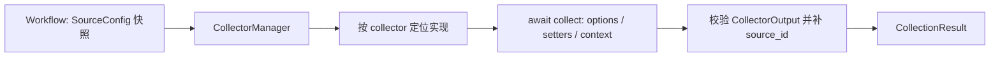

# 数据采集模块设计

[总设计](../../design.md) · [接口契约](../../contracts/module-interfaces.md#3-数据采集)

模块执行单来源采集，向 Workflow 提供可消费文本、记录、处理后计数和真实状态。跨来源拼接、失败策略和 AI/通知调用由 Workflow 决定。
配置遵循[Manager 四层设计](../manager%20design.md)：作者构造注入、插件自行读取私有 JSON、可复用 SourceConfig、Workflow.source_overrides 调用选项。
## 内部组织与依赖

CollectorManager 对外提供 describe/validate/collect；启动时接收配置模块发布的只读 `collectorRegister`，内部只按该视图定位声明与实现并执行单来源采集。插件目录扫描、`plugin.json` 解析、入口导入、`plugin.register(api)` 调用及注册冲突处理由[配置模块](../config/design.md#插件发现与注册)完成。来源专属处理留在 Collector 实现中，避免通用父类承担过滤、分页等不一致逻辑。

一个插件可在配置模块的一次入口调用中注册多个 Collector name；同一 name 可配置多个 SourceConfig.id。`collectorRegister` 保存能力声明和实现，SourceConfig 由配置模块保存，Manager 不再维护资源副本或可变注册表。

## 能力与 Setter

Collector 由插件入口的 `plugin.register(api)` 经 `register_collector` 提交 name、options_schema、setters_schema、可选 fields、count_unit 和 collect 协程。配置模块校验并发布后，Manager 的 describe 从 `collectorRegister` 生成 CapabilityDescription，供 API 展示与配置校验复用。

options 定义连接/范围；顶层 x-workflowweave-workflow=true 声明可由 Workflow 覆盖的调用字段，其他实例字段不可覆盖。setters 定义可用字段选择、过滤、排序、分组及格式化，具体类型必须在 schema 中说明。未声明的 Setter 不可注入。schema 应为 JSON Schema 2020-12 的对象约束，对不允许任意键的对象使用 additionalProperties=false。

SetterTemplate 由配置模块存储；配置展开时依次合并实例模板、实例显式键、Workflow 模板、Workflow 显式键，包括空列表；不做隐式深度合并。Manager 校验展开后的结果及模板的 collector 归属。

## 单次采集流程

1. 定位能力。未注册或导入失败返回 missing，附带发现诊断；已保存 Workflow 不因当前插件缺失而在触发前被阻断。
2. 使用 SourceConfig.timeout 限制整次调用，按需注入日志路径和凭据解析能力。来源路径在创建运行快照时按插件声明固定。
3. 插件访问一个来源、执行其声明的处理顺序并返回 CollectorOutput；阻塞 SDK 可在内部使用线程，但线程任务仍须有真实 I/O 时限。
4. Manager 严格校验返回状态、文本、count、JSON 结构，并补 source_id。异常/非法返回为 failed，时限耗尽为 timeout，不把未完成文本当成功。

正常空和过滤后空由插件区分；只返回处理后 count，不估算过滤前数量。取消向调用者传播，不发明 CollectionStatus.cancelled。插件在 finally 释放连接和文件句柄。

## 内置 Collector

### Mock

options 提供有界样例 records，或显式 mode=success/empty/failed/timeout；默认离线成功样例。setters 声明 fields、简单等值过滤、排序及分组字段。处理顺序固定为过滤、排序、字段投影、分组、格式化；count 为最终可消费记录数，分组不改变计数单位。原样例空返回 empty，过滤/投影后无内容返回 filtered_empty。

### 运行日志 logs

通过 CollectionContext.log_path 读取本工具诊断日志；未配置日志文件或目标不存在返回 missing。options 使用 max_lines 和 max_bytes 约束尾部读取，默认 200 行和 256 KiB；从文件尾分块回读，不能为取尾部扫描整文件。

应用诊断由 Python 标准库 `logging` 负责；日志 Collector 只读取其逐行 JSON 输出。setters 支持等级、模块、session/time 范围、字段与分组；count 按处理后的事件数。已读取范围中的损坏完整行返回 failed 并给出行位置诊断；文件尾尚未写完的一行不视为完整事件，metadata 说明忽略事实。日志轮转导致读取中断时报告，不无限重开追踪。

### Workflow 历史 history

通过 CollectionContext 注入 Workflow 的 SessionView 只读接口，读取运行时节点维护的 SessionStore，与对外 session 展示共用同一查询实现，不直接读取 SQLite 表或自行解释 LangGraph checkpoint。按指定 Workflow/session、最近次数、时间范围和 token 内容预算选择已保存阶段结果；只读取历史，不重新执行原始 Collector 或 Workflow。

最近次数按 session 计数，不按 checkpoint 数量计数；一次查询固定所选 session version，与 checkpoint_id 无关，并排除当前 session。未匹配历史返回 empty；已选内容未保存、过期或损坏则报告 missing/failed 及原因。超过预算按配置截取或报错，并记录截取范围；字段、分组等 Setter 由此 Collector 声明，count 为最终选中的历史 session 数。

## 验证要点

覆盖配置模块发布的一个插件多能力、注册冲突与 Manager 只读消费 `collectorRegister`，以及 Setter 覆盖、空状态区别、非法输出、超时/取消和有界日志尾读。历史采集验证与 SessionView 展示一致、次数/时间/token 边界、正文缺失与无历史的区别，以及读取时不重跑来源。
