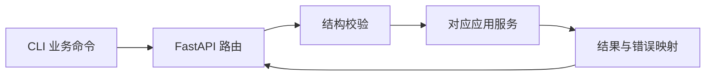

# 交互模块设计

[总设计](../../design.md) · [接口契约](../../contracts/module-interfaces.md#8-交互与生命周期)

交互模块把用户操作转换成应用服务调用。首版使用 FastAPI 提供 HTTP API，Typer 提供启动及薄 CLI；不包含前端和独立认证服务。

## 内部组织

| 组件 | 职责 |
| --- | --- |
| `routers/resources` | 五类资源 CRUD，交给配置应用服务；Workflow 写入转交 WorkflowService。 |
| `routers/runs` | 触发、查询 session、恢复和按 session_id 取消；不持有运行任务或阶段逻辑。 |
| `routers/system` | 插件能力、schema、健康与显式 reload。 |
| `schemas` / `errors` | 严格解析传输输入、统一 ErrorResponse 与 HTTP 状态。 |
| `cli` | 本地启动/配置样例；其余命令使用同一 HTTP API。 |

这些是建议包边界，不要求每项独立成类。API 依赖通过装配层注入，路由不导入具体 Collector、模型 SDK 或渠道实现。

## 请求路径

1. 校验 JSON、路径 ID、分页及未知字段。请求边界的结构校验不替代所属模块的业务校验。
2. 资源写入交由配置应用服务组织 schema、语义及引用校验；Workflow 定义交由 WorkflowService 校验后使用同一存储提交入口。
3. 触发创建 session 并返回 session 标识；取消通过 session_id 转交 WorkflowService，由 RunCoordinator 管理实际任务。
4. 路由通过 Workflow 的 SessionView 读取由 LangGraph 节点维护的业务存档，查询 session 列表、运行状态、阶段结果和备份可用性，恢复交给 WorkflowService；不直接访问 LangGraph 或 SQLite。

路径、状态码和响应形状依据本设计与总设计在交互任务中细化，接口契约仅同步记录派生结果。`GET /api/plugins` 已返回 `CapabilityDescription` 中的 schema，无需另维护渠道 schema 路由或表单字段副本。固定路由优先于 `/{kind}/{id}`。

## 配置与错误

服务地址来自 SystemConfig；CLI 仅保存 API 地址及必要本地启动参数，不维护业务资源的第二份状态。离线配置样例只是用户可编辑输入，保存仍走正常校验入口。

422 表示配置可修正错误，409 表示引用冲突，429 表示运行容量已满，503 表示必要依赖未就绪。未知错误返回脱敏 500 并保留可关联诊断。

## 验证要点

API 与 CLI 对同一无效配置返回相同原因；POST/PUT 的存在性约束在提交时成立；未知资源字段被拒绝；插件 schema 查询不执行采集、模型或通知。验证 session 展示与已提交运行时业务存档一致，读取不依赖 checkpoint 内部结构、恢复缺失材料的错误，以及独立请求通过 session_id 取消手动和定时运行。
