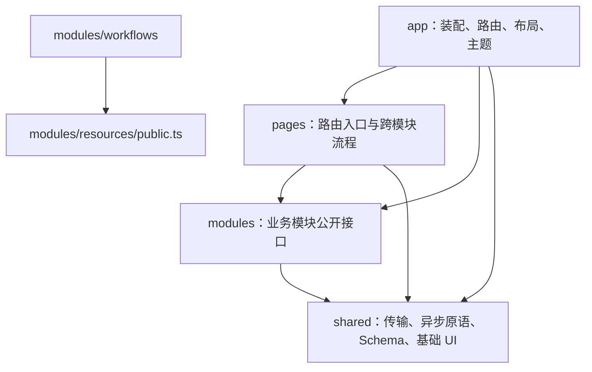

# 前端重构架构设计

状态：**待评审的架构草案；本次只做设计，代码在后续独立分支实施。**

日期：2026-09-24。调查基于 `main` 的当前工作区，HEAD 为 `cb01cd6`，包含尚未提交的 Agent 渠道和数据源中心接入修改；不能把该 commit 单独当作本设计的完整代码基线。

## 1. 结论与范围

采用 **Vue 3 单体 SPA + Axios + 按业务划分的模块 + 明确的状态所有权**。保留 TypeScript、Vue Router、Vite、Element Plus、Tailwind、Ajv、Vitest 和 Playwright。重构重点是把页面里的协调逻辑、业务状态和外部访问分开，使工作流、资源、报告和 Agent 能独立修改和验证。

本轮技术选择按用户最新要求收敛：**普通 HTTP 请求统一用 Axios，替换应用代码中的 fetch；暂不引入 Pinia、TanStack Query 或其他全局状态/查询缓存库。** 原因是优先采用维护者熟悉的技术、控制此次重构的学习与维护成本，不是断言这些库没有价值或项目没有共享状态需求。现有本地 `useQuery` 只是项目自己的组合函数，不是第三方 Query 库；Ajv 继续负责 JSON Schema 校验，与 HTTP 请求分工独立。

成功标准是：一个业务规则只维护一处；一次编辑只有一个草稿拥有者；外部请求和连接有明确生命周期；修改一个模块不需要了解其他模块内部文件。文件变短是结果，不作为拆分本身的验收标准。

本次不更换框架，不增加微前端、SSR、画布编辑器、自动保存或全局业务缓存，也不改变后端资源合并、权限、调度、恢复及渠道规则。界面继续采用现有四阶段工作流、资源中心、运行报告和 Agent 聊天流程。新交互需求另立行为变更。

## 2. 依据、现状与文档差异

### 2.1 依据优先级

本轮用户要求决定交付范围。业务约束结合既有设计、后续用户决策的任务记录和真实 API 核对；实现与设计不一致时记录差异，不默认以代码反向修改需求。

| 依据 | 本设计继承的约束 |
| --- | --- |
| [原前端设计](../configurable-collection-analysis-workflow/modules/frontend/design.md)及[前端实施记录](../configurable-collection-analysis-workflow/modules/frontend/task.md) | Vue SPA、非画布、后端事实、移动端与无障碍；后续实施移除了只复制服务端资源的 Pinia store |
| [可用性设计](../improve-frontend-usability/design.md) | 报告固定版本、分项失败、保留停用绑定、Schema 唯一验证、恢复资格来自后端 |
| [Agent 前端设计](../add-file-centric-agent/frontend.md)及[会话回归任务](../frontendFix/tasks/2026-09-23-agent-session-regressions/task.md) | 自有 SSE、请求幂等、分支、会话切换、文件冲突和输入保留 |
| [Agent 渠道设计](../add-agent-channels/design.md) | Web 命令与 SSE 走共同 AgentChannel；Web 不再直连第二套执行入口 |
| [数据源正式接入任务](../redesign-collector-configuration/tasks/2026-09-23-production-integration/task.md) | 四阶段编辑、共享数据源、完整脱离、移除模板 CRUD；后端负责解析旧模板 |
| [OpenSpec 约定](../../README.md) | 独立目标新建 change，保留旧设计；任务记录依据、默认值和真实验证结果 |

需在实施基线中显式核对的差异：

- 早期架构图的 Pinia 资源缓存已被前端实施记录移除，这是实现历史，不代表用户曾禁止 Pinia，也不能证明没有共享查询需求。本轮不引入状态/Query 库依据用户最新维护偏好；同屏共享和保存后的刷新仍需按 §5 显式设计。
- 旧采集器设计和规范仍描述独立模板管理；后续正式接入任务记录用户要求移除该入口。以这些后续记录作为草案依据，实施 change 需把实际接受的行为和规范差异明确列出，不能在本次暗改旧文件。
- 早期前端设计出现 `/api/runs` 和独立凭据管理页面；实际运行 API 是 `/api/sessions`，凭据通过保护接口及所属资源编辑器处理。迁移沿用实际协议，不补造未提供的 CRUD。
- 后续接入任务部分验收框仍未完成。本方案引用其决策，不宣称工作区里的相关实现已验收；迁移前需重新建立基线。

### 2.2 当前结构的问题与可复用资产

以下是源码检查结果，不是本轮浏览器复现结论；行号和文件规模只用于定位调查时的现状。

| 事实与定位 | 架构影响 | 处理方向 |
| --- | --- | --- |
| `frontend/src/views/AgentsView.vue` 约 1042 行，包含查询、selected 会话、按会话保存的输入、命令、分支及流事件更新 | 服务端会话、事件投影和提交状态分散协调，竞态很难单独测试 | 会话控制器、命令控制器、纯事件归并和 UI 分离 |
| `frontend/src/composables/useAgentStream.ts` 同时管理历史请求、EventSource、退避、去重及终态 | 传输协议与 Vue 生命周期耦合 | 保留协议，提取可注入的 transport 和纯投影 |
| `frontend/src/views/WorkflowEditView.vue:35`、`components/workflow/SourceStepCard.vue:70` 同时查询资源、维护草稿、解析与保存数据源 | 子组件可改变共享资源，也能修改工作流，保存范围隐含 | 工作流控制器拥有绑定和草稿，资源服务拥有共享资源写入 |
| `frontend/src/domain/resources.ts` 的 `sourceUsage` 依赖 `WorkflowDefinition`，资源页面又请求所有 workflows | 直接搬成业务目录会产生 resources/workflows 双向依赖 | 使用位置投影归 workflows，pages 组合后传给资源 UI |
| `frontend/src/components/agent/AgentContinueButton.vue` 同时调用 runs/agents API 并导航 | 跨业务流程藏在可复用按钮里 | 续接流程归 pages，按钮只表达操作和状态 |
| `frontend/src/components/report/PhaseReport.vue:18` 自行请求阶段，`:24` 解析报告 | 展示组件和生命周期绑在一起 | runs 控制器读取与解析；报告组件接收结果 |
| `frontend/src/types/index.ts` 汇集多数 DTO；`api/agents.ts` 同时定义另一批 DTO | 功能边界不明确，移动类型容易循环依赖 | DTO 按接口所有者拆分，公共 JSON/错误保持小集合 |
| `frontend/src/api/client.ts` 用单个 fetch 包装承接普通 HTTP；多个 API 测试 mock 全局 fetch | 传输已有统一入口，替换时需同时保持错误、请求头和取消契约 | 统一改用 Axios，迁移相关测试，不保留 fetch 请求后备路径 |
| Agent 页与设置弹窗分别读取配置；工作流与资源编辑器分别读取插件目录 | 已存在共享查询与刷新协调需求，不能以“没有需求”解释暂不引入 Query 库 | 页面控制器持有同屏唯一查询，组件消费同一快照，保存后调用该拥有者刷新 |
| 两个旧 Demo 页面分别约 935/3985 行，正式 router 已不引用它们；`/collector-demo` 仅重定向 | 样例与正式代码并存，可能误读为可复用业务实现 | 确认测试引用后删除未使用 Demo；保留现有重定向 |

继续复用：本地 `useQuery` 的取消和最新请求控制、`useSession` 的非重叠轮询、`ParameterInput + FieldRule + Ajv` 的注入边界、安全 Markdown、版本化报告解析及现有竞态测试。HTTP 传输实现改用 Axios，既有异步和错误语义按契约迁移。

## 3. 目标结构与依赖规则



这里的分层是依赖约束，不是要求每个操作穿过四层包装。模块之间只通过 `public.ts` 使用已声明的能力，禁止跨模块深层 import；`shared` 不依赖业务模块，模块不依赖 pages/app。

```text
frontend/src/
  app/
    main.ts
    App.vue
    bootstrap.ts                 # 装配并注入 Axios HTTP 与 EventSource 服务
    router.ts                    # 路由记录、懒加载、已有重定向
    navigation.ts                # 导航标签与图标
    layout/
    styles/                      # 主题 token、基础样式、Element Plus 适配
  pages/
    dashboard/
      DashboardPage.vue          # 路由装配；不内联指标、表格或诊断详情
      composables/useDashboard.ts # 组合模块控制器，不实现各模块查询
      ui/                        # 仅本页使用的跨模块展示组件，见 §3.3
    resources/ResourcesPage.vue
    workflows/WorkflowListPage.vue
    workflows/WorkflowEditPage.vue
    runs/RunListPage.vue
    runs/RunDetailPage.vue
    agents/AgentPage.vue
    plugins/PluginsPage.vue
    integrations/                # 按实际需要提取跨模块流程
      ContinueInAgent.vue
      useSourceUsage.ts
    NotFoundPage.vue
  modules/
    resources/                   # sources、providers、channels 三个子域
    workflows/                   # 定义、绑定、编辑、保存
    runs/                        # 历史、执行控制、阶段报告
    agents/                      # 会话、命令、事件、分支、文件、设置
    system/                      # 健康、插件目录、重载诊断
  shared/
    api/                         # Axios 实例工厂、薄请求适配、ApiError
    async/                       # 本地 useQuery/useAsyncTask，无第三方 Query 库
    schema/                      # Ajv adapter、参数模型及 Schema 控件
    ui/                          # PageHeader、SectionCard、图标、基础 Markdown
    lib/                         # 确有复用的无业务纯函数
    types/                       # JsonValue/JsonObject/ErrorInfo
```

模块按实际复杂度设 `api/`、`model/`、`composables/`、`ui/`、`public.ts`，没有需要就不建立空目录。`model/` 放 DTO、草稿变换、事件归并、展示投影等纯逻辑；`composables/` 协调 Vue 状态和调用；`api/` 实现外部访问；`ui/` 渲染模块视图。上面的 pages 清单只列路由入口，不代表每个页面只由一个组件实现；具体拆分约束和首页实例见下文。

依赖约束的具体例外只有：**workflows 可以依赖 resources 的公开类型和编辑器契约**。资源被工作流引用，这是单向业务关系。这里的编辑器契约是 API 无关的 props/emits 或注入 gateway；`SourceStepCard` 不得直接导入 `resources/api`，也不得从资源组件内部决定远端保存目标。system 的能力目录由 pages 查询后作为参数提供给资源/工作流；resources 不反向导入 system/workflows。agents 与 runs 互不导入，通过 pages 完成“从运行继续讨论”。

跨模块契约放在提供方的公开接口里；例如资源界面接受自己定义的 `SourceUsageView[]`，workflows 导出的使用位置投影由 pages 映射后传入。不会创建集中所有业务 DTO 的 `shared/domain`。

### 3.1 装配和可测试性

业务控制器接收其使用的最小 API 对象，以及确有需要的时钟/流连接工厂。可用 `Pick<Api, ...>` 表达依赖，不为每次 CRUD 增加 repository/service/use-case 三层。

- `app/bootstrap.ts` 调用 shared/api 的 Axios 客户端工厂，装配模块 API 与 EventSource 工厂，通过各模块公开的 Vue injection key 提供依赖；跨模块编辑流程由 pages 组合后注入 gateway。
- pages 取到相应依赖后调用模块控制器，或由模块公开 hook 完成注入；纯模型不依赖 Vue、路由、Element Plus、Axios、fetch 或 localStorage。
- 单元测试直接传入 API 对象/连接工厂。依赖缺失必须明确报错，不在控制器中静默创建另一套客户端。
- 模块 UI 使用 props/emits 或所属控制器的只读状态与动作。基础 UI 不请求网络；表单验证、焦点、抽屉状态仍属于 UI。

`public.ts` 仅导出实际被其他模块/pages 使用的类型、工厂、控制器和组件，内部文件不用自己的 barrel 反向导入。类型统一用 `import type`，模块入口不得发请求、创建可变单例或注册全局监听。

### 3.2 Vue 文件与逻辑的边界

**一个自有 UI 组件对应一个同名 `.vue` 单文件组件；一个页面由多个组件组合。** `.vue` 保留模板、局部样式和必要的视图逻辑，不把所有 TypeScript 都机械搬走，也不在一个 SFC 中用内联组件定义隐藏多个业务组件。

| 单元 | 可以包含 | 必须下放或移出 |
| --- | --- | --- |
| `pages/*/*Page.vue` | 读取路由参数、调用页面/模块控制器、摆放区块、连接 props/emits/slots、导航 | 表格列和行详情、大段表单、聊天消息渲染、业务草稿变换、HTTP/SSE、轮询和重试 |
| `pages/*/composables/*.ts`、`pages/integrations/*.ts` | 本页跨模块协调，例如统一刷新、运行后导航、资源使用位置与保存目标装配 | 模块内部业务规则、重复查询缓存、直接构造 HTTP 请求 |
| `modules/*/ui/*.vue`、页面私有 `ui/*.vue` | 单一语义区块、props/emits、轻量展示 computed、焦点/展开/滚动等视图行为 | DTO 解析、保存流程、事件归并、资源引用计算、重连和轮询策略 |
| `modules/*/composables/*.ts` | 注入 API、响应式状态、请求生命周期、调用纯模型、暴露只读状态和明确动作 | 模板、布局、路由跳转、Element Plus 提示、具体 HTTP/SSE 实现 |
| `modules/*/model/*.ts` | 不依赖 Vue 的类型、纯变换、校验适配和展示投影 | ref/watch、DOM、网络、路由、全局可变状态 |
| `modules/*/api/*.ts` | DTO 与端点适配、注入的传输调用、协议边界解析 | 页面状态、弹窗、业务草稿、跨模块 UI 流程 |

页面私有组件可以放在 `pages/<page>/ui/`，这里的 pages 不是单个巨大组件的容器。同一业务内的表格、卡片、编辑区归所属模块；跨业务且仅该页使用的组合归页面；多个业务真正共用的基础组件才归 shared，不以“目前只用一次”作为拒绝拆组件的理由。

拆分以职责为准：能单独命名的区块、独立的交互/空态/错误态、可重复的表单组或列表项，应形成独立 SFC。普通 `el-button`、单个文本和无独立行为的布局容器可直接内联，不为每个标签建立组件，不规定每个组件都必须配一个 hook、目录或测试文件。

默认采用 props/emits 连接控制器与展示组件。确需懒加载的抽屉或报告面板，可由明确的容器 SFC 调用所属控制器，但请求和状态机实现仍在 `.ts` 中；同一数据只能有一个控制器实例，不能父组件查询一次、子组件再查一次。编辑区接收只读草稿切片并发出命名动作，不复制完整草稿、不直接修改嵌套 props、不用双向 watch 同步两份状态。

逻辑抽取同样按职责：页面 hook 只组合模块能力；模块内按查询、编辑、命令、文件等不同生命周期拆分。不得把旧页面脚本原封不动迁入一个 `usePage.ts`，也不得新增一个 `DashboardContent.vue` / `AgentContent.vue` 承载全部旧模板后声称完成拆分。

### 3.3 Dashboard 的具体组件树与数据流

当前 `frontend/src/views/DashboardView.vue` 包含四项查询、读取时间、四张指标卡、最近运行表、插件诊断和高级组件诊断。重构时按现有界面划分以下单元；这些是目标文件，尚未创建业务代码。

```text
pages/dashboard/
  DashboardPage.vue                  # 标题、布局、事件连接
  composables/useDashboard.ts         # 组合查询控制器与 refreshAll
  ui/
    DashboardMetrics.vue             # 跨模块四项指标的排列与展示映射
    DashboardMetricCard.vue          # 单张指标的数值、读取时间和错误态

modules/workflows/composables/useWorkflowList.ts
modules/runs/
  composables/useRunList.ts
  ui/RecentRunsPanel.vue              # 最近执行区块与局部错误/空态
  ui/SessionTable.vue                 # 复用现有表格，行操作发出事件
modules/system/
  composables/useSystemDiagnostics.ts # plugins/health 独立查询和派生结果
  model/pluginHealth.ts              # 沿用现有诊断投影
  ui/SystemHealthAlert.vue
  ui/PluginHealthPanel.vue
  ui/ComponentHealthPanel.vue
```

```text
DashboardPage.vue
  ├─ PageHeader                      ← 刷新按钮和高级模式开关可直接放 slot
  ├─ DashboardMetrics
  │    └─ DashboardMetricCard × 4
  ├─ SystemHealthAlert
  ├─ RecentRunsPanel
  │    └─ SessionTable
  ├─ PluginHealthPanel
  └─ ComponentHealthPanel            ← 由高级模式控制可见性
```

- `useDashboard` 通过模块公开入口创建一个工作流列表控制器、一个运行列表控制器和一个系统诊断控制器。运行列表参数保留现有 `limit: 5`。它只组合它们的状态与刷新动作，不承担具体请求、插件状态计算或报告解析。
- 系统诊断控制器拥有 plugins/health 两个独立查询，同一 health 结果同时供指标、告警和诊断区使用；任一查询失败不阻止其他区块显示结果。`pluginHealthRows` 留在 system/model，由控制器派生后传给 UI。
- 数据从控制器以只读 props 进入区块，重试、查看运行和查看全部等意图以事件返回装配层；模块表格不导入 Router。`advanced` 等仅控制可见性的 UI 状态可留在页面。
- 每项查询保留各自 pending/error/上次成功数据和读取时间；读取时间随控制器接纳的最新有效响应更新，复用同一个异步原语，不让每张卡分别记录或请求。查询失败不能把工作流数或插件数显示为零。
- 现有统一刷新按钮只调用各控制器的 refresh；聚合 loading 只用于该按钮，不把整页所有区块合成一个成功/失败状态。

因此 `DashboardPage.vue` 的模板只列区块与布局，脚本只连接控制器、视图状态和导航；页面私有指标组件与各模块业务组件共同完成整个界面。

### 3.4 其他页面的最低拆分边界

下表定义实施时必须落到独立 SFC 的职责，名称可随现有组件迁移调整。已有组件优先复用；区块内部确有独立交互或重复单元时再继续拆分。

| 路由入口 | 独立 UI 单元 | 逻辑归属 |
| --- | --- | --- |
| `WorkflowListPage` | 工作流列表/表格、单项操作区 | workflows 列表控制器；触发 runs 由页面组合 |
| `WorkflowEditPage` | 工作流基本信息、阶段导航、来源区、分析区、汇聚区、通知区；沿用 SourceStepCard/FanOutTaskCard/FanInCard/NotificationCard | `useWorkflowEditor` 唯一拥有草稿；草稿纯变换归 model，来源异步动作单独协调并调用该拥有者 |
| `ResourcesPage` | 资源分类导航、来源筛选、来源列表/卡片、供应商列表、通知渠道列表、各类编辑器/抽屉 | 列表与编辑控制器分离；来源使用位置归 workflows，由 pages 集成 |
| `RunListPage` / `RunDetailPage` | 筛选表单、SessionTable、运行操作区、运行摘要、阶段报告面板、过程详情 | runs 列表/详情/阶段控制器负责读取和操作；报告解析归 model，按固定版本传给展示组件 |
| `AgentPage` | 会话侧栏、AgentHeader、AgentTranscript、AgentComposer、AgentBranchDrawer、AgentFileDrawer、设置弹窗 | 会话/命令/文件控制器按 §7 分离；消息投影归 model；页面协调路由与选中会话 |
| `PluginsPage` | 插件目录、重载操作区、诊断区 | system 查询与重载控制器，UI 只发出动作 |

Agent 输入框内的键盘、光标和菜单交互属于 Composer；发送/停止、request ID 和未知结果处理属于命令控制器。工作流四个阶段只编辑同一份草稿的不同切片；切换阶段不能因子组件销毁而丢失草稿。文件抽屉的开关属于 UI，路径/内容/ETag 和冲突处理属于文件控制器。

复用现有组件也要检查内部粒度：`SourceStepCard` 中的来源选择、绑定列表/绑定项和配置编辑分开；`AgentTranscript` 的消息项与工具调用分别成组件，`AgentComposer` 继续组合独立的命令菜单；新建会话、编辑后分支等独立表单从页面抽出。外层组件负责该区块的布局和动作连接，已有组件名不是保留全部内部职责的理由。

本轮补充的依据与检查见[组件边界任务记录](tasks/2026-09-24-component-boundaries/task.md)。

## 4. 模块职责

| 模块 | 拥有的行为与状态 | 对外提供 |
| --- | --- | --- |
| resources | 数据源/供应商/通知渠道编辑，凭据保护，数据源服务端解析 | 资源 DTO、目录查询、资源编辑器、解析及保存能力 |
| workflows | 工作流列表、唯一编辑草稿、分析任务引用、四阶段切换后的草稿连续性、来源/渠道绑定 | 工作流查询与编辑控制器、来源使用位置投影、阶段 UI |
| runs | `/sessions` 查询、分页过滤、运行触发/取消/恢复、版本化阶段读取与报告解析 | 运行列表/详情控制器、只读运行上下文、报告 UI |
| agents | 会话查询、发送/停止/命令、输入草稿、事件投影、分支、文件 ETag、设置 | 会话控制器、接受 Workflow session ID 的创建能力、Agent UI |
| system | 健康、插件及 Schema 目录、重载及诊断 | 分别可失败的查询结果、能力目录与诊断 UI |

说明：触发运行虽出现在工作流列表，其 HTTP 行为由 runs 提供，pages 将回调传给工作流列表 UI。首页也是页面组合，不新增“dashboard 业务模型”。Agent 默认模型、工具目录沿用 Agent API，不能拿资源中的 AI 列表重新推导工具或运行权限。

## 5. 状态所有权与数据流

### 5.1 所有权表

| 状态 | 唯一拥有者 | 生命周期与刷新方式 |
| --- | --- | --- |
| 资源、工作流、会话查询结果 | 所在页面的模块控制器 | 页面作用域内保存；同屏消费者共享同一结果，写入后精确刷新 |
| 工作流草稿 | `useWorkflowEditor` | 接受当前 ID 的初始读取后创建；资源目录刷新不重置草稿 |
| 资源弹窗草稿 | 所打开的资源编辑控制器 | 打开时创建；确认保存或明确放弃后结束；表单/JSON 使用同一领域值 |
| Agent 当前会话投影与事件游标 | `useAgentSession` | 按 session ID 隔离；切换时释放旧连接，回放重建 |
| Agent 输入及待确认请求 | `useAgentCommands` | 在连续访问 Agent 路由的稳定页面作用域内按 session ID 保存；切换会话不销毁拥有者，回执只更新对应会话；离开 Agent 区域不增加持久化 |
| 阶段报告 | runs 的阶段查询控制器 | 身份为 `(session_id, version, stage)`，身份变化取消旧请求并清除旧结果 |
| 当前资源分类、工作流阶段、可导航筛选 | Vue Router | 保留现有 URL 契约；查询草稿与已提交筛选分开，不能每键输入发请求 |
| 抽屉开关、展开项、输入焦点 | 对应 UI | 组件局部 |
| 主题、默认模型偏好 | 单一偏好访问模块 | 只允许现有非敏感偏好持久化；缺失模型显式处理 |

“后端是唯一事实来源”允许前端维护可丢弃的查询快照、编辑草稿和事件投影，不允许它们成为新的执行判定者。本轮按用户偏好不引入 Pinia/Query 库，以 Vue `ref`、`computed`、composable 和组件作用域表达所有权；不另造带 query key、TTL、自动失效或请求重试的全局缓存框架。跨页返回重新读取是本轮接受的取舍，同屏重复查询与状态生命周期问题仍需解决。

当前 `App.vue` 用 `route.path` 作为组件 key，切换 Agent 会话会重建页面，页面内按 session ID 保存的输入也随之销毁。迁移时为 `/agents` 与 `/agents/:sessionId` 使用同一个 Agent 页面 key，在原组件内响应 session ID 的变化；其他页面沿用其实体重置语义。Agent 会话切换只释放旧 SSE/查询并选择新的输入状态，离开 Agent 路由时再释放页面作用域。不通过新增全局 store 或整站 KeepAlive 掩盖生命周期问题。

### 5.2 查询与提交

继承本地 `useQuery` 的 latest-request-wins、AbortController、作用域清理和错误可见性；其 fetcher 调用模块 API，由 API 的统一 Axios 传输接收原有 `signal`。Axios 不接管草稿、Vue 状态或刷新策略；改进在原组合函数上完成，不另建第二个同义 hook。

同屏数据由页面创建一次模块查询控制器，通过 props 或页面作用域的 provide/inject 共享；写操作成功后，由协调方显式调用受影响查询的 refresh。具体边界如下：

| 场景 | 查询拥有者与刷新方式 |
| --- | --- |
| Agent 页、模型选择与设置弹窗 | 页面创建一个配置查询控制器；弹窗建立独立编辑草稿，保存后刷新同一查询，不在挂载和打开时各请求一次 |
| 工作流中的来源/通知编辑 | 页面持有插件能力和资源目录查询，将结果提供给各编辑区；共享资源保存后刷新对应目录，不重置工作流草稿 |
| 资源页与编辑抽屉 | 页面共享资源列表、能力目录与使用位置；抽屉保留独立草稿，保存成功刷新受影响的查询 |
| 运行详情续接 Agent | pages 使用已加载的运行记录连接续接流程；只有缺少当前操作需要的信息时才补充读取，不由按钮再读整份详情 |
| 切换页面或窗口返回 | 页面进入时读取；保留现有工作流目录的窗口返回刷新并清理监听；不新增全站自动重试或后台刷新 |

不使用全局事件总线广播“全部刷新”；共享查询只在实际共同作用域中复用。不可互换的数据（例如不同筛选/分页的运行列表）仍各自查询，不为了减少请求而拼成不完整的全局资源表。

- 查询身份变化清空旧实体；同身份刷新可展示旧结果，但必须同时显示刷新失败/过时状态，不能报“没有数据”。
- 首页和多个独立信息区分别查询；必须同时到齐才能执行的编辑依赖仍由控制器明确协调，不机械拆掉所有 `Promise.all`。
- 异步响应应用前检查实体 ID/请求 generation。读取消只是停止前端等待，不表示已提交的写操作被后端撤销。
- `useAsyncTask` 的失败不能在调用方被当作成功：提交控制器返回显式成功/失败结果，或让异常冒泡到唯一 UI 边界；采用一个约定并一次性迁移相关调用。不能用 `undefined` 同时表达成功的无返回值、失败和忙碌拒绝。
- 保存成功以响应或回读确认。失败保留输入；网络断开且结果未知时不自动重发有副作用的请求。只有已有服务端幂等契约支持的 Agent 请求可以携带同一 request ID 重试。

### 5.3 草稿与服务器配置

工作流的 sources、analyses、fan_in、channels 和 overrides 都属于同一草稿，子组件通过命名动作变换它。汇聚关闭时保留本次编辑的配置，提交时仍遵循原 null/启用语义。任务 ID 的编辑中间值不能破坏汇聚引用，沿用合法唯一改名后更新引用的规则。

Schema 表单与高级 JSON 共用领域值；不能解析的 JSON 文本作为显式编辑缓冲保留并阻止提交，不转换为 `{}`。只做展示与输入级校验，业务合并和引用有效性由后端最终判断。

资源列表刷新不覆盖打开的草稿。此约束不等于解决跨浏览器配置并发写入：当前资源 PUT 没有版本冲突协议，架构重构不假装提供乐观锁；文件 ETag 则继续使用已有协议。统一离开确认、自动保存、跨页持久草稿均不在本轮结构迁移中新增。

## 6. 工作流与资源的共同编辑边界

将 `SourceStepCard` 中的异步操作移入工作流控制器，资源编辑器只负责配置字段和 API 无关的保存事件；资源服务由 pages 或工作流控制器注入；卡片只呈现绑定、同步范围和动作。

```text
ResourcesPage / WorkflowEditPage
  → 单个编辑控制器：拿到后端 resolve 的配置，建立草稿
  → 同一 API 无关的 SourceConfigEditor：基础信息 / 采集参数 / 处理规则 / 高级项
  → 明确的保存目标：shared-resource 或 workflow-draft
```

- **修改共用数据源**：写 resources API，成功后刷新该资源目录/使用位置；工作流草稿只更新引用所需信息，不被整份替换。
- **编辑独立配置**：只更新当前工作流草稿中的 `source_overrides[id].source`，保存工作流后生效，不调用全局资源 PUT。
- **脱离共享**：先调用后端 `resolveSource` 获取完整有效配置，再写入草稿；前端不复制模板与覆盖的合并顺序。
- **恢复共享/发布为共用配置**：保留现有交互与确认，控制器显式执行已有动作。资源写入成功、工作流尚未保存是两个状态，不能显示为一次原子保存成功。
- **使用位置**：workflows 负责从工作流定义计算引用；当前编辑中的工作流替换其服务端快照后再计算，不能重复计数。查询失败显示未知，不能当作零个引用。

保存目标采用有区分字段的联合类型，替代多个可任意组合的 `local/shared/detached` 布尔参数。停用绑定、旧稀疏覆盖、旧模板引用、显式空对象/列表保持既有语义。此处整理数据流，不新加共享编辑权限规则。

## 7. Agent：传输、事件与命令分离

建议在 agents 内部形成以下职责，而不是把 1000 行页面搬进一个 1000 行 composable：

| 单元 | 职责 |
| --- | --- |
| `api/agentApi.ts` | REST 查询、Web 命令、文件与设置 API；DTO 不在 UI 重复定义 |
| `api/agentEventSource.ts` | URL、EventSource、游标、连接关闭与单一重连调度 |
| `model/events.ts` | 事件信封解析、会话/轮次识别、按 ID 去重 |
| `model/sessionProjection.ts` | 事件对会话状态的纯变换，不发 HTTP |
| `model/transcript.ts` | 消息/工具/命令的确定性展示投影，承接现有 transcript 函数 |
| `composables/useAgentSession.ts` | 初始快照、回放/订阅顺序、当前 session 与 generation、销毁 |
| `composables/useAgentCommands.ts` | 输入、request ID、提交中/结果未知/可重试状态、停止通道 |
| `composables/useAgentFiles.ts` | 路径、分页、内容草稿、ETag/If-Match 冲突 |

分支/设置达到独立测试所需的复杂度时再提控制器，不强制每个组件配一个 hook。

### 7.1 不可破坏的协议

1. 查询沿用 `/api/agents/...`；执行命令走 `/api/channels/web/commands`，SSE 走 `/api/channels/web/sessions/{id}/events?after={cursor}`。普通消息显式 action，斜线命令的最终解析/优先级由共同服务端入口负责。
2. 事件身份为 `(session_id, id)`。回放/续传只处理尚未应用的事件；游标在事件验证与接纳后推进。会话切换与重新订阅的 generation 必须隔离迟到回调。
3. 先读取历史，再读取当前会话以确定活动 turn，随后按历史游标续接 SSE，保留现有避免“旧终态关闭新一轮”机制。后端历史回放与实时订阅保证游标连续，前端不设计另一个服务端执行日志。
4. 连接状态与运行状态分开。断线/离页只关闭浏览器连接；不会取消后台轮次。收到当前活动 turn 的终态才更新其终态；旧 turn 的终态只更新历史。
5. 选择一种重连负责方：保留当前“onerror 后 close，再手动按游标重建”的方案，不与 EventSource 原生自动重连叠加。协议解析错误明确停止并展示；网络错误显示重新连接。EventSource 无法提供完整 HTTP 错误详情，不据此猜测会话成功/失败。
6. `/stop` 使用独立提交状态，不被普通 send pending 锁挡住。停止请求受理不等于所有副作用撤销或流已终止。
7. 一次逻辑发送保持原 request ID 与 payload。结果未知保留原输入/请求上下文；用户修改内容即成为新逻辑请求，不能用旧 ID 提交不同内容。禁止自动重放整轮工具副作用。
8. 原始事件是可回放的事实输入，会话和 transcript 是可重建投影；不得由组件再维护一份消息数组或另一套终态表。

### 7.2 类型、呈现与性能

流边界先验证信封，并对实际消费的事件 payload 做类型缩窄；不要将 `Record<string, unknown>` 直接强转为会话状态。未知事件保留在原始诊断视图，不猜测成功；无效已知事件显示协议错误。

第一轮保留现有事件投影行为，并以同一批事件验证拆分前后输出一致。只有长会话基线证实反复全量归并/Markdown 渲染造成问题时，才在单一 reducer 上改为增量投影或引入虚拟列表；不能同时保留两套消息生成算法，也不能丢弃尚需展示/回放的历史以掩盖性能问题。

## 8. API、Schema 与错误契约

### 8.1 Axios 统一传输与 fetch 替换要求

所有应用普通 HTTP 调用，包括资源 CRUD、运行控制、健康/插件查询、Agent 配置/历史/命令和文件读写，统一经过 **shared/api 的 Axios 客户端**。业务模块的 API 函数继续保留所属端点和 DTO；组件只调用控制器。依赖方向为 `组件 → 控制器 → 模块 API → Axios HTTP 客户端`，SSE 连接单独走 EventSource。

- **单一入口**：由 shared/api 提供 `axios.create` 实例工厂，应用装配时创建一个指向 `/api` 的客户端并注入模块 API。仅这一层依赖 Axios 具体实现；薄适配集中处理响应解包和错误，不重写一套 HTTP 库，不在模块里各建实例或直接调用 fetch。
- **调用形态**：模块请求改为 `method/url/params/data/headers/signal`，返回业务 DTO，而不是把 AxiosResponse 传进 UI。移除 `RequestInit`、`body` 和散落的 `JSON.stringify` 请求拼装；JSON 请求体以对象传入，只序列化一次。路径段编码、筛选/分页/版本参数及条件请求头保持原协议，不把 `0`、`false` 或有意义的空值意外丢掉。
- **取消与错误**：贯通原 `AbortSignal`。过期读取、组件卸载和会话切换仍由控制器取消并隔离迟到结果；网络失败、取消、HTTP 业务错误分开处理。继续以 `ApiError` 保留 status/code/details/path；没有响应时不伪造服务端状态。拦截器或薄适配只做传输工作，不弹业务提示、不导航、不吞异常。
- **响应规则**：`204` 明确返回 `undefined`；其他 JSON 接口的成功响应必须严格解析 JSON。为保留现有错误诊断，可在统一 JSON 适配内用 Axios 读取文本后解析一次，不能让无效 JSON 静默变成字符串成功返回。非 JSON 的 HTTP 失败保留原状态、路径和类型信息，包括现有 405 诊断；不得被“JSON 解析失败”覆盖。
- **健康检查**：仅 `/health` 允许把 `503` 的合法健康报告作为数据处理；即使该端点允许 503，结构化 `error` 信封仍抛 `ApiError`。其他端点的 4xx/5xx 继续失败，不能通过全局放宽状态判断变成成功。
- **文件和命令**：保留文件 `If-Match` / `If-None-Match`、hash/ETag 与冲突语义；保留 Agent request ID 和原 payload。请求取消或网络断开不能推导后端操作未执行，不自动重发保存、运行、发消息、停止等有副作用操作。
- **默认值**：baseURL 继续 `/api`；超时设为 `0`，沿用现有浏览器请求未设置统一时限的行为，不凭空加入 30 秒/300 秒执行取消。沿用同源代理，不新增跨域凭据策略；不增加自动重试拦截器或缓存插件。业务确需超时时另按端点契约决定。

本轮“尽可能替代 fetch”的验收边界：

| 范围 | 后续实施要求 |
| --- | --- |
| `frontend/src` 的普通 HTTP | 移除应用层直接 fetch；所有模块改用统一 Axios 入口；不保留 fetch 后备实现。Axios 内部选择的传输 adapter 不属于业务代码残留 |
| SSE | 保留 `EventSource`、游标、单一重连调度和 §7 的会话隔离；历史/快照 HTTP 请求改走 Axios，不把长连接改成普通 Axios JSON 请求 |
| HTTP/API 单元测试 | 将 mock 全局 fetch 的用例改为受控 Axios adapter/传输测试，保留原错误/取消/请求契约断言，不能只 mock 掉客户端后声称迁移通过 |
| E2E 协议探针 | `tests/e2e/agent.spec.ts` 中用于读取原始 SSE 字节和验证 Last-Event-ID 的 fetch 可保留并注明用途；这是测试探针，不是应用 HTTP 入口 |
| 测试框架与依赖 | Playwright 的 `route.fetch()` / `request`、依赖内部实现不机械替换；`fetch-suggestions` 这类组件属性也不是 HTTP fetch |

具体依据及官方 Axios 文档见[HTTP 选型修订任务](tasks/2026-09-24-axios-transport/task.md)。该任务同时替代早先“没有共享状态需求，所以不用库”的推断；旧任务只保留为历史记录。

### 8.2 DTO、Schema 与错误展示

HTTP transport 只负责传输和上述响应契约。业务错误字段文案移到所属模块或显式传入的映射，不能让底层 transport 导入 workflow/agent。

| 边界 | 规则 |
| --- | --- |
| DTO | 按模块拆分，每个接口对象只有一份 TS 定义；API 实现和调用方共用 |
| Workflow 与资源 CRUD | HTTP 可复用同一传输函数，但 WorkflowDefinition/API 属于 workflows；不因后端共用 CRUD 路由而强行把业务放一起 |
| REST 回包 | 传输解析失败保留 HTTP/path 等诊断；动态资源、报告、流事件在消费边界检查实际使用字段，不构造假数据补缺 |
| Schema | Ajv 2020-12 为唯一 JSON Schema 验证器；继续不强制类型转换、不注入默认值、不删除未知字段 |
| Schema UI | 复用现有 FieldRule 接口，局部引用/组合类型的 UI 解释不代替根 Schema 验证 |
| 错误 | 保留 code/status/details/path，UI 展示可读信息；取消、校验失败、网络结果未知、协议错误分别处理 |
| Markdown/凭据 | 复用禁 HTML/危险链接的渲染路径；明文只存在当前编辑流程，已有密文不反显、不写日志或长期浏览器存储 |

首轮不自动生成全套 OpenAPI 客户端：当前动态资源路由和自有 SSE 并没有完整可生成的业务契约。也不为所有 DTO 手写第二套后端业务校验。复用真实后端契约测试，覆盖实际消费的 JSON 结构；未来若补齐服务端 response schema，再单独评估生成类型并删除被替代的手写定义。

`system` 返回的能力/schema 由页面提供给编辑器，不根据插件名称在页面中复制规则。后端始终拥有配置有效性、恢复资格、合并、工具可用性和调度决策。

## 9. 路由、UI 与样式

保留 `/`、`/workflows`、`/workflows/new`、`/workflows/:id/edit`、`/runs`、`/runs/:id`、`/resources`、`/plugins`、`/agents`、`/agents/:sessionId`、404 和 `/collector-demo` 重定向。路由懒加载；已有 query 参数语义不变。

导航与路由使用同一命名路由标识关联，业务模块不拼接其他页面 URL。跨模块导航由 pages 处理，不新增自动扫描目录或运行时模块注册框架。

- `shared/ui` 只放多业务共用的视觉基础。`StatusBadge` 中的 session 状态、`SessionTable` 和阶段报告归 runs；Schema 编辑器归 shared/schema；凭据编辑器归 resources。
- 基础 Markdown 渲染可共享；报告结构和工具结果的业务解释留在 runs/agents。
- Element Plus 的普通按钮、输入、弹窗直接使用；仅为一致行为或语义组合封装组件，不再造一套通用组件库。
- 样式分为现有主题 token、Element Plus 适配、局部业务布局。移除重复样式应与相关模块迁移同行，不顺便重做配色和排版。
- 继续以 375px、44px 触控范围和既有 AA/核心 AAA 要求验收。Agent 长消息、输入框可见性、报告表格和抽屉均在实际浏览器检查。

## 10. 旧代码迁移映射

| 当前文件/目录 | 目标 | 需要同时做的整理 |
| --- | --- | --- |
| `main.ts`、`App.vue`、`router/*`、`components/layout/*` | app | 装配与路由，修正 Vite 入口 |
| `views/*View.vue` | pages 的路由入口 + 页面私有/模块 UI | 同时拆开模板区块与脚本职责，按 §3.2–§3.4 验收；页面只保留装配 |
| `api/client.ts` | shared/api 的 Axios 客户端 + 模块错误映射 | 替换 fetch/RequestInit；保留 ApiError、204、严格 JSON、健康 503 与取消；transport 不承载业务字段词典 |
| `api/resources.ts` | resources/api、workflows/api | 拆分业务所有者；共享传输，不复制 CRUD 实现 |
| `api/runs.ts`、`useSession.ts`、`domain/session.ts` | runs | 运行操作、状态、轮询同归属 |
| `api/agents.ts`、`useAgentStream.ts`、`components/agent/transcript.ts` | agents/api、model、composables | DTO、传输、投影、命令分别归位 |
| `domain/resources.ts` | resources/model；使用位置函数到 workflows/model | 清除 resources 对 WorkflowDefinition 的反向依赖 |
| `domain/workflow.ts`、`components/workflow/*` | workflows | 草稿动作集中，子组件去除资源写入 |
| `components/resources/*` | resources 子域 | 单一数据源编辑器；区分 shared-resource/workflow-draft 保存目标 |
| `domain/report.ts`、`components/report/*` | runs；基础文本到 shared/ui | 读取/解析和纯展示分离 |
| `api/system.ts`、能力/健康 domain | system | capabilities 和诊断保留唯一解释 |
| `domain/parameters.ts`、`adapters/schemaValidation.ts`、参数控件 | shared/schema | 保留 FieldRule 注入与唯一 Ajv |
| `composables/useQuery.ts`、`useAsyncTask.ts` | shared/async | 原地演进语义，迁移所有调用方 |
| `tests/unit/api.test.ts`、`runs-api.test.ts`、`provider-api.test.ts`、`agent-channel-api.test.ts` | 对应模块及 shared/api 的传输测试 | 改造 fetch mock，验证 Axios 实际请求适配与原有协议，而非只断言库调用次数 |
| `types/index.ts` | 各 module/model + shared/types | 删除总 DTO 桶，类型只定义一次 |
| 旧 Demo 页面 | 确认无引用后删除 | 不迁入生产 modules，不删除正式路由重定向 |

机械移动和行为整理尽量分开提交。确有必要可保留仅 re-export 的短期旧路径，并记录到期批次；禁止旧路径和新路径各有一套实现。迁移结束删除过渡出口和废弃目录。

## 11. 独立分支实施计划

### 11.1 分支与基线

建议实施分支名 `refactor/frontend-architecture`。本次不创建或切换 branch；当前工作区有大量未提交修改，不能直接切换后将其混入重构，也不应从 `cb01cd6` 新开 worktree 后假定已包含新渠道/数据源能力。

后续开始时先确认被接受的最新业务基线及其可引用 commit，再从该 commit 建独立 worktree/branch。本次文档通过已提交的文档变更带入；只迁移明确属于本设计的文件，不自动打包本地运行数据、密钥或其他未完成变更。

实施单独建立 `refactor-frontend-architecture` change，引用本设计并新建实施任务，记录实际基线、各批提交和验证。若需要改变本草案中的决策或产品行为，在实施前明确其差异；纯目录/责任迁移不重复复制现有能力规范。

### 11.2 分批完成条件

| 阶段 | 范围与依赖 | 交付和退出条件 |
| --- | --- | --- |
| P0 基线 | 接受的最新业务提交 | 记录单测/类型/构建/浏览器结果、现有失败、入口体积及长会话表现；列清文档差异 |
| P1 基础边界 | app、shared；类型归属与 Axios 统一入口 | 安装 Axios 并更新锁文件，替换所有模块 HTTP 传输及相关测试；验证 §8.1 契约；不增加 Pinia/Query 依赖；旧入口仍可运行 |
| P2 模块骨架 | system、resources、workflows 类型/查询 API | 建好单向依赖；旧页面可调用新公开入口；不迁出全局第二份资源状态 |
| P3 配置闭环 | resources + workflows 编辑，依赖 P2 | 按 §3.4 分离编辑区与逻辑；来源新增/共享/脱离/恢复，模型与通知绑定，保存回读；目录刷新保留草稿 |
| P4 运行闭环 | runs 与首页，依赖 P1/P2 | 落实 §3.3 首页组件树；版本报告、轮询、取消/恢复、分项失败；续接 Agent 集成由 pages 承接 |
| P5 Agent 闭环 | 会话控制器、命令、transport/reducer、文件 | 落实 §3.4 组件边界与 §5.1 稳定 Agent 路由作用域；真实路由切换保留按会话输入；切换/迟到回包、断线续传、旧终态、新请求/同 ID 重试、停止、分支、文件冲突通过 |
| P6 收口 | 完整路由与构建 | 删除 Demo/旧实现/临时出口；普通 HTTP 无直接 fetch，测试例外有依据；边界、类型、构建、端到端及窄屏验收通过，更新 README |

同一 branch 中按闭环小批提交，尽早追踪主线新增 API/行为。每批切换相应路由后删除被替代实现；不维护 `/v2` 平行产品、双套运行状态或长期 feature flag。无需预估无基线依据的工期。

回退单位是一个可独立验证的迁移批次及其依赖提交。由于不改变后端持久化结构，可回退前端提交恢复旧路由实现；有依赖的后续提交需一起处理，不能只回退底层边界却保留下游调用。API 变化若与主线冲突，先对齐契约再迁移，不加静默旧接口回退。

## 12. 验证与决策记录

### 12.1 验证矩阵

保留测试体系，按 `tests/unit/{shared,resources,workflows,runs,agents,system,pages}/` 逐批归属；现有 Vitest glob 已支持子目录。端到端测试按用户流程保留，不为迁移路径重写断言。

| 层面 | 必测事项 |
| --- | --- |
| 纯模型 | 任务改名/引用、来源使用位置、报告版本解析、事件去重/轮次/投影、非法 JSON 保留 |
| 控制器 | 请求 A 慢于 B、切换实体/卸载、刷新不改草稿、保存失败和未知结果、当前 turn 独立终态 |
| 契约 | 真实 `/api/sessions`、resources resolve、Web command envelope、SSE 回放、503 健康、204 和错误信封、文件 ETag |
| Axios 迁移 | JSON 只序列化一次、URL/参数/条件请求头、204、严格 JSON、非 JSON HTTP 错误与 405 诊断、健康 503 报告/错误信封区别、取消与迟到结果、网络失败和命令不自动重发 |
| 组件集成 | 共享与独立保存目标、停用绑定、模型目录刷新、Schema 高级模式、报告局部失败；首页分项失败互不遮挡、健康结果共享无重复请求；阶段切换保留唯一草稿；子组件动作传到唯一控制器 |
| 浏览器 | 资源→工作流→运行→报告→Agent 续接；使用真实 router/App 验证多会话路由切换后的输入隔离/停止/分支；Axios XHR/浏览器传输与真实代理联通；375px 与长会话输入框可见 |
| 静态边界 | shared 不导入 module；module 不导入 pages/app；只允许 workflows→resources 公共入口；无深层跨模块导入或循环依赖；SFC 不直接使用具体 API/HTTP/EventSource；纯 model 不导入 Vue/Router/UI/Axios；普通 HTTP 无直接 fetch，Axios 实现集中在 shared/api |
| 职责审查 | 每个自有组件有独立同名 SFC；Page 只装配；模板和逻辑均按 §3.2–§3.4 分离；没有以巨型 Content 组件或 usePage hook 隐藏原有耦合 |

实施时先选一个能解析 TypeScript 与 Vue SFC 的依赖检查工具/规则集，维护一份架构规则；不能用只匹配 `@/` 的 grep 冒充检查通过，相对 import、type-only import、动态 import 也需覆盖。

组件粒度按职责和数据流评审，不使用任意行数上限代替架构验收。无需为只有 props 转发的壳写快照测试；优先验证局部失败、跨组件动作与状态所有权，确保拆分后行为仍成立。

每批按顺序执行：相关单元测试 → typecheck/适用静态检查 → build → 最小真实浏览器烟测。已有命令为 `npm test`、`npm run typecheck`、`npm run format:check`、`npm run build`、`npm run test:e2e`；Agent 使用其对应 Playwright config。完整回归在收口执行，有失败则记录基线/新增的区别，不宣称全绿。

纯前端结构修改无须跑所有后端用例；涉及契约的后端单测每条命令硬超时 60 秒。隔离测试用真实 FastAPI 和临时数据，只替换模型/外网依赖。`test:live` 留给明确的本地运行环境；启动服务器不算烟测通过，不自动发送真实邮件/QQ 消息。

性能比较使用同一构建方式、路由、数据量和浏览器环境；记录入口 JS、首屏请求数和长会话交互。模块公开入口不能使所有业务被静态拉入首屏；发现变大要检查实际 chunk，不能仅凭目录分层宣称改善。不在本设计凭空设定性能百分比或全局超时。

### 12.2 默认值与取舍

| 决策/默认值 | 依据与理由 |
| --- | --- |
| 本轮使用 Axios，暂不引入 Pinia/Query 库 | 用户明确偏好熟悉的 Axios，希望降低新技术学习与维护成本；共享查询需求已存在，以页面内唯一拥有者、显式刷新和稳定作用域处理，不声称这些库没有价值 |
| Axios baseURL `/api`、timeout `0`，无自动重试 | 沿用现有 fetch 的同源路径及未设置统一浏览器超时的行为；保留 AbortSignal，未知写入结果不得自动重放 |
| 保留本地 `useQuery` 和 Vue composable | 它们是已有项目代码，不是第三方 Query 库；不扩展为全局缓存、持久化 store 或隐式失效框架 |
| Workflow 轮询继续 2000ms，请求完成后再计时 | 现有 `useSession.ts` 和原前端任务；保留不重叠、终态/错误停止 |
| SSE 重连保留 500ms 指数退避，上限 5000ms | 现有 `useAgentStream.ts`；只是网络重连节奏，不是模型执行超时。迁移至命名常量并测试，避免改变既有行为 |
| 不增加“300 秒无消息就取消” | 后端工具/模型预算已有定义，心跳不等于业务进度；浏览器连接不能决定后台轮次终态 |
| 数据源 60s、渠道 30s、AI 600s/5 次重试、并发 4 | 现有 `domain/resources.ts`、`domain/workflow.ts` 对齐 `src/logagent/models.py`；后端默认是依据，前端工厂按契约回归，不能另做隐式默认层 |
| DTO 首轮按模块手工维护 | 动态 CRUD、自有事件协议不能从当前 OpenAPI 完整生成；先明确所有者并通过真实契约验证 |
| 先保留投影算法，再按测量优化 | 降低拆分与行为改变同时发生的风险；任何优化仍只有一套事实到 UI 的变换 |

本方案相较“只移动目录”的最小补丁，多做控制器、依赖方向和状态归属整理；这些是消除循环依赖、重复会话状态与保存范围歧义的必要工作。其余工具链、视觉和后端行为保持现有约束，以便后续分支能分批验收。
