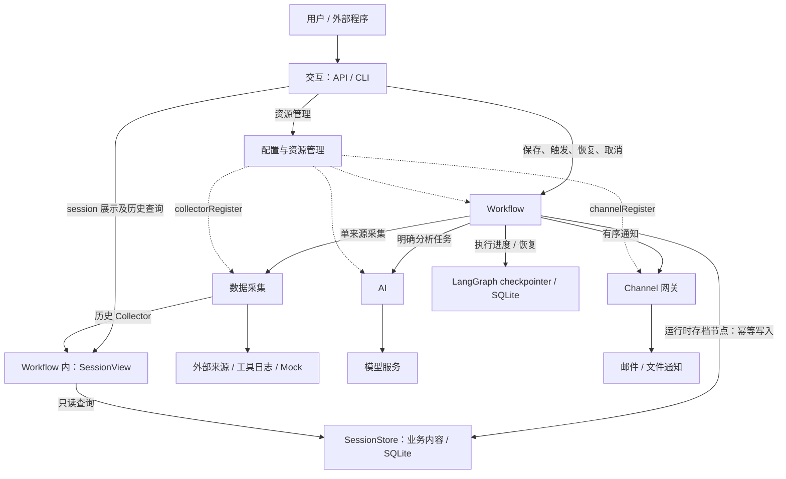

# 可配置的多源采集与 AI 分析 Workflow：设计

## 1. 架构设计

### 1.1 总体结构

保留模块化单体的总体结构：五个核心模块为交互、Workflow、数据采集、AI、Channel 网关；配置与资源管理提供公共支撑；装配与生命周期负责组合这些模块，共七个模块。Workflow 内部将执行 checkpoint 与可读 session 内容分开：LangGraph 负责运行进度，运行时的存档节点维护业务内容，SessionView 对外只读。装配模块负责依赖注入和启停协调，插件发现与注册由配置模块执行，面向个人开发者与轻量自托管场景。

用户通过 API 管理资源、触发运行和查询结果；CLI 提供服务启动和轻量 API 调用入口。Workflow 组织一次运行，分别调用采集、AI 和通知能力，通过 LangGraph checkpoint 保存执行进度，并由图节点将原快照、阶段结果和回执幂等写入 SessionStore。配置模块提供本次有效配置。

### 1.2 模块及协作边界

| 模块 | 在架构中的位置 |
| --- | --- |
| 交互 | 用户与外部程序的操作入口。 |
| Workflow | 从触发到完成的业务流程协调者，管理 LangGraph session 的持久化、展示与恢复。 |
| 数据采集 | 外部来源与内部统一采集结果之间的边界。 |
| AI | 明确分析任务与模型能力之间的边界。 |
| Channel 网关 | 已确定输出与通知平台之间的边界。 |
| 配置与资源管理 | 可复用资源、插件发现与注册及运行配置视图的公共支撑。 |

各模块的独立设计见第二部分。服务启动入口负责装配依赖与协调启停，业务决策由对应模块承担。

### 1.3 模块间关系

实线表示业务调用，虚线表示配置供给。交互层的资源写入先经过所属业务模块的语义校验，再提交配置模块。

Collector 插件处理单个来源内部的字段、过滤、分组和计数；项目侧采集管理器调用已注册能力并交付统一结果；Workflow 决定跨来源排列与共享输入。AI 处理调用方明确传入的任务；Workflow 决定任务数量、输入、执行时机和结果用途。项目侧网关管理渠道类型和实例，Channel 插件执行具体平台投递；Workflow 决定输出、目标顺序及允许哪些失败。

历史 Collector 复用 Workflow 的 SessionView 展示与查询能力，读取已保存的阶段内容，执行次数、时间和内容预算选择；读取历史不会重新运行被引用的 Workflow 或原始来源。后续 Channel 控制入口可以直接调用内部应用服务，复用相同业务规则。

### 1.4 插件、能力与实例

配置遵循[Manager 四层设计](modules/manager%20design.md)：作者构造、插件私有 JSON、可复用实例、Workflow 调用。插件提供能力，实例保存账户和调用默认值，Workflow 按声明覆盖查询范围、Setter 和收件人。一个 Collector 插件可以注册多个来源类型，同一类型可以配置多个来源实例；Channel 插件可以声明不同能力，同一通知类型可以配置多个目标。

插件发现、manifest 读取、入口导入、注册原子性和 owner 清理统一归配置模块管理。配置模块完成注册后，向其他模块发布只读的 `collectorRegister` 和 `channelRegister`；数据采集模块与 Channel 网关只消费对应注册结果，不再各自扫描插件目录。单个插件无效不影响其他有效插件。Setter 模板由配置模块保存，其可用能力仍以 `collectorRegister` 中的声明为准。

首版只要求通知能力。ControlChannel 和 ConversationChannel 的接收、指令与会话路由属于后续版本；通知不能改变用户正在进行的对话上下文。

### 1.5 一次运行的数据流

1. 读取已保存的 Workflow 及引用资源，建立本次配置快照并分配 session；插件可用性在采集阶段处理。
2. 执行来源采集，按各来源策略处理错误和空结果，再按声明顺序生成共享输入。
3. 所有 fan-out 分支接收同一份完整共享输入，分别使用自己的任务提示词和 AI 配置；完成先后不改变结果顺序。
4. fan-in 可按指定顺序组合分支，并把共享输入作为一个整体插入；需要进一步分析时再次调用 AI。关闭 fan-in 时各成功分支分别输出。
5. 最终输出进入通知前冻结，按输出及目标顺序投递，保存每条回执，再汇总业务、投递及备份状态。

### 1.6 定义、运行与恢复

`WorkflowDefinition` 是可重复执行的配置，`WorkflowSnapshot` 固定本次运行引用的有效资源。session_id 对应 LangGraph thread_id。checkpointer 管理父图和子图的执行进度；SessionStore 保存图运行时产出的业务内容，包括原快照、状态摘要、阶段结果、发送意图和回执。二者可以共用 SQLite 文件，但各自管理自己的表与接口。SessionStore 不决定下一个节点，不作为缺失 checkpoint 时另起执行的替代调度器。

SessionView 只读取 SessionStore，为 API 与历史 Collector 提供 session 列表、状态、历史版本和正文可用性，无需解释 checkpoint 内部结构。SessionRecord 是该只读业务视图。可读内容由 LangGraph 的可复用节点维护；通过节点工厂闭包绑定存储、阶段、逻辑作用域、结果选择器和业务标识，父图与子图复用同一写入逻辑。对外不开放 session 写入 API。

节点写入使用稳定的业务幂等键（session、逻辑作用域、阶段、条目、事件及必要的执行代次），不能使用重放时新生成的时间或随机 ID。相同键与相同内容重复提交返回原结果，不增加历史版本、不推进状态；相同不可变键的不同内容明确冲突。正文、可用性和可读摘要在同一业务事务发布；子图只提交自身条目，不能用旧整份 session 覆盖父图或其他分支的状态。SessionStore 提交后 checkpoint 尚未提交的窗口，通过节点重放和相同幂等键收敛，不假设两者存在跨存储事务。

备份策略决定保存哪些原快照和阶段正文；状态、错误、意图、回执和内容可用性始终保存。checkpoint 尽量只携带控制状态及存档引用，未启用备份的正文只留当前运行内存，不得通过父子图、历史 checkpoint 或 pending writes 绕过策略。SessionStore 中的正文过期后保留摘要和缺失原因。公开历史版本使用独立的 session version，不能把 checkpoint_id 当业务版本。

恢复由 Workflow 检查原 checkpoint 与 SessionStore 中必要的原快照、输入和结果后，继续原 thread_id。已保存输入、成功分支和成功投递直接复用；必要内容缺失明确拒绝，checkpoint 缺失不能从业务存档猜测进度。通知意图须先完成存档事务，再调用外部 send；意图存在但没有确定回执时标记 delivery_uncertain，不自动补发。输出冻结后只能继续投递原内容，重新分析需要新 session。取消以 session_id 定位活动运行，由 RunCoordinator 管理任务生命周期，HTTP 只转交取消指令。

### 1.7 版本边界

| 版本 | 能力范围 |
| --- | --- |
| v0.1 | 七个模块、共享输入、可选汇总、单向通知、资源管理及 LangGraph session 展示与恢复。 |
| v0.2 | Agent、工具集、插件健康监听、Webhook、指令和双向会话。 |
| v0.3 | 固定输入的效果评估、分支来源子集、Workflow 可用 Agent |
| v0.4 | 浏览器配置和运行管理、画布、评估比较与会话界面 |
| v0.5 | 执行器演进与兼容恢复 |

## 2. 模块设计

每个模块有自己的 `design.md`。总设计负责模块关系、整体流程及版本边界；模块设计负责内部组织、配置解释、执行流程及验证要点。接口契约是这些设计的派生说明，不作为独立事实来源；与已确认设计冲突时应按设计更新。

| 模块 | 独立设计 | 设计重点 |
| --- | --- | --- |
| 交互 | [交互模块](./modules/interaction/design.md) | FastAPI 路由、薄 CLI、应用服务调用与错误映射。 |
| Workflow | [Workflow 模块](./modules/workflow/design.md) | LangGraph 阶段图、共享输入、分支、汇总、通知顺序、session 展示及恢复。 |
| 数据采集 | [数据采集模块](./modules/collection/design.md) | Collector 声明、Setter、单来源异步执行、历史/日志/Mock 来源。 |
| AI | [AI 模块](./modules/ai/design.md) | 配置、提示词与一次模型请求，保持简单。 |
| Channel 网关 | [渠道模块](./modules/channel/design.md) | 类型与实例、配置绑定、单条异步发送和回执。 |
| 配置与资源管理 | [配置模块](./modules/config/design.md) | 配置分层、插件发现与注册、原子保存、凭据、引用校验与快照。 |
| 装配与生命周期 | [装配设计](./modules/lifecycle/design.md) | 依赖注入、调用配置模块完成插件发现、启动、reload 和关闭。 |

装配层是其余六个模块的连接入口。插件注册由配置模块完成，装配层只把注册结果注入数据采集模块和 Channel 网关。渠道内部另有 [邮件渠道](./modules/channel/email/design.md) 和 [Mock 文件渠道](./modules/channel/mock/design.md) 的独立设计。QwenPaw 的源码依据及取舍见 [参考记录](./references/qwenpaw.md)。

## 3. 技术决策

首版使用 Python 3.11+、FastAPI、Typer 和 uvicorn，以单进程模块化单体部署。外部 I/O 使用协程，阻塞文件或 SDK 操作可以交给线程，生命周期仍由调用模块负责。

JSON 值的校验与编解码采用 Pydantic JsonValue 和 orjson，保证严格 JSON 兼容并简化实现。

Workflow 采用 LangGraph 表达阶段和条件转移；业务规则放在可独立调用的编排函数中，节点负责调用它们。LangGraph SQLite checkpointer 保存执行进度；运行时通过可复用、参数化闭包生成的存档节点，将业务内容幂等写入 SessionStore。SessionView 从业务存储提供只读展示和历史读取，避免查询层耦合 checkpoint 的内部结构。AI 只使用普通 Provider 适配器，不为一次模型请求单独建立图。

配置模块内置轻量插件加载与注册组件，读取插件目录中的 `plugin.json`，按 `entry.backend` 导入入口 `.py`，完成声明校验后发布 `collectorRegister` 和 `channelRegister`。参考 QwenPaw 的 manifest、入口和 owner 注册机制，不依赖其运行时。数据采集模块和 Channel 网关分别接收对应注册结果。Channel 只执行单条异步发送，无发送队列、消息缓存、优先级或自动重试。首版内置邮件和追加文件的 Mock 通知。

## 4. 接口契约

接口契约定义跨边界的语义：输入是什么、字段表示什么、调用方需要满足什么条件、成功和失败分别意味着什么。它不规定模型基类、具体服务构造器、锁、文件布局、客户端或执行器。

为便于查阅，本部分分成两个文件。数据结构以带中文注释的 Python 伪代码完整列出；方法以调用方、参数、返回结果和行为约束说明。

### 4.1 数据模型

完整定义见 [接口契约：数据模型](./contracts/data-models.md)。

| 模型组 | 主要对象 | 解决的问题 |
| --- | --- | --- |
| 配置资源 | SystemConfig、SourceConfig、SetterTemplate、AIConfig、ChannelConfig、Credential | 哪些参数可以配置，各参数由谁解释。 |
| Workflow 配置 | AnalysisTask、FanInConfig、BackupPolicy、WorkflowDefinition、WorkflowSnapshot | 哪些资源用于本次运行，如何固定顺序、策略和配置。 |
| 执行结果 | ErrorInfo、CollectionResult、AnalysisResult、Notification、DeliveryResult | 如何区分结果、空内容、失败和投递事实。 |
| 运行及正文 | SessionRecord、ArtifactInfo、各阶段正文、ArtifactAvailability | 什么已经完成，哪些内容仍可读取或恢复。 |
| 插件与调用辅助对象 | 能力声明、采集输出、执行上下文 | 项目与插件如何交换配置、内容和执行结果。 |

公共字段拒绝未知字段并校验取值约束；配置允许 Pydantic 默认类型转换，扩展字段遵守所属模块声明。正文是可序列化数据，执行上下文中的运行时依赖不能进入存档。模型与实现类可以有不同组织方式，字段语义和外部兼容性必须保持一致。

### 4.2 模块接口定义

完整定义见 [接口契约：模块对外能力](./contracts/module-interfaces.md)。

| 模块 | 对外暴露的能力 |
| --- | --- |
| 配置与资源管理 | 读取设置；发现与注册插件并发布 collectorRegister/channelRegister；管理主密钥、保护和解析凭据；资源 CRUD、解析定义与生成快照。 |
| 数据采集 | 消费 collectorRegister、描述能力、验证配置、执行单来源采集。 |
| AI | 验证 AI 配置、执行明确分析，提供模型及其配置和系统提示词的复用能力。 |
| Channel 网关 | 消费 channelRegister、描述能力、验证实例、启停实例、单条异步发送并返回回执。 |
| Workflow | 校验和保存定义、触发、等待、session 展示与历史查询、恢复、取消和关闭。 |
| 交互与装配 | 对外 API 和薄 CLI 操作、可理解的错误响应、启动/关闭协调。 |

接口只发布本模块承诺的能力。运行策略统一由 Workflow 判断；其他模块提供状态和事实，不替调用方扩大权限、重跑来源或选择另一种输出模式。

## 5. 非功能约束

### 5.1 错误处理与优雅降级

优雅降级的目标是在局部故障下保留可信结果，并明确告知损失了什么。业务模块报告事实，Workflow 根据显式策略决定是否继续；不静默把失败当作空结果，不改用最新输入，也不自动切换到另一种分析或输出模式。

**错误按影响范围处理。** 无效的新提交配置在保存时拒绝，保留原配置；触发不以插件当前可用或重新通过配置校验为前置条件，已保存 Workflow 引用的 Collector 缺失或加载失败时，在采集阶段返回 missing 并执行 on_missing 策略；运行中的局部错误写入对应结果和 session；无法可靠记录运行事实的基础设施错误阻止受影响工作继续。外部调用错误使用统一结构和可修正原因，HTTP 映射见模块接口文档。

| 故障或边界 | 降级规则 | 必须保留的信息 |
| --- | --- | --- |
| 单个可选插件无效 | 隔离该插件声明，其他有效插件继续可用。 | 插件标识和失败原因；已保存 Workflow 的来源引用保留，采集时返回 missing。 |
| 来源 failed/timeout | 按 on_error 停止或跳过该来源。 | 原始状态、错误、已知计数和其他来源结果。 |
| 来源 missing | 按 on_missing 停止或跳过。 | 缺失对象及原因，不能伪装正常空。 |
| 来源 empty/filtered_empty | 分别按 on_empty/on_filtered_empty 处理。 | 原始空与处理后空的状态区别，以及处理后计数。 |
| 所有来源无有效内容 | on_all_empty=stop 时失败；skip 时结束，不调用 AI 或通知。 | 合法全空可正常完成；混有跳过的来源错误时保留降级事实。 |
| 单个分析分支失败 | 保留其他分支结果；analysis_failure=stop 阻止下游，continue 允许使用成功结果。 | 失败任务、原因和不完整性；send_partial=False 时不发送部分结果。 |
| fan-in 模型失败 | 保留已有分支结果，报告汇总失败。 | 不把单纯拼接文本当作成功汇总，也不自动改成分支分别发送。 |
| 单个通知目标失败 | 继续处理允许的其他目标，记录每条回执。 | 已完成的分析及各输出/目标结果。 |
| 投递结果不确定 | 标记 delivery_uncertain，不自动重试或补发。 | 已知投递阶段和原因，避免把可能已发送当作未发送。 |
| 阶段正文保存失败 | 先标记缺失，再按 backup.on_failure 停止或继续。 | write_failed、可用阶段与恢复限制；继续时表现为备份降级。 |
| 管理记录无法保存 | 停止受影响运行，不继续发起无法记账的外部操作。 | 尽可能记录基础设施诊断；服务不得谎报正常或完整可恢复。 |
| 恢复材料缺失/过期/损坏 | 拒绝依赖该材料的续跑，报告实际可恢复范围。 | 不重新采集或重跑已成功分析来“补齐”旧 session。 |

策略按阶段生效：先处理来源策略，再判断是否全空；收集并保留分支结果后判断能否进入汇总；只有得到有效输出且允许发送时才通知。一个分支失败不取消其他分支；用户显式取消和服务关闭仍可终止工作。

AI 的内部重试有总时限和次数上限，只用于可重试且确认没有成功副作用的失败；Channel 不做内部重试。取消生效后不启动新的模型或通知操作。外部受理和本地回执保存之间存在确认窗口，系统不能承诺所有平台恰好一次投递。

**状态与恢复分开。** 必要阶段成功为 completed；允许继续但存在局部失败或备份降级时如实反映 partial；停止策略或必要阶段失败为 failed。主动关闭正文备份是用户策略，本身不等于业务失败，但会缩小恢复范围。输出一旦冻结，恢复只继续发送原内容，重新分析显式建立新运行。

### 5.2 安全约束

**数据边界。** 采集内容、历史、日志和模型输出都按不可信业务数据处理

插件是用户安装的可信扩展，错误隔离只保证有效能力继续可用，该项目不负责沙箱

**存储与访问。** 服务默认本地单用户、回环访问；认证授权服务仍不在首版范围。

### 5.3 可运维设计

**日志。** 诊断事件至少能够关联时间、严重程度、模块、事件或错误码、Workflow/session，以及适用的来源、任务、Channel、输出 ID。记录阶段变化、策略选择、重试、取消、配置生效和恢复判定，使用户能解释“为何跳过、为何没有发送、为何不能恢复”。

日志、错误响应和诊断事件必须独立脱敏，不记录主密钥、凭据明文或认证请求头；存储加密不替代运行时脱敏。日志默认记录摘要、计数与耗时，避免完整输入、提示词、模型输出和通知正文重复落盘；正文查看通过 Workflow 的 SessionView，受备份策略控制。Mock 专用 Handler 的通知输出与应用诊断日志分开。日志需要轮转、容量和保留边界，日志采集读取有界。关键诊断不可用时要通过健康或备用诊断途径显式报告，不能递归写日志导致业务失控。

**健康检查。** 服务报告 ready、degraded 或 unavailable，并单独说明 accepting_runs。必要配置、LangGraph checkpointer、SessionStore 或生命周期未就绪时，不接受新运行；可选插件故障且必要能力仍可用时，可降级服务，并明确受影响组件。活动运行数达到上限时返回容量错误，不据此把整个服务认定为故障。

健康查询只汇总已知本地状态和已有诊断，区分“尚未检查”“已初始化”“远端可访问”“某条通知已接收”。不得借健康查询请求付费模型、重新采集或发送探测邮件。周期性的插件连通探测、异常/恢复通知属于 v0.2 的健康监听，首版健康接口不冒充已实现该能力。

必要能力的故障状态应在后续成功检查后可恢复，不能永久保留过时的健康结论。组件状态携带检查时间和脱敏原因，便于识别陈旧信息。checkpoint、健康诊断和业务结果通过 session 标识关联，但单条历史业务失败不使当前整个服务永久不可用。

**热更新。** 首版支持通过资源管理入口更新可复用配置，以及显式 reload。资源更新对后续新运行生效；具体流程见配置和装配模块设计：

| 变更内容 | 生效范围 | 失败或并发时的行为 |
| --- | --- | --- |
| 来源、Setter、AI、Channel 资源 | 成功提交后，新运行快照取得新值。 | 校验受影响引用；失败保留旧有效资源。已受理或活动 session 沿用原快照。 |
| Workflow 顺序、提示词、失败/备份策略 | 后续新触发使用新定义。 | 当前运行和恢复不混用新旧配置。 |
| Workflow 定时间隔、enabled | 更新未来触发计划；禁用阻止新的手动和定时触发。 | 已受理运行不因此被隐式取消；需要停止时调用 cancel。错过的触发不集中补跑。 |
| Channel 目标地址或连接选项 | 新运行使用新目标配置。 | 原运行仍使用原目标，不能因为共享实例被替换而投到新地址。实例切换由网关协调。 |
| 系统路径、监听地址、全局运行限制 | 首版通过重启服务应用。 | reload 不替换这些值。 |
| 插件代码、插件级设置 | 启动或显式插件 reload 时重新发现。 | 插件 reload 仅在没有活动运行时执行；失败插件给出诊断，其他有效声明可用。 |

资源 reload 完整校验后原子替换资源视图；插件 reload 不改写已保存资源。两者不会自动恢复历史 session。

### 5.4 资源与生命周期约束

首版一致性承诺面向单服务进程，不面向多个独立写入者处理。所有资源、运行记录和正文写入都经过所属模块的受控入口；API、CLI、插件和维护命令不能绕过该入口直接改写存储文件。

**配置与运行快照。** 配置模块在内存中只发布一份完整有效视图，资源写入和 `reload_resources` 都采用“读取候选、完整校验、临时文件写入、原子替换、发布新视图”的顺序。校验或写入失败保留上一版视图。Workflow 在触发时从同一份已发布视图生成不可变 `WorkflowSnapshot`；活动运行、恢复和投递都只能使用该快照，不能回查最新资源。

**并发边界。** 单进程内资源提交、同一 session 的记录/正文提交和插件注册发布分别串行化；不同 session 可以并发执行，来源、分析和通知的并发上限由 Workflow 配置和全局容量共同限制。容量计数在建档前占用、终态收尾后释放，进程异常遗留的 `created/running` 记录由启动检查标记为 `interrupted`，不自动重跑。

**启动。** 启动依次加载系统配置、凭据、LangGraph SQLite checkpointer 与 SessionStore、内置能力、外部插件和资源，完成必要引用检查后才开放新运行和定时触发。插件发现失败只隔离失败插件并留下诊断；checkpointer、SessionStore 或必要配置不可用时服务保持未就绪，不接受运行。启动过程不连接所有渠道、不读取外部来源、不调用模型，也不创建无所属的后台任务。

**显式 reload。** 资源 reload 只替换成功校验后的资源视图；插件 reload 先关闭准入并暂停定时触发，仅在没有活动运行时清理旧 owner 的注册并重新发现。reload 不取消活动运行、不修改已有快照、不恢复历史 session；失败时保留旧资源或报告降级状态。系统路径、监听地址和全局容量通过重启生效，不由 reload 静默改变。

**关闭。** 关闭先禁止新触发和定时任务，再等待或取消活动 Workflow，最后按逆序释放模型客户端、常驻渠道实例、插件资源，最后释放 SessionStore 和 SQLite checkpointer。每个清理步骤有界且可重复；清理失败单独记录，不能覆盖原始业务错误，也不能把未写入的回执报告为成功。

**磁盘与保留。** SessionStore 中的正文受 `BackupPolicy` 的阶段范围和保留天数限制；过期清理只处理终态 session，覆盖全部历史业务版本，保留摘要、幂等键和缺失原因，重放不能复活已清理正文。checkpoint 只持有控制状态及引用；任何必须持久化的正文副本同样受策略和清理约束。执行存储和业务存储各自管理 SQLite 写入，资源 JSON 继续采用临时文件和原子替换；日志、错误和 metadata 不重复存放完整正文。首版不承诺固定磁盘配额，但实现必须提供正文大小、日志轮转和清理失败诊断，便于观察和控制占用。
