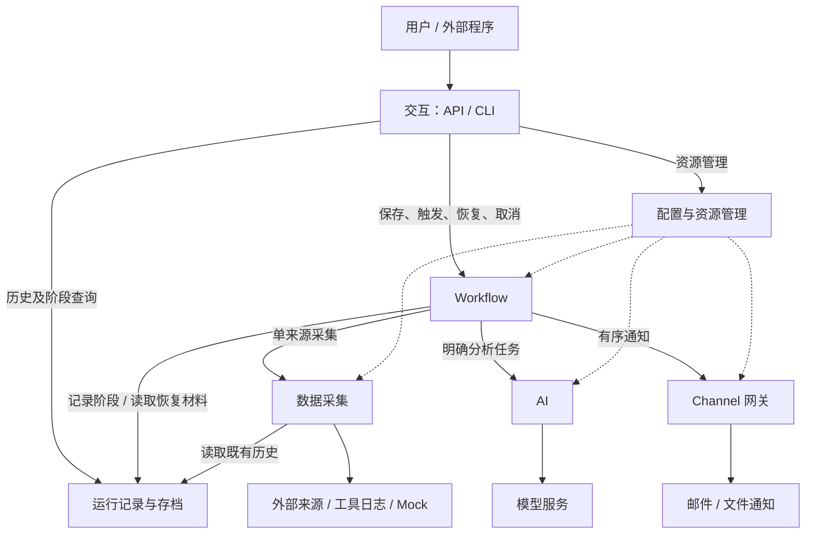

# 可配置的多源采集与 AI 分析 Workflow：设计

## 1. 架构设计

### 1.1 总体结构

保留模块化单体的总体结构：五个核心模块为交互、Workflow、数据采集、AI、Channel 网关；两个公共支撑模块为配置与资源管理、运行记录与存档。模块边界表达职责与依赖，面向个人开发者与轻量自托管场景。

用户通过 API 管理资源、触发运行和查询结果；CLI 提供服务启动和轻量 API 调用入口。Workflow 组织一次运行，分别调用采集、AI 和通知能力。配置模块提供本次有效配置，存档模块记录执行事实和可恢复材料。

### 1.2 模块及协作边界

| 模块 | 在架构中的位置 |
| --- | --- |
| 交互 | 用户与外部程序的操作入口。 |
| Workflow | 从触发到完成的业务流程协调者。 |
| 数据采集 | 外部来源与内部统一采集结果之间的边界。 |
| AI | 明确分析任务与模型能力之间的边界。 |
| Channel 网关 | 已确定输出与通知平台之间的边界。 |
| 配置与资源管理 | 可复用资源及运行配置视图的公共支撑。 |
| 运行记录与存档 | 运行事实、阶段内容和可用性信息的公共支撑。 |

各模块的单一职责及排除项统一见第二部分。服务启动入口负责装配依赖与协调启停，业务决策由对应模块承担。

### 1.3 模块间关系

实线表示业务调用，虚线表示配置供给。交互层的资源写入先经过所属业务模块的语义校验，再提交配置模块。

Collector 插件处理单个来源内部的字段、过滤、分组和计数；项目侧采集管理器调用已注册能力并交付统一结果；Workflow 决定跨来源排列与共享输入。AI 处理调用方明确传入的任务；Workflow 决定任务数量、输入、执行时机和结果用途。项目侧网关组织通知目标，Channel 插件执行具体平台投递；Workflow 决定发送哪些输出以及允许哪些失败。

历史 Collector 读取存档并执行次数、时间和内容预算选择，读取历史不会重新运行被引用的 Workflow 或原始来源。后续 Channel 控制入口可以直接调用内部应用服务，复用相同业务规则。

### 1.4 插件、能力与实例

插件提供能力，实例配置描述一次具体使用方式。一个 Collector 插件可以注册多个来源类型，同一类型可以配置多个来源实例；Channel 插件可以声明不同能力，同一通知类型可以配置多个目标。

Collector 插件归数据采集模块管理，Channel 插件归网关管理。启动时发现有效声明，单个插件无效不影响其他有效插件。Setter 模板由配置模块保存，其可用能力仍以 Collector 声明为准。

首版只要求通知能力。ControlChannel 和 ConversationChannel 的接收、指令与会话路由属于后续版本；通知不能改变用户正在进行的对话上下文。

### 1.5 一次运行的数据流

1. 读取已保存的 Workflow 及引用资源，建立本次配置快照并分配 session；插件可用性在采集阶段处理。
2. 执行来源采集，按各来源策略处理错误和空结果，再按声明顺序生成共享输入。
3. 所有 fan-out 分支接收同一份完整共享输入，分别使用自己的任务提示词和 AI 配置；完成先后不改变结果顺序。
4. fan-in 可按指定顺序组合分支，并把共享输入作为一个整体插入；需要进一步分析时再次调用 AI。关闭 fan-in 时各成功分支分别输出。
5. 最终输出进入通知前冻结，按输出及目标顺序投递，保存每条回执，再汇总业务、投递及备份状态。

### 1.6 定义、运行与恢复

`WorkflowDefinition` 是可重复执行的配置，`SessionRecord` 是一次运行的管理记录，`WorkflowSnapshot` 固定本次运行引用的有效资源。修改资源影响后续新运行，当前运行和历史恢复保持原配置含义。

运行记录与内容备份分开：管理记录始终保存状态、错误和内容索引；备份策略决定是否保留配置快照、采集内容、分析结果和最终输出正文。看得到运行记录，不代表具备完整恢复材料。

恢复由 Workflow 根据存档返回的可用范围决定。已保存输入可以直接复用，成功分支和成功投递不自动重复执行；必要内容缺失必须说明限制。输出冻结后只能继续投递确定内容，重新分析需要新 session。

### 1.7 版本边界

| 版本 | 能力范围 |
| --- | --- |
| v0.1 | 七模块、共享输入、可选汇总、单向通知、资源及运行管理。 |
| v0.2 | Agent、工具集、插件健康监听、Webhook、指令和双向会话。 |
| v0.3 | 固定输入的效果评估、分支来源子集、WorkFlow可用Agent |
| v0.4 | 浏览器配置和运行管理、画布、评估比较与会话界面 |
| v0.5 | 执行器演进与兼容恢复 |

## 2. 模块职责定义

单一职责以“谁拥有业务规则”为判断标准。采集和渠道分别划分项目侧管理能力与插件侧具体行为，再明确它们与 Workflow、配置、存档和交互的边界。项目自带的插件也遵守相同边界。

### 2.1 交互模块：把用户操作交给业务入口

**负责：** 解析 API/CLI 请求、检查传输格式、调用应用服务、映射响应和错误；暴露配置、运行、存档及插件能力。CLI 的业务操作复用 API。

**不负责：** 来源和模型的专属校验、失败降级、配置版本选择、恢复判断或直接修改存档。请求已接受时只报告受理结果，业务成功由 session 表达。

### 2.2 Workflow 模块：决定一次运行如何推进

**负责：** 验证 Workflow 整体关系，组织资源语义校验；用户手动和定时触发；固定运行快照；安排来源与分支、共享输入、fan-in 和通知；执行失败、空结果、部分发送、取消和恢复策略；汇总并提交运行事实。

**不负责：** 单来源查询协议、模型请求协议、具体通知协议、配置存储或内容完整性检验的实现。Workflow 根据模块返回的状态和可用范围决策，不通过读取模块私有文件推断状态。

### 2.3 数据采集：项目管理接入，插件实现来源

#### 项目侧负责什么

- 发现并登记插件提供的数据源选项，向 API/Workflow 暴露它们的说明、配置项和 Setter 能力；一个插件可以注册多个选项。
- 接收数据源实例配置，检查引用与声明的配置结构，调用插件完成来源专属校验。配合配置模块保存 Setter 模板、展开用户选择，再把有效设置传给插件。
- 提供统一采集入口和必要上下文，约束单次调用的等待，隔离插件加载或执行失败，将内容、计数、状态及失败原因交给 Workflow。
- 交付历史、运行日志和 Mock 三种内置 Collector；它们是项目维护的插件，不能因为内置就绕过插件契约。

#### 项目侧不负责什么

不编写第三方来源的查询协议，不替插件决定有哪些字段、是否进行过滤或分组。也不在采集管理器中拼接多个来源、选择停止/跳过策略或重跑历史 Workflow；这些规则分别属于 Workflow 和存档协作。不对除了日志和配置以外持久化。

#### Collector 插件负责什么

- 声明自己提供的数据源选项、配置字段、可用 Setter 及其含义
- 校验来源专属参数，访问具体来源，执行其声明的字段选择、过滤、分组等处理，生成可供编排的内容。
- 按插件定义且公开说明的计数方式，只返回过滤处理后的数量，不返回或使用过滤前的数量；通过状态区分原本无数据、处理后无数据和采集失败。
- 正确结束本次访问并释放自身资源；历史插件只读取已有存档，日志插件读取本工具日志，Mock 插件提供可控样例。

#### Collector 插件不负责什么

不保存全局资源或 Setter 模板，不决定跨来源顺序、Workflow 并发和降级策略，不触发 AI 或通知，不创建另一套 session，也不因为读取历史而重新执行来源

**交接边界：** 项目把已确定的来源选项、Setter 和必要上下文交给插件；插件返回单来源内容、计数和状态。项目补齐实例关联信息，Workflow 再据配置决定如何编排和处理失败。

### 2.4 AI 模块：提供可复用的分析能力

**负责：** 管理并使用模型及其配置、系统提示词；接收 Workflow 明确给出的任务及完整输入，返回处理结果。超时和重试统一从导入或保存的 AIConfig 读取：timeout 为包含所有尝试和重试等待的总时限，retries 为首次失败后的额外尝试上限；默认分别为 60 秒和 0 次。Workflow 分支及汇总通过引用 AIConfig 选择设置，不另设覆盖入口。提供OpenAI兼容API服务，提供按渠道添加模型的功能，同时提供设置思考强度，还有自定义添加的请求Json

**不负责：** 选择采集来源、创建 Workflow 分支、决定部分结果发送、保存 session 或维护连续对话。首版不增加独立预算管理、用量分析或多步 Agent 运行时；工具调用、完整 Agent、YAML Toolset 和双向讨论留到后续版本，安排统一见 §1.7。

### 2.5 Channel 网关：项目管理目标，插件实现平台

#### 项目侧负责什么

- 发现并登记 Channel 插件的类型、配置项和能力，区分 Notification、Control、Conversation；首版只使用通知能力。
- 根据用户保存的实例配置取得目标，校验能力与配置，协调实例启停和调用；一个插件可以提供多种类型，同一类型也可以配置多个目标。
- 接收 Workflow 已确定的输出与目标顺序，调用对应插件，统一关联各目标的成功或失败结果，使部分平台故障不影响已有分析结果。
- 提供缓存，按(session,channel,priority)进行接收，priority是针对不同的指令，发送按（channel,priority）进行排队，priority相关配置交给下个版本
  - 毕竟发送好像一般还真不用思考优先级啊

- 交付邮件和追加文件的 Mock NotificationChannel；平台行为由这两个内置插件实现。

#### 项目侧不负责什么

不解释平台私有响应来猜测送达，不管理用户对话内容，也不替 Workflow 改写输出、选择目标或决定整体成败。不对过程进行持久化

#### Channel 插件负责什么

- 声明平台类型、支持的能力及实例配置字段，并验证连接、地址等平台专属设置。
- 管理本实例所需的平台资源；按配置执行连接、内容适配及 publish，将确定的通知送到指定目标。
- 解释平台响应并如实报告成功、失败或无法确认的情况。
- 结束使用时释放自身资源。文件插件负责追加写入的消息边界，邮件插件负责邮件地址、正文编码和邮件协议。

**交接边界：** Workflow 决定“发什么、发给谁、什么顺序”，项目网关决定“调用哪个实例并记录怎样的关联结果”，插件负责“怎样在该平台完成投递并解释回执”。类型发现、实例管理、平台协议分别有明确归属。

### 2.6 配置与资源管理：维护一致的资源视图

**负责：** 系统设置与可复用资源的读取、保存和查询；结构约束、标识、引用完整性、模板展开、独立副本和一致快照；报告配置变更的生效结果。对 API key 和渠道插件密钥等需持久化的凭据采用主密钥加密保护，也支持仅保存环境变量引用。主密钥优先从系统配置指定的环境变量读取，其次从指定文件读取；仅在首次初始化且不存在既有密文时自动生成并安全保存。已有密文而主密钥丢失或无法解密时明确报错，恢复原主密钥后再读取，不自动生成替代密钥。运行时按需解析凭据，快照不保存明文。日志脱敏独立执行，不依赖存储加密。

**不负责：** 判断模型提供方、Collector 或 Channel 的专属参数是否合法；调用外部服务验证连通性；替换已开始运行的快照；决定如何重调度或重启连接。来源或平台专属配置仍交给对应插件校验，运行使用确定的有效配置。

### 2.7 运行记录与存档：保存事实并报告材料可用性

**负责：** 保存管理记录和策略允许的阶段正文，建立索引，校验内容完整性，查询历史，标记中断及过期原因，提供恢复材料和保守的可恢复性信息。

**不负责：** 认定分析是否成功、执行原始采集、替调用方重试、选择降级策略或启动恢复。`recoverable` 是材料和状态的提示，是否存在可继续工作仍由 Workflow 判定。

启动与关闭属于装配协调：在接收任务前建立可用依赖，关闭时先停止准入，再结束运行、释放资源。它不新增一个拥有业务规则的核心模块。

## 3. 技术决策

Workflow环节和  AI 模块重点采用LangGraph相关功能

## 4. 接口契约

接口契约定义跨边界的语义：输入是什么、字段表示什么、调用方需要满足什么条件、成功和失败分别意味着什么。它不规定模型基类、具体服务构造器、锁、文件布局、客户端或执行器。

为便于查阅，本部分分成两个文件。数据结构以带中文注释的 Python 伪代码完整列出；方法以调用方、参数、返回结果和行为约束说明。

### 4.1 数据模型

完整定义见 [接口契约：数据模型](./contracts/data-models.md)。

| 模型组 | 主要对象 | 解决的问题 |
| --- | --- | --- |
| 配置资源 | SystemConfig、SourceConfig、SetterTemplate、AIConfig、ChannelConfig、Credential | 哪些参数可以配置，各参数由谁解释。 |
| Workflow 配置 | AnalysisTask、FanInConfig、BackupPolicy、WorkflowDefinition、WorkflowSnapshot | 哪些资源用于本次运行，如何固定顺序、策略和配置。 |
| 执行结果 | ErrorInfo、CollectionResult、AnalysisResult、Notification、DeliveryResult | 如何区分结果、空内容、失败和投递事实。 |
| 运行及正文 | SessionRecord、ArtifactInfo、各阶段正文、ArtifactAvailability | 什么已经完成，哪些内容仍可读取或恢复。 |
| 插件与调用辅助对象 | 能力声明、采集输出、执行上下文 | 项目与插件如何交换配置、内容和执行结果。 |

公共字段严格校验，扩展字段遵守所属模块声明。正文是可序列化数据，执行上下文中的运行时依赖不能进入存档。模型与实现类可以有不同组织方式，字段语义和外部兼容性必须保持一致。

### 4.2 模块接口定义

完整定义见 [接口契约：模块对外能力](./contracts/module-interfaces.md)。

| 模块 | 对外暴露的能力 |
| --- | --- |
| 配置与资源管理 | 读取设置；管理主密钥、保护和解析凭据；保存、读取、列出和删除资源；解析定义；生成运行快照。 |
| 数据采集 | 注册与发现 Collector、描述能力、验证配置、执行单来源采集；提供插件扩展入口。 |
| AI | 验证 AI 配置、执行明确分析，提供模型及其配置和系统提示词的复用能力。 |
| Channel 网关 | 注册与发现类型、描述能力、验证实例、启停实例、按顺序投递并返回回执。 |
| 运行记录与存档 | 创建和查询运行、更新管理事实、保存/读取正文、查询可用性、显式标记中断和过期清理。 |
| Workflow | 校验和保存定义、触发、等待、恢复、取消和关闭。 |
| 交互与装配 | 对外 API 和薄 CLI 操作、可理解的错误响应、启动/关闭协调。 |

接口只发布本模块承诺的能力。运行策略统一由 Workflow 判断；其他模块提供状态和事实，不替调用方扩大权限、重跑来源或选择另一种输出模式。

## 5. 非功能约束

### 5.1 错误处理与优雅降级

优雅降级的目标是在局部故障下保留可信结果，并明确告知损失了什么。业务模块报告事实，Workflow 根据显式策略决定是否继续；不静默把失败当作空结果，不改用最新输入，也不自动切换到另一种分析或输出模式。

**错误按影响范围处理。** 无效的新提交配置在保存时拒绝，保留原配置；触发不以插件当前可用或重新通过配置校验为前置条件，已保存 Workflow 引用的 Collector 缺失或加载失败时，在采集阶段返回 missing 并执行 on_missing 策略；运行中的局部错误写入对应结果和 session；无法可靠记录运行事实的基础设施错误阻止受影响工作继续。外部调用错误使用统一结构和可修正原因，HTTP 映射见模块接口文档。

| 故障或边界 | 降级规则 | 必须保留的信息 |
| --- | --- | --- |
| 单个可选插件无效 | 隔离该插件声明，其他有效插件继续可用。 | 插件标识和失败原因；已保存 Workflow 的来源引用保留，采集时返回 missing。 |
| 来源 failed/timeout | 按 on_error 停止或跳过该来源。 | 原始状态、错误、已知计数和其他来源结果。 |
| 来源 missing | 按 on_missing 停止或跳过。 | 缺失对象及原因，不能伪装正常空。 |
| 来源 empty/filtered_empty | 分别按 on_empty/on_filtered_empty 处理。 | 原始空与处理后空的状态区别，以及处理后计数。 |
| 所有来源无有效内容 | on_all_empty=stop 时失败；skip 时结束，不调用 AI 或通知。 | 合法全空可正常完成；混有跳过的来源错误时保留降级事实。 |
| 单个分析分支失败 | 保留其他分支结果；analysis_failure=stop 阻止下游，continue 允许使用成功结果。 | 失败任务、原因和不完整性；send_partial=False 时不发送部分结果。 |
| fan-in 模型失败 | 保留已有分支结果，报告汇总失败。 | 不把单纯拼接文本当作成功汇总，也不自动改成分支分别发送。 |
| 单个通知目标失败 | 继续处理允许的其他目标，记录每条回执。 | 已完成的分析及各输出/目标结果。 |
| 投递结果不确定 | 标记 delivery_uncertain，不自动重试或补发。 | 已知投递阶段和原因，避免把可能已发送当作未发送。 |
| 阶段正文保存失败 | 先标记缺失，再按 backup.on_failure 停止或继续。 | write_failed、可用阶段与恢复限制；继续时表现为备份降级。 |
| 管理记录无法保存 | 停止受影响运行，不继续发起无法记账的外部操作。 | 尽可能记录基础设施诊断；服务不得谎报正常或完整可恢复。 |
| 恢复材料缺失/过期/损坏 | 拒绝依赖该材料的续跑，报告实际可恢复范围。 | 不重新采集或重跑已成功分析来“补齐”旧 session。 |

策略按阶段生效：先处理来源策略，再判断是否全空；收集并保留分支结果后判断能否进入汇总；只有得到有效输出且允许发送时才通知。一个分支失败不取消其他分支；用户显式取消和服务关闭仍可终止工作。

重试有时限和次数上限，只用于可重试且确认没有成功副作用的失败。重试不得重置整个任务的时间预算；取消生效后不启动新的模型或通知操作。外部受理和本地回执保存之间存在确认窗口，系统不能承诺所有平台恰好一次投递。

**状态与恢复分开。** 必要阶段成功为 completed；允许继续但存在局部失败或备份降级时如实反映 partial；停止策略或必要阶段失败为 failed。主动关闭正文备份是用户策略，本身不等于业务失败，但会缩小恢复范围。输出一旦冻结，恢复只继续发送原内容，重新分析显式建立新运行。

### 5.2 安全约束

**数据边界。** 采集内容、历史、日志和模型输出都按不可信业务数据处理

插件是用户安装的可信扩展，错误隔离只保证有效能力继续可用，该项目不负责沙箱

**存储与访问。** 服务默认本地单用户、回环访问；认证授权服务仍不在首版范围。

### 5.3 可运维设计

**日志。** 诊断事件至少能够关联时间、严重程度、模块、事件或错误码、Workflow/session，以及适用的来源、任务、Channel、输出 ID。记录阶段变化、策略选择、重试、取消、配置生效和恢复判定，使用户能解释“为何跳过、为何没有发送、为何不能恢复”。

日志、错误响应和诊断事件必须独立脱敏，不记录主密钥、凭据明文或认证请求头；存储加密不替代运行时脱敏。日志默认记录摘要、计数与耗时，避免完整输入、提示词、模型输出和通知正文重复落盘；正文查看走受备份策略控制的存档接口。日志需要轮转、容量和保留边界，日志采集读取有界。关键诊断不可用时要通过健康或备用诊断途径显式报告，不能递归写日志导致业务失控。

**健康检查。** 服务报告 ready、degraded 或 unavailable，并单独说明 accepting_runs。必要配置、管理存档或生命周期未就绪时，不接受新运行；可选插件故障且必要能力仍可用时，可降级服务，并明确受影响组件。队列暂满使用容量错误表达，不据此把整个服务认定为故障。

健康查询只汇总已知本地状态和已有诊断，区分“尚未检查”“已初始化”“远端可访问”“某条通知已接收”。不得借健康查询请求付费模型、重新采集或发送探测邮件。周期性的插件连通探测、异常/恢复通知属于 v0.2 的健康监听，首版健康接口不冒充已实现该能力。

必要能力的故障状态应在后续成功检查后可恢复，不能永久保留过时的健康结论。组件状态携带检查时间和脱敏原因，便于识别陈旧信息。存档记录、健康诊断和业务结果通过 session 标识关联，但单条历史业务失败不使当前整个服务永久不可用。

**热更新。** 首版支持通过资源管理入口更新可复用配置，语义为“校验后对后续新运行生效”。添加reload 功能；按变更类型说明生效边界：

| 变更内容 | 生效范围 | 失败或并发时的行为 |
| --- | --- | --- |
| 来源、Setter、AI、Channel 资源 | 成功提交后，新运行快照取得新值。 | 校验受影响引用；失败保留旧有效资源。已受理或活动 session 沿用原快照。 |
| Workflow 顺序、提示词、失败/备份策略 | 后续新触发使用新定义。 | 当前运行和恢复不混用新旧配置。 |
| Workflow 定时间隔、enabled | 更新未来触发计划；禁用阻止新的手动和定时触发。 | 已受理运行不因此被隐式取消；需要停止时调用 cancel。错过的触发不集中补跑。 |
| Channel 目标地址或连接选项 | 新运行使用新目标配置。 | 原运行仍使用原目标，不能因为共享实例被替换而投到新地址。实例切换由网关协调。 |
| 系统路径、监听地址、全局运行限制 | 首版通过重启服务应用。 | 运行时无法替换                                               |
| 插件代码、插件级设置 |                                                |  |

Reload 的具体设定以实际项目进行调整。

### 5.4 资源与生命周期约束

首版一致性承诺面向单服务进程，不面向多个独立写入者处理
