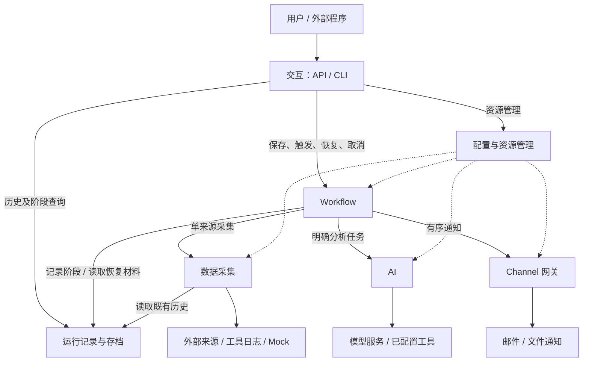

# 可配置的多源采集与 AI 分析 Workflow：设计

本文依据 [proposal.md](./proposal.md)，定义模块边界、数据含义、对外能力与运行约束。设计分为架构设计、模块职责定义、技术决策、接口契约、非功能约束五部分。

本文描述目标行为，规划完成不代表功能已实现。公共契约只约定输入、输出、前置条件和可观察结果；实现可以选择不同框架、调度方式和存储介质，只要保持相同语义。已有技术约束与模块实现方案见提案和 [模块设计索引](./modules/README.md)，技术决策留在第三部分后续讨论。

## 1. 架构设计

### 1.1 总体结构

保留模块化单体的总体结构：五个核心模块为交互、Workflow、数据采集、AI、Channel 网关；两个公共支撑模块为配置与资源管理、运行记录与存档。模块边界表达职责与依赖，首版按本地单用户、单服务进程部署。

用户通过 API 管理资源、触发运行和查询结果；CLI 提供服务启动和轻量 API 调用入口。Workflow 组织一次运行，分别调用采集、AI 和通知能力。配置模块提供本次有效配置，存档模块记录执行事实和可恢复材料。

### 1.2 模块及协作边界

| 模块 | 在架构中的位置 |
| --- | --- |
| 交互 | 用户与外部程序的操作入口。 |
| Workflow | 从触发到完成的业务流程协调者。 |
| 数据采集 | 外部来源与内部统一采集结果之间的边界。 |
| AI | 明确分析任务与模型、工具能力之间的边界。 |
| Channel 网关 | 已确定输出与通知平台之间的边界。 |
| 配置与资源管理 | 可复用资源及运行配置视图的公共支撑。 |
| 运行记录与存档 | 运行事实、阶段内容和可用性信息的公共支撑。 |

各模块的单一职责及排除项统一见第二部分。服务启动入口负责装配依赖与协调启停，业务决策由对应模块承担。

### 1.3 模块间关系

实线表示业务调用，虚线表示配置供给。交互层的资源写入先经过所属业务模块的语义校验，再提交配置模块。

Collector 处理单个来源内部的字段、过滤、分组和计数；Workflow 决定跨来源排列与共享输入。AI 处理调用方明确传入的任务；Workflow 决定任务数量、输入、执行时机和结果用途。网关投递已经确定的输出；Workflow 决定发送哪些输出以及允许哪些失败。

历史 Collector 读取存档并执行次数、时间和内容预算选择，读取历史不会重新运行被引用的 Workflow 或原始来源。后续 Channel 控制入口可以直接调用内部应用服务，复用相同业务规则。

### 1.4 插件、能力与实例

插件提供能力，实例配置描述一次具体使用方式。一个 Collector 插件可以注册多个来源类型，同一类型可以配置多个来源实例；Channel 插件可以声明不同能力，同一通知类型可以配置多个目标。

Collector 插件归数据采集模块管理，Channel 插件归网关管理。启动时发现有效声明，单个插件无效不影响其他有效插件。Setter 模板由配置模块保存，其可用能力仍以 Collector 声明为准。

首版只要求通知能力。ControlChannel 和 ConversationChannel 的接收、指令与会话路由属于后续版本；通知不能改变用户正在进行的对话上下文。

### 1.5 一次运行的数据流

1. 校验 Workflow 及引用资源，建立本次配置快照并分配 session。
2. 执行来源采集，按各来源策略处理错误和空结果，再按声明顺序生成共享输入。
3. 所有 fan-out 分支接收同一份完整共享输入，分别使用自己的任务提示词和 AI 配置；完成先后不改变结果顺序。
4. fan-in 可按指定顺序组合分支，并把共享输入作为一个整体插入；需要进一步分析时再次调用 AI。关闭 fan-in 时各成功分支分别输出。
5. 最终输出进入通知前冻结，按输出及目标顺序投递，保存每条回执，再汇总业务、投递及备份状态。

### 1.6 定义、运行与恢复

`WorkflowDefinition` 是可重复执行的配置，`SessionRecord` 是一次运行的管理记录，`WorkflowSnapshot` 固定本次运行引用的有效资源。修改资源影响后续新运行，当前运行和历史恢复保持原配置含义。

运行记录与内容备份分开：管理记录始终保存状态、错误和内容索引；备份策略决定是否保留配置快照、采集内容、分析结果和最终输出正文。看得到运行记录，不代表具备完整恢复材料。

恢复由 Workflow 根据存档返回的可用范围决定。已保存输入可以直接复用，成功分支和成功投递不自动重复执行；必要内容缺失必须说明限制。输出冻结后只能继续投递确定内容，重新分析需要新 session。

### 1.7 版本边界与设计索引

| 版本 | 能力范围 | 细化设计 |
| --- | --- | --- |
| v0.1 | 七模块、共享输入、可选汇总、单向通知、资源及运行管理。 | [模块索引](./modules/README.md) |
| v0.2 | 分支来源子集、Agent、工具集、插件健康监听、Webhook、指令和双向会话。 | [v0.2](./versions/v0.2/design.md) |
| v0.3 | 执行器演进与兼容恢复、固定输入的效果评估。 | [v0.3](./versions/v0.3/design.md) |
| v0.4 | 浏览器配置和运行管理、画布、评估比较与会话界面。 | [v0.4](./versions/v0.4/design.md) |

本轮保持文本输入边界。服务自身的健康查询属于首版运维能力，插件定时探测与异常通知属于后续健康监听，二者分开验收。

## 2. 模块职责定义

单一职责以“谁拥有业务规则、谁因这条规则变化而修改”为判断标准。下表明确每个模块拥有的决策；跨模块操作通过接口协作，避免在交互层、插件和执行器中各维护一套规则。

### 2.1 交互模块：把用户操作交给业务入口

**负责：** 解析 API/CLI 请求、检查传输格式、调用应用服务、映射响应和错误；暴露配置、运行、存档、插件能力及健康信息。CLI 的业务操作复用 API。

**不负责：** 来源和模型的专属校验、Workflow 编排、失败降级、配置版本选择、恢复判断或直接修改存档。请求已接受时只报告受理结果，业务成功由 session 表达。

### 2.2 Workflow 模块：决定一次运行如何推进

**负责：** 验证 Workflow 整体关系，组织资源语义校验；统一手动和定时触发；固定运行快照；安排来源与分支、共享输入、fan-in 和通知；执行失败、空结果、部分发送、取消和恢复策略；汇总并提交运行事实。

**不负责：** 单来源查询协议、模型请求协议、具体通知协议、配置存储或内容完整性检验的实现。Workflow 根据模块返回的状态和可用范围决策，不通过读取模块私有文件推断状态。

### 2.3 数据采集模块：把单个来源变成可消费的结果

**负责：** Collector 能力注册与发现、来源选项和 Setter 校验、单来源读取、过滤/排序/字段选择/分组/格式化与计数；报告来源状态。历史采集只从既有内容选取数据。

**不负责：** 跨来源拼接、分支输入选择、模型分析、存档写入、Workflow 重跑或 `stop/skip` 策略。Collector 声明能力，不能因用户保存了模板便获得额外能力。

### 2.4 AI 模块：完成调用方指定的分析任务

**负责：** 校验 AI 配置；装配模型参数、系统提示词和用户提示词；使用已选择工具；限制执行预算；返回文本、用量、耗时、工具事件和可识别错误。

**不负责：** 选择 Workflow 来源、创建流程分支、决定是否发送部分结果、持久化 session 或维护隐式跨运行对话。任务输入和配置由调用方明确给出，使后续 Agent 能复用该能力。

### 2.5 Channel 网关：投递已经确定的输出

**负责：** Channel 类型和能力注册、实例校验与生命周期、平台投递、有界重试、单目标回执和投递不确定性；保持一次批次的输出与目标顺序。

**不负责：** 重新分析或改写输出含义、选择业务目标、决定整个 Workflow 成败、读取存档安排补发、维护第二套 session。首版不承担双向会话或指令执行。

### 2.6 配置与资源管理：维护一致的资源视图

**负责：** 系统设置与可复用资源的读取、保存和查询；结构约束、标识、引用完整性、模板展开、独立副本和一致快照；报告配置变更的生效结果。

**不负责：** 判断模型提供方、Collector 或 Channel 的专属参数是否合法；调用外部服务验证连通性；替换已开始运行的快照；决定如何重调度或重启连接。涉及已有引用的更新必须协调所属业务模块校验，通过后才对新运行可见。

### 2.7 运行记录与存档：保存事实并报告材料可用性

**负责：** 保存管理记录和策略允许的阶段正文，建立索引，校验内容完整性，查询历史，标记中断及过期原因，提供恢复材料和保守的可恢复性信息。

**不负责：** 认定分析是否成功、执行原始采集、替调用方重试、选择降级策略或启动恢复。`recoverable` 是材料和状态的提示，是否存在可继续工作仍由 Workflow 判定。

### 2.8 跨模块规则的归属

| 规则 | 负责决策的模块 | 协作方式 |
| --- | --- | --- |
| 配置能否保存 | 所属业务模块；Workflow 负责整体关系 | 配置模块提供结构和引用一致性，失败保留原有效资源。 |
| 一个来源失败是否继续 | Workflow | 采集模块报告事实，Workflow 读取来源策略。 |
| 是否可以恢复 | Workflow | 存档报告原快照、正文和回执的可用范围。 |
| 何时补发、补发哪些目标 | Workflow | 网关提供各目标投递结果与不确定性。 |
| 新配置何时用于任务 | 配置模块管理可见版本，Workflow 选择新运行快照 | 活动 session 保持原快照，调度只影响未来触发。 |
| 服务是否就绪 | 应用生命周期的协调入口 | 汇总各模块可用状态，交互模块负责对外展示。 |

启动与关闭属于装配协调：在接收任务前建立可用依赖，关闭时先停止准入，再结束运行、释放资源。它不新增一个拥有业务规则的核心模块。

## 3. 技术决策

本轮暂不展开。框架、执行器、存储介质、插件加载方式以及并发机制的选型与取舍，留待后续讨论；第四部分的语义契约作为这些选择共同遵守的边界。

## 4. 接口契约

接口契约定义跨边界的语义：输入是什么、字段表示什么、调用方需要满足什么条件、成功和失败分别意味着什么。它不规定模型基类、具体服务构造器、锁、文件布局、客户端或执行器。

为便于查阅，本部分分成两个文件。数据结构以带中文注释的 Python 伪代码完整列出；方法以调用方、参数、返回结果和行为约束说明。

### 4.1 数据模型

完整定义见 [接口契约：数据模型](./contracts/data-models.md)。

| 模型组 | 主要对象 | 解决的问题 |
| --- | --- | --- |
| 配置资源 | SystemConfig、SourceConfig、SetterTemplate、AIConfig、ChannelConfig | 哪些参数可以配置，各参数由谁解释。 |
| Workflow 配置 | AnalysisTask、FanInConfig、BackupPolicy、WorkflowDefinition、WorkflowSnapshot | 哪些资源用于本次运行，如何固定顺序、策略和配置。 |
| 执行结果 | ErrorInfo、CollectionResult、AnalysisResult、Notification、DeliveryResult | 如何区分结果、空内容、失败和投递事实。 |
| 运行及正文 | SessionRecord、ArtifactInfo、各阶段正文、ArtifactAvailability | 什么已经完成，哪些内容仍可读取或恢复。 |
| 接口辅助对象 | 能力描述、工具调用、执行上下文、HealthReport | 模块如何声明能力、传递事件并提供运行诊断。 |

公共字段严格校验，扩展字段遵守所属模块声明。正文是可序列化数据，执行上下文中的运行时依赖不能进入存档。模型与实现类可以有不同组织方式，字段语义和外部兼容性必须保持一致。

### 4.2 模块接口定义

完整定义见 [接口契约：模块对外能力](./contracts/module-interfaces.md)。

| 模块 | 对外暴露的能力 |
| --- | --- |
| 配置与资源管理 | 读取设置；保存、读取、列出和删除资源；解析定义；生成运行快照。 |
| 数据采集 | 注册与发现 Collector、描述能力、验证配置、执行单来源采集；提供插件扩展入口。 |
| AI | 验证 AI 配置、执行明确分析、注册工具与传递工具事件。 |
| Channel 网关 | 注册与发现类型、描述能力、验证实例、启停实例、按顺序投递并返回回执。 |
| 运行记录与存档 | 创建和查询运行、更新管理事实、保存/读取正文、查询可用性、显式标记中断和过期清理。 |
| Workflow | 校验和保存定义、触发、等待、恢复、取消和关闭。 |
| 交互与装配 | 对外 API 和 CLI 操作、统一错误响应、启动/关闭协调和健康查询。 |

接口只发布本模块承诺的能力。运行策略统一由 Workflow 判断；其他模块提供状态和事实，不替调用方扩大权限、重跑来源或选择另一种输出模式。

## 5. 非功能约束

### 5.1 错误处理与优雅降级

优雅降级的目标是在局部故障下保留可信结果，并明确告知损失了什么。业务模块报告事实，Workflow 根据显式策略决定是否继续；不静默把失败当作空结果，不改用最新输入，也不自动切换到另一种分析或输出模式。

**错误按影响范围处理。** 无效配置在保存或触发前拒绝，保留原配置；运行中的局部错误写入对应结果和 session；无法可靠记录运行事实的基础设施错误阻止受影响工作继续。外部调用错误使用统一结构和可修正原因，HTTP 映射见模块接口文档。

| 故障或边界 | 降级规则 | 必须保留的信息 |
| --- | --- | --- |
| 单个可选插件无效 | 隔离该插件声明，其他有效插件继续可用。 | 插件标识和失败原因；引用该插件的配置不能假装有效。 |
| 来源 failed/timeout | 按 on_error 停止或跳过该来源。 | 原始状态、错误、已知计数和其他来源结果。 |
| 来源 missing | 按 on_missing 停止或跳过。 | 缺失对象及原因，不能伪装正常空。 |
| 来源 empty/filtered_empty | 分别按 on_empty/on_filtered_empty 处理。 | 原始空与处理后空的区别，以及处理前后计数。 |
| 所有来源无有效内容 | on_all_empty=stop 时失败；skip 时结束，不调用 AI 或通知。 | 合法全空可正常完成；混有跳过的来源错误时保留降级事实。 |
| 单个分析分支失败 | 保留其他分支结果；analysis_failure=stop 阻止下游，continue 允许使用成功结果。 | 失败任务、原因和不完整性；send_partial=False 时不发送部分结果。 |
| fan-in 模型失败 | 保留已有分支结果，报告汇总失败。 | 不把单纯拼接文本当作成功汇总，也不自动改成分支分别发送。 |
| 单个通知目标失败 | 继续处理允许的其他目标，记录每条回执。 | 已完成的分析及各输出/目标结果。 |
| 投递结果不确定 | 标记 delivery_uncertain，不自动重试或补发。 | 已知投递阶段和原因，避免把可能已发送当作未发送。 |
| 阶段正文保存失败 | 先标记缺失，再按 backup.on_failure 停止或继续。 | write_failed、可用阶段与恢复限制；继续时表现为备份降级。 |
| 管理记录无法保存 | 停止受影响运行，不继续发起无法记账的外部操作。 | 尽可能记录基础设施诊断；服务不得谎报正常或完整可恢复。 |
| 恢复材料缺失/过期/损坏 | 拒绝依赖该材料的续跑，报告实际可恢复范围。 | 不重新采集或重跑已成功分析来“补齐”旧 session。 |

策略按阶段生效：先处理来源策略，再判断是否全空；收集并保留分支结果后判断能否进入汇总；只有得到有效输出且允许发送时才通知。一个分支失败不取消其他分支；用户显式取消和服务关闭仍可终止工作。

重试有时限和次数上限，只用于可重试且确认没有成功副作用的失败。重试不得重置整个任务的时间预算；取消生效后不启动新的模型、工具或通知操作。外部受理和本地回执保存之间存在确认窗口，系统不能承诺所有平台恰好一次投递。

**状态与恢复分开。** 必要阶段成功为 completed；允许继续但存在局部失败或备份降级时如实反映 partial；停止策略或必要阶段失败为 failed。主动关闭正文备份是用户策略，本身不等于业务失败，但会缩小恢复范围。输出一旦冻结，恢复只继续发送原内容，重新分析显式建立新运行。

### 5.2 安全约束

**密钥管理。** 配置、快照和 API 只保存环境变量名称等凭据引用，解析后的秘密只用于必要的外部调用。日志、异常、工具事件、错误详情和健康响应不得包含密钥、密码、认证头或带秘密的连接串。插件的 options 同样遵守此规则。

凭据在需要时解析，缺失或无效返回明确原因，不以空值或其他账户偷偷替代。更换凭据不修改历史快照中的引用；引用固定不代表旧秘密值会被备份。通过部署环境轮换凭据时必须确认运行进程能取得新值，不能把进程外的环境修改当成已热更新。

**数据与工具边界。** 采集内容、历史、日志和模型输出都按不可信业务数据处理，不能自行成为系统指令、工具权限或通知目标。只执行本次 AI 配置允许的已注册工具，参数先按声明校验；配置文本和模型文本不能隐式执行任意代码或 shell。

插件是用户安装的可信扩展，错误隔离只保证有效能力继续可用，不是恶意代码沙箱。系统限制插件获得的上下文能力，例如历史 Collector 只获得存档读取入口。首版不承诺对恶意插件进行进程级隔离。

**存储与访问。** 运行记录、正文和通知文件按本地私有数据管理，部署应限制访问权限。ID 和阶段名不能被解释为任意路径；读写范围只能是配置允许的资源位置，禁止通过路径穿越或链接绕开边界。快照、日志和健康查询不暴露无关宿主路径。

备份只保存用户启用的阶段，按保留策略过期并明确标记可用性；不得为了恢复而暗中复制已关闭的正文。内容摘要用于完整性校验，不等于加密或防恶意篡改。需要静态加密时由部署与存储方案满足，当前语义契约不声称已经具备加密能力。

服务默认本地单用户、回环访问；认证授权服务仍不在首版范围。超出本地可信边界的访问由部署入口限制，传输中的凭据和业务内容需受保护。模型和邮件连接使用所选提供方支持的安全传输配置，认证错误不触发降级到无认证连接。

### 5.3 可运维设计

**日志。** 诊断事件至少能够关联时间、严重程度、模块、事件或错误码、Workflow/session，以及适用的来源、任务、Channel、输出 ID。记录阶段变化、策略选择、重试、取消、配置生效和恢复判定，使用户能解释“为何跳过、为何没有发送、为何不能恢复”。

日志默认记录摘要、计数与耗时，避免完整输入、提示词、模型输出和通知正文重复落盘；正文查看走受备份策略控制的存档接口。日志需要轮转、容量和保留边界，日志采集读取有界。关键诊断不可用时要通过健康或备用诊断途径显式报告，不能递归写日志导致业务失控。

**健康检查。** 服务报告 ready、degraded 或 unavailable，并单独说明 accepting_runs。必要配置、管理存档或生命周期未就绪时，不接受新运行；可选插件故障且必要能力仍可用时，可降级服务，并明确受影响组件。队列暂满使用容量错误表达，不据此把整个服务认定为故障。

健康查询只汇总已知本地状态和已有诊断，区分“尚未检查”“已初始化”“远端可访问”“某条通知已接收”。不得借健康查询请求付费模型、重新采集或发送探测邮件。周期性的插件连通探测、异常/恢复通知属于 v0.2 的健康监听，首版健康接口不冒充已实现该能力。

必要能力的故障状态应在后续成功检查后可恢复，不能永久保留过时的健康结论。组件状态携带检查时间和脱敏原因，便于识别陈旧信息。存档记录、健康诊断和业务结果通过 session 标识关联，但单条历史业务失败不使当前整个服务永久不可用。

**热更新。** 首版支持通过资源管理入口更新可复用配置，语义为“校验后对后续新运行生效”。不新增含糊的全系统 reload 开关；按变更类型说明生效边界：

| 变更内容 | 生效范围 | 失败或并发时的行为 |
| --- | --- | --- |
| 来源、Setter、AI、Channel 资源 | 成功提交后，新运行快照取得新值。 | 校验受影响引用；失败保留旧有效资源。已受理或活动 session 沿用原快照。 |
| Workflow 顺序、提示词、失败/备份策略 | 后续新触发使用新定义。 | 当前运行和恢复不混用新旧配置。 |
| Workflow 定时间隔、enabled | 更新未来触发计划；禁用阻止新的手动和定时触发。 | 已受理运行不因此被隐式取消；需要停止时调用 cancel。错过的触发不集中补跑。 |
| Channel 目标地址或连接选项 | 新运行使用新目标配置。 | 原运行仍使用原目标，不能因为共享实例被替换而投到新地址。实例切换由网关协调。 |
| 系统路径、监听地址、全局运行限制 | 首版通过重启服务应用。 | 不承诺在线迁移数据位置、监听入口或全局执行资源。 |
| 插件代码、插件级设置、工具实现 | 首版通过受控重启重新发现和装配。 | 不热替换执行中的代码，不把插件热加载视为资源更新。 |
| 环境变量引用的秘密值 | 按进程实际凭据来源轮换，必要时重启。 | 不向 API 返回值，不声称进程外改动已在进程内生效。 |

资源更新必须形成完整、可验证的新视图，成功后才发布；使用旧视图的活动运行可以正常结束。运行中的调度和网关要能取得更新后的资源视图，但不要求某一种订阅、缓存失效或文件监控机制。直接编辑底层文件不属于首版在线更新入口，需重新加载并验证后才能视为生效。

变更结果通过保存接口返回，日志记录资源 ID、变更类型、生效范围和结果，不记录秘密或完整配置。更新被引用资源时若会破坏现有配置关系，则拒绝更新并指出引用位置，用户可先调整依赖。

### 5.4 资源与生命周期约束

运行数、待运行容量、采集和分析并发都必须有界，并发设置为 1 时可观察为串行。外部访问、工具、通知、历史读取及日志读取都有时间或大小边界，单个慢来源不无限阻塞服务。时间戳用于事件关联，耗时和周期调度不受墙上时钟校正造成的无限等待影响。

接收请求前建立必要配置和存档能力；关闭时先停止准入和定时触发，再等待或取消运行，最后释放共享资源。后台任务被跟踪并回收，部分启动失败也要释放已取得资源。重启只标记和展示遗留中断运行，由用户显式恢复，不能隐式重放外部副作用。

首版一致性承诺面向单服务进程，不声称多个独立写入者天然共享调度和配置边界。正文写入及索引发生故障时保持可诊断状态；成功通知事实与输出冻结边界不得因备份关闭而丢失管理语义。

### 5.5 可验证性与兼容性

验收覆盖插件隔离、无效配置、各类空结果、来源/模型超时、分支顺序、部分结果、备份关闭/缺失/损坏/过期、恢复快照、投递不确定性、取消和关闭，以及配置更新生效范围与健康降级/恢复。

核心流程应能通过 Mock 来源、离线模型、文件通知和可控邮件替身验证，测试不依赖真实付费模型、真实邮件投递或宿主秘密。版本交付完成完整测试与构建检查；首版至少连续十分钟离线端到端运行，记录 CPU、内存、存档占用、完成/失败次数和未处理异常。24 小时稳定性单独记录，未实际运行不能标为通过。

运行存档包含可识别格式版本，升级和执行器替换保留原快照、阶段内容及恢复语义。无法理解的版本明确拒绝，不能按空数据继续。升级与回退前保存配置和 session 数据，不隐式删除用户已有内容。
