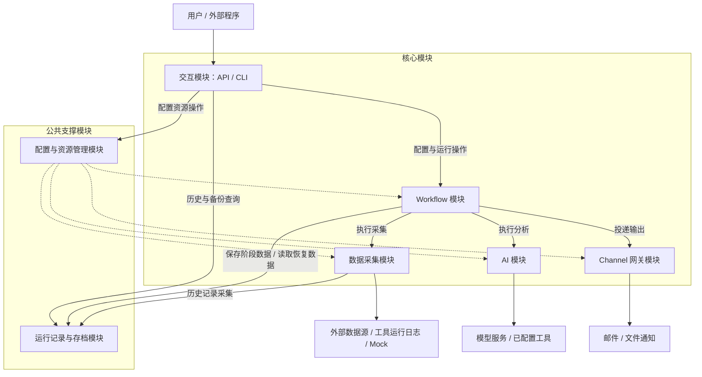

# 可配置的多源采集与 AI 分析 Workflow：设计

本文基于 [proposal.md](./proposal.md)，按系统架构、技术选型（ADR）、接口契约、非功能性约束四部分组织。

本文保留已确认的顶层模块划分，补齐接口契约、故障语义和非功能性约束，作为各模块设计及实现的共同依据。技术选型（ADR）按要求暂不填写。首版与后继版本分开验收；后继版本不改变首版交付时的范围。

## 1. 系统架构

### 1.1 总体结构

首版建议采用**模块化单体**：核心模块运行在同一个服务进程中，通过进程内调用协作，采集、模型请求和通知发送以协程推进。API 是外部调用入口，CLI 提供服务启动及轻量 HTTP 客户端能力。这里的模块边界是职责与依赖边界，不要求每个模块独立部署。

顶层保留 proposal 中的五个核心模块：交互、Workflow、数据采集、AI（简易 Agent 的基础能力）、Channel 网关。另设两个公共支撑模块：配置与资源管理、运行记录与存档。配置需要跨 Workflow 复用，存档需要同时支持运行恢复、历史采集和 API 查询，因此分别设置明确的管理边界。

### 1.2 模块划分与职责

| 模块 | 核心职责 | 向其他模块提供的能力 |
| --- | --- | --- |
| 交互模块 | 提供 API；接收配置、保存、触发及查询请求，并交给相应模块处理；CLI 提供服务启动和必要的 API 调用入口。 | 让用户和外部程序能够配置系统、管理 Workflow、触发运行及查看结果；具体业务规则由对应模块维护。 |
| Workflow 模块 | 管理 Workflow 定义及其整体有效性；统一处理运行触发；组织采集、共享输入编排、fan-out、可选 fan-in 和通知；维护运行进度并执行失败、缺失、空结果及恢复策略。 | 一个完整 Workflow 从配置到执行的管理入口，以及对数据采集、AI、Channel 和存档能力的协调。 |
| 数据采集模块 | 发现和管理 Collector 插件及其注册的数据源选项；根据数据源实例配置执行采集；处理 Collector 声明的 Setter、字段选择、过滤、分组及计数能力。 | 可供配置界面或 API 查询的采集能力，以及带有来源、内容和执行状态的采集结果。首版提供历史记录、工具运行日志和 Mock 数据源。 |
| AI 模块 | 管理模型调用、模型配置、工具和系统提示词的装配及使用；承接明确的分析任务；向 Workflow 和后续 Agent 提供可复用的 AI 执行能力。 | 使用指定 AI 配置处理任务输入并返回分析结果；fan-out 分支和需要模型处理的 fan-in 均使用该能力。 |
| Channel 网关模块 | 发现和管理 Channel 插件及实例；识别插件注册的通知等能力；将输出投递到指定 Channel，并记录各目标的投递结果。 | 按指定顺序向一个或多个通知目标发布内容。首版提供邮件和追加到文件的 Mock NotificationChannel。 |
| 配置与资源管理模块 | 读取和保存系统级配置、插件级配置及可复用资源；管理资源标识与引用；为运行提供所需的有效配置。 | 统一管理数据源实例配置、Setter 模板、AI 配置、Channel 实例配置和 Workflow 定义，支持各业务模块完成配置复用。 |
| 运行记录与存档模块 | 按 Workflow session 保存配置快照、运行状态、阶段内容、结果索引和投递记录；读取历史数据；记录存档缺失及恢复所需内容的可用情况。 | 为 Workflow 提供保存和恢复读取能力，为历史记录 Collector 提供历史数据，为 API 提供运行记录及备份查询能力。 |

服务启动入口负责装配这些模块、注入依赖并协调启动与关闭。它是部署入口；业务流程仍由各模块按上述职责承担。

### 1.3 模块间关系

下图展示主要关系。实线表示业务调用，虚线表示配置供给；配置资源的保存需经过所属业务模块的校验。

**交互模块与业务模块。** API 将请求交给相应模块的应用入口。例如，保存和触发 Workflow 由 Workflow 模块处理，查询存档由运行记录与存档模块处理。CLI 的业务操作复用 API，启动命令调用服务启动入口。将来 Channel 收到控制指令或对话消息时，可以调用同一组内部应用入口，无须绕行 HTTP。

**Workflow 与数据采集。** Collector 决定单个来源支持哪些字段、过滤、分组、Setter 和计数能力，并完成来源内部的处理。Workflow 选择来源、传入有效配置，再按全局顺序拼接各来源结果，生成共享输入；可选的来源计数说明由 Workflow 根据 Collector 返回的计数编排。跨来源排列和单个来源内部的处理分别归属这两个模块。

**Workflow 与 AI。** Workflow 确定分析任务、共享输入、执行时机、并发安排和结果用途；AI 模块负责对应模型、参数、系统提示词及工具的使用。每个 fan-out 分支接收同一份完整共享输入，同时使用自己的任务说明和 AI 配置。AI 模块的执行入口不绑定 Workflow，以便后续 Agent 复用。

**Workflow 与 Channel 网关。** Workflow 决定发送哪些结果、结果顺序和目标 Channel；网关负责具体平台的投递与各目标结果反馈。分析结果与投递状态分别记录，部分 Channel 失败时，已完成的分析仍可查询，并可作为后续补发的依据。

**业务模块与配置资源。** 配置与资源管理负责配置存取、资源引用和复用；各业务模块负责自己配置的语义校验。Workflow 保存及启动前组织整体验证，数据采集模块验证来源与 Setter，AI 模块验证 AI 配置，网关验证 Channel 能力及实例配置。运行使用确定的有效配置，后续修改模板不会改变正在运行或已存档 session 的含义。

**Workflow、历史 Collector 与存档。** Workflow 向存档模块写入运行状态和阶段数据，并根据读回的内容决定如何恢复。历史记录 Collector 将存档中的既有数据转换成采集结果，负责按最近次数、时间范围或 token 限制选择内容。历史读取使用已保存内容；被引用的 Workflow 和原始采集源不会因为读取历史而重新执行。存档模块负责数据保存与检索，流程推进及策略判断仍归 Workflow。

### 1.4 插件与实例的归属

Collector 插件由数据采集模块管理，Channel 插件由 Channel 网关管理。各模块在启动时从配置的插件目录发现并注册有效插件，分别处理重复注册、导入失败和无效声明，并保留有效插件的可用性。

插件提供可用能力，实例配置描述一次具体使用方式：一个 Collector 插件可以注册多个数据源选项，每个选项又可以配置成多个数据源实例；一个 Channel 插件可以注册多种能力，并配置多个通知目标。Workflow 引用这些已注册能力及其有效实例配置。

Setter 同样遵循这一边界：数据采集模块说明某个 Collector 支持哪些设置，配置与资源管理保存用户选择的模板，Workflow 在执行前解析引用并交给对应 Collector 使用。模板的存在并不会为 Collector 增加其未声明的能力。

Channel 网关首版围绕 NotificationChannel 建设。能力注册保留扩展位置，未来可增加 ControlChannel 和 ConversationChannel；对应的指令处理、接收循环和会话路由留待后续设计。

### 1.5 一次 Workflow 运行如何经过这些模块

1. **配置与触发。** 用户通过 API 或 CLI 保存 Workflow，相关模块完成配置校验。手动或定时触发进入 Workflow 的统一运行入口，确定有效配置，分配 Workflow session，并交由存档模块记录。

2. **采集与输入编排。** Workflow 调用选定的数据源实例；数据采集模块返回各来源的内容、计数及状态。Workflow 按配置处理失败、缺失和空结果，将可用来源按指定顺序编排成一份共享输入，并按备份策略保存。

3. **fan-out 分析。** Workflow 将同一份完整共享输入交给多个分析任务，由 AI 模块使用各自配置执行。Workflow 根据策略处理分支失败，保留可用结果，并按备份策略保存各分支内容。后续排列采用用户配置顺序，不受分支完成先后影响。

4. **可选 fan-in。** 开启 fan-in 时，Workflow 按配置重新编排分支结果，并可将原始共享输入作为一个整体放入指定位置；如需进一步分析，则再次调用 AI 模块。关闭 fan-in 时，各分析任务的结果按配置分别作为输出。存在失败分支时，由 Workflow 决定是否继续并标记输入不完整。

5. **通知与完成。** Workflow 将有序输出及目标列表交给 Channel 网关，分别记录各目标的投递状态，并汇总 session 的运行状态。最终输出按备份范围保存，供用户查询、后续历史采集和未来 Agent 使用。

### 1.6 状态、备份与恢复的职责边界

Workflow 定义描述可重复执行的配置，Workflow session 描述其中一次运行。session 统一关联本次有效配置、来源状态、共享输入、分支结果、可选 fan-in 结果及通知状态。

运行记录与内容备份需要区分：运行记录保留 session 标识、状态及内容索引等管理信息；内容备份保存输入和各阶段结果，并按用户配置决定开关与范围。有效配置快照也是恢复依据，其可用情况应与阶段内容一同记录，确保恢复不会误用之后修改过的配置。

恢复由 Workflow 发起：先读取 session 的配置和已保存阶段，再判断哪些工作可以继续。已有共享输入时，后续分析可以直接使用该输入。备份关闭、过期或写入失败导致内容缺失时，存档模块返回可用范围，由 Workflow 明确说明恢复限制，并执行配置的停止或继续策略。当然，这里主要采用LangGraph来处理，毕竟这个是LangGraph擅长的地方

各模块需要返回能够区分的执行结果，Workflow 据此统一执行策略。例如，采集失败、来源成功但没有条目、处理后没有条目属于不同情况；分析完成、通知完成和备份完整性也分别记录。这些状态的具体字段及错误结构在接口契约部分定义。

## 2. 技术选型（ADR）

待后续讨论。

## 3. 接口契约

### 3.1 公共数据与错误

公共模型定义于 `logagent/models.py`，配置使用 JSON，时间统一为带时区的 UTC ISO 8601。ID 为 1–80 位字母、数字、下划线或短横线，不直接作为任意文件路径。输入模型拒绝未知字段；插件的 `options`、`setters` 和模型的 `model_options` 再由所属模块验证。

| 对象 | 主要字段与约束 |
| --- | --- |
| `SystemConfig` | `data_dir`、`plugin_dir`、`host`、`port`、`max_concurrent_runs`、`log_file`；相对路径以配置文件目录为基准。 |
| `SourceConfig` | `id`、`collector`、`options`、`setters`、可选 `template`、`timeout`，以及分别处理 `on_error`、`on_missing`、`on_empty`、`on_filtered_empty` 的 `stop/skip` 策略。 |
| `SetterTemplate` | `id`、`collector`、`setters`；模板必须属于同一个 Collector，实例的 Setter 显式覆盖模板同名值。 |
| `AIConfig` | `id`、`provider`、`model`、`base_url`、`api_key_env`、`system_prompt`、`model_options`、`tools`、`timeout`；不提供或接受 `temperature`、`top_k`。凭据保存环境变量名，不保存解析后的秘密。 |
| `ChannelConfig` | `id`、`channel`、`options`、`timeout`、`retries`、`enabled`；重试次数表示首次失败后的额外尝试次数。 |
| `AnalysisTask` | `id`、`ai`、`prompt`；首版全部分析使用同一份共享输入。后继版本增量增加来源子集与 Agent 模式。 |
| `FanInConfig` | `order`、`separator`、可选 `ai`、`prompt`、`mark_incomplete`；`order` 是分析 ID 与至多一个 `$input` 的有序列表，共享输入不可拆开移动。空列表默认采用所有分支的声明顺序。 |
| `BackupPolicy` | `enabled`、`stages`（`snapshot/collection/analysis/final`）、`on_failure`（`stop/continue`）、可选 `retention_days`。运行状态与内容备份独立。 |
| `WorkflowDefinition` | `id`、`name`、有序 `sources`、有序 `analyses`、可选 `fan_in`、有序 `channels`、`input_separator`、`include_counts`、`collection_concurrency`、`analysis_concurrency`、`on_all_empty`（`stop/skip`）、`analysis_failure`（`stop/continue`）、`send_partial`、`backup`、可选 `interval_seconds`、`enabled`。 |
| `CollectionResult` | `source_id`、`status`、`items`、`text`、原始 `count`、处理后 `selected_count`、`error`、`metadata`；metadata 保存历史读取的计数算法、截取事实等诊断信息。状态为 `success/empty/filtered_empty/missing/failed/timeout`，不能互相伪装。 |
| `AnalysisResult` | `task_id`、`status`、`text`、`error`、`usage`、`elapsed_ms`，允许保留独立分支的失败信息。 |
| `Notification` / `DeliveryResult` | 通知包含 `session_id/output_id/title/text/metadata`；投递结果包含 `channel_id/output_id/status/attempts/error`。 |
| `SessionRecord` | `id/workflow_id/status/created_at/updated_at/stage`、`source_statuses`、`analysis_statuses`、`deliveries`、`errors`、`artifacts`、`recoverable`、`missing_artifacts`、`output_frozen`；状态为 `created/running/completed/partial/failed/cancelled/interrupted`。管理记录不保存阶段正文。 |
| `WorkflowSnapshot` | `workflow`、`sources: dict[str, SourceConfig]`、`ai: dict[str, AIConfig]`、`channels: dict[str, ChannelConfig]`、`created_at`；Setter 已展开，映射定位资源，执行顺序仍读取 Workflow 列表。 |
| `ErrorInfo` / `ArtifactInfo` | 错误为 `code/message/details`；内容索引为 `sha256/size/written_at/expires_at`。`SessionRecord.artifacts` 以阶段名称索引内容，`missing_artifacts` 为阶段到原因的映射。 |

公共异常 `LogAgentError(code, message, details)` 不包含秘密或任意堆栈。API 将校验错误映射为 422、资源不存在为 404、恢复条件不满足或状态冲突为 409、执行容量不足为 429、内部存档不可用为 503。异步执行阶段的业务失败写入 session，触发 HTTP 请求成功不等于业务执行成功。

### 3.2 配置与资源管理

`ResourceStore(root, *, base_dir=None)` 提供 `save(kind, model, *, mode="upsert")`、`get(kind, id)`、`list(kind)`、`delete(kind, id)`、`resolve(definition)` 和 `snapshot(workflow_id)`；接口为协程，磁盘读写通过工作线程执行。服务装配时使用系统配置文件目录作为 `base_dir`，独立 Store 默认以 root 为路径基准。`mode` 可为 `create/replace/upsert`，存在性检查和写入共用同一操作锁；`resolve()` 为尚未保存的定义生成快照供业务校验，不写入资源。资源种类为 `sources/setters/ai/channels/workflows`。每次写入使用同目录临时文件加原子替换；读取返回独立对象，调用方不能修改共享缓存。

`snapshot()` 返回 Workflow 及其引用来源、展开后的 Setter、AI 与 Channel 的完整配置副本。运行开始后不可再解析最新配置替换快照。业务模块执行来源 schema、模型参数、通知能力等语义校验，Workflow 统一验证所有引用。删除被引用资源返回明确冲突。

### 3.3 数据采集

`BaseCollector` 保持轻量：声明 `name`、`options_model`、`setters_model`，实现 `async collect(options, setters, context) -> list[dict]`；可覆盖 `count(items)` 和内容格式化，不需要继承线程或队列运行时。`CollectionContext` 注入存档与日志路径。

`CollectorManager` 提供 `register(collector)`、`discover(path, plugin_config)`、`describe()`、`validate(source)` 和 `async collect(source, context) -> CollectionResult`。启动扫描 `plugins/Collectors/*.py`，插件导出 `register(registry)`，可注册多个 Collector。每个文件的注册采用临时注册表，导入、声明或重复名称失败时该文件不产生部分注册，其他文件继续发现。插件级设置从同名 JSON 配置读取并传给注册入口，系统配置负责目录、实例和运行限制。

内置 `mock`、`history`、`logs`。Setter 仅允许插件声明的字段选择、过滤、分组和排序，未声明能力必须拒绝。历史 Collector 按指定 Workflow、最近次数、起止时间、token 上限读取既有存档；token 计数算法及 `truncate/error` 明示于配置，截取以记录为边界，不能重新执行来源或伪造内容。空存档返回 `empty`，存档损坏返回失败。运行日志使用有界尾部读取。

### 3.4 AI 执行

`AIService.validate(config)` 验证提供方和保留参数；`async execute(config, prompt, input_text, *, task_id, context=None) -> AnalysisResult` 完成单次明确分析。`{input}` 模板占位符填入完整输入；提示词未包含占位符时在末尾附加输入。系统提示词与用户提示词分开。实现离线 Mock 以及通过 HTTP 的兼容聊天模型提供方，连接、请求和总执行都有超时。

工具注册为名称、描述、JSON 参数 schema 与异步 callable；配置只引用已注册工具。工具调用保留调用 ID、结果及错误，禁止隐式执行任意 shell。首版提供可复用的工具接口和有界工具调用处理；后继版本增加可选择的多步 Agent、YAML Toolset 及连续对话。

### 3.5 Channel 网关

`BaseChannel` 只管理 `async start()/stop()` 与能力描述；`NotificationChannel` 增加 `async publish(notification)`。`ChannelManager` 提供 `register/discover/describe/validate/start/stop` 及 `async publish(configs, notifications) -> list[DeliveryResult]`，按输出声明顺序、目标配置顺序执行，单个目标失败不会抹去其他结果。

插件位于 `plugins/channels/*.py`，注册协议与隔离方式和 Collector 一致。内置 `file` 追加 Markdown 并用异步锁保持每个文件的完整消息边界；`email` 使用 SMTP、可选 STARTTLS/SSL、环境变量凭据和可配置收件人，通过工作线程发送。测试使用临时文件及本地/Mock SMTP，不主动给真实地址发信。

参考根目录 QwenPaw 解读中的职责分离：注册表负责类型，Manager 负责实例和生命周期，平台类负责协议。首版不建立接收循环。后继版本引入 Control/Conversation 能力时，按 `(channel_id, conversation_id)` 隔离会话，通知不得切换正在进行的对话上下文。

### 3.6 存档与 Workflow

`ArchiveStore(root)` 提供 `create(workflow_id, snapshot, backup)`、`get(session_id)`、`list(workflow_id=None, limit=100)`、`update(session_id, **changes)`、`save_artifact(session_id, name, content)`、`load_artifact(session_id, name)`、`availability(session_id)`、`mark_interrupted()` 和 `expire()`。list 的 limit=None 表示不限制数量；服务启动且尚未接收任务时显式调用 mark_interrupted，不在普通查询中改写运行状态。管理记录总是持久化；内容备份受策略控制。内容写入成功后才能更新索引；读取核验完整性，缺失、关闭、过期、损坏、写入失败分别保留原因。

每个 session 的目录包含 `record.json`、可选 `snapshot.json`、`collection.json`、`analysis.json`、`final.json`。采集存档包含共享输入及各来源结果，分析存档包含声明顺序与成功/失败分支。备份失败先尝试写入缺失记录，再按 `on_failure` 决定停止或继续；管理记录本身不可写时返回存档不可用，不能谎报可恢复。

阶段 JSON 正文固定为：`snapshot` 使用 `WorkflowSnapshot.model_dump(mode="json")`；`collection` 为 `{"shared_input": str, "results": list[CollectionResult]}`；`analysis` 为 `{"order": list[str], "results": list[AnalysisResult], "events": list[dict]}`；`final` 为 `{"outputs": list[Notification], "fan_in": AnalysisResult | null}`。模型在写入前转为 JSON 值；正文无执行器私有对象，历史采集和后继执行器共用这些字段。管理文件封套保存必填的 `format_version: 1`、备份策略、SessionRecord 和原始快照的 `snapshot_sha256`，不复制阶段正文。存储及恢复规则详见 [存档模块设计](./modules/archive/design.md)。

`WorkflowService` 提供 `validate(definition)`、`save(definition)`、`trigger(workflow_id)`、`wait(session_id)`、`resume(session_id)`、`cancel(session_id)` 与 `shutdown()`。触发分配 session 并排队受全局并发上限约束。单 Workflow 定时触发不重叠；调度按单调时钟推进，服务重启不补发全部错过的触发。

首版执行图为 `collect → analyze → aggregate → notify → finish`，采用 LangGraph，分支内部采用有界协程并发并保留声明顺序。存档是跨进程恢复的依据，不依赖仅内存 checkpoint。每完成阶段更新存档；取消时传递取消信号并写入终止状态。恢复读取原 session 快照：已有采集输入则不重采，已有成功分支则不重跑，已成功投递则不自动重复发送；失败分支与失败投递可以继续。任何必要材料缺失返回明确恢复范围，不能静默改用最新配置或重新请求原始来源。

最终输出一旦进入通知阶段即冻结，此时恢复只补发失败或尚未发送的目标；重新分析通过新运行显式发起，避免同一个 output_id 对已接收者与补发接收者产生不同含义。每次单条投递返回后立即保存回执。SMTP 超时但服务端可能已接收的结果标记 `delivery_uncertain`，不进行自动重试或自动补发，避免无条件重复投递。`on_all_empty=skip` 直接结束，既不调用模型也不发送通知。

### 3.7 API、CLI 与生命周期

API 前缀 `/api`，提供资源增删改查、`/plugins` 能力发现、`/workflows/{id}/run`、`/sessions`、`/sessions/{id}`、`/sessions/{id}/artifacts/{name}`、`/sessions/{id}/resume`、`/sessions/{id}/cancel`、`/health`。创建/修改 Workflow 经过完整语义验证后再落盘，错误响应包含字段路径和可修正原因。

`logagent serve --config config.json` 装配 FastAPI/uvicorn；`logagent init` 生成可离线运行的样例；其余 CLI 子命令使用 HTTP 调用 API。CLI 不直接执行 Workflow 或绕过语义校验。应用 lifespan 完成配置读取、插件发现、服务装配、调度启动，以及停止接收、取消/等待运行、关闭插件和模型客户端。后台任务必须被跟踪并回收。

### 3.8 版本与模块设计索引

| 版本 | 范围 | 对应文档 |
| --- | --- | --- |
| v0.1 | 七模块首版，LangGraph，单向通知，API/CLI 与 JSON | `modules/{configuration,archive,collectors,ai,channels,workflow,interaction}/design.md` |
| v0.2 | 分支来源子集、多步 Agent、YAML Toolset、健康监测、Webhook、指令与双向会话 | `versions/v0.2/design.md` |
| v0.3 | 去除 LangGraph，保持存档恢复兼容，离线/模型评估 | `versions/v0.3/design.md` |
| v0.4 | 浏览器配置与运行管理、可编辑画布、评估比较与会话界面 | `versions/v0.4/design.md` |

后继计划来自 proposal §4，另包含 §2 中明确留到后续版本的 Webhook、ControlChannel 与 ConversationChannel。图片输入是更远期可选方向，本轮保留文本边界，不声明已有多模态能力。

## 4. 非功能性约束

### 4.1 并发与资源

Python 运行时支持 3.11 以上，实际最低版本取所用依赖的共同兼容范围；FastAPI、Typer、uvicorn 按 proposal 使用。采集、模型请求、调度和投递使用协程；阻塞文件/SMTP 操作移交工作线程。并发上限至少为 1，配置为 1 时必须可观测地串行。来源、分支、工具和通知均有超时；取消任务不能继续发送后续通知。

日志采用轮转与大小限制，历史读取支持次数/时间/token 边界。单进程部署为默认约束；运行时不声称多 worker 之间共享调度锁或一致性。存档目录占用、进程 CPU、RSS 和运行次数纳入稳定性报告。

### 4.2 可靠性与可观测性

日志包含 session、Workflow、来源/分支/Channel 标识和错误码；不记录凭据。部分成功状态为 `partial`，全部必要阶段成功才为 `completed`。API 可以分别查询业务结果、投递状态及恢复材料。配置、记录和备份使用原子写入；在启动恢复扫描中将未正常结束的 `running` session 标记为 `interrupted`，供用户显式恢复。

验收覆盖故障插件、重复注册、无效字段/Setter、三类空结果、来源/模型超时、分支并发与顺序、备份关闭/缺失/损坏/过期、恢复快照、通知部分失败、取消与关闭。测试不得依赖真实模型付费调用、真实邮件投递或宿主机秘密。

### 4.3 验收与稳定性

每个模块先写设计与三层 tasks.md，再实施、运行对应测试、记录结果并独立提交。公共契约或集成行为变化时运行相关回归；版本交付运行完整测试和构建检查。首版执行至少连续十分钟的离线端到端稳定性测试，保存 CPU、内存、磁盘、完成/失败次数及未处理异常报告。24 小时运行是单独的长期验证目标；未实际运行不得标记通过。

### 4.4 部署与演进

默认绑定回环地址，提供本地单用户自托管部署；认证授权服务不在首版范围。所有配置示例只使用占位环境变量。升级先备份配置与 session 目录，存档包含格式版本；v0.3 迁移执行器时保持相同阶段数据契约及恢复能力。各版本的提交构成可回退点，不对用户已有数据执行隐式删除。
