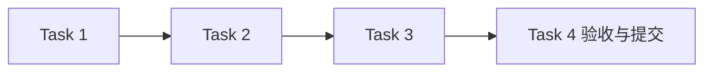

# AI 执行模块任务

## 任务元信息

| 项目 | 内容 |
| --- | --- |
| 项目名称 | LogAgent v0.1 · AI 执行 |
| 关联文档 | [proposal.md](./proposal.md)、[design.md](./design.md)、[总体设计](../../design.md) |
| 任务总数 | 4 |
| 前置模块 | configuration 已验收提交；按整体顺序在 collectors 后实施 |
| 执行策略 | subagent 实施，主 agent 审查与验收；本模块测试通过并提交后进入下一模块 |
| 计划产物 | logagent/ai/、tests/test_ai.py |
| 验证命令 | `rtk proxy uv run pytest tests/test_ai.py -q` |

## 任务列表

### Task 1：实现 AI 配置装配与 Mock

描述：实现提供方校验、系统/用户提示词、完整输入模板以及可测试 Mock 执行。

输入：本模块 proposal/design；AIConfig/AnalysisResult

输出：AIService 和 Mock；提示词测试

依赖：configuration

验收标准：

- [ ] 不同配置互不串用，保留完整输入和系统提示词
- [ ] 保留参数、未知工具、temperature/top_k 被拒绝

### Task 2：实现 HTTP 模型与工具协议

描述：实现兼容聊天模型请求、响应验证、环境凭据、工具 schema/调用 ID/结果关联。

输入：Task 1；本模块接口设计

输出：HTTP provider、工具注册执行；模拟传输测试

依赖：Task 1

验收标准：

- [ ] Mock HTTP 验证请求正文、工具与响应解析
- [ ] 不执行未知工具，参数校验、工具失败与非法模型响应可诊断

### Task 3：实现执行预算与结果指标

描述：约束网络、工具与整体期限，保留 usage/耗时/错误，取消可传播。

输入：Task 2

输出：超时、取消与错误处理；异常响应测试

依赖：Task 2

验收标准：

- [ ] 慢请求和工具不能无限阻塞，失败不泄漏凭据
- [ ] 部分工具或模型异常返回确定状态

### Task 4：完成 AI 模块验收并提交

描述：运行离线与 Mock HTTP 测试，审查并提交。

输入：Tasks 1–3

输出：tests/test_ai.py；验收记录；Git commit

依赖：Tasks 1–3

验收标准：

- [ ] 指定测试命令全部通过且无需真实密钥
- [ ] 对外执行入口不依赖 Workflow 或 Channel

## 执行顺序

推荐顺序：前置模块验收 → Task 1 → Task 2 → Task 3 → Task 4。无依赖的测试审查可并行，集成和提交按依赖顺序执行。

## 验收记录

尚未执行测试；完成后填写真实命令、结果与提交记录。
