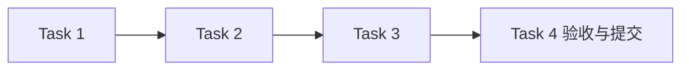

# 运行记录与存档模块任务

## 任务元信息

| 项目 | 内容 |
| --- | --- |
| 项目名称 | LogAgent v0.1 · 运行记录与存档 |
| 关联文档 | [proposal.md](./proposal.md)、[design.md](./design.md)、[总体设计](../../design.md) |
| 任务总数 | 4 |
| 前置模块 | configuration 已验收提交 |
| 执行策略 | 主 agent 实现，subagent 独立完成故障/并发契约测试与代码审查；本模块验收提交后按用户指示停止 |
| 计划产物 | logagent/archive.py、tests/test_archive.py、tests/test_archive_contract.py 及模块文档 |
| 验证命令 | `rtk proxy uv run --no-sync pytest tests/test_archive.py tests/test_archive_contract.py -q` |

## 任务列表

### Task 1：建立 session 记录与查询

描述：实现创建、读取、过滤排序、原子状态更新和启动中断识别。

输入：configuration 产出的公共模型与文件助手；本模块设计

输出：logagent/archive.py；记录查询测试

依赖：configuration

验收标准：

- [x] 记录独立于备份开关保留，使用带时区时间和安全 session ID
- [x] 并发更新不丢失状态，重启识别未完成运行

### Task 2：实现阶段备份与可用性

描述：按策略写入 snapshot/collection/analysis/final，内容成功后更新索引，校验哈希和格式。

输入：Task 1；BackupPolicy

输出：阶段内容与可用性接口；故障测试

依赖：Task 1

验收标准：

- [x] 关闭/缺失/损坏/写入失败原因可区分
- [x] 失败不把旧内容标为新成功，不谎报可完整恢复
- [x] 未知阶段与路径越界被拒绝

### Task 3：实现保留期与恢复材料验证

描述：到期只清理可过期内容且保留记录，availability 明确返回实际可用范围。

输入：Task 2

输出：expire/availability；时间边界测试

依赖：Task 2

验收标准：

- [x] TTL 边界准确，过期后记录仍可查询
- [x] 恢复查询只使用既有正文，不调用 Collector 或最新资源；首次发现过期时保存过期标记

### Task 4：完成存档模块验收并提交

描述：运行原子更新、故障注入、完整性、TTL 和中断测试，审查并独立提交。

输入：Tasks 1–3

输出：tests/test_archive.py、tests/test_archive_contract.py；同步 proposal/design/tasks；验收记录；Git commit

依赖：Tasks 1–3

验收标准：

- [x] 指定测试命令全部通过
- [x] 以原配置快照及真实阶段材料作恢复依据；提交包含 proposal/design/tasks，提交后停止，采集模块待用户继续指示

## 执行顺序

推荐顺序：前置模块验收 → Task 1 → Task 2 → Task 3 → Task 4。无依赖的测试审查可并行，集成和提交按依赖顺序执行。

## 验收记录

2026-09-12，Python 3.12 环境下完成：

| 命令 | 实际结果 |
| --- | --- |
| `rtk proxy uv run --no-sync pytest tests/test_archive.py tests/test_archive_contract.py -q` | 65 passed，1.69 秒 |
| `rtk proxy uv run --no-sync pytest -q` | 134 passed，2.25 秒 |
| `rtk proxy uv run --no-sync ruff check logagent tests` | All checks passed |
| `rtk proxy uv run --no-sync ruff format --check logagent tests` | 10 个文件格式通过 |
| `rtk proxy env OPENSPEC_TELEMETRY=0 openspec validate configurable-collection-analysis-workflow --strict --no-interactive` | 校验通过 |
| `rtk proxy uv build` | sdist 与 wheel 构建成功 |

主 agent 完成存档实现与 28 项功能测试，subagent 独立完成 37 项故障和并发契约测试，另一 subagent 完成代码审查。审查发现的成功/不确定回执被覆盖、模型 fan-in 结果丢失后误报可恢复、汇总不引用共享输入却强制要求 collection、时钟回退使已过期正文重新可用均已修复并加入回归。测试还验证结果已索引但状态摘要尚未提交、首次结果备份失败、取消期间持锁及独立 session 并行写入。

本验收记录、模块实现与测试、模块 proposal/design/tasks 及总体设计/任务进度随 `feat(archive): persist session artifacts and recovery metadata` 同次提交。配置与存档两个批次完成后停止；后续从采集模块继续，十分钟和 24 小时整体验收尚未执行。
