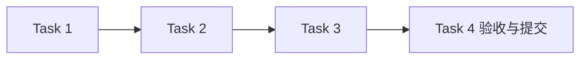

# 运行记录与存档模块任务

## 任务元信息

| 项目 | 内容 |
| --- | --- |
| 项目名称 | LogAgent v0.1 · 运行记录与存档 |
| 关联文档 | [proposal.md](./proposal.md)、[design.md](./design.md)、[总体设计](../../design.md) |
| 任务总数 | 4 |
| 前置模块 | configuration 已验收提交 |
| 执行策略 | subagent 实施，主 agent 审查与验收；本模块测试通过并提交后进入下一模块 |
| 计划产物 | logagent/archive.py、tests/test_archive.py |
| 验证命令 | `rtk proxy uv run pytest tests/test_archive.py -q` |

## 任务列表

### Task 1：建立 session 记录与查询

描述：实现创建、读取、过滤排序、原子状态更新和启动中断识别。

输入：configuration 产出的公共模型与文件助手；本模块设计

输出：logagent/archive.py；记录查询测试

依赖：configuration

验收标准：

- [ ] 记录独立于备份开关保留，使用带时区时间和安全 session ID
- [ ] 并发更新不丢失状态，重启识别未完成运行

### Task 2：实现阶段备份与可用性

描述：按策略写入 snapshot/collection/analysis/final，内容成功后更新索引，校验哈希和格式。

输入：Task 1；BackupPolicy

输出：阶段内容与可用性接口；故障测试

依赖：Task 1

验收标准：

- [ ] 关闭/缺失/损坏/写入失败原因可区分
- [ ] 失败不把旧内容标为新成功，不谎报可完整恢复
- [ ] 未知阶段与路径越界被拒绝

### Task 3：实现保留期与恢复材料验证

描述：到期只清理可过期内容且保留记录，availability 明确返回实际可用范围。

输入：Task 2

输出：expire/availability；时间边界测试

依赖：Task 2

验收标准：

- [ ] TTL 边界准确，过期后记录仍可查询
- [ ] 恢复查询只读既有文件，不调用 Collector 或最新资源

### Task 4：完成存档模块验收并提交

描述：运行原子更新、故障注入、完整性、TTL 和中断测试，审查并独立提交。

输入：Tasks 1–3

输出：tests/test_archive.py；验收记录；Git commit

依赖：Tasks 1–3

验收标准：

- [ ] 指定测试命令全部通过
- [ ] 以原配置快照及真实阶段材料作恢复依据，完成后再推进采集模块

## 执行顺序

推荐顺序：前置模块验收 → Task 1 → Task 2 → Task 3 → Task 4。无依赖的测试审查可并行，集成和提交按依赖顺序执行。

## 验收记录

尚未执行测试；完成后填写真实命令、结果与提交记录。
