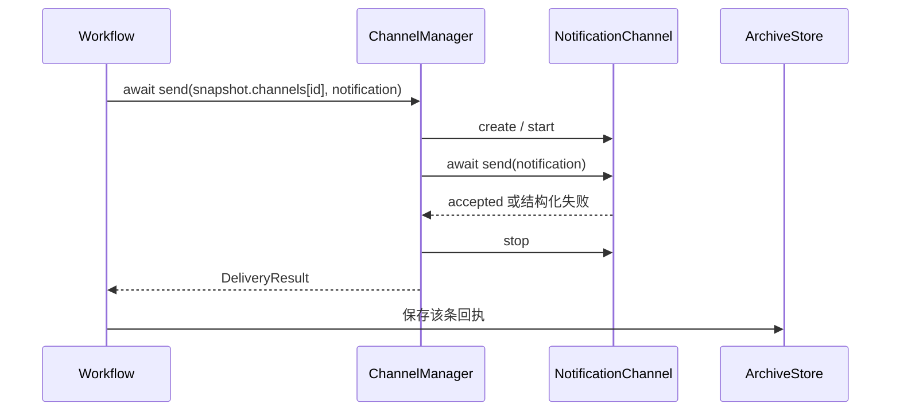

# Channel 网关模块设计

[总设计](../../design.md) · [接口契约](../../contracts/module-interfaces.md#5-channel-网关) · [QwenPaw 依据](../../references/qwenpaw.md)

网关把 Workflow 已确定的单条 Notification 发送到指定目标。它管理渠道类型、配置校验和实例调用；平台协议由渠道实现，输出顺序及部分失败策略由 Workflow 决定。

## 类型、实例与能力

| 对象 | 含义 |
| --- | --- |
| `ChannelType` | 注册声明：name、真实能力、options_schema、实例工厂。一个插件可注册多个类型。 |
| `ChannelConfig` | 可保存的目标配置，id 表示实例身份，channel 指向类型。 |
| `NotificationChannel` | 根据一份配置构造的运行实例，提供 start、send、stop。 |
| `ChannelManager` | 消费只读 `channelRegister`，组合配置校验器和单条发送入口，统一返回 DeliveryResult。 |

首版目标需要 notification 能力。ControlChannel、ConversationChannel 仅保留能力名称和将来扩展方向，本期不设计接收循环、命令路由或会话缓存。

## 配置与发现

配置模块识别 channel 插件：它读取插件目录的 `plugin.json`，导入 `entry.backend` 指向的入口 `.py`，并调用其 `plugin.register(api)`。入口经 `register_channel` 一次提交类型、说明、schema 和工厂；配置模块检查名称唯一、内置 key 冲突、schema 结构及可调用协议，并向 Manager 注入只读 `channelRegister`。无需继承复杂 BaseChannel。

一个插件的声明全部验证通过才由配置模块发布；失败时撤销本轮声明并记录原因。ChannelManager 不扫描目录、不导入入口、不维护第二份注册表；其 describe 从 `channelRegister` 生成 CapabilityDescription，`GET /api/plugins` 已返回同一 schema，配置 API 不另维护平台字段清单。

ChannelConfig 的公共字段由公共模型校验，options 由注册类型解释。目标只能来自配置，通知 text/metadata 不能覆盖收件人、路径或凭据。校验阶段不连接远端或发送测试消息。

## 实例绑定与发送

对外入口是 `await ChannelManager.send(config, notification)`。config 必须来自本次 WorkflowSnapshot，不能只按 channel_id 查最新配置，否则修改目标地址会改变活动 session 的投递位置。

首版每次调用按该配置创建一个短生命周期实例：校验/解析凭据 → factory → start → await send → stop。无跨调用连接池或实例缓存；同一目标的旧配置和新配置天然分离。总 timeout 覆盖本次准备、启动和发送，收尾需有界并保留清理错误。

Workflow 在一个 session 内按输出顺序和目标顺序依次 await；并发 session 之间不承诺总顺序。网关没有发送队列、消息缓存、优先级、后台发送任务或内部自动重试。

| 情况 | 回执 |
| --- | --- |
| enabled=False | skipped，attempts=0，不构造实例或解析凭据。 |
| 类型缺失、凭据失败或启动失败 | failed；尚未进入插件 send 时 attempts=0。 |
| 平台明确接受 | success，attempts=1；仅代表平台提交成功。 |
| 明确拒绝或传输失败 | failed，attempts=1，保留原因。 |
| 到达发送总时限 | timeout，attempts 取决于是否已进入插件 send。 |
| 可能接收但确认丢失 | failed/timeout，error.details.delivery_uncertain=True。 |

attempts 描述本次调用，不累计恢复调用次数。进入插件 send 最多一次；SDK 自动重试必须关闭。已经确认接受后 stop 失败不能降级成功回执，单独记录资源清理诊断。取消向 Workflow 传播，渠道仍有界清理资源。若已进入插件 send，Manager 的取消错误携带 attempts=1 和已知接收情况；Workflow 在收尾时为该项保存 failed + delivery_uncertain 回执（已明确接受则保留 success），再将 session 标记 cancelled，不能继续发送其他目标。尚未进入 send 时没有投递副作用。

恢复只跳过已知成功/不确定回执；缺回执的崩溃窗口由 Workflow 的恢复约定处理。网关不读取存档，不自行补发。

## 首版渠道

| 类型 | 独立设计 | 行为 |
| --- | --- | --- |
| email | [邮件渠道](./email/design.md) | 将一条通知提交给一个收件人，SMTP 接受后成功。 |
| mock | [Mock 文件渠道](./mock/design.md) | 将一条通知追加到指定文件，用于本地输出与验收。 |

首版的文件输出由 mock 承担，不另设重复的 file 类型。Telegram、钉钉、飞书、企业微信、Discord、Slack 等按同一插件契约后续接入，Webhook 安排依总设计版本边界。

## 验证要点

检查配置模块发布的多类型、schema 与注册冲突，以及 ChannelManager 只读消费 `channelRegister`；同时检查多实例、禁用无副作用、配置更新不改变旧目标、发送次数至多一次、超时/取消、SMTP 不确定性以及文件完整消息边界。
