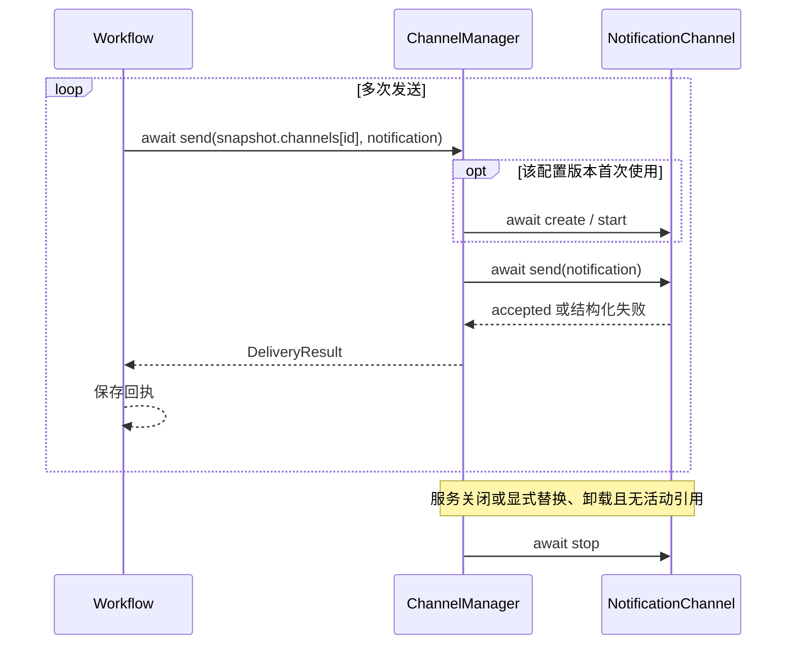

# Channel 网关模块设计

[总设计](../../design.md) · [接口契约](../../contracts/module-interfaces.md#5-channel-网关) · [QwenPaw 依据](../../references/qwenpaw.md)

网关把 Workflow 已确定的单条 Notification 发送到指定目标。它管理渠道类型、配置校验和实例调用；平台协议由渠道实现，输出顺序及部分失败策略由 Workflow 决定。

## 类型、实例与能力

| 对象 | 含义 |
| --- | --- |
| `ChannelType` | 注册声明：name、真实能力、options_schema、实例工厂。一个插件可注册多个类型。 |
| `ChannelConfig` | 可保存的目标配置，id 表示实例身份，channel 指向类型。 |
| `NotificationChannel` | 按快照配置绑定的常驻实例，提供 start、send、stop，多次发送复用。 |
| `ChannelManager` | 消费只读 `channelRegister`，组合配置校验器和单条发送入口，统一返回 DeliveryResult。 |

首版目标需要 notification 能力。ControlChannel、ConversationChannel 仅保留能力名称和将来扩展方向，本期不设计接收循环、命令路由或会话缓存。

## 配置与发现

channel以插件形式导入，通过config模块向 Manager 注入只读 `channelRegister`

这个模块需要负责读取ChannelConfig，这个是可复用的，诸如channel的key这些信息

ChannelConfig 的公共字段由公共模型校验，options 由注册类型解释。目标只能来自配置，通知 text/metadata 不能覆盖收件人、路径或凭据。校验阶段不连接远端或发送测试消息。

## 实例绑定与发送

对外入口是 `await ChannelManager.send(config, notification)`。config 必须来自本次 WorkflowSnapshot，不能只按 channel_id 查最新配置，否则修改目标地址会改变活动 session 的投递位置。

渠道实例由 ChannelManager 持有并持续整个程序生命周期，首次使用快照配置时创建并 start，后续发送复用，服务关闭时统一 stop。实例按 channel_id 与有效配置版本区分；资源更新创建新版本，旧实例继续服务旧快照，不能原地修改其目标。显式替换或卸载可在旧实例没有活动引用后关闭；历史恢复仍按原快照绑定实例。

同一实例的初始化只执行一次，不能因并发首发重复创建；不支持并发发送的实例串行调用 send。每次发送的 timeout 覆盖等待实例可用、必要准备和发送，关闭单独有界。输出和目标顺序由 Workflow 依次 await 保证。

调用示例如下

Workflow 在一次调用内按输出顺序和目标顺序依次 await；并发调用之间不承诺总顺序。网关没有发送队列、消息缓存、优先级、后台发送任务或内部自动重试。

| 情况 | 回执 |
| --- | --- |
| enabled=False | skipped，attempts=0，不构造实例或解析凭据。 |
| 类型缺失、凭据失败或启动失败 | failed；尚未进入插件 send 时 attempts=0。 |
| 平台明确接受 | success，attempts=1 |
| 明确拒绝或传输失败 | failed，attempts=1，保留原因。 |
| 到达发送总时限 | timeout，attempts 取决于是否已进入插件 send。 |
| 可能接收但确认丢失 | failed/timeout，error.details.delivery_uncertain=True。 |

失败会向调用的模块汇报，并且记录日志

## 首版渠道

| 类型 | 独立设计 | 行为 |
| --- | --- | --- |
| email | [邮件渠道](./email/design.md) | 将一条通知提交给一个收件人，SMTP 接受后成功。 |
| mock | [Mock 文件渠道](./mock/design.md) | 将一条通知追加到指定文件，用于本地输出与验收。 |

首版的文件输出由 mock 承担，不另设重复的 file 类型。Telegram、钉钉、飞书、企业微信、Discord、Slack 等按同一插件契约后续接入，Webhook 安排依总设计版本边界。

## 验证要点

检查配置模块发布的多类型、schema 与注册冲突，以及 ChannelManager 只读消费 `channelRegister`。验证连续发送复用实例、并发首次使用只初始化一次、旧快照目标不漂移，以及关闭或卸载时只释放一次。
