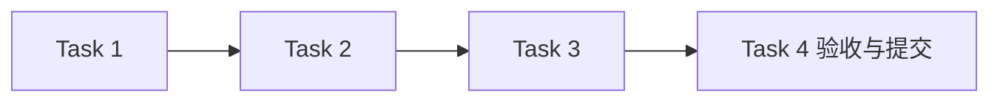

# Channel 网关模块任务

## 任务元信息

| 项目 | 内容 |
| --- | --- |
| 项目名称 | LogAgent v0.1 · Channel 网关 |
| 关联文档 | [proposal.md](./proposal.md)、[design.md](./design.md)、[总体设计](../../design.md) |
| 任务总数 | 4 |
| 前置模块 | configuration 已验收提交；按整体顺序在 ai 后实施 |
| 执行策略 | subagent 实施，主 agent 审查与验收；本模块测试通过并提交后进入下一模块 |
| 计划产物 | logagent/channels/、tests/test_channels.py、tests/test_channel_plugins.py |
| 验证命令 | `rtk proxy uv run pytest tests/test_channels.py tests/test_channel_plugins.py -q` |

## 任务列表

### Task 1：实现通知能力、插件与生命周期

描述：实现 Base/NotificationChannel、逐文件原子注册、schema、实例指纹与异步启停。

输入：本模块设计 §4–6；公共通知模型

输出：Channel 基类、注册表、Manager；插件测试

依赖：configuration

验收标准：

- [ ] 单个插件或实例失败不影响其他类型
- [ ] disabled 不实例化，旧配置快照不被新资源替换

### Task 2：实现文件和 SMTP 通知

描述：按确定路径追加完整 Markdown，构造 Unicode SMTP 消息并支持 none/starttls/ssl 与环境凭据。

输入：Task 1；本模块设计 §8–9

输出：file/email 平台；文件和模拟 SMTP 测试

依赖：Task 1

验收标准：

- [ ] 共享目标文件的消息完整不交错，保留既有内容
- [ ] TLS 失败不降级，SMTP 部分拒收和凭据缺失可诊断

### Task 3：实现投递顺序、有限重试与取消

描述：按输出后目标顺序返回独立回执，超时/永久失败/不确定送达区分，回收在途任务。

输入：Task 2；设计 §7

输出：投递调度与错误策略；顺序/失败测试

依赖：Task 2

验收标准：

- [ ] 部分失败仍发送其他目标且保留已成功回执
- [ ] 不自动重发 delivery_uncertain，重试不超过上限
- [ ] 取消不继续下个目标，关闭不遗留无主任务

### Task 4：完成网关模块验收并提交

描述：使用临时文件和 Mock SMTP 跑完整验收并提交。

输入：Tasks 1–3

输出：网关测试；验收记录；Git commit

依赖：Tasks 1–3

验收标准：

- [ ] 指定测试命令全部通过
- [ ] 未向真实邮箱或外部群发送测试消息

## 执行顺序

推荐顺序：前置模块验收 → Task 1 → Task 2 → Task 3 → Task 4。无依赖的测试审查可并行，集成和提交按依赖顺序执行。

## 验收记录

尚未执行测试；完成后填写真实命令、结果与提交记录。
