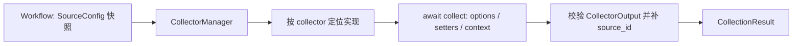

# 数据采集模块设计

[总设计](../../design.md) · [接口契约](../../contracts/module-interfaces.md#3-数据采集)

模块执行单来源采集，向 Workflow 提供可消费文本、记录、处理后计数和真实状态。跨来源拼接、失败策略和 AI/通知调用由 Workflow 决定。

## 内部组织与依赖

CollectorManager 对外提供 describe/validate/collect；启动时接收配置模块发布的只读 `collectorRegister`，内部只按该视图定位声明与实现并执行单来源采集。插件目录扫描、`plugin.json` 解析、入口导入、`plugin.register(api)` 调用及注册冲突处理由[配置模块](../config/design.md#插件发现与注册)完成。来源专属处理留在 Collector 实现中，避免通用父类承担过滤、分页等不一致逻辑。

一个插件可在配置模块的一次入口调用中注册多个 Collector name；同一 name 可配置多个 SourceConfig.id。`collectorRegister` 保存能力声明和实现，SourceConfig 由配置模块保存，Manager 不再维护资源副本或可变注册表。

## 能力与 Setter

Collector 由插件入口的 `plugin.register(api)` 经 `register_collector` 提交 name、options_schema、setters_schema、可选 fields、count_unit 和 collect 协程。配置模块校验并发布后，Manager 的 describe 从 `collectorRegister` 生成 CapabilityDescription，供 API 展示与配置校验复用。

options 定义连接/范围；setters 定义可用字段选择、过滤、排序、分组及格式化，具体类型必须在 schema 中说明。未声明的 Setter 不可注入。schema 应为 JSON Schema 2020-12 的对象约束，对不允许任意键的对象使用 additionalProperties=false。

SetterTemplate 由配置模块存储；配置展开时先复制模板再以实例显式同名键覆盖，包括空列表；不做隐式深度合并。Manager 校验展开后的结果及模板的 collector 归属。

## 单次采集流程

1. 定位能力。未注册或导入失败返回 missing，附带发现诊断；已保存 Workflow 不因当前插件缺失而在触发前被阻断。
2. 使用 SourceConfig.timeout 限制整次调用，按需注入只读存档、日志路径和凭据解析能力。来源路径在创建运行快照时按插件声明固定。
3. 插件访问一个来源、执行其声明的处理顺序并返回 CollectorOutput；阻塞 SDK 可在内部使用线程，但线程任务仍须有真实 I/O 时限。
4. Manager 严格校验返回状态、文本、count、JSON 结构，并补 source_id。异常/非法返回为 failed，时限耗尽为 timeout，不把未完成文本当成功。

正常空和过滤后空由插件区分；只返回处理后 count，不估算过滤前数量。取消向调用者传播，Workflow 记录 session cancelled，不发明 CollectionStatus.cancelled。插件在 finally 释放连接和文件句柄。

## 内置 Collector

### Mock

options 提供有界样例 records，或显式 mode=success/empty/failed/timeout；默认离线成功样例。setters 声明 fields、简单等值过滤、排序及分组字段。处理顺序固定为过滤、排序、字段投影、分组、格式化；count 为最终可消费记录数，分组不改变计数单位。原样例空返回 empty，过滤/投影后无内容返回 filtered_empty。

### 运行日志 logs

通过 CollectionContext.log_path 读取本工具诊断日志；未配置日志文件或目标不存在返回 missing。options 使用 max_lines 和 max_bytes 约束尾部读取，默认 200 行和 256 KiB；从文件尾分块回读，不能为取尾部扫描整文件。

日志建议使用逐行 JSON 事件。setters 支持等级、模块、session/time 范围、字段与分组；count 按处理后的事件数。已读取范围中的损坏完整行返回 failed 并给出行位置诊断；文件尾尚未写完的一行不视为完整事件，metadata 说明忽略事实。日志轮转导致读取中断时报告，不无限重开追踪。

### 历史 history

通过注入的 ArchiveReader 选择指定 workflow_id 的既有终态 session；排除当前 session。options 指定 artifact（collection/analysis/final）、最近次数、可选起止时间及 token 预算；默认读取最近一次 final。次数与时间同时配置时取交集，按创建时间从新到旧选择，同时间按 ID 稳定排列。

读取选中的 artifact 必须使用 load_artifact；collection 取 shared_input，analysis 取成功分支并保持声明顺序，final 取冻结输出。每个 session 的选中阶段作为完整历史记录，count 为实际保留的记录数。

预算按最终格式化内容（含来源标记）计算，插件 schema 公开 tokenizer/估算规则。首版固定使用 UTF-8 字节数作为保守预算估算单位，并在 metadata 写明算法为 utf8_bytes_v1、预算与实际占用；它不等同提供方实际 token 用量。overflow=truncate 时只保留可放入的最新完整记录前缀，首条过大则 filtered_empty 并记录预算截取；overflow=error 时报告超限。不能截断一段 JSON 或半条记录。

正常无匹配返回 empty；选中 session 的必要正文未备份/缺失/过期返回 missing；损坏返回 failed，不静默跳过缺失记录继续伪装完整历史。历史读取永不触发旧 Workflow 或原来源。

## 验证要点

覆盖配置模块发布的一个插件多能力、注册冲突与 Manager 只读消费 `collectorRegister`，以及 Setter 覆盖、空状态区别、非法输出、超时/取消、历史选择顺序和完整记录预算；验证日志尾读有界，history 仅调用只读接口。
