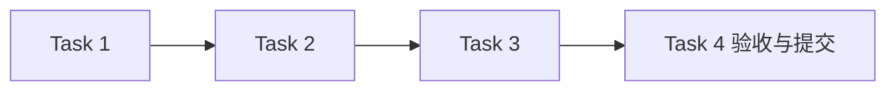

# 配置与资源管理模块任务

## 任务元信息

| 项目 | 内容 |
| --- | --- |
| 项目名称 | LogAgent v0.1 · 配置与资源管理 |
| 关联文档 | [proposal.md](./proposal.md)、[design.md](./design.md)、[总体设计](../../design.md) |
| 任务总数 | 4 |
| 前置模块 | 无 |
| 执行策略 | 主 agent 实施与验收，subagent 独立审查；按用户最新要求，在本模块测试通过并提交后停止 |
| 计划产物 | logagent/__init__.py、logagent/models.py、logagent/config.py、logagent/errors.py、logagent/_io.py、pyproject.toml、uv.lock、tests/test_config.py、tests/test_config_contract.py |
| 验证命令 | `rtk proxy uv run --no-sync pytest tests/test_config.py tests/test_config_contract.py -q`（先执行 `rtk proxy uv sync --locked`） |

## 任务列表

### Task 1：建立公共模型与可运行工程

描述：定义根设计 §4.1 的严格配置、结果、session 和快照模型，配置 Python、依赖、可导入包与测试运行环境。CLI 命令入口在交互模块实现时注册。

输入：根 design.md §4.1；本模块 proposal.md/design.md

输出：公共模型、错误与工程配置

依赖：无

验收标准：

- [x] 公共字段与类型符合接口契约，未知字段、非法 ID、非有限超时与无效范围被拒绝
- [x] 不接受 temperature/top_k，密钥只保留环境变量名
- [x] 依赖可安装，公共模型能被测试导入

### Task 2：实现配置读取与原子资源存取

描述：实现 JSON 系统配置与相对路径解析，异步资源 CRUD、并发原子替换、错误转换和插件配置读取。

输入：Task 1；本模块 design.md 的文件与路径约定

输出：logagent/config.py；资源存取测试

依赖：Task 1

验收标准：

- [x] 损坏 JSON、错误资源类型、未知字段与路径越界返回明确错误
- [x] 并发读写只能看到完整 JSON，写入失败保留此前内容
- [x] 系统级和插件级配置区分，插件读取失败可逐文件诊断

### Task 3：实现引用、Setter 展开和运行快照

描述：校验 Workflow 和资源引用，拒绝删除仍被引用的资源，实例覆盖同 Collector 模板，返回独立 WorkflowSnapshot。

输入：Task 2；公共资源模型

输出：快照与引用校验；相关测试

依赖：Task 2

验收标准：

- [x] 不存在引用或跨 Collector 模板被拒绝
- [x] 修改原配置、模板或返回对象不改变已有快照
- [x] 快照只包含本次依赖资源，所有可变数据独立复制

### Task 4：完成配置模块验收并提交

描述：运行配置模块的边界、并发和快照测试，审查 diff，记录证据，提交本模块。

输入：Tasks 1–3

输出：tests/test_config.py；tasks 验收记录；Git commit

依赖：Tasks 1–3

验收标准：

- [x] 指定测试命令全部通过
- [x] 提交本模块代码、测试及已准备的规划文档，保留工作区原有非相关修改
- [x] 公共模型与模块设计一致，下一模块可依赖已提交接口

## 执行顺序

推荐顺序：前置模块验收 → Task 1 → Task 2 → Task 3 → Task 4。无依赖的测试审查可并行，集成和提交按依赖顺序执行。

## 验收记录

2026-09-12，Python 3.12 环境下完成：

| 命令 | 实际结果 |
| --- | --- |
| `rtk proxy uv sync --locked` | 依赖锁一致，依赖安装检查通过 |
| `rtk proxy uv run --no-sync pytest tests/test_config.py tests/test_config_contract.py -q` | 69 passed，0.58 秒 |
| `rtk proxy uv run --no-sync ruff check logagent tests` | All checks passed |
| `rtk proxy uv run --no-sync ruff format --check logagent tests` | 7 个文件格式通过 |
| `rtk proxy env OPENSPEC_TELEMETRY=0 openspec validate configurable-collection-analysis-workflow --strict --no-interactive` | 校验通过 |
| `rtk proxy uv build` | sdist 与 wheel 构建成功 |

独立 subagent 审查发现的严格数值/布尔校验、插件路径误改写、损坏目录误判、非法系统路径错误转换及 URL 错误泄露问题均已修复并纳入回归测试。测试还覆盖并发创建、引用删除竞争、取消期间写入保锁、原子替换失败、快照隔离和快照反序列化完整性。

本验收记录、模块实现、测试及既有规划文档随 `feat(config): implement validated resource storage and workflow snapshots` 同次提交。按用户最新要求，此提交完成后停止；其它模块与后继版本仍未实施，十分钟及 24 小时整体验收尚未执行。
