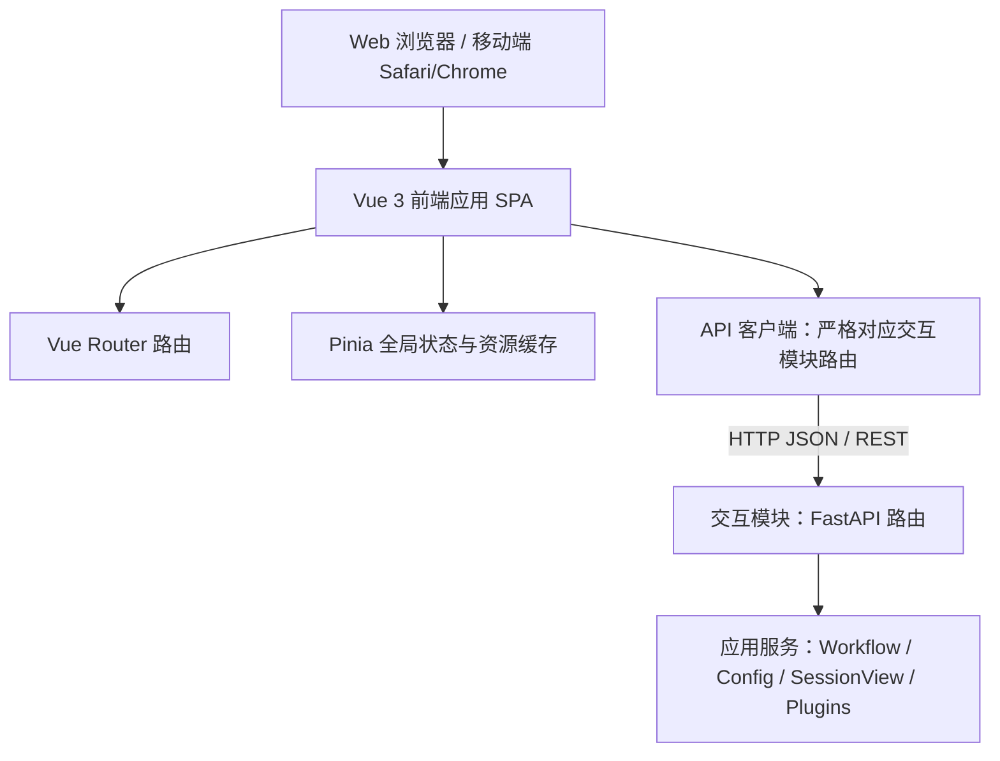
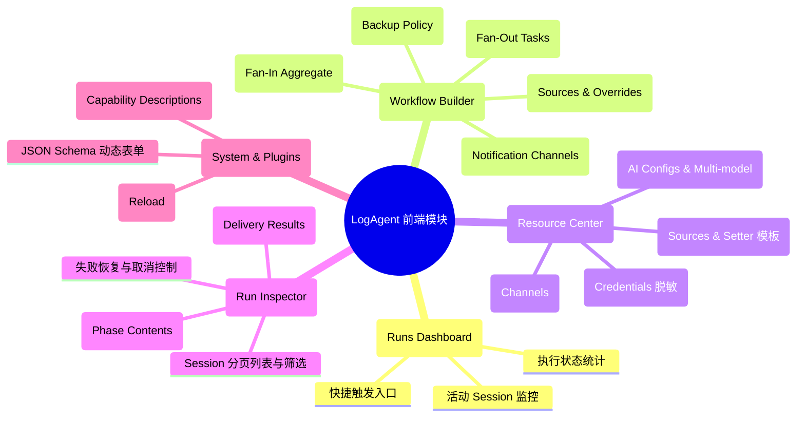

# 前端模块设计

[总设计](../../design.md) · [交互模块](../interaction/design.md) · [接口契约](../../contracts/module-interfaces.md#8-交互与生命周期) · [数据模型](../../contracts/data-models.md)

前端模块作为系统的交互视图层，提供面向个人开发者和自托管用户的轻量、现代、零代码且移动端友好的 Web 界面。前端不包含任何自研服务端业务逻辑，完全通过标准 HTTP/JSON API 与后端的交互模块（FastAPI）进行通信。

---

## 1. 架构定位与核心原则

### 1.1 系统中的位置

前端采用模块化单页面应用（SPA）架构，使用 **Vue 3 + Tailwind CSS + Vite** 构建，通过静态资源托管或与交互模块的 FastAPI 静态挂载配合运行。



### 1.2 核心原则与限制边界

1. **绝对不设计画布（No Canvas Editor）**：
   - 依据 [提案](../../proposal.md §2.2)，明确排除节点连线式画布（Node/Graph Canvas）。
   - 采用**响应式垂直流式阶梯卡片（Responsive Stepper / Linear Flow Cards）**，以结构化表单、拖拽重排与折叠卡片实现零代码配置，在桌面端和移动端保持一致的直观体验。
2. **单一数据源与无业务状态沉淀**：
   - 前端不设立本地存储作为第二事实来源。所有资源（Source、AI、Channel、Workflow、Credential）与运行事实（SessionRecord、PhaseContent）均由后端返回。
3. **高标准无障碍与视觉舒适度**：
   - 界面整体严格满足 **WCAG 2.1 AA 级** 对比度（常规文本 ≥ 4.5:1，UI 组件 ≥ 3:1）；
   - 核心状态指示、危险告警及重要监控模块达到 **WCAG 2.1 AAA 级** 对比度（文本 ≥ 7:1，大文本 ≥ 4.5:1）。
4. **移动优先的自适应布局**：
   - 全面兼容移动设备浏览器（最小兼容至 375px 宽度屏幕），无水平溢出滚动条，所有可交互按钮具备最小 44×44px 的触控命中范围。

---

## 2. 设计语言规范 (Design System)

为保证全站视觉体验的高度统一与工程实现的可维护性，建立完整的前端设计语言规范。

### 2.1 文字排版系统 (Typography)

#### 2.1.1 字体族 (Font Family)
- **常规界面字体栈 (Sans)**：优先调用现代操作系统原生西文与中文字体，确保零网络字体加载延迟与最高清晰度：
  ```css
  font-family: -apple-system, BlinkMacSystemFont, "Segoe UI", Roboto, "PingFang SC", "Hiragino Sans GB", "Microsoft YaHei", "WenQuanYi Micro Hei", sans-serif;
  ```
- **等宽代码/标识符字体栈 (Mono)**：用于 ID、Cron 表达式、JSON 字段名、日志片段及模型名称：
  ```css
  font-family: "JetBrains Mono", ui-monospace, SFMono-Regular, Menlo, Monaco, Consolas, "Liberation Mono", "Courier New", monospace;
  ```

#### 2.1.2 字阶标尺与层级结构 (Scale & Hierarchy)

| 层级代号 | 像素大小 | 相对大小 | 行高 | 推荐字重 | 应用场景 |
| :--- | :--- | :--- | :--- | :--- | :--- |
| `text-display` | 32px | 2.0rem | 1.25 (40px) | Bold (700) | 仪表盘关键数值、大标题 |
| `text-h1` | 24px | 1.5rem | 1.33 (32px) | Bold (700) | 页面一级主标题 |
| `text-h2` | 20px | 1.25rem | 1.4 (28px) | SemiBold (600) | 模块卡片标题、弹窗标题 |
| `text-h3` | 16px | 1.0rem | 1.5 (24px) | SemiBold (600) | 阶段子步骤、分组标题 |
| `text-body` | 14px | 0.875rem | 1.5 (21px) | Regular (400) / Medium (500) | 默认正文字体、输入框文本、列表项 |
| `text-body-sm` | 13px | 0.8125rem | 1.45 (19px) | Regular (400) | 辅助说明、表单标签、次级摘要 |
| `text-caption`| 12px | 0.75rem | 1.33 (16px) | Medium (500) | 状态徽标 (Badge)、元数据、时间戳 |
| `text-code` | 13px | 0.8125rem | 1.5 (19.5px)| Regular (400) | 嵌入式代码、Schema 键名、ID 标签 |

### 2.2 色彩系统与对比度矩阵 (Color & Contrast System)

色彩系统支持 **明亮模式 (Light)** 与 **深色模式 (Dark)**，采用 HSL/Tailwind 语义变量定义。

#### 2.2.1 语义色彩调色板

| 语义角色 | 亮色模式值 | 暗色模式值 | 语义说明与对比度级别 |
| :--- | :--- | :--- | :--- |
| **Brand (主品牌色)** | `#2563EB` (blue-600) | `#3B82F6` (blue-500) | 主动作、焦点环、高亮导航。亮色对比度 5.2:1 (AA) |
| **Neutral Base (基底背景)** | `#F8FAFC` (slate-50) | `#0F172A` (slate-900) | 页面背景色 |
| **Neutral Surface (卡片表面)** | `#FFFFFF` (white) | `#1E293B` (slate-800) | 卡片、容器、输入框表面 |
| **Neutral Border (常规边框)** | `#E2E8F0` (slate-200) | `#334155` (slate-700) | 分割线与容器边框 |
| **Text Primary (主要文本)** | `#0F172A` (slate-900) | `#F8FAFC` (slate-50) | 标题、重要信息。对比度 14.5:1 (AAA) |
| **Text Secondary (次要文本)** | `#475569` (slate-600) | `#94A3B8` (slate-400) | 描述、标签。对比度 5.6:1 (AA) |
| **Text Muted (弱化说明)** | `#64748B` (slate-500) | `#64748B` (slate-500) | 占位符、辅助时间。对比度 4.6:1 (AA) |
| **Success (成功/完成)** | `#16A34A` (green-600) | `#22C55E` (green-500) | `completed` 状态、保存成功 |
| **Warning/Partial (警告/部分成功)** | `#D97706` (amber-600) | `#F59E0B` (amber-500) | `partial` 降级、正文未保存警告 |
| **Danger/Failed (危险/失败)** | `#DC2626` (red-600) | `#EF4444` (red-500) | `failed` 状态、删除动作、异常中断 |
| **Info/Running (信息/运行中)** | `#0284C7` (sky-600) | `#38BDF8` (sky-400) | `running` 状态、提示信息 |

#### 2.2.2 重要模块 WCAG AAA 级合规配置
在系统运行状态徽标（Status Badges）与错误提示横幅中，必须满足 AAA 级标准（≥ 7:1 文本对比度）：
- 亮色模式下的“运行失败”徽标：采用深红文字 `#991B1B` (red-800) 搭配浅粉背景 `#FEE2E2` (red-100)，对比度为 7.4:1 (AAA)。
- 亮色模式下的“完成”徽标：采用深绿文字 `#14532D` (green-900) 搭配浅绿背景 `#DCFCE7` (green-100)，对比度为 8.1:1 (AAA)。
- 暗色模式下的“运行中”徽标：采用明亮天蓝 `#E0F2FE` (sky-100) 搭配深天蓝背景 `#075985` (sky-800)，对比度为 7.2:1 (AAA)。

### 2.3 栅格与自适应布局 (Grid & Layout)

#### 2.3.1 断点标准 (Breakpoints)
- `sm`: 640px（大屏手机横屏与紧凑型平板）
- `md`: 768px（标准平板立屏）
- `lg`: 1024px（笔记本与标准平板横屏）
- `xl`: 1280px（桌面工作站）
- `2xl`: 1536px（宽屏工作站）

#### 2.3.2 布局结构系统
1. **全局应用骨架 (App Shell)**：
   - 桌面端 (`lg` 以上)：固定左侧折叠侧边栏（宽度 240px，折叠后 64px）+ 顶部紧凑状态栏 + 弹性滚动主工作区。
   - 移动端 (`< lg`)：顶部移动导航栏（含品牌、健康指示器与汉堡菜单呼出按钮）+ 抽屉式侧边导航（Slide-over Drawer）+ 单列全宽工作区。
2. **工作区容器 (Container)**：
   - 最大内容宽度限制在 1440px，居中对齐，留有内侧自适应 padding：移动端 `px-4` (16px)，桌面端 `px-8` (32px)。
3. **非画布流式阶梯编排布局 (Flow Stepper Layout)**：
   - Workflow 编排采用竖向贯穿的时间轴流（Vertical Timeline Flow）：
     - **步骤 1：采集源编排 (Collection Stage)**：卡片列表，支持上下调整排列优先级，直观展示来源策略；
     - **连接线 (Connecting Line)**：带有定向箭头的竖向虚线/实线指示；
     - **步骤 2：并行分析任务 (Fan-Out Analysis Stage)**：网格/卡片堆叠，支持多分支独立提示词与模型配置；
     - **步骤 3：汇聚汇总 (Fan-In Aggregate Stage)**：条件激活卡片，可选择模型或纯文本拼接；
     - **步骤 4：通知渠道 (Notification Stage)**：有序渠道分发卡片；
     - **步骤 5：备份策略 (Backup Policy)**：开关矩阵。
   - 在手机端，所有卡片自动 100% 宽度垂直流式排列，完全杜绝横向滚动与手势冲突。

### 2.4 图标系统 (Icon System)

图标作为视觉认知的关键组成部分，严格规范其类型、认知维度、风格与视觉重量。

#### 2.4.1 图标类型定义
1. **Icon (功能图标)**：代表明确的交互动作、系统对象或即时状态。尺寸通常为 16×16px 或 20×20px。
2. **Symbol (符号/徽记)**：代表固定的概念实体或数据类型（如 JSON、Schema、Token、API）。
3. **Pictogram (图解/插图)**：具有故事性或空状态图解说明的组合矢量图形（如“暂无运行记录”、“未发现可用插件”）。

#### 2.4.2 图标功能三分类

| 类别 | 包含图标示例 | 核心语义与使用场景 |
| :--- | :--- | :--- |
| **对象图标 (Object)** | 数据源 (`Database`)、模型服务 (`Cpu` / `Bot`)、通知渠道 (`Send` / `Mail`)、历史记录 (`History`)、凭据 (`Key` / `Shield`) | 标识实体类型，置于标题前或选择器中，增强实体记忆性 |
| **动作图标 (Action)** | 触发运行 (`Play`)、取消任务 (`Square` / `XCircle`)、恢复执行 (`RotateCcw`)、编辑 (`Edit3`)、删除 (`Trash2`)、展开/折叠 (`ChevronDown`) | 引导用户交互，必须与对应动作强关联，杜绝语义混淆 |
| **状态图标 (State)** | 成功 (`CheckCircle2`)、运行中 (`Loader2` 旋转)、警告/降级 (`AlertTriangle`)、失败 (`XOctagon`)、不确定 (`HelpCircle`)、已排队 (`Clock`) | 反映运行时瞬时状态，通常搭配特定语义色彩徽标显示 |

#### 2.4.3 认知设计：消除歧义与记忆性
- **“恢复执行 (Recover)” vs “重新触发 (Trigger New)”**：
  - 恢复使用 `RotateCcw`（逆时针回溯箭头），文案强化“从断点继续”；
  - 触发使用 `Play`（实体三角形），文案为“开始新运行”。
- **“取消运行 (Cancel)” vs “删除资源 (Delete)”**：
  - 取消活动任务使用 `StopCircle` 或 `XCircle`（圆圈带叉），保持可逆认知；
  - 删除永久资源使用 `Trash2`（废纸篓），且点击必须经过二次确认。
- **“部分成功 (Partial)” vs “失败 (Failed)”**：
  - 部分成功采用 `AlertTriangle`（黄色警示三角），表明“有可用结果但存在局部降级”；
  - 失败采用 `XOctagon`（红色八角形停止牌），表明“流程终止且无最终有效输出”。

#### 2.4.4 图标视觉风格与重量平衡 (Visual Weight & Balance)
- **线宽与风格**：
  - 基础图标采用统一 **1.75px 描边、圆角拐角（Round Cap / Join）** 的线性矢量图标（基于 Lucide 图标集规范）。
  - 选中状态或关键警示状态，切换为**填充面性或双调（Dual-tone）**，以增强视觉对比。
- **视觉平衡校正 (Optical Alignment)**：
  - 图标外层统一包含在 20×20 或 24×24 正方形视框（ViewBox）内。
  - 对于不对称图形（如 `Play` 三角形箭头），在 CSS 中进行微调 `translate-x-[0.5px]`，保证视觉重心位于中心。

### 2.5 间距、曲率与图像规范 (Spacing, Radius & Imagery)

#### 2.5.1 基础度量标尺 (4px/8px Grid)
- `space-1` (4px): 紧凑内边距、图标与微型文字间距。
- `space-2` (8px): 按钮内边距、表单项间垂直间隙、标签内边距。
- `space-3` (12px): 列表行间距、卡片紧凑内边距。
- `space-4` (16px): 标准卡片内边距、移动端页面水平边距。
- `space-6` (24px): 桌面端卡片内边距、表单分区垂直间距。
- `space-8` (32px): 页面模块主分区垂直间距。

#### 2.5.2 圆角阶梯 (Radius Scale)
- `rounded-sm` (4px): 徽标、微型标签。
- `rounded-md` (6px): 输入框、下拉选择器、基础按钮。
- `rounded-lg` (8px): 卡片容器、对话框外框。
- `rounded-xl` (12px): 核心仪表板模块、大图预览浮层。

#### 2.5.3 图像与空状态插图 (Imagery)
- 严禁使用重型位图；空状态与错误引导统一使用轻量 SVG 矢量插图，遵循系统语义色彩（灰蓝冷色调搭配品牌蓝）。

### 2.6 动效、触控与交互反馈 (Motion & Interaction)

#### 2.6.1 缓动与持续时间
- **微交互反馈 (Hover, Focus, Press)**: `150ms ease-out`。
- **抽屉与弹窗转场 (Modals, Drawers)**: `250ms cubic-bezier(0.16, 1, 0.3, 1)`（平滑减速入场）。
- **步骤卡片折叠/展开 (Accordion)**: `300ms cubic-bezier(0.4, 0, 0.2, 1)`。
- **遵循减少动效偏好 (prefers-reduced-motion)**: 当用户系统开启减少动效时，禁用所有位置偏移与展开动画，仅保留瞬时透明度淡入淡出。

#### 2.6.2 触控友好标准 (Touch Targets)
- 在移动视口（`< 768px`）下，所有按钮、复选框、选择项与折叠箭头的有效触控面积不低于 **44×44px**（通过 CSS `min-h-[44px]` 与伪元素扩大命中区实现）。

---

## 3. 功能架构与模块界面设计

根据后端交互模块的 API 能力与总设计，前端划分五大核心功能视图：



### 3.1 运行记录与详情查看器 (Run Inspector)
- **列表页 (`/runs`)**：
  - 展示 `SessionRecord` 列表，支持按 `workflow_id` 过滤、按时间区间（after/before）筛选及分页（limit/offset）。
  - 状态徽标严格区分 `created`, `running`, `completed`, `partial`, `failed`, `cancelled`, `interrupted`。
  - 操作列提供“详情”、“取消”（针对活动任务）、“恢复”（针对中断或失败且有可用 checkpoint 的 session）。
- **详情页 (`/runs/:id`)**：
  - 顶部显示 Session 基本元数据（状态、版本号 `version`、开始/结束时间、快照可用性 `snapshot_availability`）。
  - 核心区域为**阶段流式面板**：
    1. **采集阶段 (Collection)**：展示各数据源采集状态（success/empty/filtered_empty/missing/failed/timeout）、采集条目计数与共享输入正文内容（支持折叠/展开、复制与 JSON 格式化）；
    2. **分析阶段 (Fan-Out Analysis)**：卡片列出各个分析分支的任务说明、所用模型、耗时及输出正文；
    3. **汇聚阶段 (Fan-In Aggregate)**：若启用，展示汇总正文；
    4. **通知阶段 (Notification)**：展示各目标的发送回执（`attempts`, `status`, `delivered_at`，或标明 `delivery_uncertain` 不确定投递状态）；
  - 阶段正文查询严格调用 `GET /api/runs/{session_id}/phases/{stage}?version={version}`，正文标记为 `expired` 或 `write_failed` 时给出明确降级原因提示。

### 3.2 零代码工作流编排器 (Workflow Builder)
- **列表页 (`/workflows`)** 与 **编辑页 (`/workflows/:id/edit`)**：
- **无画布流式步骤设计**：
  - **Stage 1: 采集源配置 (Sources)**：从已保存的 SourceConfig 中多选，支持拖拽或上下按钮调整编排顺序；展开单项可覆写 `source_overrides`（调用级 options、Setter 模板与自定义 setters）。
  - **Stage 2: 共享输入与错误策略**：配置单来源失败策略（`on_error`: stop/skip）、全空策略（`on_all_empty`: stop/skip）。
  - **Stage 3: Fan-Out 分析任务 (Analysis Tasks)**：动态添加分析卡片。每张卡片配置：任务标识符 `task_id`、任务说明 `task_name`、选择引用的 AIConfig 及模型名称 `model`、独立的分析提示词 `prompt`。
  - **Stage 4: Fan-In 汇聚汇总 (Fan-In)**：开关控制。开启时可选择是否通过 AI 再次总结，或仅进行结构化文本拼接。
  - **Stage 5: 通知渠道 (Channels)**：多选 Channel 实例，支持设置 `channel_overrides`（如收件人覆写）；配置各渠道投递失败策略。
  - **Stage 6: 备份策略 (Backup Policy)**：开关矩阵控制（全量备份总开关，以及快照、采集、分析、最终正文分项开关，保留天数 `retention_days` 与失败动作 `on_failure`）。

### 3.3 资源配置中心 (Resource Center)
- **数据源 (`/resources/sources`)**：选择已注册 Collector 插件类型，根据其 schema 动态渲染配置表单；支持保存 Setter 模板便于复用。
- **AI 配置 (`/resources/ai`)**：以“API 格式”单选项配置连接协议；当前唯一选项为 `OpenAI Compatible API`（传输值 `http`，兼容 OpenAI API 的 AxonHub 等服务）。同时配置基础 URL、共享 API 凭据、超时（默认 600s）与重试次数（默认 5 次）；配置多模型字典 `models: {模型名: 参数}`。不在前端展示系统提示词。
- **渠道配置 (`/resources/channels`)**：配置邮件（SMTP 主机、端口、安全协议、发件人）或 Mock（文件输出路径）；显式区分实例级属性与调用级属性。
- **凭据管理 (`/resources/credentials`)**：仅显示凭据键名与类型（环境变量引用或加密存储），安全脱敏掩码展示，严禁前端明文反显或在控制台输出秘密。

### 3.4 插件与 Schema 浏览器 (Plugin Capabilities)
- 对应后端 `GET /api/plugins` 接口；
- 展示已注册的 Collector 与 Channel 插件清单及其版本、所有者及 `options_schema`；
- 提供动态 Schema 测试预览器，校验用户填写的选项是否合规。

---

## 4. 设计决策索引与模块映射理由 (Design Decision Index & Rationale)

为满足系统设计审查要求，以下对全站关键设计决策进行编号索引，并详述各模块在采纳这些设计时的依据与理由。

### 4.1 核心设计决策索引表

| 决策编号 | 领域分类 | 核心设计决策内容 | 关键理由与依据 |
| :--- | :--- | :--- | :--- |
| `DEC-TYPO-01` | 文字排版 | 采用原生系统字体栈与 14px 紧凑基准字阶 | 避免远程字体加载阻塞；自托管工具以密集信息呈现为主，14px 提供最佳屏效与阅读舒适平衡 |
| `DEC-TYPO-02` | 文字排版 | 代码、键名与 ID 强制使用等宽字体并带弱灰底色包裹 | 避免视觉形近混淆（如 `1`、`l`、`I`），便于开发者快速校验配置标识符 |
| `DEC-COLOR-01`| 色彩系统 | 状态徽标全面满足 WCAG AAA 级（≥ 7:1）对比度 | 运维监控属于高警觉场景，状态指示必须在弱光、高反光及视觉障碍下依然秒级辨识 |
| `DEC-COLOR-02`| 色彩系统 | 深浅色模式双轨制，深色使用 Slate 冷灰体系而非纯黑 (`#000`) | 纯黑与高亮文本对比过于生硬，Slate-900 具有更好的视觉纵深与护眼舒适度 |
| `DEC-LAYOUT-01`| 栅格布局 | 绝对排除画布（No Canvas），采用垂直阶梯流（Flow Stepper） | 依据 [proposal.md §2.2]；手机端连线画布体验极差，阶梯卡片可完全自适应单列流 |
| `DEC-LAYOUT-02`| 栅格布局 | 移动端采用全高抽屉导航，触控目标最小 44×44px | 遵循 iOS/Android 移动端人机交互规范，杜绝触控误触 |
| `DEC-ICON-01` | 图标系统 | 图标严格划分对象、动作、状态，杜绝跨语义共用 | 消除动作歧义（如“从断点恢复”使用 `RotateCcw`，绝不与“新建触发”的 `Play` 混用） |
| `DEC-ICON-02` | 图标系统 | 默认 1.75px 描边圆角线性；关键状态/高亮激活切换为面性双调 | 保持常规浏览界面的清爽克制，利用面性图标的更重视觉重量引导关键决策 |
| `DEC-MOTION-01`| 动效交互 | 所有微交互控制在 150ms-250ms，且适配 `prefers-reduced-motion` | 运维工具强调极速操作反馈，禁止冗长动画阻碍工作效率 |
| `DEC-SEC-01`  | 安全交互 | 凭据类字段前端只读掩码，不提供明文反显，保存采用密文/引用 | 依据 [总设计 §5.2 安全约束]，防止屏幕窥探与跨网络敏感信息泄露 |

### 4.2 各功能模块的具体采纳理由

1. **Workflow 编排模块**：
   - *采纳决策*：`DEC-LAYOUT-01`, `DEC-ICON-01`, `DEC-TYPO-02`。
   - *实现理由*：Workflow 涉及 fan-out 多分支与 fan-in 汇聚。画布连线在小屏幕上几乎无法精准拖拽。采用垂直阶梯流配合清晰的阶段标识卡片，不仅能直观表达执行流向，且利用拖拽手柄或上下移动箭头即可轻松调整顺序，完美兼容手机浏览器。
2. **运行详情与正文查看模块 (Run Inspector)**：
   - *采纳决策*：`DEC-COLOR-01`, `DEC-ICON-02`, `DEC-TYPO-01`。
   - *实现理由*：Session 运行可能产生 `partial`（部分成功/降级）、`delivery_uncertain`（投递不确定）或 `write_failed`（正文备份失败）。这些状态若仅靠普通标签难以引起注意，因此采用高对比度 AAA 级徽标与面性警示图标，确保运维人员一目了然。
3. **资源管理中心 (Resource Center)**：
   - *采纳决策*：`DEC-SEC-01`, `DEC-TYPO-02`。
   - *实现理由*：AI 的 API 密钥和邮件 SMTP 密码等属于敏感凭据。前端在创建时接受引用（如 `env:API_KEY`）或密文，在详情展示时仅显示占位符或掩码，严禁直接返回明文。
4. **系统与插件浏览模块**：
   - *采纳决策*：`DEC-TYPO-02`, `DEC-MOTION-01`。
   - *实现理由*：展示插件的 JSON Schema 时采用等宽代码块高亮，点击测试选项时通过轻量平滑抽屉展开，避免页面频繁跳转。

---

## 5. 前端工程规范与实现方案

### 5.1 目录结构与技术栈清单

- **构建工具**: Vite 5+
- **框架**: Vue 3 (Composition API, `<script setup>`, TypeScript 5+)
- **样式方案**: Tailwind CSS 3+
- **状态管理**: Pinia
- **路由**: Vue Router 4+
- **图标集**: Lucide Icons (轻量、统一 24×24 视框与可配置 stroke-width)

建议工程目录布局：
```text
src/
  api/              # 严格对应 FastAPI 路由的 HTTP 请求客户端封装
    client.ts       # 基础 Axios/Fetch 实例，统一错误处理与脱敏拦截
    resources.ts    # 资源 CRUD API
    runs.ts         # Workflow 运行、Session 查询、恢复与取消 API
    system.ts       # 插件描述与系统健康 API
  assets/           # 样式与静态资源
    main.css        # Tailwind 样式指令与设计系统变量
  components/       # 通用 UI 组件（设计系统基石）
    common/         # 按钮、输入框、下拉框、开关、模态框、徽标
    icons/          # 规范化的状态、动作与对象图标封装
    layout/         # 侧边栏、顶部导航、工作区外框
    workflow/       # 流程步骤卡片、Fan-out 任务卡、Fan-in 卡、备份配置
  composables/      # 业务逻辑复用（如异步轮询、自适应断点、主题切换）
  router/           # 页面路由配置
  stores/           # Pinia 状态仓库（资源缓存、活动运行状态）
  types/            # 严格镜像 contracts/data-models.md 的 TypeScript 接口
  views/            # 页面视图组件
    DashboardView.vue
    WorkflowsView.vue
    WorkflowEditView.vue
    RunsView.vue
    RunDetailView.vue
    ResourcesView.vue
    PluginsView.vue
```

### 5.2 API 交互与错误映射

前端严格对齐交互模块的 HTTP 响应规范：
- `422 Unprocessable Entity`：表单字段级错误，前端通过字段下方红色提示（AAA 对比度）直观标注，禁止整屏报错崩溃。
- `409 Conflict`：资源引用冲突或并发修改冲突，弹窗告知“当前资源正被 Workflow 引用”或“版本已过期”。
- `429 Too Many Requests`：运行容量已满（达到 `max_concurrent_runs`），触发按钮提示“系统并发已达上限，请稍后重试”。
- `503 Service Unavailable`：依赖未就绪，全局顶部横幅提示系统状态。
- `500 Internal Server Error`：返回脱敏错误诊断码，不展示技术堆栈。

---

## 6. 不做的范围 (Out of Scope)

依据提案和总设计，本前端模块严格遵守以下边界：
1. **不做画布式节点连线图（No Canvas Graph Editing）**。
2. **不做独立用户账号、密码注册登录体系**（首版系统设计为本地单用户单进程运行）。
3. **不做流式 Markdown 实时生成渲染图表**（AI 模块按设计为单次明确分析任务返回，非聊天会话）。
4. **不在前端重复实现业务逻辑、调度器或配置合并**，所有有效快照与校验规则以服务端为准。

---

## 7. 验收标准与验证方案

### 7.1 无障碍与视觉验收
1. **对比度验证**：
   - 运行自动化无障碍检查工具（如 Axe-core 或 Lighthouse Accessibility 审计），综合评分 ≥ 95；
   - 检查所有状态徽标与重要操作按钮，确认其文本与背景对比度在亮/暗模式下均达到或超过 WCAG AAA (7:1)。
2. **响应式断点验证**：
   - 在移动端分辨率（375×667、390×844）下测试所有主视图：
     - 导航栏自动折叠为抽屉；
     - 编排器步骤卡片自动单列展示，横向无溢出滚动条；
     - 所有可点击组件触控区域 ≥ 44×44px。

### 7.2 功能联动验收
1. **资源 CRUD 完整性**：
   - 能够通过界面成功创建 Source、AIConfig、Channel，并在创建 Workflow 时正常引用。
2. **Workflow 编排与触发**：
   - 在非画布模式下完成多来源添加、fan-out 多分支配置、fan-in 汇总配置及通知配置，成功提交保存；
   - 点击触发运行后，立即收到 session_id 并无缝跳转至运行详情页。
3. **Session 监控与阶段内容展示**：
   - 运行过程中正确展示 `running` 状态；完成后刷新展示 `completed` 或 `partial`；
   - 能够正常读取采集共享输入、各个分析分支输出及通知回执。
4. **断点恢复与取消**：
   - 活动任务可点击“取消”，状态正确变为 `cancelled`；
   - 中断或失败任务可点击“恢复”，继续从原有断点推进。
