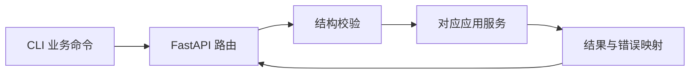

# 交互模块设计

[总设计](../../design.md) · [接口契约](../../contracts/module-interfaces.md#8-交互与生命周期)

交互模块把用户操作转换成应用服务调用。首版使用 FastAPI 提供 HTTP API，Typer 提供启动及薄 CLI；不包含前端和独立认证服务。

## 内部组织

| 组件 | 职责 |
| --- | --- |
| `routers/resources` | 五类资源 CRUD，交给配置应用服务；Workflow 写入转交 WorkflowService。 |
| `routers/runs` | 触发、查询、恢复、取消；不持有运行任务或阶段逻辑。 |
| `routers/artifacts` | 通过 ArchiveReader 读取固定阶段正文。 |
| `routers/system` | 插件能力、schema、健康与显式 reload。 |
| `schemas` / `errors` | 严格解析传输输入、统一 ErrorResponse 与 HTTP 状态。 |
| `cli` | 本地启动/配置样例；其余命令使用同一 HTTP API。 |

这些是建议包边界，不要求每项独立成类。API 依赖通过装配层注入，路由不导入具体 Collector、模型 SDK 或渠道实现。

## 请求路径

1. 校验 JSON、路径 ID、分页、固定 artifact 名称及未知字段。请求边界的结构校验不替代所属模块的业务校验。
2. 资源写入交由配置应用服务组织 schema、语义及引用校验；Workflow 定义交由 WorkflowService 校验后使用同一存储提交入口。
3. 触发/恢复返回 `202 + SessionRecord + Location`。运行由 Workflow 接管，HTTP 断开不取消已受理运行。
4. 查询直接使用只读服务；取消等待 Workflow 写回状态后返回。CLI 不轮询私有文件。

完整路径、状态码和响应形状以接口契约为准。`GET /api/plugins` 已返回 `CapabilityDescription` 中的 schema，无需另维护渠道 schema 路由或表单字段副本。固定路由优先于 `/{kind}/{id}`。

## 配置与错误

服务地址来自 SystemConfig；CLI 仅保存 API 地址及必要本地启动参数，不维护业务资源的第二份状态。离线配置样例只是用户可编辑输入，保存仍走正常校验入口。

422 表示配置可修正错误，409 表示引用/运行状态冲突，429 表示运行容量已满，503 表示必要依赖未就绪。未知错误返回脱敏 500 并保留可关联诊断。查询备份不存在或损坏时如实返回原因，不返回空白内容冒充成功。

## 验证要点

API 与 CLI 对同一无效配置返回相同原因；POST/PUT 的存在性约束在提交时成立；受理后客户端断开仍可查询运行；未知资源字段及非法 artifact 名称被拒绝；插件 schema 查询不执行采集、模型或通知。
