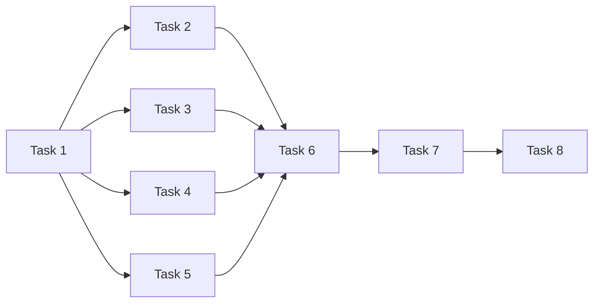

元信息

- 关联规范：[交互模块设计](./design.md)、[模块接口 §8](../../contracts/module-interfaces.md#8-交互与生命周期)、[数据模型](../../contracts/data-models.md)、[总体设计](../../design.md)。
- 任务总数：8。
- 预计执行时间：人工串行实现约 7 小时 45 分钟；各任务预计 45–75 分钟，独立路由可按依赖并发。
- 执行状态：全部未执行；本文件先于本模块实现建立。
- 执行策略：Task 1 完成后 Task 2–5 可并发，再实现薄 CLI。生命周期依赖使用 ApplicationLifecycle 契约和注入入口，本模块不等待具体装配实现；真实整机启动在 lifecycle 集成任务验收。

# Task 1: FastAPI 应用工厂、传输校验与错误封套

描述：建立注入应用服务的 FastAPI 工厂，实现统一请求解析和 ErrorResponse 映射。（预计 45 分钟）
输入：公开配置/运行模型、应用服务接口及生命周期公开契约。
输出：可独立创建的 API 应用、公共传输模型和错误处理器。
依赖：config 的严格公共资源模型；archive/workflow 的公共结果和错误语义；ApplicationLifecycle 接口契约。

验收标准：

- 路由通过注入依赖调用应用服务，不导入具体 Collector、模型 SDK、渠道实现或存档文件布局。
- JSON 公共字段、ID、枚举和数值严格校验，未知字段及非法路径 ID 返回 422 和字段原因。
- 错误封套统一为 ErrorResponse；配置、未找到、冲突、容量、未就绪和未知错误分别映射 422/404/409/429/503/500。
- 未预期错误只返回脱敏说明和可关联诊断，不回显堆栈、凭据、认证头或整份请求正文。

# Task 2: 五类资源 CRUD 路由

描述：实现 /api/{kind} 资源管理，Workflow 写入转交其业务服务。（预计 75 分钟）
输入：sources/setters/ai/channels/workflows 的请求及配置应用服务。
输出：符合契约状态码和存在性约束的资源 CRUD API。
依赖：Task 1；config 的资源应用服务、引用校验和 ResourceStore；workflow 的 validate/save。

验收标准：

- GET 列表和对象返回 200，POST 返回 201，PUT 返回 200，DELETE 返回 204 且无正文。
- POST 使用 create、PUT 使用 replace；重复 ID、缺失替换目标和并发存在性条件由提交边界保证，路由不以先查后写代替。
- PUT 路径 ID 与正文 ID 不一致返回 422；非法 kind 或直接定位不存在的对象有明确错误。
- 来源/Setter/AI/Channel 的语义校验由配置应用服务组织，Workflow 通过 WorkflowService 保存，被引用资源不能连带删除。
- 返回资源独立视图，不暴露解析后的凭据或绕过校验直接改写资源文件。

# Task 3: 运行触发、查询、恢复与取消路由

描述：实现 workflows/{id}/run 和 sessions 相关操作，运行任务归属 Workflow。（预计 60 分钟）
输入：Workflow/session ID、workflow_id 过滤和有界 limit。
输出：运行管理 API 和异步受理响应。
依赖：Task 1；workflow 的 trigger/resume/cancel；archive 的 get/list。

验收标准：

- trigger/resume 返回 202、SessionRecord 和 Location: /api/sessions/{id}，不接受临时业务配置覆盖。
- HTTP 请求结束或客户端断开后，已受理任务继续由 Workflow 管理且可通过查询取得状态。
- sessions 查询只接受有界正整数 limit，拒绝零、负数及超出公开上限的请求；使用存档规定的稳定倒序。
- cancel 等待状态写回后返回 200，容量不足为 429，禁用/活动恢复等冲突为 409，未就绪为 503。
- 路由不维护第二份活动任务表，不用 HTTP 后台任务替代 Workflow 的受控运行生命周期。

# Task 4: 固定阶段正文与缺失原因查询

描述：通过 ArchiveReader 提供 snapshot/collection/analysis/final 四类正文查询。（预计 45 分钟）
输入：session ID 和固定 ArtifactName。
输出：已核验的 ArtifactContent 或可理解的不可用原因。
依赖：Task 1；archive 的 load_artifact 与正文可用性错误语义。

验收标准：

- 每个合法名称返回与该名称相符的正文类型，读取始终经过 ArchiveReader 的索引、完整性和结构核验。
- 非法名称、路径分隔符及路径穿越输入在访问存档之前拒绝，名称不能解释成任意文件路径。
- 不存在 session 返回 404；已知 session 的正文关闭、未生成、缺失、过期、损坏或写入失败返回 409 并保留具体原因。
- 不用空字符串或空对象伪装正文成功，也不在查询中触发重采集、分析或自动恢复。

# Task 5: 插件能力、健康和 reload 路由

描述：实现固定系统路由，复用能力声明及生命周期入口。（预计 60 分钟）
输入：DiscoveryReport、能力描述、HealthReport 和 reload scope。
输出：GET /api/plugins、GET /api/health、POST /api/reload。
依赖：Task 1；config 的插件发现诊断；collection/channel 的 describe；ApplicationLifecycle 的 health/reload 契约及可注入实现。

验收标准：

- plugins 返回 DiscoveryReport 的 registered/errors 形状，包含既有 options_schema/setters_schema，不维护重复表单字段或渠道 schema 表。
- 固定路由优先于 /{kind}/{id}，plugins/health/reload/sessions 不被当成资源 kind 处理。
- ready/degraded 健康返回 200，必要依赖 unavailable 返回 503，并如实给出 accepting_runs。
- reload 默认 resources，只接受 resources/plugins；资源验证失败为 422、插件活动冲突为 409、必要能力不可用为 503。
- 查询插件或健康不触发 collect、付费模型、send 或插件重新发现，reload 仅在显式请求时调用。

# Task 6: 薄 CLI 的统一 HTTP 业务命令

描述：使用 Typer 实现资源、运行、阶段正文和系统查询命令，业务操作统一调用现有 HTTP API。（预计 60 分钟）
输入：API 地址、命令参数、资源 JSON 和统一 HTTP 响应。
输出：可脚本使用的业务 CLI 与共享 API 客户端。
依赖：Task 2、Task 3、Task 4、Task 5。

验收标准：

- 资源管理、触发、查询、恢复和取消各命令映射既有 API，不直接执行 Workflow 或读取存档私有文件。
- CLI 仅保存 API 地址和必要本地启动参数，不建立业务资源的第二份状态。
- 同一无效配置经 CLI 与 HTTP 得到相同业务原因；非成功响应和连接错误使用非零退出码并输出可理解说明。
- 运行受理输出 session ID 和查询位置，阶段正文按 API 可用性返回，不把 409 错误当成成功空内容。
- CLI 客户端等待有界，错误输出不包含凭据明文或认证请求头。

# Task 7: 本地启动与离线配置样例命令

描述：补齐 CLI 的本地职责，并将具体服务生命周期启动留给注入的装配入口。（预计 45 分钟）
输入：系统配置位置、样例目标位置、本地启动工厂和启动参数。
输出：服务启动命令和可编辑的离线配置样例。
依赖：Task 6；config 的 SystemConfig 与配置读取能力；ApplicationLifecycle/start 的本地启动入口契约。

验收标准：

- 启动命令按 SystemConfig 的地址/端口启动服务，并将启动和关闭交给装配入口，不复制生命周期次序。
- 离线样例使用 Mock 来源/AI/Channel 和合法字段，可以提交现有资源 API 完成正常验证。
- 样例生成不调用来源、模型或通知，不写入业务存储的私有文件，也不包含真实凭据明文。
- CLI 中断能调用注入的关闭入口；业务命令仍只通过 HTTP，不因本地服务可访问而绕过 API。

# Task 8: API 与 CLI 契约集成验收

描述：用本地测试应用和受控依赖验证路由、状态码及 CLI 一致性。（预计 75 分钟）
输入：全部路由、Typer CLI、真实业务服务或可控契约实现、临时存档。
输出：可重复的交互模块集成测试及验收记录。
依赖：Task 2、Task 3、Task 4、Task 5、Task 6、Task 7。

验收标准：

- 覆盖 CRUD 存在性约束、PUT ID 不匹配、引用冲突、非法公共字段/阶段名称和固定路由优先级。
- 触发后断开请求仍能查询受理运行；恢复材料不足返回 409，容量限制返回 429，必要依赖故障返回 503。
- 用同一资源 JSON 比较 CLI 与 API 的成功结果和错误原因，确认 CLI 不访问存档/资源私有路径。
- 插件/健康查询的外部采集、模型和发送调用计数为零；异常响应和 CLI 输出中没有注入的测试秘密。
- 四类 artifact 的正常/不可用响应、reload 的默认及非法 scope、CLI 非零退出码均符合公开契约；具体全服务启动由 lifecycle 的最终装配测试覆盖。
