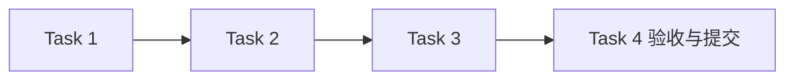

# 交互与首版验收模块任务

## 任务元信息

| 项目 | 内容 |
| --- | --- |
| 项目名称 | LogAgent v0.1 · 交互与首版验收 |
| 关联文档 | [proposal.md](./proposal.md)、[design.md](./design.md)、[总体设计](../../design.md) |
| 任务总数 | 4 |
| 前置模块 | 前六个模块全部验收提交 |
| 执行策略 | subagent 实施，主 agent 审查与验收；本模块测试通过并提交后进入下一模块 |
| 计划产物 | logagent/api.py、logagent/cli.py、logagent/app.py、main.py、examples/、tests/test_api.py、tests/test_cli.py、scripts/soak.py |
| 验证命令 | `rtk proxy uv run pytest tests/test_api.py tests/test_cli.py -q` |

## 任务列表

### Task 1：实现 FastAPI 与应用生命周期

描述：装配模块、插件、存档恢复扫描及调度；提供资源/插件/运行/备份 API 和可理解错误。

输入：本模块design；前六模块

输出：api.py、app.py；API测试

依赖：configuration、archive、collectors、ai、channels、workflow

验收标准：

- [ ] 创建/保存/触发之前完整校验，错误有正确状态码
- [ ] 异步触发真实状态可查询，取消/恢复及所有资源CRUD有效

### Task 2：实现薄 CLI 与离线示例

描述：Typer提供init/serve及HTTP调用；提供JSON样例、插件例子与可运行README。

输入：Task 1

输出：cli.py、main.py、examples/、README；CLI测试

依赖：Task 1

验收标准：

- [ ] init生成Mock采集→AI→文件通知样例，serve正确启动
- [ ] 业务CLI只发HTTP请求，不重复执行服务逻辑

### Task 3：完成跨模块端到端与构建检查

描述：执行样例、插件隔离、恢复、错误和服务关闭流程，验证包内入口与资源。

输入：Task 2；所有模块测试

输出：端到端测试、构建与使用记录

依赖：Task 2

验收标准：

- [ ] 全部首版模块测试通过，uv build成功，CLI帮助可用
- [ ] 运行记录、备份及通知内容完整且顺序正确

### Task 4：执行十分钟稳定性验收并提交首版

描述：持续运行离线Workflow至少600秒，记录CPU/RSS/磁盘/成功失败及未处理异常，再提交。

输入：Task 3

输出：scripts/soak.py、docs/validation/v0.1-soak.json；首版提交

依赖：Task 3

验收标准：

- [ ] 实际连续运行至少600秒且无未处理异常崩溃
- [ ] 报告是真实测量，24小时验证不伪标完成

## 执行顺序

推荐顺序：前置模块验收 → Task 1 → Task 2 → Task 3 → Task 4。无依赖的测试审查可并行，集成和提交按依赖顺序执行。

## 验收记录

尚未执行测试；完成后填写真实命令、结果与提交记录。
