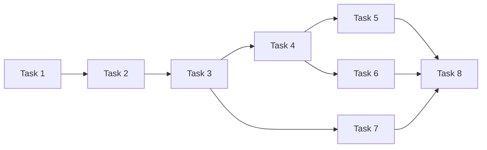

元信息

- 关联规范：[装配与生命周期设计](./design.md)、[总体设计 §5](../../design.md#5-非功能约束)、[模块接口 §8](../../contracts/module-interfaces.md#8-交互与生命周期)、[插件与健康模型](../../contracts/data-models.md)。
- 任务总数：8。
- 预计执行时间：人工串行实现约 8 小时 45 分钟；各任务预计 45–75 分钟，独立任务可按依赖并发。
- 执行状态：全部未执行；本文件先于本模块实现建立。
- 执行策略：按 DAG 执行；启动完成后，健康、关闭能力可分别推进，resources/plugins reload 可并发实现。interaction 使用生命周期公开契约和可注入启动入口，生命周期最终绑定具体实现，避免互相等待完整模块。

# Task 1: 装配上下文与依赖所有权

描述：建立 ApplicationLifecycle、依赖工厂和已取得资源清单，明确服务状态和调用方向。（预计 45 分钟）
输入：公开模块契约、构造工厂和共享运行准入协调接口。
输出：可注入的生命周期骨架、资源所有权记录及统一装配上下文。
依赖：config 的 SystemConfig；workflow 的准入协调契约；各模块公开接口与数据模型。

验收标准：

- 依赖经构造参数或显式工厂传入，装配层不导入业务模块私有状态或再建资源存储。
- 准入控制与活动数检查共用 workflow 的协调边界，避免装配层与运行服务持有不同计数。
- 已成功取得的资源有明确 owner 和逆序清理记录，构造到一半失败也能确定清理范围。
- 暴露 start/health/reload/stop 的契约形状，初始化完成前 accepting_runs=False。

# Task 2: 必要配置、凭据、诊断和存档启动

描述：实现启动的基础阶段，必要能力可用后才继续业务装配。（预计 75 分钟）
输入：系统配置位置、SystemConfig、配置/凭据/存档工厂和本地诊断输出。
输出：已初始化的配置存储、CredentialManager、ArchiveStore 和有界诊断资源。
依赖：Task 1；config 的 load_system 与 CredentialManager.initialize；archive 的管理存档初始化能力。

验收标准：

- 系统路径按系统配置文件基准解析，必要配置损坏或管理存档不可用时保持未就绪，不接受新运行。
- 凭据初始化使用配置模块既定主密钥规则，装配层不自行生成第二份密钥或回显解析值。
- 日志记录可关联时间、模块、事件和 session，使用容量/轮转边界；诊断不可用有独立健康或备用报告，不递归写日志。
- 基础启动只检查必要本地状态，不读取实际来源、不连接所有渠道、不请求模型。

# Task 3: 能力注入、业务装配与启动中断检查

描述：调用配置模块注册内置与外部插件，注入只读视图，装配业务服务及 API。（预计 75 分钟）
输入：已初始化基础依赖、内置能力、插件设置、资源视图及交互应用工厂。
输出：完整服务对象图、发布后的能力视图和可以开放的运行入口。
依赖：Task 2；config 的 PluginRegistry/资源加载；collection 的 mock/logs/history 与 CollectorManager；ai 的 AIService；channel 的 email/mock 与 ChannelManager；workflow 的 WorkflowService/IntervalTrigger；interaction 的可注入应用工厂；archive 的 mark_interrupted。

验收标准：

- 内置能力和外部插件均由配置模块注册；装配层不扫描插件目录、不解析 manifest、不维护第二份 owner/schema 表。
- collectorRegister/channelRegister 分别注入对应 Manager，注册记录中的类型、schema 和实现保持一致。
- 五类资源解析完成，已保存来源的插件缺失作为诊断保留，不删除资源或阻断该 Workflow 的后续 missing 策略。
- 在准入和定时触发开放前完成 mark_interrupted，仅标记遗留 created/running 记录，不自动恢复历史运行。
- 启动期间没有 collect/send/付费模型请求，Channel 不批量预连接；应用工厂接收已构造服务和生命周期入口。

# Task 4: 本地健康汇总与准入状态

描述：实现 health，以当前本地状态和已有诊断报告就绪程度。（预计 60 分钟）
输入：组件可用性、DiscoveryReport、生命周期状态、最近检查时间。
输出：HealthReport 与是否允许接收运行的判断。
依赖：Task 3；config/ archive 的必要能力状态及各模块已有诊断。

验收标准：

- 必要能力未就绪或关闭中返回 unavailable/accepting_runs=False；可选插件失败且必要能力可用时可 degraded 并继续准入。
- 组件分别给出 required、状态、checked_at 和脱敏原因，未检查远端标为 unknown，不把实例已初始化当作远端已连通。
- health 不调用 collect、AI execute、Channel send，也不发送探测邮件或启动后台健康监听。
- 后续成功检查能清除过时故障结论；单条历史业务失败和容量暂满不使整个服务永久 unavailable。

# Task 5: 资源 reload 与未来计划刷新

描述：协调 resources reload，成功后刷新未来定时计划。（预计 60 分钟）
输入：scope=resources、资源 JSON 和当前有效配置视图。
输出：更新后的有效资源视图及 HealthReport。
依赖：Task 3、Task 4；config 的 ResourceStore.reload_resources；workflow 的定时计划更新能力。

验收标准：

- 无 scope 时采用 resources；候选资源完整校验通过后才发布，校验失败返回可修正原因并保留旧有效视图。
- 成功 reload 后新触发取得新配置，活动和历史 session 仍使用原快照。
- Workflow enabled/interval 更新只重建未来计划，不隐式取消活动运行、不集中补跑历史时点。
- 系统路径、监听地址和全局运行上限不由 reload 更换，插件代码不在资源 reload 中重新导入。

# Task 6: 插件 reload、活动冲突与卸载

描述：在同一准入协调边界中暂停触发、确认无活动运行，再调用配置模块重新发现插件。（预计 75 分钟）
输入：scope=plugins、当前活动状态、PluginRegistry 和已发布只读能力视图。
输出：新能力视图、DiscoveryReport 和恢复后的健康/准入状态。
依赖：Task 3、Task 4；config 的 PluginRegistry.reload_plugins；workflow 的原子准入暂停与活动检查；collection/channel 的注册视图重新注入能力。

验收标准：

- 先原子关闭新准入并暂停定时触发，再检查活动数；并发 trigger 不能穿过检查与 reload 的间隙。
- 存在活动运行返回冲突且不取消运行，并按必要能力和原生命周期状态恢复适当准入与调度。
- 清理 owner、导入入口和注册发布均交给配置模块；装配层只替换两个已发布视图，不重建注册内容。
- 单插件失败被隔离，其他有效能力仍可服务；卸载后的全部旧类型/schema/工厂不再可见。
- reload 不删除保存资源或历史快照，不自动恢复 session，也不宣称能回滚任意 Python 插件导入副作用。

# Task 7: 有界关闭与失败启动回收

描述：实现可重复 stop，以及各启动阶段失败时的逆序回收。（预计 75 分钟）
输入：活动 Workflow、调度句柄、已取得资源清单及清理超时。
输出：停止接收任务后的干净关闭或可诊断清理结果。
依赖：Task 3；workflow 的 shutdown；ai 的客户端关闭能力；channel 的 stop；config 的插件资源释放能力；archive 的关闭能力。

验收标准：

- 关闭先禁止新触发并停止调度，再等待或取消活动 Workflow，最后逆序释放模型、渠道/插件和存档资源。
- ChannelManager 的当前 send 完成有界清理后才被释放，未保存的回执不报告成功。
- 每一步清理有期限且重复 stop 安全；单个清理失败仍继续回收其他资源，原始启动或业务错误得到保留。
- 对启动各阶段注入异常后，已取得资源恰好得到必要回收，不留下无所属后台任务或文件句柄。
- 阻塞线程/SDK 使用实际 I/O 时限，不将取消 async 包装宣称为已经强制结束底层线程。

# Task 8: 生命周期与依赖装配集成验收

描述：以真实临时配置/存档和离线能力验证启动、reload、健康及关闭。（预计 60 分钟）
输入：临时目录插件、可控依赖工厂、interaction API/CLI 入口及 Mock Workflow。
输出：生命周期集成测试和可复现的本地启动烟测。
依赖：Task 4、Task 5、Task 6、Task 7；interaction 的应用工厂和本地启动命令。

验收标准：

- 有效启动能通过 API 触发一次 Mock 运行并查询终态，停止后没有未回收任务。
- 用目录插件验证多能力发布与注入；重复 ID/key、kind 不符、入口越界、导入错误、无效 defaults 和部分注册失败均不泄漏无效声明。
- 并发 trigger/plugins reload 的事件同步测试证明活动冲突及原子准入，失败 reload 不改变历史快照。
- 资源 reload 失败保留旧视图、成功刷新未来计划；系统重启专属参数保持不变。
- 必要依赖失败、可选插件降级、后续恢复及重复 stop 的健康结果符合契约，所有场景不调用真实外部模型或通知平台。
