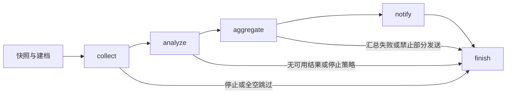

# Workflow 模块设计

[总设计](../../design.md) · [接口契约](../../contracts/module-interfaces.md#7-workflow) · [运行数据](../../contracts/data-models.md#3-workflow-配置)

Workflow 拥有跨来源和跨任务的编排规则。来源如何查询、模型如何请求、通知如何传输、正文如何存储分别由对应模块提供能力。

## 内部组织

| 组件 | 职责 |
| --- | --- |
| `WorkflowService` | validate/save/trigger/wait/resume/cancel/shutdown 应用入口。 |
| `RunCoordinator` | 容量、活动任务句柄、快照、session 及图执行生命周期。 |
| `CollectionOrchestrator` | 来源并发、失败策略、声明顺序、共享输入。 |
| `AnalysisOrchestrator` | 分支并发、结果排序、可选汇总。 |
| `NotificationOrchestrator` | 冻结输出、按输出与目标顺序发送、逐条记账。 |
| `IntervalTrigger` | 定时产生 trigger 调用，复用手动入口规则。 |

编排器可以实现为函数。依赖注入 CollectorManager、AIService、ChannelManager、资源服务及 ArchiveStore，不读取它们的私有状态。

## LangGraph 执行图

首版以 LangGraph 的异步 StateGraph 包装固定业务阶段。阶段内部使用协程和各自 semaphore 处理有限 fan-out，无需为每个来源动态生成一套持久化图。

图状态包含 session_id、原快照、当前阶段、阶段结果与取消状态。分支按 task_id 写入结果映射，结束后再按定义中的顺序排列，避免完成顺序改变输出。

SessionRecord 与 artifact 是持久化事实的唯一来源。首版不使用独立 LangGraph checkpointer、持久化任务队列或节点自动重试；恢复先读取存档再构造图输入，避免图重放重复发送。后续替换执行器时保持应用入口和阶段函数不变。

## 准入、定义与定时触发

定义保存先解析来源/Setter/AI/目标，再检查 fan-in 引用和策略，交由资源提交入口原子保存。新运行只接受已保存 Workflow ID，不接受临时业务覆盖。

RunCoordinator 在建档前占用 `max_concurrent_runs` 名额，容量不足直接报错；成功后固定配置快照、创建 session 并启动受控任务。建档失败释放名额，不留下“已受理但无人执行”的运行。`created` 是异步启动前的短暂状态，不表示等待队列。

定时间隔从服务启动或计划更新时重新计算，只对 enabled 定义生效；同一 Workflow 已活动或容量不足时记录本次跳过，下一周期继续，不积攒补跑。手动并发仍受全局上限约束。资源变更只影响新运行。

## 采集与共享输入

1. 按 sources 声明创建单来源协程，在 collection_concurrency 内执行。Manager 返回真实状态与处理后 count。
2. failed/timeout、missing、empty、filtered_empty 分别应用来源对应策略；停止策略阻止下游，已有结果仍记录。
3. 成功来源按声明顺序排列，以 input_separator 拼接；include_counts 开启时附带各来源状态和处理后计数，不能把计数说明当成有效内容。
4. 无有效来源文本时应用 on_all_empty：stop 失败；skip 结束且不调用 AI/通知。夹有被跳过错误的运行仍保留 partial 事实。
5. 生成一份 CollectionArtifact；后续全部分析分支读取同一个 shared_input 字符串。

备份失败先记录 write_failed，再按 backup.on_failure 停止或继续；管理记录无法保存时停止后续外部操作。

## 分支与汇总

分析按 analysis_concurrency 并发调用 AIService，每个任务带自己的 prompt 和 AIConfig。完成一个分支即可更新管理事实、按策略增量保存分析 artifact；保存调用由协调器串行合并，防止两个分支覆盖彼此。一个分支失败不取消其他分支。

analysis_failure=stop 在已开始分支收束后阻止汇总/通知；continue 允许使用成功分支。无成功分支则失败。send_partial=False 时存在分支缺失就不发送；结构化失败始终保留。

fan-in 关闭时，按分支声明顺序生成输出，output_id 为 task_id。开启时按照 fan_in.order 拼接，空 order 表示全部分支声明顺序；`$input` 至多出现一次并代表完整 shared_input。缺失分支按 mark_incomplete 决定是否在正文标明。

fan-in.ai 为空时拼接结果就是最终正文；非空时使用汇总 prompt 再调用一次 AIService。汇总失败不得改发纯拼接内容或分支内容。汇总输出使用稳定 ID `final`。

## 通知

冻结有序 Notification 列表，按备份策略保存 FinalArtifact，在首次发送前写入 output_frozen。通知循环是 `for output -> for channel -> await send(snapshot_channel, output) -> save receipt`，没有独立后台发送器。

一次 send 对一个目标至多尝试一次。目标失败继续其他允许目标；禁用目标记录 skipped。回执与错误保存在 SessionRecord，成功和 delivery_uncertain 事实不得覆盖成未发送。无 channel 时只生成输出，正常结束。

## 取消与恢复

cancel 设置协作取消并取消当前可取消调用，收束任务后写回 cancelled；后续阶段及目标不再启动。只取消 wait 的等待者不会取消运行。收尾以 finally 释放容量与任务句柄。

| 恢复入口 | 执行范围 |
| --- | --- |
| 已保存共享输入，尚未冻结 | 复用成功分支正文，只执行失败或未执行分支，再按原定义进入汇总。 |
| 已成功汇总，尚未通知 | 复用确定的汇总正文，不重新请求模型。 |
| 已冻结且 snapshot/final 可用 | 只继续发送原正文，跳过成功及已知不确定投递。 |
| 必要正文缺失、过期、损坏 | 明确说明依赖材料，拒绝对应续跑，不重新采集补齐旧输入。 |

恢复保持原 session ID、快照与创建时间；活动/已完成无待办运行拒绝恢复。原输入尚未保存且采集已中断时，用户需触发新 session。硬崩溃可能发生于平台接收后、回执写入前，缺少回执不能证明未发送；首版不承诺跨平台恰好一次。

## 验证要点

覆盖乱序完成仍有序输出、完整共享输入、全空与失败状态、分支/汇总失败策略、逐条回执、容量满、取消及上述恢复材料组合。用 Mock Collector、AI、Channel 验证完整阶段路径，确认 LangGraph 不额外重试节点。
