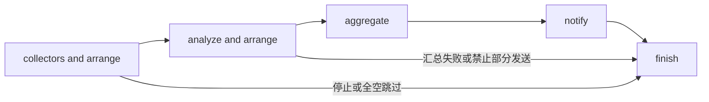

# Workflow 模块设计

[总设计](../../design.md) · [接口契约](../../contracts/module-interfaces.md#7-workflow) · [运行数据](../../contracts/data-models.md#3-workflow-配置)

Workflow 拥有跨来源和跨任务的编排规则，以 LangGraph 管理执行进度，并由运行时节点维护独立的只读 session 业务内容。来源如何查询、模型如何请求、通知如何传输分别由对应模块提供能力。

## 内部组织

| 组件 | 职责 |
| --- | --- |
| `WorkflowService` | validate/save/trigger/recover/cancel/shutdown 应用入口，暴露 session 查询能力。 |
| `RunCoordinator` | session 的容量、任务句柄、快照及 LangGraph 执行生命周期。 |
| `SessionStore` | 接收图节点的幂等业务写入，保存原快照、阶段结果、状态摘要、意图及回执，不承担图调度。 |
| `SessionView` | 从 SessionStore 查询 session 列表、状态、历史版本和正文可用性，供 API 与历史 Collector 共用。 |
| 存档节点工厂 | 通过闭包绑定阶段、逻辑作用域、条目标识及结果选择器，供父图和子图复用。 |
| `CollectionOrchestrator` | 来源并发、失败策略、声明顺序、共享输入。 |
| `AnalysisOrchestrator` | 分支并发、结果排序、可选汇总。 |
| `NotificationOrchestrator` | 冻结输出、按输出与目标顺序发送、逐条记账。 |
| `IntervalTrigger` | 定时产生 trigger 调用，复用手动入口规则。 |

编排器可以实现为函数。依赖注入 CollectorManager、AIService、ChannelManager、资源服务、SessionStore 和 SQLite checkpointer，不读取它们的私有状态。SessionView 是 Workflow 内的只读查询实现，可通过窄接口注入历史 Collector，无需让采集模块反向依赖 WorkflowService 或 LangGraph 存储结构。

## 调用层配置

sources/channels 保留有序 ID 引用；source_overrides[id] 包含 options、setters、可选 template，channel_overrides[id] 包含 options。默认空对象表示无覆盖；显式空列表覆盖同名值。遵循[Manager 四层设计](../manager%20design.md)，配置模块统一解析、校验并固定有效快照，执行/恢复只使用快照。

## LangGraph 执行图

首版以 LangGraph 的异步 StateGraph 包装固定业务阶段。阶段内部使用协程和各自 semaphore 处理有限 fan-out；每个 session 使用持久化 graph/checkpoint，支持状态展示、历史读取和未完成运行恢复。

collectors和analyze可以是多个，采用fan-out——fan-in架构，aggregate可以选择指定AI model，也可以为空

collectors and arrange和analyze and arrange分别采用采用子图设计

图状态包含 session_id、执行代次、当前阶段、取消状态以及快照和结果的存档引用。分支按 task_id 保存引用，结束后按定义顺序读取并排列，避免完成顺序改变输出；正文和运行时依赖不重复塞进控制状态。

## session 持久化、展示与恢复

采用 LangGraph SQLite checkpointer 管理执行进度；SessionStore 管理供展示、历史读取和恢复使用的业务内容。session_id 对应 thread_id；父图编译时注入 checkpointer，采集与分析子图继承它，checkpoint namespace 只表达内部执行位置。运行时客户端、任务句柄和解密凭据不进入任一持久化存储。

SessionView 只查询 SessionStore，不枚举 checkpoint；每个 session 一条摘要，使用独立的 version 固定历史版本。它提供 list_sessions、get_session 和阶段内容查询，包含状态、时间、错误、结果和备份可用性。API 和历史 Collector 共用这一实现，对外不提供 session 写入或前端。

### 可复用、幂等的存档节点

父图的快照、共享输入、汇总、通知意图/回执及终态，与子图的逐来源/逐分析结果，均通过同一存档节点工厂写入。工厂返回异步闭包，绑定 `store`、`scope`、`stage`、`key` 和内容选择函数；差异用参数表达，不为每个子图复制存档代码。可以把执行函数注入同一节点包装器，在完成业务动作后立即等待存档事务，再返回控制状态/内容引用；已有成功内容先读取复用，避免重放再次调用业务动作。

幂等键使用 session、稳定逻辑作用域、阶段、条目、事件和必要的执行代次，不依赖本次调用时间或重新生成的 checkpoint ID。相同键及相同内容返回原 version，不添加历史、不回退状态；不可变内容冲突明确报错。分支只写自身条目，父图负责整体状态。摘要、正文引用、内容可用性和新增 version 在同一 SessionStore 事务发布；并发分支不能丢失彼此结果。

SessionStore 与 checkpointer 不承诺跨存储原子提交。节点先等待业务存档提交，再返回交由 LangGraph 保存执行进度；存档成功后进程退出，重放相同节点须读取已有内容并幂等收敛。图使用同步 checkpoint 持久化边界；仍须实测逐项保存与强退窗口，不能把整个 fan-out 完成当作唯一保存点。

通知使用稳定的输出/目标键：先独立存档发送意图并确认事务提交，再进入 send，随后立即保存回执。成功回执直接复用；发现意图却没有确定回执则保存 delivery_uncertain，不自动补发。关闭正文备份也不得删除这些管理事实。

### 备份、恢复与取消

BackupPolicy 控制原快照、采集/共享输入、分析分支及最终输出。图控制状态尽量仅含内容引用；未保存正文由当前运行的内存上下文持有，重启后明确不可用。正文不得通过父子 checkpoint、pending writes、错误或 metadata 绕过开关。终态过期清理覆盖业务存储全部历史版本，保留摘要、幂等键和 expired 原因；重复节点不能重新插入已到期内容。

recover(session_id) 在同一 session 的互斥边界内验证原 checkpoint、原快照和必要内容，从原 thread_id 继续。缺少 checkpoint 不根据 SessionStore 的阶段标签猜测下一节点；缺少正文不重新采集或重跑成功分析补齐。输出冻结后只继续原内容投递。存档管理事实失败立即停止新外部操作；正文保存失败先记录 write_failed，再按 backup.on_failure 停止或继续。

RunCoordinator 持有 session 任务；手动与定时触发共用容量、快照和取消规则，触发返回 session 标识，内部 wait 等待结果。HTTP 只转交取消指令，生效后不启动新的模型或通知操作。启动将遗留 created/running 标记 interrupted，不自动恢复；取消、中断与恢复的可读事件也复用运行时存档入口，保留明确事件身份，不能向 API 暴露 writer。

## 验证要点

验证父子图使用相同存档闭包、同键重复写入不增加 version、冲突与并发写入、存档提交后 checkpoint 提交前强退、成功分支不重跑、意图已保存但回执未知时不补发。验证 API/history 使用同一只读 SessionView 且不依赖 checkpoint 表、固定 version、备份关闭/到期实际删除、缺少 checkpoint 拒绝恢复、独立 HTTP 取消定时运行。保留用户指定的 M/A/T 图及所有失败/空/汇总策略。
