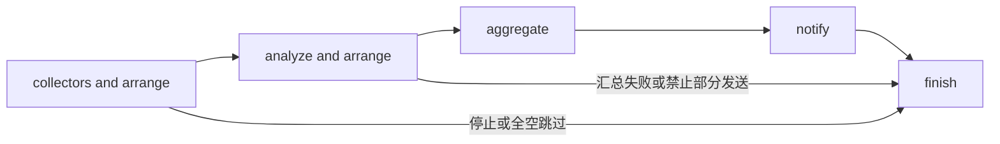

# Workflow 模块设计

[总设计](../../design.md) · [接口契约](../../contracts/module-interfaces.md#7-workflow) · [运行数据](../../contracts/data-models.md#3-workflow-配置)

Workflow 拥有跨来源和跨任务的编排规则，并用 LangGraph 管理 session 的持久化、展示和恢复。来源如何查询、模型如何请求、通知如何传输分别由对应模块提供能力。

## 内部组织

| 组件 | 职责 |
| --- | --- |
| `WorkflowService` | validate/save/trigger/recover/cancel/shutdown 应用入口，暴露 session 查询能力。 |
| `RunCoordinator` | session 的容量、任务句柄、快照及 LangGraph 执行生命周期。 |
| `SessionView` | 从 LangGraph checkpoint 投影 session 列表、状态、阶段结果和备份可用性，供 API 与历史 Collector 共用。 |
| `CollectionOrchestrator` | 来源并发、失败策略、声明顺序、共享输入。 |
| `AnalysisOrchestrator` | 分支并发、结果排序、可选汇总。 |
| `NotificationOrchestrator` | 冻结输出、按输出与目标顺序发送、逐条记账。 |
| `IntervalTrigger` | 定时产生 trigger 调用，复用手动入口规则。 |

编排器可以实现为函数。依赖注入 CollectorManager、AIService、ChannelManager、资源服务和 SQLite checkpointer，不读取它们的私有状态。SessionView 是 Workflow 内的只读查询实现，可通过窄接口注入历史 Collector，无需让采集模块反向依赖 WorkflowService 或 LangGraph 存储结构。

## LangGraph 执行图

首版以 LangGraph 的异步 StateGraph 包装固定业务阶段。阶段内部使用协程和各自 semaphore 处理有限 fan-out；每个 session 使用持久化 graph/checkpoint，支持状态展示、历史读取和未完成运行恢复。

collectors和analyze可以是多个，采用fan-out——fan-in架构，aggregate可以选择指定AI model，也可以为空

collectors and arrange和analyze and arrange分别采用采用子图设计

图状态包含 session_id、原快照、当前阶段、阶段结果与取消状态。分支按 task_id 写入结果映射，结束后再按定义中的顺序排列，避免完成顺序改变输出。

## session 持久化、展示与恢复

采用 LangGraph SQLite checkpointer。session_id 作为 thread_id；父图编译时注入 checkpointer，两个子图继承它，并由 LangGraph 的 checkpoint namespace 区分内部进度。持久化的是状态与执行进度，运行时客户端、任务句柄和解密凭据不进入 checkpoint。

SessionView 提供 list_sessions、get_session 和阶段内容查询：展示 Workflow/session 标识、状态、当前阶段、时间、错误、结果与备份可用性。通过 LangGraph 状态读取及 checkpoint 枚举能力实现，按 thread_id 汇总父图最新状态，不能把子图或每个历史 checkpoint 当作另一次运行。API 与历史 Collector 复用这份只读实现；展示指数据查询，本期不增加前端。

备份策略约束所有 checkpoint 和待提交写入的正文范围；关闭某阶段备份时，正文仅服务当前运行，查询返回未保存原因。终态过期清理包含父图、子图和历史 checkpoint 中的对应正文，保留 session 摘要及不可恢复原因。查询不得把缺失或过期正文当作正常空结果。

recover(session_id) 在同一 session 的互斥边界内检查原快照和必要内容，随后使用原 thread_id 继续 LangGraph 执行；缺失材料则说明不能恢复的阶段。分支结果和通知回执需在对应工作的持久化边界保存，不能只在整个 fan-out 或 notify 结束后保存。成功分析和成功投递不重复执行；通知调用前保存发送意图，意图存在但没有确定回执时标记 delivery_uncertain，不自动补发。输出冻结后恢复只继续原输出的投递。

RunCoordinator 以 session_id 管理活动任务；手动触发和定时触发共用同一入口。HTTP 只转交取消指令，取消不绑定原请求，生效后不启动新的模型或通知操作。进程重启时，将没有活动任务的遗留 created/running 状态标记为 interrupted，不自动恢复。

## 验证要点

验证父子图持久化和重启恢复、session 列表去重、API 与历史采集查询一致、备份关闭及过期后的实际可用性、成功项不重复执行、不确定投递不补发，以及从独立 HTTP 请求取消定时运行。
