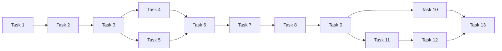

元信息

- 关联规范：[Workflow 模块设计](./design.md)、[总体设计](../../design.md)、[数据模型](../../contracts/data-models.md)、[模块接口 §7](../../contracts/module-interfaces.md#7-workflow)。
- 任务总数：13。
- 预计执行时间：人工串行实现约 15 小时；各任务预计 60–75 分钟，独立任务可按依赖并发。
- 执行状态：全部未执行；本文件先于本模块实现建立。
- 执行策略：按 DAG 执行；Task 4 与 Task 5 可并发，Task 10 与恢复任务可并发。跨模块依赖指已经验收的接口产物，不要求上游无关能力全部实现。

# Task 1: 定义校验与原子保存入口

描述：实现 WorkflowService 的 validate/save，组织资源解析及业务校验。（预计 60 分钟）
输入：WorkflowDefinition；保存模式；配置模块提供的候选快照和资源提交入口。
输出：可独立调用的定义校验、创建、替换和更新入口。
依赖：config 的严格资源模型、ResourceStore.resolve/save；collection 的 CollectorManager.validate；ai 的 AIService.validate；channel 的 ChannelManager.validate。

验收标准：

- 来源、Setter 归属、AI、Channel 引用及全部展开配置经所属模块验证，validate 不执行 collect、模型请求或 send。
- 拒绝重复来源/任务/目标、不存在的 fan-in 分支、重复 `$input`、非法并发数和未知公共字段，并给出可定位的字段原因。
- create 已有 ID、replace 不存在 ID 和引用冲突由同一提交边界检查；失败保留原有效定义。
- 保存的是可复用定义，trigger 的输入契约仅允许已保存 Workflow ID，不增加临时配置覆盖入口。

# Task 2: 运行准入、快照与任务归属

描述：实现 RunCoordinator，管理容量、受控异步执行句柄和运行接管；提供装配层可注入的准入协调能力。（预计 75 分钟）
输入：已保存 Workflow ID；系统并发上限；阶段执行回调；配置和存档依赖。
输出：trigger/wait 基础入口、活动运行登记及共享准入控制接口。
依赖：Task 1；config 的 ResourceStore.snapshot；archive 的 ArchiveStore.create/get/update。

验收标准：

- 在建档前原子占用名额；并发触发超过上限返回容量错误，不建立排队 session。
- 不存在或禁用定义不能触发；快照不重新校验插件可用性，已保存来源的 Collector 缺失仍能建档。
- 快照、建档或受控任务启动失败均释放名额，不留下无人接管的 created 运行；终态通过 finally 释放容量和句柄。
- 每次运行只使用独立的原快照，后续资源变更不影响本次输入、模型或通知目标。
- wait 返回最新终态记录，取消等待者不取消运行；装配层的暂停准入和活动数检查复用同一协调边界，不读取私有任务表或维护第二份计数。

# Task 3: 阶段事实提交与备份失败策略

描述：实现阶段记录协调、单 session 串行合并及最终业务状态归纳。（预计 60 分钟）
输入：当前运行状态、来源/分析/投递结果、阶段正文及 BackupPolicy。
输出：统一的阶段提交函数、备份降级处理和终态计算函数。
依赖：Task 2；archive 的 update/save_artifact 及 write_failed 可用性语义。

验收标准：

- 来源和分支按标识合并管理事实；并行分析的增量正文提交不会用旧副本覆盖已经保存的分支。
- 正文写入失败先保留 write_failed 事实，再执行 backup.on_failure；continue 保留备份降级，stop 阻止下一阶段。
- 主动关闭备份或排除阶段不会单独导致业务失败；管理记录写入失败后不再开始模型或通知操作。
- completed、partial、failed 的归纳区分正常全空跳过、允许继续的局部错误和必要阶段失败。
- 阶段诊断关联 workflow/session/来源/任务，保留可解释原因，不在 errors 或 metadata 复制完整正文和凭据。

# Task 4: 来源并发、策略与完整共享输入

描述：实现 CollectionOrchestrator，将单来源事实编排为一份 CollectionArtifact。（预计 75 分钟）
输入：WorkflowSnapshot、CollectionContext 依赖和来源执行结果。
输出：按声明顺序保存的来源结果、唯一 shared_input 及是否继续的阶段决策。
依赖：Task 3；collection 的 CollectorManager.collect；archive 的 ArchiveReader；config 的凭据解析能力与固定日志路径。

验收标准：

- 来源调用不超过 collection_concurrency，为 1 时实际串行；完成顺序不同不改变最终来源排列。
- failed/timeout、missing、empty、filtered_empty 分别执行对应 stop/skip 策略，保留真实状态和处理后 count。
- 仅成功的有效文本参与拼接；include_counts 只附带状态与处理后计数，计数说明不能使全空输入变成有效内容。
- on_all_empty=stop 时失败，skip 时不调用 AI 或通知；合法全空可 completed，混有被跳过错误时保留 partial。
- 每个来源仅接收自己的快照配置与运行依赖，CollectionArtifact.results 同时保存成功和失败事实。

# Task 5: 并行分析与增量结果保存

描述：实现 AnalysisOrchestrator 的 fan-out 部分，独立于具体图节点验证并发与失败规则。（预计 75 分钟）
输入：契约形状的 CollectionArtifact、分支定义和快照中的 AIConfig；开发时可使用固定共享输入夹具。
输出：AnalysisArtifact 和分支阶段决策。
依赖：Task 3；ai 的 AIService.execute；archive 的分析正文保存能力。

验收标准：

- 所有分支接收完全相同的 shared_input 字符串，各分支只使用自己的 prompt 和快照 AIConfig。
- 调用数量受 analysis_concurrency 限制，为 1 时串行；结果按任务声明顺序输出，已完成分支可增量保存。
- 单个分支失败不取消其他分支；analysis_failure=stop 在已开始分支收束后阻止下游。
- continue 只使用成功分支，无成功分支时失败；失败/超时/取消结果不伪造分析正文。
- 不覆盖 AIConfig 中的 timeout/retries，也不由 Workflow 图额外重试已经执行的模型请求。

# Task 6: 可选汇总与稳定输出标识

描述：实现 fan-in 拼接、可选汇总模型调用和输出形成规则。（预计 60 分钟）
输入：共享输入、AnalysisArtifact、FanInConfig 及发送部分结果策略。
输出：有序确定输出及可选汇总 AnalysisResult。
依赖：Task 4、Task 5；ai 的 AIService.execute。

验收标准：

- fan-in 关闭时按成功分支声明顺序输出，output_id 等于 task_id；开启时输出 ID 固定为 final。
- fan_in.order 为空时按分支声明顺序，`$input` 作为完整共享输入一次插入；配置的 separator 生效。
- mark_incomplete 控制正文标记但不删除结构化失败；send_partial=False 时有缺失分支就不进入通知。
- 无汇总 AI 时采用确定拼接正文；有汇总 AI 时必须取得成功分析，失败不得发送拼接内容或改为各分支输出。
- 汇总只使用原快照 AIConfig，不因配置更新改变模型、提示词或预算。

# Task 7: 冻结最终输出并逐条发送记账

描述：实现 NotificationOrchestrator，在不可改写输出边界之后按顺序投递。（预计 75 分钟）
输入：有序确定输出、快照 ChannelConfig、BackupPolicy 和存档提交能力。
输出：FinalArtifact、output_frozen 和各输出/目标的 DeliveryResult。
依赖：Task 3、Task 6；channel 的 ChannelManager.send 与取消结果约定；archive 的冻结和回执保护能力。

验收标准：

- 首次 send 前先形成完整 FinalArtifact，并成功记录 output_frozen；备份或管理记录失败按既定策略阻止不允许的发送。
- 严格按 output 外层、channel 内层的顺序 await send，每条回执返回即保存后再开始下一条。
- 每个目标每次调用最多一次发送；禁用目标记录 skipped，目标失败不抹去其他已完成回执，无目标时输出仍正常完成。
- 成功回执及 error.details.delivery_uncertain 事实不可覆盖为未发送，也不自动重试不确定投递。
- 通知标题、正文和目标均取当前运行确定内容及原快照，更新可复用 Channel 资源不能改变已受理运行的收件目标。

# Task 8: LangGraph 阶段图装配

描述：以异步 StateGraph 连接已有编排函数，保持持久化事实只有 session 和 artifact。（预计 60 分钟）
输入：RunCoordinator、阶段函数、阶段决策和图状态。
输出：collect → analyze → aggregate → notify → finish 的可执行图。
依赖：Task 2、Task 4、Task 5、Task 6、Task 7。

验收标准：

- 成功运行完整经过固定阶段；采集停止/全空、分析停止和汇总失败分别直接进入 finish。
- 图状态只持有所需原快照、阶段结果与取消信息，不引入持久化 checkpointer、第二套 session 或隐式任务队列。
- 图节点只调用所属阶段函数，不复制来源、模型、平台和存档私有逻辑。
- 用调用计数验证 LangGraph 不自动重试节点，阶段跳转不会重复 collect、AI execute 或 send。

# Task 9: 取消、等待与 Workflow 关闭

描述：完成协作取消、当前 I/O 收束和可重复 shutdown。（预计 75 分钟）
输入：运行 ID、取消请求、当前阶段句柄及模块清理结果。
输出：cancel/shutdown 入口与可靠的 cancelled 收尾。
依赖：Task 8；collection/ai/channel 的取消及有界清理语义。

验收标准：

- cancel 等待 cancelled 状态写回后返回，已取消时幂等，其他不可取消终态返回冲突。
- 取消生效后不启动新的来源、模型请求或通知目标，已开始的可取消调用得到取消并完成所属清理。
- 发送期间取消时先保存已知成功或 failed + delivery_uncertain 回执，再结束 session；不新增 CollectionStatus.cancelled 或 DeliveryStatus.cancelled。
- 单独取消 wait 等待者不会终止运行；重复 shutdown 不重复释放资源，不遗留无所属任务。
- 取消、阶段异常、管理记录故障和 shutdown 路径均释放运行容量，清理错误不覆盖原始业务错误。

# Task 10: 定时触发与计划更新

描述：实现归属明确的 IntervalTrigger，复用手动触发和准入规则。（预计 60 分钟）
输入：已保存 Workflow 定义、计划更新时间、共享准入控制接口。
输出：可启动、暂停、更新和关闭的定时计划。
依赖：Task 2、Task 9；config 的有效定义变更通知或完整资源视图。

验收标准：

- 从服务启动或计划更新时重新计算间隔，仅 enabled 且有 interval_seconds 的定义产生触发。
- 同 Workflow 已受理/活动或全局容量不足时记录本轮跳过，下一周期再判断，不累积补跑。
- 修改间隔或禁用只改变未来计划，不取消已经受理的运行；手动触发仍复用容量和 enabled 检查。
- 插件 reload 的暂停和关闭能停止新定时触发，重复更新不会建立多个同名后台调度任务。

# Task 11: 冻结前恢复与材料校验

描述：基于存档事实构建恢复计划，复用原输入和成功分支，只推进仍待执行的分析或汇总。（预计 75 分钟）
输入：待恢复 session、原快照、ArtifactAvailability 及已核验阶段正文。
输出：冻结前 resume 计划和运行接管能力。
依赖：Task 8、Task 9；archive 的 get/load_artifact/availability。

验收标准：

- 仅接受有待办的 failed/partial/cancelled/interrupted 记录，活动记录及无待办终态返回冲突；恢复同样受容量上限限制。
- 沿用原 session ID、created_at 和快照，不用最新资源替代原配置。
- 分支恢复要求原共享输入及全部成功分支正文，只执行失败或未执行分支，成功分支不重复请求模型。
- 未完成汇总按所需材料恢复；引用 `$input` 时必须有原共享输入，已成功汇总不得静默重跑。
- 输入或成功正文缺失、过期、损坏时说明依赖材料并拒绝对应续跑，不重新采集或用重新分析补成历史正文。

# Task 12: 冻结后恢复与投递不确定性

描述：实现只使用冻结正文的投递恢复路径，并复用已经确定的成功汇总。（预计 75 分钟）
输入：原快照、FinalArtifact、冻结标记和已持久化回执。
输出：仅包含可安全继续目标的恢复执行计划。
依赖：Task 7、Task 9、Task 11；archive 的正文完整性与冻结保护能力。

验收标准：

- 冻结后原快照和 final 可用即可判断投递恢复，不额外要求 collection/analysis 仍有备份。
- 只对明确失败或尚未发送且可安全继续的项执行发送，跳过成功和已知 delivery_uncertain 的投递。
- 通知内容、输出顺序、output_id 和快照目标保持不变，不再调用 Collector 或 AI。
- final 缺失或损坏时拒绝补发；recoverable=True 仍须经过待办和安全范围判断，不能直接作为执行许可。
- 已成功汇总但尚未通知时复用原汇总正文；恢复结果保留历史不确定性诊断，不宣称跨平台恰好一次投递。

# Task 13: 编排与恢复边界集成验收

描述：用离线 Collector、AI、Channel 及故障注入验证主要 DAG 路径。（预计 75 分钟）
输入：全部 Workflow 入口、可控完成顺序的测试依赖和临时存档。
输出：可重复的 Workflow 集成测试及模块验收记录。
依赖：Task 10、Task 11、Task 12；collection/ai/channel 的 Mock 能力；archive 的真实临时存档实现。

验收标准：

- 覆盖乱序完成但共享输入/输出有序、完整共享输入传给各分支、纯拼接汇总和模型汇总两类成功路径。
- 用参数化场景覆盖各来源策略、全空、分支失败、禁止部分发送、汇总失败、目标失败和备份降级。
- 用事件同步验证容量为 1、等待取消、运行取消、关闭以及定时跳过，不依赖长时间真实 sleep。
- 覆盖共享输入/成功分支/final 缺失、过期、损坏及冻结后仅保留 snapshot/final 的恢复组合。
- 管理记录提交故障后下游外部调用计数不增加；全过程不访问真实模型或邮件服务。
