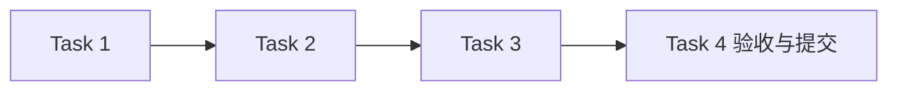

# Workflow 编排模块任务

## 任务元信息

| 项目 | 内容 |
| --- | --- |
| 项目名称 | LogAgent v0.1 · Workflow 编排 |
| 关联文档 | [proposal.md](./proposal.md)、[design.md](./design.md)、[总体设计](../../design.md) |
| 任务总数 | 4 |
| 前置模块 | 前五个模块全部验收提交 |
| 执行策略 | subagent 实施，主 agent 审查与验收；本模块测试通过并提交后进入下一模块 |
| 计划产物 | logagent/workflow/、tests/test_workflow.py、tests/test_workflow_recovery.py |
| 验证命令 | `rtk proxy uv run pytest tests/test_workflow.py tests/test_workflow_recovery.py -q` |

## 任务列表

### Task 1：实现保存校验、触发与 LangGraph 阶段

描述：完整验证资源语义并生成快照，构建 collect/analyze/aggregate/notify/finish 阶段和受限运行任务。

输入：前五个模块接口；本模块设计

输出：WorkflowService、LangGraph runner；运行测试

依赖：configuration、archive、collectors、ai、channels

验收标准：

- [ ] 无效配置不落盘或启动，所有阶段共用同一session快照
- [ ] 全局运行容量有界，任务错误有持久状态

### Task 2：实现共享输入、并行分析和汇聚策略

描述：按来源顺序组装共享文本与计数，分支有界并行，汇聚可插入整体输入，执行全部空/部分失败策略。

输入：Task 1；来源与AI接口

输出：编排和失败策略；并发/排序测试

依赖：Task 1

验收标准：

- [ ] 全部分支收到同一完整输入，并发1实际串行
- [ ] 声明顺序不受完成时间影响，原始输入至多整体出现一次
- [ ] 停止/跳过、send_partial和不完整标记均有行为测试

### Task 3：实现持久恢复、通知和调度关闭

描述：读取原快照及成功阶段，冻结通知内容，只补失败目标；实现定时不重叠、取消及启动中断识别。

输入：Task 2；存档、网关接口

输出：resume/cancel/scheduler/shutdown；恢复故障测试

依赖：Task 2

验收标准：

- [ ] 恢复不重采、不重跑成功分支、不重发成功/不确定目标
- [ ] 备份缺失、损坏、关闭、过期时报告恢复范围
- [ ] 取消停止后续通知，调度与关闭无孤立任务

### Task 4：完成 Workflow 集成验收并提交

描述：运行跨模块、故障及旧阶段恢复测试并提交。

输入：Tasks 1–3

输出：Workflow集成测试；验收记录；Git commit

依赖：Tasks 1–3

验收标准：

- [ ] 指定测试命令全部通过
- [ ] 采集/分析/通知部分失败均保留已完成结果

## 执行顺序

推荐顺序：前置模块验收 → Task 1 → Task 2 → Task 3 → Task 4。无依赖的测试审查可并行，集成和提交按依赖顺序执行。

## 验收记录

尚未执行测试；完成后填写真实命令、结果与提交记录。
