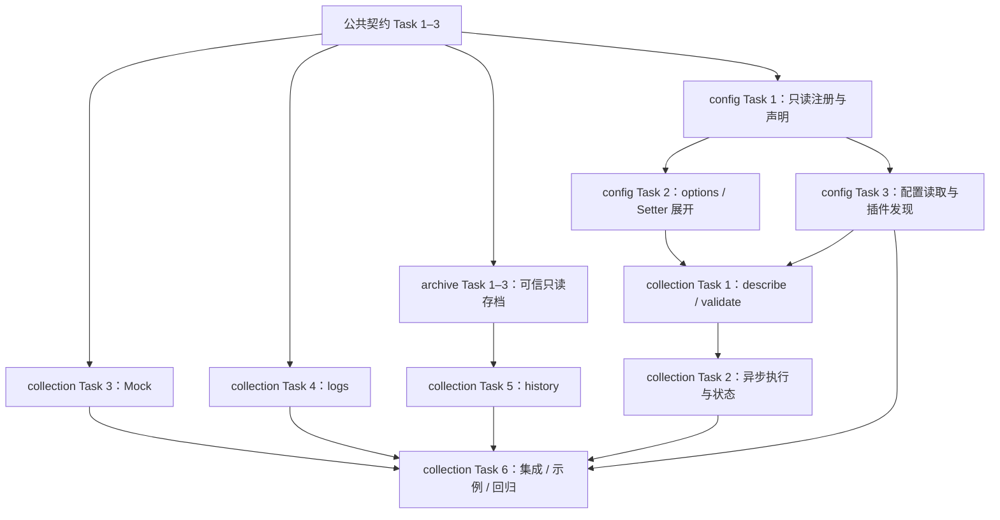

元信息
- 关联规范：[提案](./proposal.md)、[总设计](./design.md)、[公共数据](./contracts/data-models.md)、[公共接口](./contracts/module-interfaces.md)
- 任务总数：69（下表各模块任务之和；本文件是调度索引，不重复计数）
- 预计执行时间：73 小时 15 分钟人工工作量；本轮 collection 和必要前置约 16 小时 15 分钟人工工作量，并行执行缩短关键路径。这是开发工作量估算，不是自动执行耗时承诺。

按用户要求，所有模块先写 task.md，再进行代码实现。每个任务的描述、输入、输出、依赖和至少三条验收标准在对应模块文件中。当前从 collection 开始，其他业务模块逐个推进。

| 模块 | 任务计划 | 数量 | 本轮范围 |
| --- | --- | ---: | --- |
| 公共契约与工程基础 | [contracts/task.md](./contracts/task.md) | 3 | Task 1–3 |
| 配置 | [config/task.md](./modules/config/task.md) | 8 | Task 1–3；完整资源存储及凭据实现后续执行 |
| 存档 | [archive/task.md](./modules/archive/task.md) | 7 | Task 1–3；只读文件存档，写入与维护后续执行 |
| 数据采集 | [collection/task.md](./modules/collection/task.md) | 6 | Task 1–6 全部 |
| AI | [ai/task.md](./modules/ai/task.md) | 5 | 后续执行 |
| Channel 网关 | [channel/task.md](./modules/channel/task.md) | 5 | 后续执行 |
| 邮件渠道 | [channel/email/task.md](./modules/channel/email/task.md) | 3 | 后续执行 |
| Mock 文件渠道 | [channel/mock/task.md](./modules/channel/mock/task.md) | 3 | 后续执行 |
| Workflow | [workflow/task.md](./modules/workflow/task.md) | 13 | 后续执行 |
| 交互 | [interaction/task.md](./modules/interaction/task.md) | 8 | 后续执行 |
| 装配与生命周期 | [lifecycle/task.md](./modules/lifecycle/task.md) | 8 | 后续执行 |

## 本轮 DAG

## 调度规则

1. 依赖产物完成并通过相应验证后，后继任务进入可执行集合。
2. 主 agent 维护公共契约、采集管理器和集成；subagent 分别承担配置、存档/历史、日志等独立分支。共享文件只有一个写入负责人。
3. 已完成前置的独立分支并行；尚未就绪的任务只做规范阅读，不提前假定依赖已实现。
4. 每个分支结束先运行本分支检查，再汇合执行 collection 回归。发现缺陷回到对应节点修复。
5. 本轮不启动完整 Workflow、AI、Channel、API 或后台调度。后续按对应 task.md 继续遍历。

## 后续依赖顺序

公共契约 → config/archive 支撑能力 → collection、AI、Channel（邮件与 Mock 适配器可并行）→ Workflow → 交互与生命周期最终装配。

配置存储通过注入业务校验函数连接其他模块；交互和生命周期通过应用服务契约连接。依赖接口不等于依赖对方完整实现，避免模块互相等待。后续存档写入器须复用只读实现的封套格式与一致性边界。

## 执行记录

- 2026-09-13：完成 11 份模块任务计划及本调度索引，保留已有设计文档修改。
- 当前：公共契约 Task 1–3、config Task 1–3、archive Task 1–3 和 collection Task 1–6 已完成，共 15 项；其余 54 项尚未完成，按后续依赖顺序推进。
- 实际分工：主 agent 完成公共模型、采集管理器、集成和调度；subagent 分别实现 config、logs、archive/history，并交叉审查独立分支。后续业务模块仍待执行。
- 最终验证：Python 3.11.15 和 3.14.3 各通过 368 项测试；Ruff、源码包/安装包构建和默认采集示例通过。11 份模块计划合计 69 项，任务字段、至少三条验收标准及本地文件链接均通过检查。
- 工作区检查：已有 design.md 和 references/qwenpaw.md 的 CRLF 换行会被默认 git diff --check 报为行尾空白；这些原有修改保持不变，本轮新增文件单独检查。
