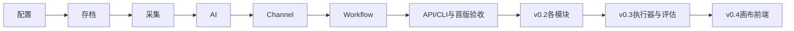

# LogAgent 实施任务总表

## 任务元信息

| 项目 | 内容 |
| --- | --- |
| 项目名称 | 可配置的多源采集与 AI 分析 Workflow |
| 关联文档 | [proposal.md](./proposal.md)、[design.md](./design.md)、[模块索引](./modules/README.md) |
| 任务总数 | 原有 10 个验收批次；首版每模块 4 项详细任务，共 28 项；本轮补充验收单列于 §11 |
| 执行策略 | 各模块 proposal/design → 三层 tasks → subagent 实现 → 测试审查 → 独立提交；完成首版后推进后继版本 |

## 1. 配置与资源管理

- [x] 1.1 完成 [配置与资源管理 tasks](./modules/configuration/tasks.md) 的四项任务；验证：`rtk proxy uv run --no-sync pytest tests/test_config.py tests/test_config_contract.py -q` 69 项通过并独立提交。

## 2. 运行记录与存档

- [x] 2.1 完成 [运行记录与存档 tasks](./modules/archive/tasks.md) 的四项任务；验证：`rtk proxy uv run --no-sync pytest tests/test_archive.py tests/test_archive_contract.py -q` 65 项通过，全量 134 项通过并独立提交。

## 3. 数据采集

- [ ] 3.1 完成 [数据采集 tasks](./modules/collectors/tasks.md) 的四项任务；验证：`rtk proxy uv run pytest tests/test_collectors.py tests/test_collector_plugins.py -q` 通过并独立提交。

## 4. AI 执行

- [ ] 4.1 完成 [AI 执行 tasks](./modules/ai/tasks.md) 的四项任务；验证：`rtk proxy uv run pytest tests/test_ai.py -q` 通过并独立提交。

## 5. Channel 网关

- [ ] 5.1 完成 [Channel 网关 tasks](./modules/channels/tasks.md) 的四项任务；验证：`rtk proxy uv run pytest tests/test_channels.py tests/test_channel_plugins.py -q` 通过并独立提交。

## 6. Workflow 编排

- [ ] 6.1 完成 [Workflow 编排 tasks](./modules/workflow/tasks.md) 的四项任务；验证：`rtk proxy uv run pytest tests/test_workflow.py tests/test_workflow_recovery.py -q` 通过并独立提交。

## 7. 交互与首版验收

- [ ] 7.1 完成 [交互与首版验收 tasks](./modules/interaction/tasks.md) 的四项任务；验证：`rtk proxy uv run pytest tests/test_api.py tests/test_cli.py -q` 通过并独立提交，包括真实十分钟稳定性报告和构建验收。

## 8. v0.2 扩展

- [ ] 8.1 在首版验收提交后，为来源子集、Agent、YAML Toolset、健康、Webhook、指令和会话落实独立模块文档与任务，逐模块实施；验证相关单元及集成测试通过并按模块提交。

## 9. v0.3 原生执行与评估

- [ ] 9.1 为原生执行器和效果评估落实模块文档与任务，移除 LangGraph，验证旧格式恢复与固定输入候选比较、无采集通知副作用、规则/模型评分后分别提交。

## 10. v0.4 浏览器画布

- [ ] 10.1 为前端模块落实文档与任务，实现资源、画布、运行、评估与会话界面；验证真实浏览器流程、响应式截图、全量测试及包构建后提交。

## 11. 本轮设计补充验收

2026-09-12：按本轮要求将根设计改为五部分，并拆出语义数据模型与模块接口。以下是设计新增或澄清的待核验行为；此前代码和测试记录继续表示当时的验收范围，本轮仅修改规划文档。

- [ ] 11.1 配置与 Workflow：验证资源更新的引用一致性、失败保留旧有效配置、新运行使用新值、已受理/恢复运行保持原快照；校验 `save(mode=create/replace/upsert)` 的提交边界语义。
- [ ] 11.2 网关与 Workflow：验证 Channel 配置更新不会改变旧 session 的目标；Workflow 定时间隔及 enabled 更新只影响未来触发，旧运行通过 cancel 显式停止。
- [ ] 11.3 交互与生命周期：落实带组件时间和原因的 HealthReport；验证可选插件降级、必要存档不可用、恢复后状态刷新以及健康查询没有业务副作用。
- [ ] 11.4 各模块与集成：验证日志关联、脱敏、容量边界和配置生效诊断；公开能力描述、上下文及工具事件与语义契约对应，秘密和正文不会通过诊断旁路保存。

## 执行顺序

§11 的补充项按配置、网关、Workflow、交互模块的依赖穿插验收，首版交付前完成。它们不因原有模块验收曾通过而自动完成。

模块详细清单在对应目录，验收复选框只有行为已实现并验证后才能勾选。技术选型 ADR 保持待讨论。24 小时长期稳定性测试只有实际执行后才可声称通过。

## 实施状态

既有验收记录：配置与资源管理、运行记录与存档两个模块已按当时契约完成，其余 8 个验收批次尚未完成。后续实施从数据采集批次继续，并按依赖核验 §11 补充项。本轮只重写设计及关联规划，不更新代码验收结论；规划文档的存在不代表功能已经实现。
