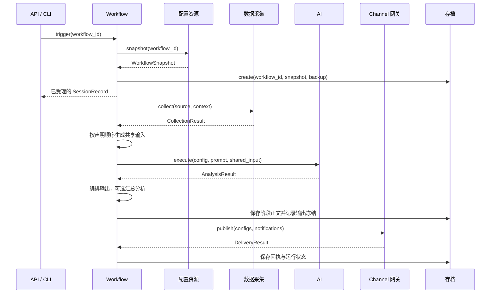

# `design.md` 接口契约解读

本文配合重写后的 [design.md 第四部分](./design.md#4-接口契约) 阅读，解释模块之间交换的数据和操作含义。完整字段见 [数据模型](./contracts/data-models.md)，全部公开接口见 [模块接口](./contracts/module-interfaces.md)。这些是目标设计，实施状态见 [tasks.md](./tasks.md)。

## 1. 如何阅读新的五部分设计

| 部分 | 要回答的问题 |
| --- | --- |
| 架构设计 | 系统由哪些模块组成，数据如何经过它们？ |
| 模块职责定义 | 哪个模块拥有哪条业务规则，它不负责哪些事情？ |
| 技术决策 | 后续选择什么实现方案，为什么这样选择？本轮留空。 |
| 接口契约 | 模块交换什么数据，对外能做什么，结果意味着什么？ |
| 非功能约束 | 局部故障如何降级，数据如何保护，服务如何观察和更新？ |

例如，“通知必须返回每个目标的回执”属于语义契约；“用哪种 HTTP 客户端、怎样加锁或保存文件”属于实现细化。判断契约是否稳定，可以看更换执行器或存储方式之后，调用者是否仍能按同样规则理解结果。

## 2. 四个容易混淆的对象

| 对象 | 可以怎样理解 | 修改时的影响 |
| --- | --- | --- |
| WorkflowDefinition | 一份可重复执行的流程配置。 | 保存新值影响后续新运行。 |
| WorkflowSnapshot | 某次运行已经确定的全部有效配置。 | 运行和恢复不重新替换它。 |
| SessionRecord | 这次运行的事实记录：在哪一步、发生什么、哪些内容可用。 | 随执行更新，但不复制阶段正文。 |
| ArtifactContent | 当时的快照、共享输入、分析结果或最终输出正文。 | 受备份范围和有效期控制，读取时核验完整性。 |

因此，“配置还在”“运行记录还在”“可以恢复”是不同判断。有记录但没有原始输入，不能声称可以继续原分析；改了模型配置，也不能让旧 session 的恢复自动采用新模型。

## 3. 从配置到运行，谁调用谁

图中省略了多个来源、多个分支和逐阶段记账的重复调用。真实语义要求保存每个阶段的已有结果，每条投递返回后立即保存回执。触发请求先返回受理结果，采集和模型执行的成败通过 session 查询。

## 4. 配置接口：保存资源与固定快照

`save/get/list/delete` 管理五类资源：sources、setters、ai、channels、workflows。`create` 只创建，`replace` 只替换，`upsert` 根据存在性创建或替换；创建重复、删除仍被引用资源都应明确失败。

`resolve(definition)` 为尚未保存的定义解析引用，供完整校验使用；`snapshot(workflow_id)` 为已保存 Workflow 取得一致资源视图。模板展开先使用模板值，再用实例显式同名值覆盖；展开之后，运行不用再读模板。

保存合法 JSON 只是结构层面通过。Collector 是否支持该 Setter、模型参数是否允许、目标是否具有通知能力，都要由对应业务模块校验；Workflow 组织整体验证。

## 5. 采集接口：状态决定后续策略

Collector 返回单来源事实，Workflow 决定停止还是跳过：

| 来源状态 | 意思 | 对应策略 |
| --- | --- | --- |
| success | 有可消费内容。 | 加入共享输入。 |
| empty | 来源范围内没有原始记录。 | on_empty。 |
| filtered_empty | 有原始记录，但过滤或字段选择后没有内容。 | on_filtered_empty。 |
| missing | 来源或必要历史内容不存在。 | on_missing。 |
| failed | 来源、格式、权限或完整性出错。 | on_error。 |
| timeout | 来源执行超过时限。 | on_error。 |

例如原来有 100 条记录，筛选后剩 3 条，则 count=100、selected_count=3；若全部被筛掉，则是 filtered_empty，不能写成 empty。来源分组也不能把“组数”冒充原来的记录数。

如果全部来源无有效内容，on_all_empty=skip 的含义是结束且不调用模型、不通知。附加计数说明本身不是业务输入，不能因为它有文字就继续执行。

## 6. AI 接口：明确任务与输入

AIService.execute 接受 AI 配置、任务提示词、完整输入和任务标识。它不自行选择 Workflow 来源。首版所有 fan-out 分支使用同一份共享输入，分支之间可以选择不同模型或提示词。

提示词中的字面 `{input}` 替换为完整输入；没有该占位符时在末尾附加输入。系统提示词独立，模型参数不能覆盖服务管理的消息或工具结构。temperature、top_k 是本项目明确排除的字段。

工具必须先注册、被本次配置选择并通过参数校验。工具事件保留调用 ID 和错误，调用时长、次数和内容大小有界；执行上下文里的回调只在运行时使用，不进入存档。

## 7. 通知接口：正文与回执分开

Notification 是已经确定的内容，DeliveryResult 是某个输出送到某个目标后的事实。一个 session 内用 `(output_id, channel_id)` 区分回执，单个邮件目标失败不会删除已完成的分析或另一个文件目标的成功记录。

发布顺序以配置为准：输出 `[A, B]`、目标 `[X, Y]`，得到 `A→X、A→Y、B→X、B→Y`。最大尝试次数是 `1 + retries`，但永久错误和可能已送达的情况不要求用完次数。

SMTP 超时可能发生在服务器接收之后，因此 timeout 不必然表示未送达。此时在 `error.details.delivery_uncertain` 标记不确定性，不自动重试或补发；它不是一个独立的成功状态。

## 8. 存档和恢复：为什么要冻结输出

正文分四类：snapshot 保存有效配置，collection 保存共享输入和来源结果，analysis 保存分支顺序、结果与事件，final 保存确定的有序输出和可选汇总结果。SessionRecord 只保留状态和正文索引。

在通知前，Workflow 将 output_frozen 设为 True。这样即使邮件成功、文件失败，恢复时两位接收者得到的也会是同一 output_id 对应的同一份内容。

| 恢复目标 | 要有的材料 |
| --- | --- |
| 重试失败分支 | 原快照、原共享输入、已有成功分支正文。 |
| 继续未发布的汇总 | 原快照、所需分支结果；引用原输入时还需 collection。 |
| 补发冻结输出 | 原快照、完整 final、已保存回执。 |

冻结后只能补发允许继续的目标。需要重新分析时创建新 session；成功正文丢失、备份关闭或过期时报告恢复范围，不能重采或调用最新模型来猜测原输出。

## 9. 把降级、健康和热更新联系起来

来源失败但策略允许跳过，是业务降级；可选插件不可用但其他工作仍可执行，是服务降级；管理记录无法可靠保存，则不能继续接受依赖它的新运行。这些情况分别体现在结果、SessionRecord 和 HealthReport 中。

资源热更新通过校验后的资源保存入口完成，新运行使用新值，已经受理的运行保留快照。更新定时间隔或禁用 Workflow 只影响未来触发；停止已有运行使用 cancel。插件代码、系统路径和监听配置首版按重启生效，不能把“文件已经修改”当成“运行时已经切换”。

日志提供状态、错误、资源生效和恢复判断的关联信息；业务正文按备份策略查看，密钥只保存环境变量引用。健康查询汇总已知状态，不隐式采集、请求付费模型或发测试通知。

## 10. 用一个例子检查理解

假设 daily_review 引用日志和历史两个来源，声明 summary、risks 两个分析任务，最后发给 local_notice 和 mail_notice。这里的 ID 仅用于说明。

1. 触发时取得完整快照，建立一个 session。
2. 历史来源正常为空且允许跳过，日志有内容；Workflow 使用可用日志编排共享输入。
3. summary 和 risks 分析同一份输入，即使 risks 先完成，后续排列仍按声明顺序。
4. fan-in 按 `[summary, $input, risks]` 编排，生成稳定的 final 输出并冻结。
5. 文件通知成功，邮件明确拒收；保存各自回执并保留分析结果。
6. 用户随后修改邮件目标并恢复旧 session：恢复仍使用原快照的目标和原 final。若希望采用新目标或新分析配置，应显式发起新运行。

完整字段与默认值查 [数据模型](./contracts/data-models.md)，方法的前置条件与返回语义查 [模块接口](./contracts/module-interfaces.md)，降级、安全、日志、健康和热更新规则查 [非功能约束](./design.md#5-非功能约束)。
