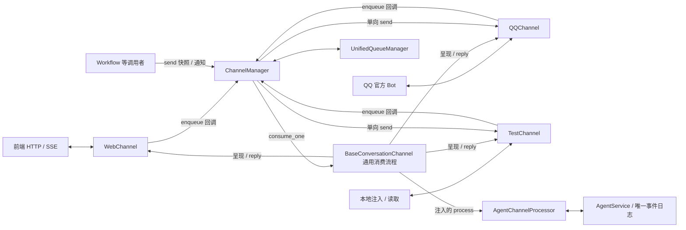

# ChannelManager 双向渠道重设计

## 1. 状态、问题与边界

状态：2026-09-24 重设计稿，依据用户“参考 ChannelManager模块解读.md，重新设计”的要求。本文件取代 [上一版设计](../add-agent-channels/design.md) 的架构决策；[新的实施任务](tasks.md) 全部重新验收。现有代码及旧版测试结果不代表本设计已实现。

用户追加硬约束：不修改任何前端文件。Web 接入在后端完成，兼容现有前端的请求字段、响应结构和 SSE；不得要求新增 conversation UUID、轮询、排队 UI 或通知事件处理。

这是结构性调整。只把 Web 也转发给 `AgentChannelRuntime` 虽然改动少，却仍让它和 `ChannelManager` 分别拥有配置、任务及生命周期。采用统一 Manager 的方案，移除独立渠道运行时；不另建插件注册表，不重写 Agent 的模型循环。

必须成立的约束：

1. Web、QQ、test 的所有对话输入都经过同一个 `ChannelManager` 的路由、队列和消费者。
2. 双向消费只注入当前 Agent 的处理端口，没有可绑定 Workflow 的通用业务处理器配置。
3. `send(snapshot_config, notification)` 是独立的单向调用，不入输入队列，不创建 Agent 会话，也不要求启用 Agent 接收。
4. Manager 拥有渠道任务；AgentService 拥有模型轮次、工具执行、取消和对话事件。两者不重复跟踪同一类任务。
5. 一个已受理请求必须有可查询结局；排队、Agent 完成、渠道发送接受、用户读到消息是不同事实。

## 2. 按参考项目拆分职责



图中的 Base 是具体 conversation 渠道共享的基类逻辑，不是额外注册的渠道或第二个运行时。

| 组件 | 拥有的职责 | 不拥有的职责 |
| --- | --- | --- |
| `ChannelManager` | 实例版本、接收配置、入站准入与路由、消费任务、回执、启停/替换/健康、单向发送 | 模型循环、Agent 会话正文、平台协议 |
| `UnifiedQueueManager` | Manager 内部的队列状态、容量、消费者唤醒和安全空闲回收 | 渠道配置副本、Agent 调用、另一套生命周期服务 |
| `BaseConversationChannel` | 规范化输入接口、调用注入的 `process`、消费结果流、调用具体渠道呈现和回复 | AgentService 具体实现、后台模型任务、独立入站队列 |
| `WebChannel` / `QQChannel` / `TestChannel` | 来源身份、平台内容/地址转换、连接、事件呈现、发送协议 | 命令语义、跨平台队列、Agent 任务跟踪 |
| `AgentChannelProcessor` | 唯一命令分类、平台对话到 Agent session 的绑定、调用 AgentService 并投影事件流 | 平台连接、队列消费者、发送及重试任务 |
| `AgentService` | 会话、原子轮次准入、模型/工具、安全边界命令、取消、事件持久化 | QQ/Web/test 适配器及其配置 |

`AgentChannelProcessor` 是 Agent 模块中的薄端口适配器，替代旧 `channel/agent.py` 门面的业务位置。它只有命令/绑定逻辑，不成为独立运行时。共享 `CommandRegistry` 由此端口提供，Manager 用它确定优先级，执行端用同一分类结果，不能在 HTTP、QQ、Manager 各解析一遍。

## 3. 构造、注入、启动

沿用 config 唯一发布的只读 `channelRegister`、`ChannelType`、`ChannelConfig` 和四层选项合并规则。插件工厂仍为 `create(instance_config, credentials)`，已有 email/mock 不必接收 Agent 参数。

1. 生命周期装配 AgentService 和处理端口，再把端口注入唯一 ChannelManager。
2. Manager 根据有效配置创建实例；conversation 实例再由 Manager 绑定 `process`、命令分类器、固定该实例身份的异步 `enqueue` 回调及回复发送回调。
3. Manager 建立队列运行时，再启动启用的接收端。`start()` 的资源准备与 `start_receiving()` 的平台监听分开；单向首发不会隐式启动 Gateway。
4. 接收状态明确区分 starting、ready、failed、stopped，后台任务已创建不能报告连接 ready。某一 QQ 接收失败独立报告，不阻断 Web/test，也不直接判定该渠道的 REST 发送能力失效。

`ChannelConfig.agent_enabled=false` 保留，唯一含义是“此资源的输入绑定当前 Agent”。`enabled && agent_enabled && conversation 能力` 才启动接收；没有模块名、Workflow ID 或任意回调字符串可配置。该开关不参与常驻实例身份。`notification` 与 `conversation` 是独立能力，现有 email/mock 继续只有 notification。

Web 是注册表中的内置渠道类型，有 Manager 持有的保留实例 `web`，随 Agent 的可用状态启停，用户资源不得占用该 ID。保留实例来自应用装配的一份有效配置，不增加另一份渠道配置文件或注册表。HTTP 只取得该实例并调用其收发入口；不能直接访问处理端口。

最小接口轮廓（表示职责，不是已实现代码）：

```python
class AgentChannelPort(Protocol):
    def classify(self, command) -> CommandSpec: ...
    def process(self, request) -> AsyncIterator[ProcessEvent]: ...
    def events(self, session_id, *, after) -> AsyncIterator[AgentEvent]: ...

class ConversationChannel(Protocol):
    def bind(self, *, process, enqueue, deliver_reply) -> None: ...
    async def start_receiving(self) -> None: ...
    async def stop_receiving(self) -> None: ...
    async def consume_one(self, admitted_request) -> None: ...

class ChannelManager:
    async def enqueue(self, channel_id, inbound) -> ChannelReceipt: ...
    async def send(self, snapshot_config, notification) -> DeliveryResult: ...
    async def reply(self, admitted_request, rendered_reply) -> DeliveryResult: ...
```

Base 的 `consume_one` 调用 `process`，按顺序处理 operation/Agent 事件，并等待本次处理及回复收敛后返回。Manager 的消费者拥有这段调用；禁止适配器启动不受 Manager 管理的“等待模型再回复”任务。Agent 端口不依赖具体渠道实现。

## 4. 信封与两种会话身份

入站规范化后包含：

| 字段 | 来源及含义 |
| --- | --- |
| `channel_id` | Manager 注入的资源身份；HTTP 路径/QQ 实例决定，不能由模型或客户端冒充其他渠道 |
| `conversation_key` | 平台对话身份，用于队列；不等于 Agent session ID |
| `sender` | 适配器从已接收消息取得的来源主体 |
| `request_id` | 平台消息 ID 或前端生成的 UUID，在渠道与对话内唯一 |
| `command` | action、参数和文本；显式 `action=message` 的 `/xxx` 文本仍是普通消息 |
| `reply_route` | 适配器验证过的不可变平台地址，含原消息关联信息；通用层把它当作不透明数据 |
| `received_at` / `sequence` | 接收时间与 Manager 分配的对话内单调序号 |

通用层不再硬编码 `c2c/group/guild/dm/test` 的地址枚举。QQ 自己验证路由类型及目标；测试渠道自己验证 room/sender；模型输出只能提供内容，不能提供 reply_route 或凭据。

QQ 的 conversation_key 由 app_id、聊天类型、目标、发送者构成，保留现有按发送者隔离的会话语义；账号变化进入新的身份空间，轮换同账号凭据或修改单向目标不改变会话身份。群中回复仍对群成员可见，不等同于私信。test 使用 room/sender。

Web 保留现有显式指定 session 的交互：后端将会话操作规范化为 `session:<id>`，同会话的不同页签使用同一队列；无 session 的创建操作使用 `create:<request_id>`。前端无需传 conversation_key。Web 的 new/fork/workflow 返回新 session，仍由现有前端在后续请求里选择它；这些操作不把旧 session 队列重新绑定到新 session。已经指明旧 session 的消息始终属于旧 session，不能被一次页面切换改投新会话。

绑定数据由 Agent 端口拥有：`(channel_id, conversation_key) -> current Agent session`，以及该来源的既有会话集合。QQ/test 首条普通消息可自动创建会话，`/new /resume /fork /workflow` 更新当前绑定。Web 输入提供显式目标 session，由同一端口执行既有会话访问校验，不持久化冗余的“当前页面会话”。规范化输入明确区分绑定式目标与显式目标，两者均调用同一个 process。命令执行失败不修改绑定。

Web 可以操作已有 Agent 会话，因此不同平台队列可能最终指向同一个 Agent session。队列键隔离不能代替 Agent 的单轮约束：AgentService 应在原有 session 同步机制内提供“等待空闲后原子准入”，等待期间不持有全局锁，取消可中断等待。不得用循环吞掉 `session_busy`，也不得另建一份 Agent 请求队列或活动轮次表。

## 5. 入站队列、顺序与停止

沿用参考结构 `QueueKey = (channel_id, conversation_key, priority)`；priority 为 `0 stop / 10 command / 20 conversation`。每键一个消费者，不同对话并发。它们是独立处理通道，数字本身不代表抢占运行中的协程。

### 普通对话与会话切换

- 普通消息 FIFO；消费者等待当前轮次的终态和本次回复结果后再处理下一条。Agent 忙时已受理消息保持等待，不能丢弃或以 `session_busy` 当作队列行为。
- QQ/test 的 `new/resume/fork/带结果的 workflow` 是会话切换屏障。它们等待此对话中先受理的普通消息完成，并阻止后来消息越过屏障；处理时确定新绑定。例：`A 正在执行、B 已排队、/new、C` 的顺序是 `A → B → /new → C`，C 才进入新会话。Web 的同类操作若指定源 session，也等待该源队列此前消息；其后发往旧 session 的消息仍属于旧队列，只有显式指定返回的新 session 才进入新会话。
- 不切换会话的命令可经 command 通道处理；队列内仍是 FIFO。`append/compact` 在活动轮次中交给 Agent 已有安全边界，命令生效或失败后结束该命令请求；不重复向平台发送整个活动轮次的最终回复。命令可先于尚未开始的普通消息作用于活动轮次：A 执行、B 排队时收到 append，它先在 A 的安全边界生效，B 后执行。这是命令优先级的明确语义，但不能越过更早的会话切换屏障。没有活动轮次时，按 Agent 原有语义启动并等待相应轮次。
- 队列中的输入保留原始 reply_route。处理开始后固定 Agent session、实例版本和回复地址，后续切换不改变在途结果的归属。

屏障是 QueueManager 中同一对话各队列的调度条件，不能由消费者持有一把长锁等待彼此，从而阻塞 stop。首次会话创建与轮次开始前都要检查请求仍有效。

### `/stop`

stop 使用独立优先级队列，不等普通队列或模型完成后才开始。Manager 首先完成请求去重，再建立对话停止屏障：

1. 截取此对话的受理序号，取消此前尚未进入 Agent 的请求（包含会话切换命令），为每条写入 interrupted 回执。
2. 与端口的“绑定/创建/提交”短准入段协调，定位已开始的轮次并调用 AgentService.cancel；不在持锁状态等待模型。正在等待其他来源轮次结束的请求也须可被中断。
3. Agent 记录终态并释放工具资源后，stop 请求才完成；停止之后受理的消息等待屏障撤销再正常执行。

若最早消息正在创建 session，stop 要么在其提交前阻止执行，要么准确取消刚提交的轮次，不能返回停止成功后再启动那条旧消息。重复 stop 返回原回执，不能推进停止代次并取消后来的输入。

对话 stop 只清理该来源的待处理请求；若当前 Agent session 也被 Web 等其他来源使用，取消的是该 session 的活动轮次，其他来源能看到同一取消事件，其待处理消息仍保留。Agent 的原子准入须等待取消清理完成。

### 容量、合并与清理

每键最多等待 1000 条消息，满载立即返回 `channel_queue_full`（Web/test HTTP 429）；不创建无界等待入队任务。此数值沿用参考实现的单队列容量，作用范围不是全系统容量。接收回调须 await 实际受理结果，不能 fire-and-forget 后冒充成功。

首版逐条消费，不合并消息、不主动防抖。参考实现的批量拼接会改变多请求回执和回复关联，当前纯文本需求没有要求这种语义；不能合并命令，也不能合并失败后只处理第一条。

每 60 秒回收空闲至少 600 秒的队列，沿用参考数值；只有队列空、无消费/发送/准入任务、无停止或切换屏障时才可回收。等待模型十分钟不算空闲。接收循环只做协议和入站；队列满的 QQ 消息报告拒绝，并在平台允许回复时发送一次错误提示，提示失败也必须留日志，不能伪造已受理回执。

## 6. `process`、请求回执与事件事实

Agent 端口的 `process` 返回异步事件流，包含操作已执行的结果、对既有 AgentEvent 的引用，以及操作结束/失败。普通消息的流直到真实轮次终态才结束，不能在 `AgentService.submit()` 返回 turn_id 时就结束消费。命令只报告自身执行结果；活动轮次中的 append/compact 关联已有 turn，不创建假 turn。

渠道请求状态与发送状态分开：

- 请求：`queued → processing → completed / failed / interrupted / outcome_unknown`。processing 可以是在等待 Agent session 的准入；只有实际准入后才有 turn_id。请求 completed 表示操作/Agent 已完成，与消息发送成功无关。
- 发送：`not_started → sending → success / failed / timeout`；无法确认是否投递时保留 `delivery_uncertain=true`，与既有 DeliveryResult 一致。无需回复的操作不伪造发送成功。
- 唯一请求键为 `(channel_id, conversation_key, request_id)`；内容摘要覆盖命令参数及固定回复路由。重复相同输入返回同一回执；同键不同内容明确 `request_conflict`，不重复入队、执行或发送。

复用现有 `channels.sqlite3`，把绑定存取接口归 Agent 端口、请求及发送回执接口归 Manager；共享存储不等于共享业务所有权。SQLite 写入使用参数化查询。这里只存身份、摘要、状态、错误及 session/turn/event 引用；Agent 对话正文仍仅在原 Agent JSONL 事件日志。

旧 peer 是资源配置与地址的摘要，不能从摘要反解新 conversation_key。迁移保留旧表及已知配置版本；收到输入时，仅用可验证的原配置和地址计算旧键并建立显式映射。无法证明来源的记录保留为 legacy 未映射记录，不按 session ID 猜测归属、不删除数据。新旧请求通过该映射共享去重检查，不能因为升级身份格式就执行同一条历史消息。

受理过程：先原子预留队列位置并登记请求，再向消费者发布，完成后才返回 queued；登记失败释放位置并明确报错。登记后发布失败把请求标为失败，不能留下假 queued。Agent 事件与渠道回执跨存储不能假装原子事务：传给 Agent 的 request_id 使用上述请求键的稳定编码，Agent 的既有去重及事件引用用于恢复核对。

队列在内存，重启不自动执行旧消息：确定尚未调用 Agent 的请求标为 interrupted；已开始且能从 Agent 事件定位终态的投影实际结果；无法确定执行窗口的请求标为 outcome_unknown。会话创建等命令需要关联稳定 operation_id 才能恢复核对。已完成 Agent 操作但未确认发送的请求不得自动再发送，送达未知明确暴露。没有足够证据时不能猜测成功或重放可能有副作用的工具。

## 7. 后端 WebChannel 兼容现有前端

WebChannel 的入口同样调用注入的 enqueue；HTTP 路由不再调用 `AgentChannel.dispatch`。对话创建、发送、slash 命令、停止、追加、压缩、分支和从 Workflow 结果创建会话都进入 Manager。`/workflow` 仅读取最终输出作为 Agent 上下文，不启动 Workflow 或把它注册为消费者。

WebChannel 将 Manager 的内部 queued 回执适配成现有 HTTP 契约。HTTP 等待对应请求真正取得原接口要求的结果，消费任务仍由 Manager 持有；等待响应不等于在路由里执行 Agent。

| 入口 | 返回/职责 |
| --- | --- |
| `POST /api/channels/web/commands` | 保留现有 action/session/request_id/text 等字段及 `{channel, session, priority, kind, result}` 响应。消息待 Agent 真实准入后返回原 TurnAccepted；创建/恢复/分支返回原 AgentSession；保留 HTTP 202，不返回缺少真实 turn_id 的成功结果 |
| `GET /api/channels/web/requests/{request_id}?session=...` | 后端诊断入口，按同一规范化身份查询内部回执；前端无需调用，也不作为正常交互的前置条件 |
| `GET /api/channels/web/sessions/{session_id}/events` | WebChannel 通过注入的事件读取端口投影 Agent 原日志；沿用 after/Last-Event-ID 游标 |

排队期间 HTTP 保持等待，现有前端继续使用其原有请求状态，不新增 queued UI。普通消息返回真实 turn_id 后，现有 `useAgentStream.resume(turn_id)` 能照常订阅；此前已产生的事件从原日志重放。SSE 保持 `id/session_id/turn_id/type/at/data` 信封及既有事件类型，支持现有前端在当前轮次终态时断开。HTTP/SSE 断连不取消已受理请求，只有 stop 命令执行取消；重复 request_id 仍查询/等待原操作，不重新执行。反向代理超时可能先于排队结束，后端不能因此把已受理操作记作失败或盲目重试。

Web 的 reply 以原 Agent 事件和请求结果呈现，不能再把模型 token 写进另一份渠道日志。Web 首版只声明 conversation 能力；当前前端没有任意通知消费协议，因此不增加 Web notification 事件，更不能将 Workflow 通知伪造成 Agent 对话。双向模块的单向 send 能力由支持 notification 的 QQ/test 等适配器提供。

旧 `/api/agents` 对话写接口也调用相同 WebChannel，并规范化到相同 `session:<id>` 队列；不能为旧路由再建 legacy 队列导致 stop 无法处理另一路由的待处理消息。保留各旧接口的原响应形状和状态码，只在后端等待 Manager 回执达到相应阶段后投影。会话列表、配置、文件、模型选择等管理 API 保持原模块职责。

本节只修改 Python 后端及后端契约测试；`frontend/` 下源码、组件、类型、测试和构建配置均不在实施范围。

## 8. 单向发送与原路回复

扩展旧 Channel 设计时保留它的关键契约：

- `send` 只检查 notification 能力及本次快照；不读取当前 agent_enabled、会话绑定或输入队列状态来决定发送目标。
- 仍按 channel_id、类型、实例 options 版本持有常驻实例；调用选项不进入身份。旧 Workflow 快照绑定旧实例与旧目标，不能改查最新资源。
- send 总预算覆盖等待实例、准备和一次发送；沿用 ChannelConfig.timeout，默认 30 秒。无内部发送队列、后台自动重试或 Agent 整轮超时。
- reply 使用受理时固定的配置版本和 reply_route，也经过 Manager 的同一发送执行器、并发约束、预算及 DeliveryResult；与 send 的区别是地址来自可信入站而非配置目标。模型内容和 metadata 都不能覆盖地址。

QQ/test 同时实现 notification 和 conversation，Workflow 可独立调用其 send。关闭 Agent 接收不撤销单向能力；对只声明 conversation 的 Web 调用通知 send，返回明确的能力不支持错误。应用整体关闭则按生命周期停止所有渠道。

## 9. QQ 与测试渠道

QQ 继续采用参考项目的官方 Bot Gateway + REST，而非个人 QQ/OneBot。保留上一版可复用的 token、心跳 ACK、会话恢复、重连、C2C/群聊/频道路由协议代码及协议测试；将入站 handler 改为 Manager 的 enqueue，并把消费/回复改为 Base 流程。

app_id 来自实例配置，client_secret 来自 Credential 引用。平台消息 ID 用于入站去重，原 message_id 用于关联回复；回复窗口过期、权限不足、限流、确认缺失均给出真实回执。QQ 默认只发每轮最终文本或明确错误/取消结果，不按 token 发送。接收重连只恢复连接，不等同于重试 Agent 请求或重发回复。token 与重连默认值沿用已验证的协议实现，平台未返回有效心跳间隔或有效期时明确失败。

TestChannel 实现与 QQ 相同的 Base 消费协议：`inject` 调用 Manager，`outbox` 保存单向 send 和原路 reply 记录，`outcome` 查询 Manager 回执。保留现有 `/channels/{id}/test/messages` 的注入/出站查询入口，注入改为返回 queued 回执。出站带递增游标、request/session/turn 引用、目标和发送状态。测试渠道只代替外部传输；自动化测试使用真实 Manager、队列、绑定、AgentService 和事件日志，只替换模型与网络。

test 的 outbox 是内存调试记录，重启清空，绑定和请求回执仍持久化；默认单向目标 `local` 仅表达本地输出。测试需要能控制模型等待与发送失败，以确定性验证停止、排队和回复失败，不能在生产分支里伪造成功。

## 10. 生命周期、替换与恢复

全局 lifecycle 仍协调 Agent/Workflow 准入，但 ApplicationServices 只发布一个 ChannelManager；删除独立 `agent_channels` 运行时和单独的接收配置同步任务。配置变更统一交给 Manager；Agent 端口是注入依赖，不自行订阅配置。

普通资源更新：先校验新有效配置；Manager 暂停该资源入站、撤销旧 enqueue 代次、停止旧监听。尚未处理的旧输入标为 interrupted，不转投新账号；在途处理继续使用旧实例快照直到回复完成。旧监听成功停止后才能启新监听，避免同账号两个 Gateway。新实例启动失败则保持接收失败状态，显式报告，不静默恢复或声称 ready；旧版本仍可服务旧 Workflow 快照的单向发送。

关闭/禁用接收需要保存旧实例与任务引用，清理成功才移除；清理失败可再次处理。插件卸载/重载遵守既有 lifecycle 活动任务冲突规则，有活动消费、回复或发送时返回冲突，不在模型执行中替换其插件。Manager 消费时核对实例代次；失效回调不能把旧消息偷偷提交到新账号。

进程关闭按顺序关闭入站准入、停止监听、结算尚未执行的队列、通过 Agent 既有关闭流程取消活动轮次、收敛消费者及发送、关闭存储、释放实例。渠道发送/停止等待沿用现有 5 秒清理预算，超时记录发送不确定或清理失败；模型轮次的资源释放仍由 Agent 管，不拿 5 秒冒充 Agent 整轮上限。未确认取消/清理不能写 completed。

## 11. 迁移与验收

迁移顺序是契约和队列 → Agent 端口 → Manager 收发/生命周期 → Web 后端及兼容接口 → QQ/test → 验证。文件保留、迁移、删除清单及默认值依据记录在 [tasks.md](tasks.md)，源码证据见 [references.md](references.md)。

关键验收必须包括真实 Manager 入队路径、普通消息排队、切换屏障、首次消息与 stop 竞态、多来源同 session 单轮、现有前端请求/响应与 SSE 契约兼容、单向快照不漂移、重启不重放、QQ 协议及测试渠道闭环。后端测试须证明现有请求无需增加字段即经过同一 Manager，不能以 URL 名称作为通过证据。
