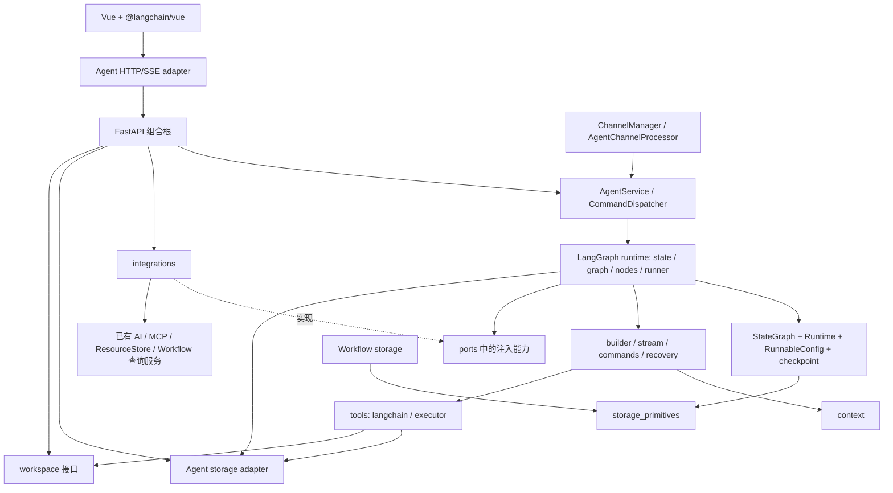

# Agent 模块重设计

状态：2026-10-06 设计交付，尚未 apply。用户授权“基于隔壁 qwenpaw 重新设计 agent 模块，交付 OpenSpec 流程，特别是目录结构”；本稿在独立 change 内给出方案，不回写历史设计。需求边界见 [proposal.md](proposal.md)，证据见 [references.md](references.md)，实施入口见 [tasks.md](tasks.md)。

## 1. 结论与根因

保留 LangGraph 作为 Agent 的主运行时，而不是把它当成 `create_graph()` 的实现细节。Agent 组织为“用例入口 → LangGraph graph/runtime → context/tools → 存储原语与领域存储/外部依赖”。借鉴 QwenPaw 的构建与执行分离，保持 LogAgent 已有的单工作区、多会话、唯一渠道队列和事实存储语义。

这不是单纯移动文件。当前 `service.py` 约 1350 行：既创建 `WorkspaceBackend`、`ArtifactStore`、SQLite saver 和默认工具，又处理会话、任务、恢复、模型解析、流事件和配置持久化；`AgentSession` 同时携带事实字段、锁、任务、待执行命令和日志句柄；`graph.py` 同时装配图并执行去重、调度、工具调用、artifact 和结果提交。更换一个依赖或修复恢复逻辑，需要了解整个对象的隐式状态。

必须表达为单一所有者的约束：

1. 渠道拥有入站 FIFO、绑定与投递；Agent 拥有 session 的活动 turn。两层不是两套普通消息队列。
2. 一个 session 最多一个活动 turn；一个 turn 有一份冻结配置和一棵由它负责取消、等待的工具任务树。
3. JSONL 是用户可见事实权威，checkpoint 是可继续执行状态权威，Sessions JSON 是可重建投影；三者不互相猜测替代。
4. 所有模型工具经过同一个 LangGraph ToolNode/工具执行边界。LangChain 适配器不单独记账，内置工具不自行占用稳定执行键。
5. FastAPI 是应用组合根；Agent 不创建第二个 ChannelManager、MCP runtime、AI 连接池或插件 registry。

### 1.1 基线冲突的处理

用户选中的 [交互与存储分析](../../../docs/open-spec-interaction-and-storage.md) 提供阅读入口，但其中 Collector/`plugin` 的表述须结合后续 `redesign-mcp-schema-first` 阅读。本方案使用 `mcp`、`read`、`write`、`grep`、`shell` 五个稳定入口；不恢复 CollectorManager、Setter 或 Collector 网关。Workflow 交接的是调用描述，不是模型可见的完整 MCP 配置。

`centralize-fastapi-lifecycle-sse` 已规划 `interaction/fastapi/` 组合根。当前代码仍有 `lifecycle/`，不能因它存在就把新 Agent 装配永久放回其中。实施顺序和交接点见第 8 节。

`openspec/specs/` 当前无已同步能力；行为约束仍在历史及活动 changes。不能把这些变更的文档状态视为验收状态。本次只引用约束，不归档其他变更，不擅自解决其剩余实现缺口。

## 2. 从 QwenPaw 借鉴什么

参考版本：邻仓 `../qwenpaw`，HEAD `4279e4920f4ccc606fb0805808ef15b5b1d68143`。以下为阅读到的源码结构，不代表整仓经过运行验证。

| QwenPaw 源码 | 有用的分工 | LogAgent 的落点与取舍 |
| --- | --- | --- |
| `runtime/builder.py` / `AgentBuilder` | 每请求装配模型、prompt、toolkit，注入 Agent | `runtime/builder.py` 装配 LangGraph，输入已冻结的 turn 依赖 |
| `runtime/runtime.py` / `Runtime` | 请求生命周期与实际执行分离 | `runtime/runner.py` 明确 prepare/build/execute/finalize 调用；不引入八阶段 hook registry |
| `runtime/executor.py` / `AgentExecutor` | 消费框架事件并转换 | `runtime/stream.py` 转换成待提交业务事件；SSE 编码和 ping 留给 FastAPI |
| `agents/react_agent.py` | Agent 接收构造依赖 | 图构建不发现资源，不创建外部 manager，不内置模型选择回退 |
| `agents/context/base.py`、`prompt_builder.py` | 上下文管理与 prompt 装配可单独理解 | `context/` 管 prompt、预算和压缩；沿用现有 SummarizationMiddleware |
| `agents/offloader.py` | 大结果文件化，与上下文分开 | 保留 `ArtifactStore` 和 session 隔离，不采用跨会话按日合并执行历史 |
| `app/workspace/service_manager.py`、`service_factories.py` | 初始化失败也能找到已创建资源并释放 | FastAPI lifespan 显式持有资源，按依赖逆序关闭；不复制通用 ServiceManager |
| `app/chats/repo/base.py` | 会话查询与保存的职责可分开 | `storage/sessions.py` 维护只读事实投影；不新增 chats.json 正文权威 |

QwenPaw 的多 workspace、每 workspace ChannelManager、AgentScope、DriverCard、记忆召回工具、skills 平台、模型 fallback 和可变项目目录不在此次范围。其某些 prompt provider 失败返回空字符串的做法也不采用：LogAgent 必需输入读取或装配失败应沿现有错误通道显式报告。

## 3. 源码目录规划

以下是**实施目标**，不是本次已经创建的 Python 文件。只拆出现有职责；不创建 `base/`、`common/`、`utils/` 或无实现的预留插件目录。包内 `__init__.py` 按需添加，图中仅列公共入口。

```text
src/logagent/
├── storage_primitives/              # Agent/Workflow 共用的底层存储原语
│   ├── atomic.py                    # 临时文件、flush/fsync、os.replace
│   ├── locks.py                     # 文件锁、异步短临界区与释放协议
│   ├── digest.py                    # canonical JSON、digest、敏感字段脱敏入口
│   ├── revision.py                  # revision、ETag、If-Match 比较
│   ├── jsonl.py                    # 连续序号、追加、游标和 append/subscribe 接续
│   ├── sqlite.py                   # 参数化事务、连接/关闭和失败传播辅助
│   └── paths.py                    # 物理路径边界与安全临时路径
├── agent/
│   ├── __init__.py                 # AgentService、配置、公共 DTO 的显式导出
│   ├── service.py                  # 会话/文件/配置/执行查询的用例入口
│   ├── commands.py                 # AgentCommand 解析与 CommandDispatcher
│   ├── config.py                   # 唯一 AgentConfig / SandboxConfig 定义
│   ├── contracts.py                # SessionView、TurnSnapshot、RuntimeIdentity 等值对象
│   ├── ports.py                    # 实际使用的外部能力接口，禁止服务定位器
│   ├── runtime/
│   │   ├── state.py                # AgentState、消息 reducer、turn/branch 状态字段
│   │   ├── context.py              # LangGraph ContextSchema 与 Runtime[AgentContext]
│   │   ├── graph.py                # StateGraph/create_agent、START/END、model/tools 边界
│   │   ├── nodes.py                # prepare、model、tools、command/compaction 边界节点
│   │   ├── builder.py              # 编译 graph、注入 middleware、ToolNode 和 checkpointer
│   │   ├── runner.py               # RunnableConfig/thread_id、invoke/astream 生命周期
│   │   ├── stream.py               # astream/astream_events/stream_mode 转业务事件
│   │   ├── commands.py             # Command(update/goto)、stop/append/compact 安全边界
│   │   ├── interrupts.py           # interrupt/resume 协议；没有待确认动作时不制造 interrupt
│   │   └── recovery.py             # checkpoint、pending writes 和事件事实核对
│   ├── context/
│   │   ├── prompt.py               # AGENTS 与 runtime 指令装配，turn 内固定
│   │   ├── budget.py               # token 统计、模型容量和完整请求预算
│   │   └── compaction.py           # 自动/手动压缩共用实现，消息配对检查
│   ├── tools/
│   │   ├── declaration.py          # ToolDeclaration / schema；不导入内置工具
│   │   ├── executor.py             # 稳定键、调度、调用、结果存档的唯一执行流程
│   │   ├── langchain.py            # ToolRuntime → ToolInvocation → 执行器
│   │   ├── scheduling.py           # 工作区共享读槽/写独占，沿用现有算法
│   │   └── builtin/
│   │       ├── mcp.py              # 固定 MCP schema 代理声明
│   │       ├── read.py
│   │       ├── write.py
│   │       ├── grep.py
│   │       └── shell.py
│   ├── storage/
│   │   ├── events.py               # Agent 事件领域适配，委托 storage_primitives.jsonl
│   │   ├── checkpoints.py          # 官方 LangGraph saver/runtime 适配；不重写数据库格式
│   │   ├── sessions.py             # 从事实构建 SessionView、Sessions JSON 投影
│   │   ├── artifacts.py            # 原始输出落盘与有界 preview
│   │   ├── bindings.py             # 原 session MCP 绑定快照读写
│   │   ├── settings.py             # 原 Agent 配置文件的原子持久化
│   │   └── io.py                   # 沿用异步文件 I/O 执行辅助，不承载业务规则
│   ├── workspace/
│   │   ├── files.py                # 唯一文件路径/版本/原子写边界
│   │   ├── views.py                # Runtime/self.json 与只读逻辑映射
│   │   ├── sandbox.py              # bubblewrap/显式关闭模式
│   │   ├── process.py              # 单次进程运行与取消
│   │   └── process_supervisor.py   # 进程组退出处理，沿用现有实现
│   └── integrations/
│       ├── resources.py           # 资源视图/registry generation → TurnSnapshot
│       ├── models.py              # 注入的 AIService → 模型/摘要模型租约
│       ├── mcp.py                 # MCPGateway，委托唯一 MCP runtime
│       └── workflow.py            # 已保存 Workflow 调用描述和 MCP 绑定解析
├── workflow/                       # 现有 Workflow 模块；其 storage adapter 可调用 storage_primitives
├── channel/
│   ├── agent.py                    # 渠道侧 AgentChannelProcessor，持绑定协调
│   ├── manager.py                  # 唯一入站/投递 manager
│   ├── bindings.py                 # 渠道实例绑定 SQLite 与 revision
│   └── unified_queue.py            # 唯一普通消息 FIFO / stop 屏障
└── interaction/fastapi/            # 已有独立 change 的目标，不由 Agent 扩建框架
    ├── app.py                     # lifespan 装配 Agent 及共享依赖
    ├── dependencies.py            # 从 app.state 取得同一个服务
    ├── sse.py                     # 原生 SSE 传输与订阅清理
    └── routers/{agent,channel}.py  # 原路径、原字段、WebChannel 写入口

frontend/src/
└── modules/agents/
    ├── langchain/                  # @langchain/vue 的 useStream 与自定义后端 adapter
    │   ├── adapter.ts              # LogAgent API ↔ LangChain v2 stream adapter
    │   ├── stream.ts               # useStream 配置、thread/session 映射
    │   └── types.ts                # LangGraph state/message/tool 视图类型
    ├── api/                        # 非流式管理 API：session、files、settings、tools
    ├── composables/                # 仅保留业务动作，不再自建事件流状态机
    └── ui/                         # 会话、消息、工具和文件组件
```

### 3.1 各层依赖方向



- `contracts.py` 只包含数据与局部类型校验，不导入服务、FastAPI、SQLite 或工具实现；`config.py` 仍是默认值唯一来源。框架消息类型停留在 builder/context/checkpoints 适配边界，不泄漏进 HTTP DTO。
- `ports.py` 只定义当前真实的调用面：资源快照读取、模型租约、Workflow 交接读取，以及运行时使用的存储/文件操作。接口按消费者需要裁剪，不为每个小函数造一套抽象基类。实现经构造参数注入，不用 `app.state`、全局变量或 `Any` 服务袋在业务层查找依赖。
- `runtime` 不导入 `channel`、`interaction`、`lifecycle`，不硬导入 integrations 或具体存储实现；它必须显式使用 LangGraph 的 `StateGraph`、`Runtime[AgentContext]`、`RunnableConfig`、checkpointer、`Command` 和原生 stream API。`storage` 和 `workspace` 不反向导入 runtime/service。
- `storage_primitives` 只提供无业务语义的存储原语，不能导入 agent/workflow、LangGraph、FastAPI 或 Vue；Agent/Workflow 只能在各自 adapter 中解释这些原语。
- `tools/declaration.py` 无导入副作用；registry 可加载声明或按启用状态导入 builtin。Service 和 builder 不保留默认五工具的第二份列表。迁移必须同时更新 registry 的内置模块定位。
- `integrations` 只适配既有服务，不重复 schema 校验、权限、凭据解析或连接管理。模型选择策略从当前实现提取，策略变化另行提案。
- `AgentService` 不再创建具体数据库、模型、工具或 manager；所有权由组合根注入。使用可直接构造的真实内存/临时目录测试依赖，不依赖生产中的隐式测试回退。`AgentService` 只把命令转换成 LangGraph thread/turn 操作，不持有第二套 graph state。

### 3.2 会话与运行对象

| 对象 | 生命周期 / 所有者 | 内容与约束 |
| --- | --- | --- |
| SessionView | `storage/sessions` 从事实构建；可缓存 | session/branch/parent、模型选择、标题、最近终态、来源；不含 lock/task |
| TurnSnapshot | 准入时生成，当前 turn 只读 | Agent 配置、AI 选择、工具声明与 generation、MCP 范围、捕获的 prompt；冻结嵌套值，不能只给可变 dict 套 frozen 外壳 |
| ActiveTurn | `runtime/turns`，清理完成前占用 session | turn_id、主任务、取消信号、append/compact 待处理项；不持第二份历史正文 |
| ToolInvocation | 每次工具调用 | session/turn/tool_call_id、参数、执行类别；身份来自真实框架调用 |
| ToolScope | `runtime/runner` 创建并最终等待释放 | 当前 turn 的工具任务表与依赖；executor 注册任务，统一取消和回收 |
| EventLog | 单 session，由存储层提供 | JSONL 事实、稳定键索引和事件通知；索引可以重建 |

`runtime/turns` 是唯一活动任务表，取消不会因为移出旧 AgentSession 而产生两处任务句柄。`runtime/sessions` 的元数据操作通过同一个准入协调器与活动轮次协调；不能每个类各建一把“会话锁”。

### 3.3 LangGraph runtime 是主轴

Agent 运行时的真实状态必须存在 LangGraph state/checkpoint 中；Python 对象只保存短生命周期的准入和任务句柄。目标 graph 不是一个被 service 隐藏的黑盒，而是一个可检查的编译产物：

```text
START
  → prepare (读取已冻结 Runtime[AgentContext]，生成当前请求消息)
  → model (模型节点 / middleware)
  → tools (ToolNode，工具调用经过 tools/executor)
  ├─ 有新的 tool_calls → tools → model
  ├─ 有待处理 Command → command_boundary
  ├─ 需要 compaction → compact → model
  └─ assistant 已完成 → finalize → END
```

具体约束如下：

- `AgentState` 使用 LangGraph message reducer，保存消息、当前 turn、branch、compact 标记和可恢复的工具边界；活动 asyncio Task、锁和模型客户端不写入 state。
- `AgentContext` 是 `context_schema`，由 `Runtime[AgentContext]` 注入节点和工具；它只包含本轮冻结的配置、workspace view、外部能力 port、取消信号和观察者回调，不从全局变量查服务。
- 节点可以使用 `Runtime` 提供的 `context`、`stream_writer` 和受控的 `store` 入口：`context` 传本轮依赖，`stream_writer` 只产生 runner 内部进度，`store` 若启用只能保存可重建的派生缓存；用户可见事实仍必须进入 EventLog，不能把 LangGraph store 变成第二个事实源。
- `RunnableConfig` 是唯一 thread 配置入口，至少包含 `thread_id=session_id`、`checkpoint_ns`、turn/request metadata 和 tags。每次 `invoke`/`astream`/`astream_events` 使用同一 config，不能用另一个内存 session 推断图位置。
- 组合根在 Agent 生命周期初始化阶段编译一次静态 graph，并注入 checkpointer、middleware、ToolNode 和进程级工具声明；运行期间不按 turn、模型租约或工具调用重编译 graph。普通 turn 只通过 `Runtime[AgentContext]` 注入冻结依赖，复用同一份 topology；工具注册代次若确实改变，必须显式重建整棵 graph 并在切换期间停止准入。
- `runner.py` 只负责把命令转换为 graph input/config、消费 `astream` 或 `astream_events`、等待 graph 终态并释放 turn 资源。Agent SSE 不自己发第二套 graph 事件。
- `Command` 只用于图内安全边界：`append`/`compact` 在模型或工具组返回边界由独立 command 节点返回 `Command(update=..., goto=...)`，更新 state 或转移到下一次 model；`stop` 通过取消当前 run 并提交终态事实完成；不把普通命令伪装成用户消息，也不把 `jump_to` 字段写入业务 state。
- `interrupt` 只在未来确实需要用户确认的图节点使用；当前没有确认型工具时不人为插入 interrupt。恢复必须使用 `Command(resume=...)` 和原 thread checkpoint，不能从 JSONL 猜测节点。
- LangGraph 的 `stream_mode` 按用途选择：`messages`/`updates` 用于 Agent 业务增量，`checkpoints` 仅由存储适配器核对；`astream_events(version="v2")` 只启动一次，内部事件不能全部广播成用户事件。
- `Runtime[AgentContext]` 与 LangGraph 的 `Runtime` 同名，源码中统一使用明确别名或模块限定，避免和 `agent/runtime/` 包名造成误读。

静态图的装配边界与 Workflow 保持一致：`AgentService.initialize()`（或其组合根调用方）持有唯一 checkpointer，并调用 `build_agent_graph(checkpointer=...)`；`TurnRunner` 不拥有 graph 的编译职责。每次 turn 只构造不可变 `AgentContext`，以同一 `RunnableConfig(thread_id=session_id)` 启动 graph stream；model、prompt、summary model、资源快照和事件端口由 context 读取。这样 graph 的节点和边是可检查、可复用的长期结构，Python turn 对象只负责准入、取消和清理。

用户确认的实现契约补充：静态 graph 的编译输入是进程当前发布的工具 registry，而不是某个 session 的 `tool_names`。session 工具范围通过 `Runtime[AgentContext]` 的允许集合过滤模型请求和工具执行；因此不同 session 不会触发按轮次重编译。工具声明、schema 或 registry generation 发生变化时，应用组合根必须先暂停准入、等待活动 turn 结束，再显式重建整图；`TurnRunner` 只能调用已编译 graph 的绑定入口，不能在 `run()` 内调用 `build()` 或 `create_agent()`。模型租约、system prompt、摘要模型和 workspace/MCP 视图都属于 Runtime context 的 turn 快照，不改变 graph topology。该补充是对 Workflow `start()` 一次 `build_workflow()` 模式的契约化，不引入新的业务行为。

这使 Agent 与 Workflow 使用同一套 LangGraph 思维，但 graph 的 state、节点和 checkpoint 数据库仍然隔离；Workflow 的 `StateGraph` 不被 Agent 直接调用。

### 3.4 前端采用 LangChain Vue 3 适配层

前端采用已存在的 `@langchain/vue` Composition API（实施时锁定兼容版本），Agent 页面以 `useStream` 作为流状态唯一拥有者。该包默认面向 LangGraph v2 streaming protocol；LogAgent 不直接假设自己是 LangGraph Agent Server，而是实现一个窄的 `AgentServerAdapter`，将现有 `/api/agents/sessions/*`、事件游标和 command endpoint 映射到 SDK 的 thread/run/submission 语义。

前端边界为：

- `langchain/adapter.ts`：处理 HTTP/SSE、Last-Event-ID/after、事件 envelope 到 LangChain message/tool/update 的转换，以及 `submit`、取消、fork、resume 的映射。
- `langchain/stream.ts`：创建 `useStream`，只提供 session/thread identity 和 adapter；不再在 Vue 组件中维护一套 `EventSource` 状态机。
- Agent 页面通过 `stream.messages`、`stream.isLoading`、`stream.error` 和必要 selector 渲染；文件、设置、工具列表等非流式管理 API 仍由模块 API 提供。
- 后端已有 Agent 事件字段和路由保持兼容；如果 `@langchain/vue` v2 适配要求新增字段，只增加可向后兼容的 stream envelope，不改变事件事实 JSONL。
- 先验证 `@langchain/vue` 对当前 Agent SSE 的自定义 adapter 能力；若 SDK 版本无法承载游标回放或 fork 语义，任务必须停在 adapter 设计评审，不在组件中偷偷恢复第二套状态机。

## 4. 运行过程与关键边界

### 4.1 一次消息

1. Web/平台输入经 `ChannelManager → UnifiedQueue → channel/agent.py`，携带稳定请求身份和可信路由。渠道处理器读取绑定，只把明确的 session 与命令交给 CommandDispatcher。
2. `runtime/turns` 等待原活动 turn 完成清理，在短准入段核对有效性和 request 去重，生成真实 turn_id 并登记任务。重复请求复用已有事实；HTTP 仍等到原契约要求的真实准入结果。
3. runner 从注入的资源读取能力一次捕获 turn 配置、工具 generation 和模型选择；会话 MCP 范围来自原绑定材料，不能用当前全局资源扩容。AGENTS/提示与目录均关联本 turn。所需快照不可用则明确失败。
4. recovery 校验既有 checkpoint/事件，builder 用冻结依赖构图；runner 获取模型租约。只启动一次 `astream_events`，stream 将框架输出转换成业务事件，经 EventLog 提交后才供观察者读取。
5. 工具走统一执行器：调度 → 原子预留 `tool.started` → 外部调用 → 完整结果/artifact → `tool.completed` → 允许图继续。完成键复用，参数冲突报错，未知结果不重做。`storage/events` 提供原子事实操作，executor 只编排这些操作，不建第二份持久化 ledger。
6. runner 完成终态提交并清理工具和模型租约；turns 释放 session 准入。渠道独立生成发送回执，投递失败不改写 Agent 完成事实。

### 4.2 命令、取消和关闭

`commands.py` 解析命令并调用用例；`runtime/turns.py` 保存运行中 append/compact，context 在已有模型返回边界取走命令。普通对话继续排在 UnifiedQueue，不加入另一个 Agent inbox。空闲命令沿用原行为；`/workflow` 读取已有 Workflow 输出，不执行一次新 Workflow。

stop 绕过渠道普通等待队列，调用 turns 取消活动任务；turns 等待 runner 的工具/进程清理后再允许下一轮。HTTP/SSE 断开仅释放请求等待或订阅，不拥有 turn 的取消权。

lifespan 在共享资源就绪后装配 Agent；正常退出先停渠道入站和 Agent 准入，等待/取消已有 turn，释放 Agent checkpointer，再关闭其借用的共享能力。构造资源成功后立即纳入清理上下文，初始化失败按逆序释放并保留原始异常。插件 reload 沿用活动 turn 时拒绝 busy 的规则，不引入 QwenPaw 的另一套热替换服务管理器。

### 4.3 恢复与副作用

recovery 协调 EventLog 和官方 checkpoint 适配器；JSONL 只用于确定执行事实，不能重建不存在的图状态。重启后的未结束 turn 显式标记 interrupted；未知副作用标记 outcome_unknown。用户新输入先形成干净消息边界，不能 resume 旧 pending 工具来“补完”。已完成工具应按原事实复用，缺材料明确报错。

fork 由 sessions 协调 builder/checkpoints 的投影能力，沿用原 session/branch/parent 关联及已持久化 Workflow/MCP 描述；不复制待执行任务，不改变原分支。checkpoint 的节点名、thread_id、序列化状态保持兼容，文件移动不能顺带改图拓扑。

跨 JSONL、artifact 和 checkpoint 不存在统一事务。提交失败停止新副作用并报告；恢复按现有事实核对，不用清空历史、回滚工具实际效果或自动重跑来消除不一致。

## 5. 数据目录与逻辑文件规划

**源码重分层不触发用户数据搬迁。** 首版仍一个工作区，不新增 `<agent_id>/` 层；`data/agents` 是默认根，继续尊重已有部署路径配置。下面补全选中文档未列出的配置与 MCP 绑定材料。

```text
data/agents/
├── config.json                        # 用户 Agent 设置；不是 resources.json 副本
├── mcp-bindings/
│   └── <session_id>.json               # 原 session 的 MCP 绑定材料，非公共文件
├── workspace/
│   ├── AGENTS.md                       # 可编辑，下一轮捕获
│   ├── Memory/YYYY-MM-DD.md            # 模型/用户主动维护
│   └── History/<session_id>.md         # 可编辑协作内容，不是执行历史权威
└── runtime/
    ├── checkpoints.sqlite             # 官方 LangGraph thread 状态
    ├── Sessions/<session_id>.json      # 会话查询投影，可从事实重建
    ├── History/<session_id>/
    │   ├── events.jsonl                # 用户可见事件事实
    │   └── events.lock                 # 提交协调文件，不是第二份数据
    ├── Artifacts/<session_id>/         # 完整工具输出；内部命名沿用现实现
    └── Catalog/<turn_id>/index.json    # 已捕获轮次的目录视图，不是 registry
```

| 逻辑入口 | 实际归属 | 写入边界 |
| --- | --- | --- |
| `AGENTS.md`、`Memory/*`、`History/<session>.md` | workspace | 普通文件工具和 UI 共用路径校验、ETag 与写锁 |
| `Runtime/self.json` | `workspace/views` 根据注入 RuntimeIdentity 动态生成 | 只读，不创建共享 current.json |
| `Runtime/History/<session>/events.jsonl` | runtime/History | 只读映射，只有 EventLog 可以追加 |
| `Sessions/*`、`Artifacts/*`、`Catalog/*` | runtime 对应目录 | 对模型/UI 只读，内部所有者可以提交 |
| `config.json`、`mcp-bindings/*`、checkpoint DB | 内部存储 | 不新增公共逻辑入口；配置使用管理用例，凭据不进入 prompt 或公共事件；现有路径可达性另按原沙箱/API 契约核对 |

物理路径由一个 workspace 路径边界处理，views 只映射逻辑名，不再实现一套路径校验。保留当前穿越、symlink、版本冲突和沙箱规则。上表表达数据职责，不声明关闭沙箱后的宿主文件隔离；现有 Runtime 映射和内部文件可达性的疑点见 references §4，不在本次悄悄增加路径权限规则。

`mcp-bindings` 与 `channel/bindings.py` 名称相似但含义不同：前者是 session 允许使用的 MCP 范围与交接材料，后者是渠道实例当前指向哪个 session。不可合并数据库或在 AgentSession 中新增 channel_id。绑定丢失/损坏继续显式禁止相关 MCP 调用，不能用全局服务补齐。

本阶段不更改数据格式，不双读双写新旧目录，不提供自动搬迁。未来如需多工作区或格式升级，另建含版本、备份、校验和回退方案的 change。

## 6. `logagent.storage_primitives` 共享设计

`storage_primitives` 是一个新的顶层基础包，目标是消除 Agent 与 Workflow 中重复的底层 I/O 保护代码；它不是新的业务存储，也不是把两个模块的数据库合并。它只提供可被两个模块独立组合的原语，所有者、表结构、事件类型和保留策略仍留在调用方。

### 6.1 原语目录与窄 API

```text
src/logagent/storage_primitives/
├── atomic.py
├── locks.py
├── digest.py
├── revision.py
├── jsonl.py
├── sqlite.py
├── paths.py
└── __init__.py
```

| 原语 | Agent 用法 | Workflow 用法 | 明确不负责 |
| --- | --- | --- | --- |
| `atomic.py` | Sessions JSON、MCP binding、配置和 artifact manifest | resources/配置文件、需要原子替换的外部索引 | 不解释业务冲突，不替业务事务提交 |
| `locks.py` | events.lock、workspace 写锁、短提交临界区 | maintenance/retention 与外部文件写入的互斥 | 不提供 session/turn/channel 锁语义 |
| `digest.py` | tool 参数、事件 payload、artifact 内容摘要 | `SessionStore.write_key` 内容 digest、snapshot/body 摘要 | 不做凭据脱敏策略的最终决定 |
| `revision.py` | 文件 ETag、Session JSON revision、If-Match | resources.json revision、配置编辑并发检查 | 不生成 LangGraph checkpoint ID |
| `jsonl.py` | 连续事件 ID、游标回放、append/subscribe 无缝接续 | 仅在未来确实需要 JSONL 外部事实时使用 | 不定义 Agent event type 或 Workflow fact |
| `sqlite.py` | Agent 专用 checkpoint/索引连接生命周期辅助 | Workflow SessionStore 事务/连接生命周期辅助 | 不创建共享数据库、不封装 SQLModel 领域查询 |
| `paths.py` | 安全临时文件、根目录相对路径检查辅助 | 资源文件/导出文件的物理路径辅助 | 不替代 workspace 的 sandbox/权限判断 |

建议的最小接口是无业务名的函数/协议，例如 `atomic_replace(path, writer)`, `FileLock.acquire()`, `canonical_digest(value)`, `RevisionedValue`, `JsonlLog.append()/replay()/subscribe()` 和 `sqlite_transaction(connection)`。接口必须接受依赖和路径，不读取全局配置；失败原样抛出，不返回“写入成功”的 fallback。

### 6.2 共享与隔离规则

- Agent `storage/events.py` 负责把 Agent event envelope 转成 `JsonlLog` 调用；Workflow `SessionStore` 仍负责 SQLModel、`write_key`、body 分类和版本投影。两者可以共用 digest/atomic/lock，但不共用 event 表或 `SessionView`。
- Agent LangGraph checkpointer 与 Workflow `workflows.sqlite3` 继续分库。`storage_primitives.sqlite` 只提供连接/事务辅助，不提供一个跨模块“通用存储数据库”。
- ArtifactStore 与 Workflow collection/analysis/report body 不合并。若未来两边都需要 blob 文件，另建明确的 `BlobStore` capability；本 change 不把它假设成共享业务模型。
- 原语包不得导入 LangGraph、SQLModel、AgentService、WorkflowService、FastAPI 或前端；其测试用临时目录、临时 SQLite 和内存 bytes 验证原子性/并发性。
- 原语升级采用向后兼容函数签名和独立单测；任何改变事件格式、业务版本、checkpoint schema 或 retention 的需求必须另建 OpenSpec change。

## 7. 旧文件与职责迁移表

| 现位置/职责 | 目标位置 | 迁移完成后删除什么 |
| --- | --- | --- |
| `service.py:AgentSession` | contracts 的会话值对象 + turns 的 ActiveTurn | 同时包含事实/锁/任务/日志的旧聚合对象 |
| `service.py` 会话增改查、fork | `runtime/sessions.py` + `storage/sessions.py` | facade 中的文件读写、事件扫描、图投影实现 |
| `service.py` 准入/append/compact/cancel/wait | `runtime/turns.py` | session.task 与全局任务表的重复所有权 |
| `service.py:_run_turn`、`_stream_graph` | `runtime/runner.py`、`stream.py`、`nodes.py` | facade 中的框架事件解析与模型租约 |
| `service.py` 恢复与 checkpoint 创建 | `runtime/recovery.py`、`runtime/graph.py`、`storage/checkpoints.py` | Service 自建 saver、内联恢复分支 |
| `service.py` 资源/模型选择 | `integrations/resources.py`、`models.py` | 业务层硬导入具体 manager、默认工具列表 |
| `service.py` 配置与 MCP 绑定文件 | `storage/settings.py`、`bindings.py` | Service 的原子文件操作；不是新增数据文件 |
| `graph.py:create_graph`、投影图 | `runtime/graph.py`、`runtime/builder.py` | 原 graph.py 中隐藏 graph topology 的函数 |
| `graph.py:_langchain_tool` 与 AgentToolContext | `tools/langchain.py`、`tools/executor.py`、`runtime/context.py`、contracts/ToolScope | 框架适配器中重复的执行事务与身份回退 |
| `context.py` | `context/{prompt,budget,compaction}.py` | 同名旧文件，迁移为包后不能并存 |
| `events.py`、`artifacts.py`、`io.py` | `storage/` 同职责文件 + `storage_primitives/` 底层调用 | 旧路径，不保留复制实现；Agent 领域语义不下沉到原语包 |
| `workspace.py` | `workspace/files.py`、`views.py`，identity 到 contracts | 同名旧文件及重复路径解析 |
| `sandbox.py`、`process.py`、`process_supervisor.py` | `workspace/` 同名文件 | 旧路径 |
| `scheduling.py`、`builtin/` | `tools/scheduling.py`、`tools/builtin/` | 旧路径；ToolDeclaration 从 builtin 提到 tools |
| `gateway.py`、`binding.py` | `integrations/mcp.py`、`workflow.py` | 旧入口；继续委托现有 MCP runtime |
| `agent/channel.py:AgentChannelProcessor` | `channel/agent.py` | 旧 agent/channel.py 以及原 channel/agent.py 兼容转导 |
| `commands.py:AgentChannel` | 同文件改为 CommandDispatcher | “渠道”和“命令分发”混用的内部类名；HTTP 不变 |
| `config/registry.py` 内置模块字符串 | 指向 `agent.tools.builtin.*` | 旧模块定位；保持 disabled 不导入 |

迁移是逐阶段的仓内调用方整体切换：阶段中保持仓库可运行，阶段完成后旧路径必须没有引用。不保留长期 re-export 兼容层；旧内部 Python import 的变化在 proposal 明示。`logagent.agent.AgentService` 保持公共用例入口；其他真实外部依赖若在实施盘点时发现，先记录其兼容需求再决定适配，不猜测存在第三方插件。

## 8. 测试目录与验证重点

```text
tests/agent/
├── test_service.py                 # facade 的公共用例契约
├── test_architecture.py            # 静态 import 边界与唯一入口
├── runtime/                        # 准入、取消、任务所有权、恢复、框架契约
├── context/                        # prompt 稳定性、预算、手动/自动压缩
├── tools/                          # 声明、调度、一次执行、MCP 原始结果
├── storage/                        # 事件、投影、绑定、artifact、重启材料
├── storage_primitives/              # 原子写、锁、digest、revision、JSONL、SQLite 辅助
├── workspace/                      # 路径、ETag、逻辑视图、沙箱/进程
└── integrations/                   # 资源 generation、模型租约、Workflow 交接
```

按被测职责移动已有测试，复用既有 `helpers.py`，避免只检查“调用了同名方法”的空壳测试。跨模块场景仍留在 `tests/channel`、`tests/interaction`、`tests/lifecycle`、`tests/workflow`，不重复复制。测试目录拆分只随对应实现迁移发生。

重点验证行为证据：两个渠道共享 session 仍串行；运行中 stop 能取消并等待工具释放；SSE 断线不会取消；JSONL append 与订阅接续不漏事件；有副作用的工具在 started 后崩溃不重做；checkpoint 缺失不猜恢复；fork 保留来源和工具范围；模型/工具/AGENTS 的变更只影响后续 turn；disabled 工具不导入；配置与文件 API 写入共用锁。

兼容性必须使用迁移前生成的合成数据副本进行新代码启动验证，至少包含已完成、工具中断、有 fork、含 MCP/CLI 交接的会话。不得读取真实用户数据或凭据作为测试夹具。比较 API 解析结果、旧事件 ID、checkpoint 可读性和无重执行，而不是只验证目录存在。

## 9. 实施顺序与其他 change 的衔接

1. **基线**：记录现有契约测试结果、合成持久化夹具和导入调用方；区分已有失败与本次回归。
2. **叶子依赖**：先实现并验证 `storage_primitives`，再提取 contracts/ports、工具声明、文件/存储职责；保证旧流程仍工作。
3. **LangGraph 核心**：将 AgentState、ContextSchema、StateGraph、Runtime、RunnableConfig、ToolNode、Command/interrupt、stream 和 recovery 提取，沿用已有图节点语义与持久化布局。
4. **所有权切换**：引入唯一 turns/session 管理，Service 变薄；迁移渠道处理器，删除重复状态和旧兼容转导。
5. **组合根接线**：以 `centralize-fastapi-lifecycle-sse` 的目标落点装配，复用其 app factory、lifespan、SSE。该变更未具备目标入口时，先完成 Agent 内部可测试拆分；最终接线与该变更协调后再验收，不在旧 lifecycle 内创建第二套永久装配。
6. **前端适配**：锁定 `@langchain/vue` 版本，实现 AgentServerAdapter，迁移 Agent 页面和测试；确认组件不再拥有第二套 stream/session 状态。
7. **兼容与回归**：验证合成旧数据、前端原 API、渠道、Workflow/MCP、存储原语和静态依赖；确认旧路径无引用后移除。全部完成才进入 archive。

`redesign-mcp-schema-first` 提供工具/交接语义，`bind-duplex-channel-conversations` 提供绑定语义，`centralize-fastapi-lifecycle-sse` 提供组合根语义。本 change 不重复实施它们的独立功能；与尚未落地的约束有关的失败须列为前置依赖或独立缺口，不能靠修改其 design 使本变更通过。

## 10. 取舍、默认值与风险

最小方案是把 service.py 按方法复制成多个 mixin，或搬到 runtime/service.py。它保留同一个巨型对象和隐式状态，无法表达任务、存储、依赖所有权，故不采用。完整照搬 QwenPaw 则会引入 AgentScope、多 workspace 和 hooks 等未要求的产品范围。选择 LangGraph 原生边界重构：StateGraph/Runtime/Command/checkpoint 是主轴，workspace 仅提供文件和进程能力，多个小职责组件经显式构造注入，以真实会话和恢复场景验收。

本次不调参：继续沿用 AgentConfig 的模型空闲 300 秒、shell 60 秒、4 个读槽及现有上下文/输出预算。300 秒是等待模型活动的预算，不是整轮最长时间，也不由 SSE ping 重置；数值来源与所有默认值理由见[详细任务](tasks/2026-10-06-agent-module/task.md#2-默认值与保持理由)。共享 AI 配置已有 timeout 的语义也不在目录重构中重定义。

主要风险是任务所有权切换导致取消竞态、图节点变化破坏旧 checkpoint、两个组合根并存，以及数据文件被误当缓存删除。分别用双来源准入/stop、真实 saver 旧数据恢复、静态导入检查和逐类数据保留验证约束。当前代码与旧规范的不一致单独记录，尤其是 MCP 执行类别、未完成工具结果核对和事件尾部损坏处置，不能将其静默改成新产品规则。
