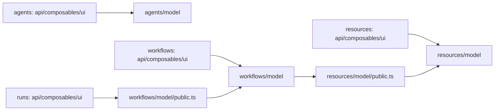

# 前端 Model 层重构设计

状态：2026-10-06 规划交付，尚未 apply。本次用户已纠正范围：重构 Model 层，不重排 API、UI、Composable 和路由。范围见 [proposal.md](proposal.md)，证据见 [references.md](references.md)，唯一实施清单为 [tasks.md](tasks.md)。

## 1. Context 与分层顺序

先以 Agents、Resources、Workflow 作为业务垂直边界，再在各业务的 `model/` 内细分。保留现有技术层，不采用 `agents/session/api` 或 `workflows/run/ui` 这类把所有层搬到子业务目录的结构。

**当前现状**：`api/`、`model/`、`composables/`、`ui/` 是业务模块下的同级目录；现有四个 `model/` 中没有 `api/` 子目录。API 引用模型类型与 API 实现放入模型是两回事。

**本次目标**：先按业务垂直划分 `agents`、`resources`、`workflows`、`runs`，再只在业务内部的 `model/` 中细分。`api/`、`composables/`、`ui/` 始终是业务模块的同级目录并保持原位；HTTP/SSE 请求、SDK adapter、Vue 控制器和组件不成为 Model 的子模块。目标树完整展示业务边界和 Model 子树。

用户选中的 [Agent 交接](../../../.worktree/redesign-agent-module/docs/redesign-agent-module-handoff.md) 对应 `065701c`：交接分支已经采用 `@langchain/vue`，主工作区仍有旧 SSE 实现。这个差异作为 Model 兼容检查依据，不要求本 change 合并或改造 SDK 实现；实施时在所选基线里更新 Model 引用，既有 SDK/事件协议保持原样。Workflow 的 Agent Task 和汇总优化字段同样必须保留。

## 2. 目标目录

```text
frontend/src/modules/
├── agents/
│   ├── api/                        # 保持原位
│   ├── composables/                # 保持原位
│   ├── model/
│   │   ├── session/                # 会话、分支、模型引用、session kind
│   │   ├── runtime/                # 事件、turn、transcript、预算、工具视图
│   │   ├── workspace/              # 用户文件、目录、分页、条件写入 DTO
│   │   ├── workflow-handoff.ts     # 结果续接输入/来源值类型
│   │   └── public.ts
│   ├── ui/                         # 保持原位
│   └── public.ts
├── resources/
│   ├── api/                        # 保持原位
│   ├── composables/                # 保持原位
│   ├── model/
│   │   ├── source/
│   │   │   ├── definition.ts       # SourceConfig、策略、limits
│   │   │   ├── call.ts             # MCP/CLI 调用身份与方式
│   │   │   ├── parameters.ts       # arguments/options 等静态值与纯转换
│   │   │   ├── setters.ts          # 现存历史字段；无实现不造空模块
│   │   │   ├── overrides.ts        # SourceOverride、编辑输入/gateway 类型
│   │   │   ├── defaults.ts         # Source 默认构造
│   │   │   └── filtering.ts        # 现有名称/筛选纯逻辑
│   │   ├── mcp/                    # MCPServerConfig、配置导入和默认值
│   │   ├── ai/                     # AIConfig、模型配置和默认值
│   │   ├── channel/                # ChannelConfig、override 和默认值
│   │   ├── credential.ts           # 共享凭据值类型/纯 schema 投影
│   │   ├── catalog.ts              # ResourceMap、种类、名称、工厂组合
│   │   └── public.ts
│   ├── ui/                         # 保持原位
│   └── public.ts
├── workflows/
│   ├── api/                        # 保持原位
│   ├── composables/                # 保持原位
│   ├── model/
│   │   ├── shared/                 # 阶段、Session、Phase、Progress 公共值类型
│   │   ├── create/
│   │   │   ├── definition.ts       # WorkflowDefinition、schedule
│   │   │   ├── defaults.ts         # 唯一 createWorkflow 工厂
│   │   │   ├── actions.ts          # 不可变草稿动作与引用联动
│   │   │   ├── validation.ts
│   │   │   ├── backup.ts
│   │   │   ├── sourceUsage.ts
│   │   │   └── stages/             # 采集、分析、汇总、通知的配置/默认值
│   │   ├── run/
│   │   │   ├── session.ts          # 状态映射、终态判断和纯投影
│   │   │   ├── progress.ts
│   │   │   └── recovery.ts         # 恢复查询/重跑选项值类型
│   │   ├── history/
│   │   │   ├── filters.ts
│   │   │   ├── report.ts
│   │   │   └── artifacts.ts        # 正文可用性、显示标签/查询值类型
│   │   └── public.ts
│   ├── ui/                         # 保持原位
│   └── public.ts
└── runs/
    ├── api/                        # 保持原位，消费 Workflow Model
    ├── composables/                # 保持原位，消费 Workflow Model
    ├── ui/                         # 保持原位，消费 Workflow Model
    └── public.ts                   # 仅更新模型导出；runs/model 迁移后删除
```

这张树先展示业务边界，再展示每个业务的 Model 子模块；不要求每个字段造独立文件。Source 调用参数仍只有一份：`call` 引用参数值类型，最终对象仍由现有 Source editor 保存。DTO 字段和 JSON 形状不因内部拆分变化。

## 3. Agents Model

- `session`：AgentSession、父子分支、标题、模型引用、会话来源和 session kind；`sessionProjection` 按其实际事件职责归 runtime，而不是创建第二份会话状态。
- `runtime`：AgentEvent、ContextBudget、TurnAccepted、AgentTool、AgentConfig/Settings 及纯事件校验、去重、transcript/会话投影。这里不放 SDK transport、SSE 连接或可变命令草稿。
- `workspace`：AgentFile、目录条目、offset、hash、readonly 等用户文件操作值类型。If-Match/If-None-Match 仍由现有 API 实现，冲突草稿仍由现有 `useAgentFiles` 管理；Agent 后端工具执行与这里无关。
- `workflow-handoff`：只定义续接输入、来源 ID 和模型引用。已有 ContinueInAgent 页面继续负责跨业务组合，不搬到新的 integration 目录。

真实模型需要共享少量值类型时按单一文件定义，并通过纯 type 引用连接；不能为了禁止一切依赖复制 ContextBudget 或 AgentSession。Model 拆分不改变当前选中会话和事件流的状态拥有者。

## 4. Resources Model

先按 Source/MCP/AI/Channel 配置拆分当前 `types.ts` 和 `resources.ts`，各自 defaults 由原 `createResource` 工厂组合。`catalog.ts` 保存 ResourceMap/ResourceKind 的聚合索引，不重建一份资源 DTO。

Source 再按以下职责划分：

| 模型 | 内容 |
| --- | --- |
| definition | id、display_name、description、enabled、timeout、limits、错误策略和 SourceConfig 聚合 |
| call | MCP server/tool，CLI argv/shell、可执行文件、cwd 的调用值对象 |
| parameters | MCP arguments、CLI 参数和 options 的静态值类型/纯转换，schema 组件留在 UI |
| setters | 只隔离当前真实存在的旧字段，不新增 Setter 管理 API 或 UI |
| overrides | SourceOverride、SourceSaveTarget、SourceUsageView 和 gateway 类型声明 |

`SourceConfigEditorGateway` 的 Promise/AbortSignal 接口可以作为类型声明保留在模型，但 resolve/save 的实际调用和保存范围处理不搬进 Model。共享资源与 Workflow 草稿的两种保存目标不变。

后端 `calls.py` 拥有有效调用解析；前端只编辑配置，不复制模板合并、参数覆盖或默认值解析规则。MCP 服务配置与来源的工具调用参数分别定义，仍保留 env/encrypted 凭据引用。

## 5. Workflow Model：创建、运行、历史同目录

### 5.1 Create

Workflow 定义与草稿纯逻辑放入 `workflows/model/create`。现有 defaults/actions/validation/backup/sourceUsage/cronPresets 按职责迁移。

每个阶段保存自己的配置类型和默认构造，顶层 `createWorkflow` 只组合一次；Workflow actions 仍以不可变输入/输出维护 source/fan-in/channel 引用。Resource 类型从公开模型契约输入；资源加载、resolve 和保存调用仍在原 API/Composable 层。

保留 agent_mode、agent_tools、single_task_optimization、分层提示词、schedule 和分类保留期。不新增默认值，不把新建模型和后端执行器混在一起。

### 5.2 Run

从 `runs/model` 迁入运行 Session/状态、WorkflowProgress、阶段和终态判断等纯模型；恢复请求和重跑选项若当前写在 `runsApi.ts`，只提取其值类型，API 方法本身保持原位。这里不包含 trigger/cancel/resume HTTP 调用或 SSE 生命周期。

### 5.3 History

从 `runs/model` 迁入历史筛选、报告解析、ReportSection/ReportItem、产物可用性标签和 Phase 查询输入。按 `(session_id, version, stage)` 理解正文身份，查询、缓存和分页状态仍由现有 Composable 管理。

### 5.4 Shared

`WorkflowStage`、`SessionStatus`、`ArtifactInfo`、`PhaseContent`、`SessionRecord`、`WorkflowProgress` 在一个位置定义，由 run/history 共同消费，不复制同义字段。shared 只放真实跨模型的值类型，不放统一 store、API 工厂或运行时总线。

## 6. 公开出口与依赖



业务内消费者直接使用本业务 `model/public.ts` 或同域精确文件；模型实现不反向导入自己的聚合 barrel。跨业务只通过纯 Model 公开出口，避免 import 顶层 UI/API barrel 产生循环。

在现有 `check-architecture.mjs` 扩展两个窄规则：Workflow Model 可引用 Resource Model 的公开契约；runs 消费层可引用 Workflow Model 公开契约。不放开 runs 对 workflows API/UI 的深层依赖，不新建第二检查器。type-only、动态导入和 model 纯度仍需检查。顶层 public.ts 可聚合导出同一模型定义，不能保留旧 runs/model 的转导目录。

## 7. 迁移、验证与回退

1. 盘点当前 Model 和对应消费者，记录主仓/选中交接的字段差异；选择实际实施基线，不要求本次合并后端重设计分支。
2. 拆 Agents 和 Resources 的模型与唯一 defaults，消费层只更新导入。
3. 统一 Workflow create/run/history 模型，更新 runs 消费引用和必要的架构规则。
4. 删除旧 Model 重复定义/转导；API、UI、Composable、pages 和路由物理位置保持原样。
5. 按目标 Model 单测、typecheck/architecture、build 验证；已有 Agent SDK、Source editor 和 Run detail 测试验证消费者行为未变。

回退按模型迁移提交及导入更新原子回退，不保留两份长期 DTO 或 defaults；不回滚用户无关文件。

## 8. Risks / Trade-offs

- Workflow 模型合并而 runs 消费层留在原位 → 明确纯 Model 公开出口和窄依赖规则，不顺带移动 API/UI。
- 相同字段拆出多份类型或 defaults → 单一聚合 DTO、单一工厂和 round-trip/默认值对比验证。
- Source 分层变成多个草稿 → 所有 Model 函数为纯转换，现有 editor 的 Vue 草稿保持唯一。
- Setter 被误读为新资源能力 → 无真实实现不造空模块，不添加 CRUD、模板服务或隐式迁移。
- 旧 SSE 和 SDK 分支不同 → 本次只核对 Model 兼容，不合并或改写 stream/adapter；测试必须在实际实施基线上运行。

## 9. Non-Goals

不移动或重构 API、UI、Composable、页面、路由、SDK adapter 或后端 Runtime。除必要 Model 导入/类型签名适配外不修改消费层行为，不新增缓存库、权限规则、运行协议或用户能力。
