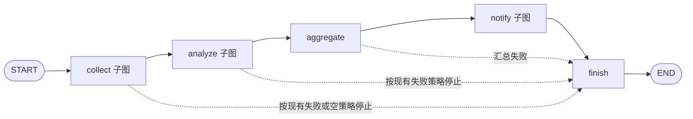
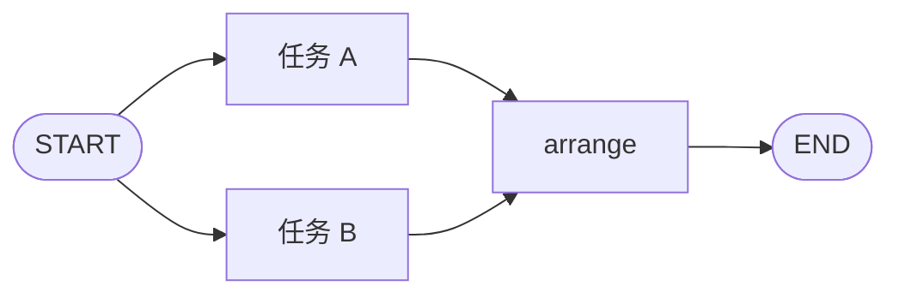
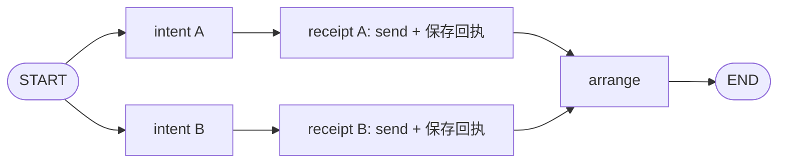

# Workflow 图执行与流式输出设计

## Context

旧版并非自行实现 LangGraph 调度：`fan.py` 已逐来源、逐分析项注册图节点；父图注入官方 `AsyncSqliteSaver`，子图继承；`service.py` 使用 `thread_id=session_id`、`ainvoke(..., durability="sync")` 执行和恢复。复杂度主要来自图周围的业务存档、阶段包装和查询协调。

本设计以这些实际能力为基线，替换旧版全局串行通知决策，并精简执行入口与过程输出。已有归档 proposal/design 保留为历史依据。本文件为新设计，不由移出的伪代码推导实现。

## Goals / Non-Goals

### Goals

核心目标为精简 Workflow，以及让前端及时看到必要的业务进度；以下持久化、恢复与兼容要求为这两个目标的约束。

- 由 LangGraph 唯一决定阶段流转、分支调度和执行位置；应用层不根据业务历史另行调度节点。
- 将 Workflow 工作逻辑与 `astream` 消费子模块分开，减少重复转发和只为展示而存在的图节点。
- 按 tags 选择 fan-out 单项成功、fan-in 完成、aggregate 成功及逐渠道发送成功等必要业务更新，及时推送前端；粒度细于子图，不广播所有内部节点。
- 保留采集、分析的逐项图任务及成功结果复用，复用现有业务函数和外部能力接口。
- 子图采用 per-invocation 持久化以恢复进程中断；用户通过 resume 从选定父图阶段重跑至 finish。已经由父图接收结果的子图内部 checkpoint 异步清理。
- 独立通知投递并行，每条投递内部严格先持久化意图，再发送并保存回执。
- 限制非 Workflow 模块改动，保留已保存配置、提示词、调度、业务历史及备份语义。

### Non-Goals

- 不将整个采集或分析批次封装为一次 ToolNode，也不在单个节点中用 gather 替代图任务边界。
- 不建设通用事件总线、事件溯源平台、独立恢复引擎或通用 Agent 编排框架。
- 不在本次重构中删除 BackupPolicy 或业务历史版本，不直接把所有正文迁入 checkpoint。
- 不新增 fork 产品入口或“挑选一个已返回 failed 的业务分支单独重试”的接口，不改变 Agent 按 sessionID 主动读取的接续方式，不新增零分析任务配置模式。

## Decisions

### 1. 父图只表达业务阶段

配置快照在运行准入时固定。阶段中仍执行既有失败、空结果、部分输出规则；关闭 fan-in 时，aggregate 只负责按既有规则冻结分支输出，不额外调用模型。保留分层提示词的模型复用、显式模型及旧配置纯拼接语义，不将所有汇总强制改为单次 LLM。

图由少量构建函数及节点函数组织；不要求为每个职责建立类或文件。仅展示用途的包装可删除；阶段入口必须保留明确的 checkpoint 与前驱路由。现有 `start_*` 如用于稳定定位 resume，可保留该用途，不为减少节点数而丢掉恢复锚点。

### 2. 采集、分析保留逐任务 fan-out

每个来源或分析项都是独立 LangGraph 任务，arrange 在本批任务汇合后按配置顺序整理。节点输入只包含该项所需配置、共享输入或其引用、稳定业务身份和存储访问所需信息；CollectorManager、AIService、凭据解析器等静态能力通过依赖注入提供，不序列化进 state。独立任务的持久化用于本次子图调用遭遇进程中断后的恢复；用户主动重跑阶段时，不复用该阶段上一轮成功分支来跳过工作。

首选沿用 `fan.py` 的逐项节点注册方式，共享业务调用函数，避免以统一节点名称为目标重写图。

局部采集/模型业务失败转换为该项明确结果；取消继续传播，存储或运行基础设施错误不得伪装成普通成功或空结果。并发更新按稳定 item ID 合并，避免覆盖其他分支。并发上限沿用现有 collection_concurrency、analysis_concurrency；完整共享输入及声明顺序不变。

返回 `status=failed` 但正常结束的节点，在 LangGraph 看来已经完成，不能期待 `astream(None, config)` 自动再执行它。此类结果按既有 continue/stop 策略汇总；用户想重做时选择该父图阶段，通过第 5 节的阶段重跑重新执行，不再增加单项业务重试调度器。

### 3. 通知改为并行 intent → receipt 分支

以 `(session_id, execution_epoch, output_id, channel_id)` 识别一次投递。execution_epoch 是一次主动执行轮次：初次运行产生一轮，进程中断续跑保持原轮次，用户从阶段重跑产生新轮次。冻结的每个输出与每个已选渠道组成独立分支，各分支无交叉顺序依赖：

- intent 提交成功后，该分支才能进入 receipt；发送意图不可交由尚未完成的 stream 消费者异步保存。
- receipt 负责一次外部发送并立即持久化结果。已有确定回执直接复用；跨执行恢复时发现旧意图而没有确定回执，沿用 `delivery_uncertain`，不自动补发。
- 本次执行刚建立的意图与重启前遗留意图必须可区分。不能仅以“意图存在”判断它是本次可发送的新意图，也不能将 checkpoint 恢复误认为外部发送恰好一次。
- 同一轮进程恢复沿用原稳定业务键；主动阶段重跑用新轮次的键，notify 会重新投递，旧轮次回执不能使它静默跳过。实际并行的分支只写自身结果，不覆盖整份通知状态。单条发送失败不取消其他已允许的投递，arrange 汇总真实结果。
- 无渠道或无可发送输出时直接汇合，不等待不存在的分支。
- 结果列表仍按输出、渠道配置顺序展示；实际发送开始、完成和外部到达顺序不再保证。这明确替换旧设计按声明顺序逐条发送的约束。

并行要求指 Workflow 不再人为串接独立分支。当前 ChannelManager 对同一常驻实例有 `send_lock`，插件也可能串行访问共享文件；保留已有资源互斥，不在此变更中改变插件并发契约。不同实例应能重叠执行；同实例调用允许在能力层排队，不承诺所有外部 I/O 同时发生。首版不新加一个未经测量的 notification_concurrency 默认值，沿用既有运行容量及渠道资源约束；真实压力证据需要新增容量策略时再单独记录依据。

### 4. Workflow 工作逻辑与 astream 消费子模块

Workflow 内部划分两部分职责，不要求拆为独立服务：

| 部分 | 职责 |
| --- | --- |
| Workflow 工作逻辑 | 构建父子图、调用业务能力、产生结果，完成恢复和外部副作用所必需的业务提交；LangGraph 管理调度与 checkpoint |
| astream 消费子模块 | 消费同一次执行的更新，筛选必要业务事件、更新查询投影、向前端推送；不根据事件启动下一业务节点 |

SessionStore 是共用的业务存储能力：可重建的展示状态和过程索引由消费子模块更新；正文、配置快照及通知 intent/receipt 等必须先提交的事实，仍由执行路径等待保存。消费者引用已有结果，不重复存正文；SessionStore 本身不承担流循环或图调度。

每次执行或续跑请求只启动一次 `graph.astream` 并消费至结束，继续使用原 thread_id 和同步 checkpoint 持久化边界。订阅父子图更新；按实际安装版本的公开 stream 格式解析 namespace、节点/任务身份及更新。消息流仅在存在模型增量需求时开启。tags 可辅助分类，但不能作为唯一身份或存档幂等键。

前端推送按业务意义选择，不能仅订阅父图阶段完成，也不能把全部子图节点更新原样转发：

| 必要推送点 | 粒度与时机 |
| --- | --- |
| fan-out 某一项成功 | 采集或分析子图中一个来源/分析项完成必要业务提交后即推送，不等待其他分支或 arrange |
| fan-in 完成 | 实际业务汇总结果完成后推送一次；这里指业务 fan-in，不是所有子图里名为 arrange 的排序/汇合节点 |
| aggregate 成功 | aggregate 完成必要业务提交并冻结输出后推送一次，不等待 notify；关闭模型 fan-in、只整理或冻结分支输出时也推送 |
| 某个渠道发送成功 | 以 output/channel 投递项为单位，在外部发送成功且确定回执持久化后推送，不等待其他渠道 |

初始化、路由、存档包装、intent、单纯排序等内部节点默认不推送；内部状态仍可用于诊断。上述业务项失败时也应反馈必要错误状态，不能因节点正常返回就标记成功；`delivery_uncertain` 不算发送成功。fan-in 未启用时不伪造模型汇总完成事件，但 aggregate 成功仍需推送。fan-in 与 aggregate 若是不同业务完成点，分别推送；若同一个完成结果被两种分类或父子图重复暴露，则合并为一次更新并明确 aggregate 已成功，不能漏报该阶段完成。

在需要对外展示的业务节点/可运行对象上配置 tags，用于标识事件类别；结合 namespace、节点/任务身份与业务结果定位具体条目，不能只靠 tags 区分并发任务或继承 tags 的内部调用。使用父子图的逐任务更新，而非等待整个子图输出；以当前 LangGraph 版本公开的 stream 格式实现并验证分类映射，不假定每个 updates chunk 都自带 tags。

消费者取得选中的更新后及时 await 推送或进入受控发送队列，不人为攒到阶段结束；“及时”允许协程调度、必要提交与传输耗时，不承诺零延迟。该项业务完成不等于父图 checkpoint 已提交，不能用前端事件作为恢复或清理屏障。对外只投影必要状态、摘要、正文可用性及已提交结果的引用/版本，不默认发送完整 state、配置或正文。

对外过程信息至少关联 session、execution_epoch、阶段、事件类别、适用的 item/output/channel、状态或错误。前端按本轮稳定业务身份更新条目；重连通过现有查询补齐已提交状态，不假定 `astream` 自带持久化消息重放。父子图重复暴露同一结果时，不产生重复业务版本；不假定流事件按配置顺序到达。不为每个 token 建业务历史版本，不重复保存完整正文。

运行入口、事件解析和消费者可以是函数，不额外建立多层 Service/Coordinator/Dispatcher。复用必要的任务句柄、准入容量、取消和关闭逻辑；同一 thread 不允许被两个活动执行同时推进。HTTP 订阅断开不等于取消后台运行，取消仍走现有显式入口。

消费方式默认直接 await 或使用受控队列；不得每个 chunk 创建无界线程或未跟踪后台任务。必要的查询持久化失败明确反馈到运行状态；单个可选进度订阅者断开不阻塞整个运行。关闭时等待已接收的必要写入或报告未完成，不提前报告全部落盘成功。实现只引入实际需要的消费者，不预建通用广播系统。

#### 4.1 Workflow 前端的执行视图

本节依据用户“前端也要跟着修改，特别是 workflow 可以及时更新”的要求，细化既有第 4 节的消费边界。当前 `frontend/src/modules/runs/composables/useSession.ts` 每 2000 ms 轮询 session，`useRunDetail.ts` 按记录 version 重新查询阶段报告，`RunProcessDetails.vue` 默认折叠过程；这套阶段报告读取不能单独承担逐项实时进度。现有 Workflow interaction 仅有查询和操作路由，Agent Web 渠道的 SSE 不是 Workflow 订阅入口，不能视为本能力已经存在。

- Workflow 列表的“立即运行”继续进入该 session 的运行详情；运行详情是 Workflow 实时执行视图。页面普通模式直接展示当前阶段及采集项、分析项、业务汇总和通知投递的必要状态，不要求打开高级模式、展开原始 JSON 或点击刷新才能看到进展。配置编辑仍负责配置，不承载第二份运行状态。
- 条目以 session、execution_epoch、阶段及 item/output/channel 业务身份定位；名称和排列来自该次运行快照，不能用修改后的 Workflow 配置重命名或重排旧运行。采集/分析项及 output/channel 投递按配置顺序展示，事件乱序不造成跳行、串项或覆盖兄弟分支。
- 已提交的单项结果到达即更新其条目；尚未完成的其他条目不被推断为成功。采集/分析成功、失败、汇总完成、渠道发送成功、失败及 `delivery_uncertain` 使用明确文案；不使用完成项数量推断整个运行已结束，不暴露 intent、arrange 等内部节点作为业务步骤。
- aggregate 成功即展示最终报告可用性，必要时按事件引用的固定业务版本读取报告，同时明确通知是否仍在进行；aggregate 成功不等于运行终态。正文未保存或过期时保留可读摘要和不可用原因，不等待正文才能显示进度，也不假装正文可读。无渠道、无输出或策略停止以真实阶段/终态呈现，不制造永远等待的条目。
- 运行生命周期状态同步至摘要和操作按钮。用户可以区分“执行中”和“进度连接中断”；连接中断保留最后已知结果并提示需重新同步，不能把网络错误转换为 Workflow 失败或成功。
- 正常实时更新由订阅驱动，移除该执行视图中作为主路径的固定 2 秒轮询；查询用于首屏、重连、终态核对和用户主动刷新。不增加静默轮询降级，也不对每条进度更新重新拉取所有阶段正文。

#### 4.2 Workflow 订阅、查询与页面生命周期

采用 Workflow 自己的只读 SSE 入口 `GET /api/sessions/{session_id}/events`，用于观察已存在的运行。复用 HTTP/SSE 基础传输方式，不接入 Agent command、Agent 事件持久化日志或 Agent 自动接续。订阅入口只登记观察者，不能启动第二次 `astream`、trigger 或 resume；所有观察者消费同一次后台执行的投影。

对外字段在 interaction schema 与前端 runs 类型中保持一致，最小契约如下；最终字段名在实施时统一记录于本轮任务，不从 LangGraph 内部 chunk 直接生成前端接口：

| 内容 | 对外含义 |
| --- | --- |
| session_id、execution_epoch | 运行及执行轮次身份；不能拿轮次代替业务 version，也不能靠字符串大小猜新旧轮次 |
| stage、业务事件类别 | 第 4 节限定的业务完成/错误类别，以及必要的运行生命周期状态；内部路由节点不对外展开 |
| item_id 或 output_id/channel_id | 定位采集、分析或通知条目；只提供适用的身份，不以 tags 或数组下标作为唯一键 |
| 状态、错误、摘要 | 来自已提交事实的可展示内容；未知和不确定状态不得转成成功 |
| 结果引用、业务版本、正文可用性 | 需要读正文时使用该引用所对应的固定版本；不默认夹带完整正文、配置或凭据 |

既有 session 查询最小扩展为能返回当前 execution_epoch 与已提交的逐项进度投影；固定版本查询仍对应原业务历史，不混入最新轮次的活动状态。查询与推送读取同一投影，不能在 HTTP 层再维护一套业务状态。后台先完成必要事实/查询投影提交，再发布对应可查询的结果通知；该提交不是父图 checkpoint 屏障。

首屏及每次重连采用“订阅已就绪 → 查询快照 → 合并期间更新”的同步边界：服务端在观察者实际注册后给出就绪信号，前端缓存同步期间收到的业务更新，查询返回后依据轮次与已提交结果引用/版本归并。实现须使用可比较的已提交结果版本或等价的原子快照边界，证明较旧查询不会覆盖较新事件；不能用客户端接收时间推断业务先后，也不能仅先 GET 再连接而遗漏窗口中的最终更新。就绪信号是传输控制信息，不显示为业务完成。重连通过查询补齐，不承诺 `Last-Event-ID` 的持久化重放。

运行终态提交后发送必要的状态更新，前端核对查询并结束活动订阅；若连接先断开，走同一重连同步流程确认终态，不把 EOF 当成执行完成。新一轮阶段重跑发生时按服务端确认的轮次切换活动视图，保留历史固定版本；旧轮次的迟到事件、旧查询响应不得覆盖新轮次条目。

在 runs 模块内集中处理订阅与合并，页面只负责布局和动作组合。切换 session、离开页面或销毁作用域时释放连接、待处理查询和重连任务；迟到回调必须核对 session、轮次及当前订阅代次。断开观察不能取消后台执行，取消仍走明确的操作入口。沿用直接 await/受控队列边界；订阅者跟不上或同步缓冲无法继续接收时明确中断连接并重新同步，不丢弃更新后继续标记为已同步。

#### 4.3 前端恢复入口与轮次切换

运行页区分“继续中断运行”和“从阶段重新执行”。前者不传 stage，沿用原轮次；后者只提供 collect、analyze、aggregate、notify，展示“重做所选阶段及后续流程；进入通知阶段会重新发送”的操作说明，仍在原 session 中创建新轮次，不提供单项失败重试或 fork。

恢复可用性由后端针对相应模式、目标阶段及所需材料核验；现有仅含 available/reason 的恢复查询需最小扩展或接受目标阶段参数，不能只根据 session.status 复用旧的统一“恢复执行”按钮。完成的运行也可在入口及上游材料可用时主动阶段重跑，正常返回的 failed/partial 不暗示无 stage 续跑会重新执行失败项。

已有活动执行时禁用重复推进，服务端仍负责同 thread 互斥；按钮是否可用不替代服务端校验。受理重跑后查询确认新轮次并接入其进度，不通过页面清空制造“已重新运行”的假象。请求结果未知时先查询核对，不能自动重复提交并意外再投递。恢复材料缺失、checkpoint 不兼容和运行冲突均显示具体原因。

### 5. Checkpoint、resume 与异步清理

#### 5.1 父子图持久化配置

父图编译时注入官方 `AsyncSqliteSaver`，由应用生命周期创建和关闭；`session_id = thread_id`。collect、analyze、notify 子图显式采用 per-invocation：`compile(checkpointer=None)`，作为父图节点继承 saver。本变更不使用 `checkpointer=False` 的 Stateless，也不使用 `checkpointer=True` 的跨调用子图记忆。

每次子图调用有自己的 LangGraph namespace；业务阶段名称、业务 item ID 与 namespace 不混用。namespace 必须读取运行时提供的真实配置，不自行拼接随机任务后缀。`subgraphs=True` 只控制流/状态中子图信息的可见性，不能替代持久化配置。

持久化层次如下：

| 层次                              | 保存内容                                   | 用途与保留边界                                     |
| --------------------------------- | ------------------------------------------ | -------------------------------------------------- |
| 父图 checkpoint                   | 阶段边界、控制状态、配置快照及阶段结果引用 | 进程恢复、阶段重跑；随 session 的既有保留策略管理  |
| 子图 checkpoint 与 pending writes | 当前调用内部的分支进度与结果引用           | 当前调用中断续跑；父图可靠接收结果后异步清理       |
| SessionStore                      | 可读结果、版本、备份可用性、通知意图与回执 | 历史查询、Agent 主动读取及业务幂等，不决定下一节点 |

父图 state 至少能关联原快照、graph_revision、execution_epoch、阶段结果引用和终态；子图 state 关联本轮 item 结果与父图传入的阶段输入。状态只携带可序列化控制信息和符合备份策略的引用，不放客户端或明文凭据。execution_epoch 是运行控制身份，不等于 checkpoint_id 或 session 的业务 version。

#### 5.2 一个 resume 入口，两种运行语义

继续使用 `resume(session_id, stage=None, checkpoint_id=None)` 的应用语义；现有 recover 路由可作为同一实现的兼容别名，不提供另一套 fork 服务。

| 请求                         | 起点                                     | 执行范围                            | 通知行为                               |
| ---------------------------- | ---------------------------------------- | ----------------------------------- | -------------------------------------- |
| 不指定 stage，进程中断后续跑 | 当前活动轮次的最新父图状态及关联子图进度 | 继续未完成任务，沿原图到结束        | 复用本轮确定回执，不自动重发不确定投递 |
| 指定 stage，从阶段重跑       | 所选轮次中该父图阶段开始前的 checkpoint  | 该阶段完整重做，并沿后续图到 finish | 创建新轮次；经过 notify 时正常重新投递 |

stage 可选 collect、analyze、aggregate、notify；finish 是收尾终点，不作为用户重跑业务入口。沿图执行仍遵守原有失败、空输入和停止路由，不强制越过错误调用后续模型或发送。

#### 5.3 进程中断续跑

使用只有原 thread_id 的当前运行配置，通过 `aget_state(..., subgraphs=True)` 检查未完成任务，再调用 `astream(None, config, durability="sync", subgraphs=True)`。不向新调用灌入完整初始 state，不为了“续跑”任意绑定历史 checkpoint_id，不重建新的子图身份。

在同一个父图任务及子图 invocation 内，LangGraph 的 checkpoint/pending writes 用于复用已持久化的成功任务；既有业务存档仍覆盖“业务提交成功、checkpoint 尚未提交”的窗口。不保证尚未持久化的外部模型调用绝不重复，通知通过 intent/receipt 单独处理外部副作用。

父图或子图内部必须保存足够进度才能承诺这一行为；进程中断时子图 checkpoint 不能被清理。若已经正常结束（包括正常返回的 failed/partial 结果），不指定 stage 的 resume 只返回当前结果，不把业务失败自动变成单项重试。用户需要重新计算时明确选择 stage。

#### 5.4 从选定阶段重跑到 finish

1. 在同一 session 的准入/互斥边界内读取原快照及父图历史，只接受属于该 session、兼容 graph_revision 的父图 checkpoint。checkpoint_id 若提供，必须与选定 stage 的入口边界匹配；未提供时选择当前轮次该阶段的入口，不静默退到另一轮历史。
2. 入口应是“目标阶段尚未执行，next 指向其入口”的已提交父图状态。阶段未曾到达、入口已清理、必要上游正文不可用或图版本不兼容时，返回具体原因。仅校验此次重跑需要的原快照和上游输入，不要求已经失效的下游结果仍存在。
3. 保留入口之前的输入与结果引用，创建新的 execution_epoch，清除目标阶段及其后续的结果引用、分支 items、停止/终态信息。若 reducer 合并字典，不能用 `{}` 假装清空；应构建正确的阶段局部输入或采用显式替换，避免上一轮结果混入。
4. 使用公开 `aupdate_state` 在选定父图 checkpoint 上建立新的执行状态，并明确指定将调度到目标阶段的前驱/入口节点；`as_node=目标阶段` 表示目标阶段已经执行，不能用它实现重跑目标。使用返回的配置继续 `astream(None, ...)`，不能丢掉返回的 checkpoint_id 而猜测执行头。
5. 新调用使用新的子图 invocation，不携带旧的子图 checkpoint_map 或 namespace 作为恢复目标。目标阶段所有分支重新执行，后续 aggregate、notify、finish 正常运行；前序阶段不重新调用。所有重新产出的业务条目使用本轮稳定键，不能被上一轮成功存档短路。

例如从 analyze 开始，复用原 collect 输入，重做全部分析，再汇总、通知、finish；从 notify 开始，复用所选历史冻结输出，但创建新投递轮次并执行 notify、finish。从 collect 开始则重新采集并运行全部后续阶段。显式阶段重跑包含通知，即使新正文与原正文相同，也不能被旧轮次回执跳过。

session/thread 不变，原 checkpoint 和业务历史版本不原地覆盖。LangGraph 内部形成新的 checkpoint 后继链是实现细节，不暴露新 session/fork 产品概念。并发 resume 请求不能同时推进同一 session；重放同一已受理请求应关联原轮次，不能意外产生第二轮投递。新轮次标识在首次外部操作前持久化，崩溃后续跑不得重新分配。

#### 5.5 子图内部 checkpoint 异步清理

清理的最小单位是一次已结束子图调用的 `(thread_id, checkpoint_ns)` 及其已确认的嵌套 namespace，而不是整个 thread 或所有同名阶段。必须同时满足：

- 子图正常结束并将完整阶段结果或结果引用返回父图；局部业务 failed 也可作为已汇合结果，真正异常中断或尚有未完成 tasks 不可清理。
- 父图已经同步提交包含该结果的后继 checkpoint，下一步执行不再依赖该子图内部进度；不能以 arrange 的 stream chunk 到达作为提交证据。
- 需要保留的阶段输入/输出、通知意图与回执已由父图引用或业务存储负责，删除子图内部历史不会删除这些业务事实。
- 同 session 的恢复与清理在执行器的同一互斥边界检查，确认没有活动恢复持有该 namespace。启动核对时，中断子图保留；已被父图可靠接收结果的调用可重新进入清理候选。

采用应用生命周期管理的异步清理任务，阶段结果提交后即可触发，无需保留草图的 30 天或等待 60 分钟。队列只携带候选身份、保持有界并合并重复请求，不为每个流事件新建线程。漏掉进程内通知时，下次启动或执行结束核对可从父图完成状态与 saver 清单重新发现候选，不新增第二份执行调度库。关闭时停止接收并有界收尾；清理失败记录错误并保留待清理数据，之后重试，不阻止已提交业务结果读取，也不伪报已释放空间。

清理时在一个存储事务中删除该 invocation 的 checkpoint 和关联 pending writes，不保留孤立 writes。父图入口 checkpoint、父图阶段结果和业务意图/回执不在此清理范围；不能使用 `adelete_thread(session_id)` 来清理子图。嵌套 namespace 使用经过验证的完整集合，不用未经转义的前缀 LIKE 猜测归属。

当前安装的 `langgraph-checkpoint-sqlite 3.1.1` 实现了整 thread 删除，但未提供已实现的 namespace 删除；继承的 `aprune`、`adelete_for_runs` 仍抛出 NotImplementedError。因此在 saver 所属存储边界补一个窄的 namespace 清理适配，复用连接互斥和事务，参数化 SQL，仅负责已确认候选的 checkpoints/writes 删除。业务层不直接操作第三方表，不复制整个 saver 或重写恢复协议。此处是相对旧“完全不触及 checkpoint 表”的明确、有限扩展；需针对当前 saver schema 做契约测试。

删除子图 checkpoint 使 SQLite 空闲页可复用，不保证数据库文件立即缩小；不要每次清理都执行 VACUUM。本次不新增磁盘压缩策略。

清理后仅支持父图阶段入口重跑，不再承诺跳回已清理的子图内部历史任务。父图历史里曾指向该子图的中间记录仍可展示“内部进度已清理”，不能作为可用的内部恢复入口。当前未完成 invocation 的恢复与已经保存的父图阶段边界不受影响。

#### 5.6 业务存储边界

checkpointer 管理执行状态、pending writes 和历史 checkpoint；恢复调用使用原 thread 和原配置快照，不从业务阶段标签推断下一节点。`astream` 与 `ainvoke` 共用同一恢复机制，不以“重新消费 stream”作为恢复执行的方法。

本次保留 SessionStore 的已存正文、业务版本、备份开关和只读查询能力，复用其基础存储实现。数据按用途区分写入时机：

| 数据                                          | 写入时机与依据                                   |
| --------------------------------------------- | ------------------------------------------------ |
| LangGraph 执行进度                            | 由 checkpointer 在图执行中保存                   |
| 恢复必需的正文/引用、配置快照、通知意图和回执 | 由所属操作等待持久化，再允许依赖该事实的后续操作 |
| 可由已提交状态重建的阶段展示、过程索引、诊断  | 可由 stream 消费者更新，不作为执行调度依据       |

同一业务事实只有一个写入所有者。已有节点已保存的结果，stream 消费者只引用或投影，不再存一份正文；幂等依赖稳定业务身份，而非本次消费时间、随机 ID 或 tags。stream 中断后查询可依据已提交事实补齐，不能仅凭曾看到一个 chunk 就声明 checkpoint 已提交。

旧版通用存档包装按实际用途收缩，不强制保留所有 ArchiveRuntime/工厂层级，也不把必须等待的存档整体搬到后台。正文未启用备份时仍只在当前运行内存中可用，不通过 checkpoint 或 pending writes 绕过备份策略。需要已过期、未保存内容的恢复明确失败。

本轮已确定采用引用方案：SessionStore 保存符合备份策略的正文，checkpoint/pending writes 保存执行控制信息及正文引用，不保存完整正文副本。固定业务版本继续由 SessionStore 发布，SessionReader 按指定 version 读取；重复消费不增加版本，新轮次不覆盖旧版本。正文过期时保留摘要、身份和不可用状态，不能以最新正文替换。

子图内部 checkpoint 清理不连带删除 SessionStore 的正文或业务版本；正文保留期由 BackupPolicy 管理。此方案保留必要的执行/业务提交协调，复用现有备份、历史查询及 Agent 读取能力；正文是否迁入 checkpoint 不再是待定项。

### 6. 非 Workflow 模块复用

| 模块                                       | 本次边界                                                                                                                                                                  |
| ------------------------------------------ | ------------------------------------------------------------------------------------------------------------------------------------------------------------------------- |
| Collector、AI、Channel、插件注册、凭据管理 | 复用现有接口和实现，不因图变化更换协议                                                                                                                                    |
| 配置及公共模型                             | 保留现有资源、快照、提示词与调度；仅在明确的接口适配确有需要时修改                                                                                                        |
| lifecycle                                  | 调整运行入口装配、活动任务状态和启停调用，继续由创建者关闭 saver                                                                                                          |
| interaction                                | 保留 trigger/query/cancel，resume 增加可选 stage/checkpoint_id；recover 兼容别名复用同一实现，无 stage 仍是原运行续跑                                                     |
| History Collector、Agent 接续              | Agent 继续根据 sessionID 主动调用 SessionReader，先取记录版本再取该版本阶段正文；不注入 checkpoint、不自动续接完整模型对话、不因 Workflow 新轮次自动改写已创建 Agent 会话 |
| 前端                                       | 按第 4.1–4.3 节改造 Workflow 运行详情、runs 订阅/合并与恢复动作；普通模式逐项更新，替换运行详情固定轮询，重连查询补齐并隔离轮次；配置编辑保持既有职责                                                                                  |

### 7. 旧运行兼容和默认值

保留现有配置数据及历史查询。图节点重命名、删去 start_* 或通知拓扑改并行可能使旧 checkpoint 的 next/tasks 指向失效节点；实施前以旧图生成真实 checkpoint 验证恢复。不能把旧串行通知的中间状态直接送进新并行拓扑猜测续跑。无法保持恢复兼容时，应给出明确不兼容原因并先确定迁移范围，保留历史数据，不自动重新采集或重发；具体迁移方案在任务中记录，若改变本节兼容目标则另行修订设计。

本次不调整 collection_concurrency=4、analysis_concurrency=4、max_concurrent_runs=4、备份默认开启及 retention_days=None；依据为现有模型和运行配置，避免纯结构重构改变运行预算和保留行为。移出草图的“30 天不活动、60 分钟清理”不是本次默认值依据。

## Alternatives / Trade-offs

- 只将 ainvoke 替换为 astream：改动小，但保留全部包装复杂度，不能达到本次简化目标。
- 本次方案：复用逐项图任务和底层能力，压缩包装、统一观察入口、通知并行；保留真实持久化边界，缩减幅度取决于这些边界而非文件数。
- 整批 ToolNode/gather：图定义短，但改变逐项恢复粒度，用户已明确撤回。
- 立即删除业务存储并只用 checkpoint：改动扩大到备份、历史、Agent 和 API，本次不选。

采集与分析原本已并行，不承诺改用 astream 后总耗时明显下降。通知的独立慢渠道可以重叠等待；SQLite 写入及共享实例锁仍会限制吞吐。评估以相同输入、并发和持久化保障下的执行耗时、写入次数和代码职责为准，不通过延后落盘制造性能提升。

## Validation

验证独立任务的乱序完成、局部失败、真实重启后成功项复用、并发结果不丢失，以及双消费者不重复写版本。通知验证不同渠道调用实际重叠、每条意图先提交、局部失败隔离、无目标汇合、取消，以及发送成功后回执保存前强退时不自动补发。

真实 SQLite 检查父子 checkpoint、pending writes 与业务正文的备份开关；检查旧 checkpoint 恢复兼容性、History Collector、Agent 接续和查询返回。验证流消费者阻塞/断开/写失败时运行结果真实且无无界后台任务。后端每个测试命令硬超时 60 秒；再执行静态检查、构建和最小集成烟测。

新增验证：业务 failed 不触发隐式单项重试；进程强退后在原 per-invocation namespace 续跑；从 analyze/notify 阶段重跑至 finish 的真实调用计数、原轮次和新轮次的投递区分；入口选择、reducer 清空、重复请求和并发 resume；子图完成但父图尚未提交时不能清理、提交后异步删除、清理/恢复互斥、清理失败与重启补扫、父图历史重跑仍可用。仅查看 compile 参数不能作为断点恢复测试通过的证据。

新增推送验证：阻塞一个 fan-out 分支，确认前端在该分支结束和 arrange 执行前已显示另一成功项；fan-in 完成只产生一次业务更新，aggregate 成功在 notify 完成前可见（包括关闭模型 fan-in 的情况），单渠道确定发送成功不等待其他渠道；初始化、intent 与纯排序节点不泄漏为业务推送。验证错误、重复更新、断线重连和慢订阅者，不用固定毫秒阈值替代粒度与时序验收。

前端补充验证：从 Workflow 列表触发后进入真实运行页；普通模式在慢分支释放前显示快项结果，aggregate 报告在慢渠道结束前可用。覆盖首屏订阅/查询窗口、断线期间最终事件、旧查询晚到、新旧轮次交错、切换页面及连接释放；验证重复订阅不会增加业务执行次数。验证两种恢复动作的参数、可用性、再次发送说明和结果未知处理。按单元测试、类型/架构检查、前端构建、真实 HTTP/SSE 与浏览器烟测顺序执行；仅 mock 事件不能作为端到端实时能力完成的证据。
