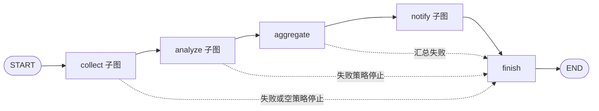
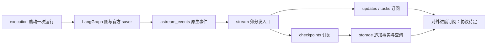

# Workflow 原生事件流与四部分模块设计

## Context

本轮取代此前“checkpoint 只保存引用、节点同步存入 SessionStore”的方案。该实现从基线 `8ab64a1` 到 `f175e03`，原六个执行模块 1,399→1,358 行，整个 Workflow 目录 1,988→2,387 行，前端 runs 模块 1,018→1,735 行。这些数字保留为历史观察。用户本轮明确取消代码行数必须下降的要求：本变更包含新增能力，允许合理增长，验收关注功能、职责与重复实现。

本轮用户授权按 storage、graph、execution、stream 四部分重新组织 Workflow，并明确使用 `astream_events`，图内 tags 分类、`config.metadata.sessionID` 注入运行身份。旧日期任务保留历史；本轮依据与未实施任务见 [原生事件流与模块拆分任务](tasks/2026-09-28-native-events-layout/task.md)。本轮只修改 OpenSpec，不将目录设计或旧任务的通过记录视为新实现已验收。

当前 worktree 已有五阶段图、逐项子图、并行 intent/receipt、恢复及清理，并有未提交的内容 state、分类归档和 snapshot 实现。现状不等于目标结构：当前 archive.py 仍只消费 updates 后扫描历史，service.py 仍组装归档报告，尚未按本轮四部分及原生事件接口拆分。外部 snapshot 的首帧、版本传输、心跳和断连协议重新列为待讨论，不能由现有代码反推为本轮最终决定。

## Goals / Non-Goals

### Goals

- 以 collect→analyze→aggregate→notify→finish 图直接表达业务，节点读取局部输入、调用能力、返回内容。
- 实际删除正文引用解析、节点存档工厂、运行时正文缓存和全局结果重建；按第 7 节审查职责与功能，不以代码行数下降作为验收门槛。
- 保持 fan-out 逐项任务、通知并行 intent→receipt、per-invocation 中断恢复、阶段 resume 至 finish。
- 单次 astream_events 输出父子图事件；订阅协程处理归档与必要进度，使用原生 tags、metadata 和执行身份，不重复建立标记注册表或执行状态机。
- 存储提供固定版本正文及只读视图；对外实时协议属于 stream 消费范围，具体 snapshot 协议按第 4 节继续讨论。

### Non-Goals

- 不引入 ToolNode 批处理、第二个执行调度器、通用事件总线、持久化消息平台或独立恢复服务。
- 不承诺外部调用恰好一次；不增加单独重试正常返回 failed 项、fork 或自动 Agent 接续。
- 不设生产代码行数上限或净减少门槛，不为缩短代码削弱既定功能。

## Decisions

### 1. 图与节点直接表达业务



保留分层提示词、完整共享输入、声明顺序、部分输出与失败策略；关闭模型 fan-in 时 aggregate 冻结分支输出，不强制额外调用模型。图构建函数直接注册 async 节点，必要的错误转换留在外部能力调用边界。

图构造写法参考用户指定的 `D:\BaiduNetdiskDownload\尚硅谷大模型技术之LangGraph实战教程\3.代码\langgraph\chapter01\workflow.py`：直接声明 StateGraph、注册节点/子图、连接普通边与条件边并 compile。该文件是构图风格参考，不复制其中未完成语法、逐 chunk 建线程或可选阶段路由。此前移出的旧草图仍非实施依据；当前 collect/analyze/aggregate/notify/finish 行为不因目录拆分而改变，是否允许跳过整个 fan-out/fan-in 另行讨论。

采集、分析每个来源/任务一个 LangGraph 分支，按稳定 item ID 合并，arrange 仅整理所需结果。Collector、AI、Channel、凭据解析等通过运行上下文注入，不序列化进 state。子图采用局部 schema/明确输入输出，不继承父图全部历史字段作为方便的通用容器。配置在准入时固定，恢复使用原配置。

局部业务失败按原 continue/stop 规则返回明确结果；取消继续传播，存储或基础设施异常不得转换成空结果或业务成功。依赖注入和图构建保留现有能力接口，不为统一外观增加节点包装层。

删除执行路径对 SessionStore 的读取、写入和成功存档扫描。移除 ArchiveRuntime 的正文缓存/引用解析、archive_node 与 _saved_result 通用存档工厂；阶段用直接函数，不再通过多个闭包层配置一项正常业务调用。最终报告组装属于读取投影，节点不遍历所有阶段存档重建 WorkflowResult。共享结果模型不得定义在 service.py 后被底层阶段反向导入。

### 2. 内容 state 与最小保留

state 中存真正内容，不以数据库条目 ID、文件路径或懒加载正文包装替代输入输出。允许业务身份、配置中的凭据引用和归档版本作为元数据；它们不承担节点读取正文的作用。

| 数据 | 保存位置与范围 |
| --- | --- |
| session、graph_revision、execution_epoch、控制状态 | 父图必要控制字段；无历史轮次列表 |
| 原配置快照 | 父图执行上下文所需的可序列化配置，仅一份；不重复复制到每项结果，不保存明文凭据 |
| 采集内容 | 子图逐项结果；汇合后父图保留分析/可选汇总需要的规范化输入 |
| 分析内容 | 当前阶段按 item ID 保存结果，供 aggregate 使用；不把同份正文同时放进 items、analyses 和完整 WorkflowResult |
| 最终输出 | 按 output ID 保存一份冻结正文；通知按 ID 访问同一 state 内容，不再构造含重复正文的 Notification 列表进入 state |
| 通知意图与回执 | 每个 output/channel 的小记录，不携带正文副本 |
| 已结束阶段 | 当前 state 只保留下游必要内容和小摘要；原阶段完整结果从保留的 checkpoint/pending writes 归档 |

“压缩”指减少重复表示与内容寿命，不截断业务正文，不把内容换回引用，不新增压缩编码框架。是否保留 `$input` 由 fan-in 的输入声明决定。reducer 更新采用明确替换/删除语义，不能用 `{}` 假装清空合并字典。

父图收缩当前 state 不等于删掉历史：移除当前字段前，相关结果必须仍有可确认的持久化副本；实际清理最后一份副本前必须满足第 5 节归档交接。父图阶段入口 checkpoint 自带该阶段所需输入，阶段重跑不要求最新 state 保存全部历史。

### 3. 原生事件流与订阅归档



执行位置和成功任务结果由 LangGraph checkpoint/pending writes 决定。storage 的长期事实是派生副本，供历史读取，不能反向决定图的下一步；checkpoint 清理后，归档仍可读但不能代替已过期执行位置恢复。归档期间的临时双份正文是交接成本，不声称磁盘零重复。

#### 事件入口与身份

每次运行只由一个协程消费一次 `graph.astream_events`。使用当前已安装版本支持的 `version="v2"` 事件结构；沿底层流请求 updates/checkpoints、子图事件和 sync durability。下例表达调用契约，不代表本轮已经完成运行验证：

```python
config = {
    "configurable": {"thread_id": session_id},
    "metadata": {"sessionID": session_id},
}
async for event in graph.astream_events(
    initial_state, config=config, version="v2",
    stream_mode=["updates", "checkpoints"],
    subgraphs=True, durability="sync",
):
    await dispatch(event)
```

`configurable.thread_id` 和 `metadata.sessionID` 由同一个 session_id 生成；metadata 用于观测身份，不代替 checkpointer 的 thread_id。图内节点/子图声明 tags，订阅者按原生 event/name/tags 分类，从 metadata 获取 sessionID。原生 run_id/parent_ids 表达 Runnable 调用关系；checkpoint config、namespace 和 task ID 保持各自原生含义，不能把 Runnable run_id 当 checkpoint task ID。业务 item/output/channel 和 execution_epoch 仍是必要结果身份，不另建用于重复分类的字段或节点注册表。

v2 标准事件含 event、name、tags、metadata、run_id、parent_ids、data。updates/checkpoints 是底层 stream mode，checkpoint 载荷经相应图的 `on_chain_stream` / `data.chunk` 暴露；不存在本设计假定的独立 `on_checkpoint` 回调。父子图与普通节点都可能产生 chain 事件，订阅端须按真实图事件及载荷区分，不能只判断 on_chain_stream 就当作 checkpoint。tags 会随 Runnable 调用继承，不能把继承同一 tag 的模型或内部调用都当作一次业务完成；按业务节点完成边界筛选。仅含业务 tags 的全局 include_tags 过滤可能排除图级 checkpoint，因此分类默认在订阅端完成，必要时核实后再使用原生过滤参数。

发送端不保存业务执行状态、不访问长期正文、不拼报告。事件携带所属运行及原生调用信息，订阅者不依赖“上一条消息属于谁”来猜身份。无状态不表示事件流是持久化日志，也不要求连接/队列没有生命周期。

#### 订阅与存储

updates、checkpoints、任务过程和对外展示处理放在 `stream/subscriptions/`；其中 tasks.py 处理 astream_events 的原生开始/完成等 Runnable 事件，并非额外开启另一轮图执行。各订阅协程共用同一次事件流，不各自调用 astream_events，不修改图 state、不重跑业务。publisher.py 只做分发和订阅生命周期连接，不扩展为通用消息平台。进程内分发使用直接异步观察者还是带有界队列的发布/订阅尚待确定；本轮不授权引入 broker、持久化事件日志或多套投递机制。

存储订阅将结果转换为 storage 接口参数；业务完成、归档可读、checkpoint 允许清理分别依据各自事实。正常消费直接使用原生事件信息与 checkpoint 身份，不每收到一个 chunk 就调用 alist 全量扫描 session 历史，也不以 sleep(0) 反复全扫作为确认算法。节点完成事件不一概等于 SQLite 已提交；当前版本的事件与提交时序需以定向探针验证，若有差异，仅在 checkpoint 订阅/存储边界做有证据的窄处理，不自建持久化确认引擎。保持快项在慢分支结束前可归档和发布的业务要求。

storage 统一按稳定事实键 `(session, epoch, stage, kind, item/output/channel)` 追加不可变结果，同键同内容复用版本，同键不同内容报错；多个事件或 tags 指向同一事实不能重复创建正文/版本。生命周期转换使用各自的来源身份，不能用一个固定键覆盖整轮状态。正文或 not_saved、摘要、来源和业务版本在同一事务提交；消费者不自行实现第二套去重/版本逻辑。报告组装属于 storage，执行部分不再扫描阶段归档拼 WorkflowResult。

进程退出造成的消费遗漏，在启动、续跑前和结束时按保留的 checkpoint/writes 补齐，复用 storage 的同一追加接口；补存不调用业务、不假设重开 astream_events(None) 会重播全部历史。扫描仅用于必要历史补齐/清理，不进入每条实时事件的常规路径。

具体分发方案须满足：内存有界、慢消费有显式背压、存储事件不静默丢弃、不逐 chunk 创建无界线程/任务。checkpoint 写失败中止执行；归档失败按 BackupPolicy 报告且保留源数据，不把已完成业务改写为业务失败。必要消费者失败或退出使结果无法继续安全接收时，显式收尾执行并保留恢复材料，不伪报已全部归档。对外连接失败的隔离方式留给第 4 节讨论。

#### 3.1 通知 intent→receipt

通知分支仍然并行，每项有独立 intent 与 receipt 节点。intent 作为 state 更新由 checkpointer 提交，sync durability 屏障成功后才允许 receipt 调用渠道；SessionStore 归档不参与发送准入。receipt 返回实际发送结果，由 checkpoint/pending writes 保存，消费者在确认后归档并推送成功。

当前进程新建的意图与从 checkpoint 恢复的遗留意图必须区分，可使用本次执行上下文中的临时身份集合；不把它写成跨进程仍可发送的许可。恢复遇到持久化意图而无确定回执时返回 delivery_uncertain，宁可明确不确定，也不自动补发。确定回执复用 LangGraph 已保存任务结果，不再查询 SessionStore 判断是否发送。外部发送完成到回执提交之间仍有不可消除的中断窗口。

同轮恢复保持 execution_epoch，主动阶段重跑产生新 epoch 并正常通知。保留 ChannelManager 实例锁、无目标直接汇合、局部失败隔离及最终配置顺序；中间回执按完成先后发布，前端自行排序，不承诺外部到达顺序。

#### 3.2 三类独立正文归档与共享索引

长期正文分为采集结果、分析结果、最终报告三个独立集合，分别保存、查询和过期；不把三者嵌进一份长期 WorkflowResult/state JSON。沿用 `<data_dir>/workflows.sqlite3`，由同一 SessionStore 管理三类正文记录及共用索引，不因此建立三个存储服务或三个数据库。具体 SQL 表名在实施中确定。

| 正文集合 | 最小归档单位 | 关联信息 |
| --- | --- | --- |
| 采集结果 | 单个来源/采集项的业务结果 | session、epoch、item、固定 content_version、来源与执行配置版本 |
| 分析结果 | 单个分析项及独立业务 fan-in 结果 | 分析身份、模型与参数、提示词版本、上游采集结果身份 |
| 最终报告 | aggregate 冻结的每个 output | output 身份、提示词/模型版本（适用时）、上游分析结果身份 |

共用结果索引保存稳定业务键、类别、正文记录定位、摘要、可用性、content_version 和过期时间；通知 intent/receipt 仍是小型事实记录，不复制报告正文。支持按 `(session, epoch, category, item/output)` 定位以及按固定业务版本读取，按类别/过期时间扫描清理。阶段报告按索引读取该阶段内容，不能再复制一份包含所有上游正文的全量报告。最终报告正文可独立读取，上游过期不使已保存报告失效。

重复的系统提示词、静态模板等放入共用的不可变提示词版本记录，按精确内容和模板格式版本生成内容哈希去重；分析/报告及归档配置只保存其版本索引。相同内容跨轮次、跨运行复用，修改内容产生新版本，不能仅保存可变的配置名称或读取当前提示词解释旧结果。模型、参数、来源配置按实际运行值记录，不因提示词相同而复用结果。正文、业务版本、提示词关联在同一归档事务提交，避免出现已可读结果但缺失关联记录。

共享提示词记录只承载不含业务正文的模板/静态系统提示词。动态输入、完整渲染请求和采集正文不得偷偷放进长期共享表绕过分类过期；用原始模板版本、必要且可保存的变量及上游身份说明来源，上游过期后不承诺仍能重建完整模型请求。原配置/提示词内容遵循 snapshot 备份开关，关闭时保留身份、摘要及 not_saved，不通过共用表间接备份。未被任何保留的追溯索引引用的共用内容才可回收，不因一份采集结果过期删除其他报告仍引用的提示词。

这里的版本引用只用于长期归档的去重和追溯。执行 state/checkpoint 仍保存必要真实内容，节点不回查这些索引恢复输入；不得把本轮设计退回“checkpoint 只保存引用”。

### 4. 对外进度消费与待讨论协议

#### 4.1 已确定的业务范围

必要进度仍包括 fan-out 单项完成、业务 fan-in 完成、aggregate 完成、单 output/channel 投递结果，以及业务错误和运行结束。fan-in 与 aggregate 指向同一结果时只记录一次。先完成项先归档/发布，不等待兄弟分支或配置排序；最终业务结果仍按配置顺序。内部 intent、路由和纯排序事件不默认对外广播。

对外进度的业务消费归 `stream/subscriptions/`；interaction 保持 HTTP/SSE 的路由与编码边界。storage 向订阅者、HTTP、Agent 和 History Collector 提供同一套查询接口，按 session 和固定业务版本读取；正文可用性、业务成功与运行是否结束分别表达。Agent 主动读取方式不变，内部订阅不重复启动图。

#### 4.2 Snapshot 协议重新讨论

用户明确将对外 snapshot 的首帧、递增版本、心跳、断连释放及离页与后台执行的关系留待讨论。本节取代此前第 4.1–4.4 节对 Workflow 具体传输流程的定案，不把现有完整 snapshot 实现当作新的强制验收契约，也不据此直接修改现有前端行为。

待确定：

- 对外使用完整 snapshot、必要事件还是两者的明确组合；首帧如何取得，断线期间如何同步。
- storage 已有固定业务版本如何用于传输排序；不因协议未定取消历史固定版本。
- 心跳、连接释放、慢订阅处理和业务终态的责任；页面离开是否以及如何与后台执行解耦。
- 对外订阅与内部必要存储订阅分别如何处理失败；是否采用有界队列分发及其具体生命周期。

这些项目确认前，只实施已确定的内部事件/存储边界，不声称 snapshot、重连和浏览器生命周期已完成本轮验收。

#### 4.3 已有共用 SSE 能力

保留前后端共用 SSE 层的职责方向：传输函数处理编码、连接等公共能力，Agent 保持既有事件游标和对话语义，不因 Workflow 拆分改写 Agent 存储。Workflow 的数据源适配和对外协议在第 4.2 节确定后接入。此前日期任务中的心跳、退避、完整首帧及终态处理数值与流程是旧方案记录，不自动成为本轮重新讨论后的默认值。

### 5. 恢复、归档交接与清理

#### 5.1 执行恢复

父图由生命周期注入官方 AsyncSqliteSaver；session_id=thread_id。collect、analyze、notify 子图 `compile(checkpointer=None)`，使用 per-invocation，不采用 Stateless 或跨调用子图记忆。

无 stage 的 resume 使用最新父图和原子图 invocation，依靠 checkpoint/pending writes 复用成功任务；不再读取 SessionStore 正文恢复执行。正常返回 failed 已完成，不隐式重试；执行结束后只补齐必要归档并返回结果，不重发通知。尚未持久化的外部采集/模型结果可能重做，不再承诺旧业务存档能覆盖“外部调用完成但 checkpoint 未提交”的窗口。

指定 collect/analyze/aggregate/notify 时，从所选轮次该阶段之前的真实父图 checkpoint 取原配置及上游内容，重做整阶段及下游至 finish。通过 aupdate_state 在正确前驱建立新 epoch，显式替换下游 state，使用返回配置继续 astream_events(None)。不以 `as_node=目标阶段` 跳过目标，不从归档标签猜执行入口。新 epoch 在第一次外部操作前持久化，重复已受理 request_id 不创建第二轮投递。

阶段 resume 仅在 checkpoint 保留期内提供：期间保留必要父图阶段入口及其恢复依赖，到期后明确返回 checkpoint_expired，不因长期报告仍在而无限保留入口。本轮为 checkpoint 独立配置保留期，通常最早清理，取代此前“默认保留阶段入口、未设期限”的决定；不新增“从归档重建执行图”的第三种恢复模式。stage/checkpoint_id 必须属于原 session、匹配入口和 graph_revision，缺失明确报错。服务端返回恢复截止时间/不可用原因，前端据此展示，不能只凭正文可读就允许重跑。

#### 5.2 归档交接后清理

删除的条件同时满足：

1. 子图调用已结束，父图后继 checkpoint 已同步接收下游必要内容；更新 chunk 不能替代提交证明。
2. 将被删除的数据中，每项需长期保留的正文、原配置及意图/回执均已在归档事务中确认；关闭该类长期备份时，not_saved 决定与必要摘要也已提交。不能只检查“队列为空”或“父图已有汇总”。
3. 未归档的单项结果在被删 namespace/历史中不是最后一份可恢复副本；归档失败或进程退出时保留源数据并可补齐。
4. 活动执行/恢复所需 invocation、尚在保留期内的父图阶段入口及其 saver 依赖不删除。同 session 恢复和清理在共同互斥边界重新核对；到期的非活动入口可以清理，过期不是无限保留阶段入口的例外。

先持久化归档，再删除 checkpoint。崩溃发生在两者之间只造成暂时重复，不造成内容丢失；重启凭稳定事实键重复归档不会创建新业务版本。不能先删后补，也不能因前端收到成功就认为长期归档已完成。

子图清理最小单位仍为真实 `(thread_id, checkpoint_ns)` 及已证明归属的嵌套 namespace，原子删除 checkpoint 和关联 writes，不删除业务归档。当前 SQLite saver 无已实现的 namespace 删除接口，保留窄存储适配，参数化 SQL、同连接互斥与事务；不复制整个 saver。清理父图历史时必须保留选中入口所需完整存储依赖，不能猜测仅留一行即可恢复；无可靠选择性清理能力时先保留，而非删错。

storage 负责保留策略、到期查询和安全删除；execution 提供活动运行及恢复边界，stream 订阅提供归档完成事实。清理与启动补齐复用已有生命周期能力，不新增执行调度器，不在全局准入锁内扫描所有历史；针对待交接运行/调用处理，互斥只覆盖该 session 的判定和删除。到期检查不能只依赖启动或运行结束：长期在线且没有新执行时，也须有生命周期触发的过期检查，具体周期待实施依据与验证确定，不在本轮虚构默认值。清理失败保留数据并显式报告。SQLite 删除使页可复用，不保证文件立即缩小，不每次 VACUUM。

#### 5.3 备份、长期版本与内容寿命

BackupPolicy 的定义、期限计算和执行归 storage 所有，作为本轮 Workflow 数据保留策略的统一配置入口，不另建一套 checkpoint 保留配置；配置/API 复用该模型，不复制字段与默认值。其管理范围如下：

| 数据 | BackupPolicy 管理内容 | 保留与清理边界 |
| --- | --- | --- |
| checkpoint / pending writes | 独立保留期，包含父图入口和子图依赖 | 执行持久化必需；活动执行与归档交接保护仍适用 |
| 配置快照 / 共享静态提示词 | snapshot 归档开关及关联保留规则 | 关闭时不存正文；共享内容按保留的追溯引用存活，无引用后才可回收 |
| 采集 / 分析 / 最终报告 | 各类归档开关与独立保留期 | 各类独立读取、过期，不级联删除其他类别 |
| 通知 intent/receipt | 必要事实记录的关联保留 | 不复制报告正文，不因关闭正文备份丢失投递事实 |
| 来源索引 / 摘要 / 版本与可用性 | 必要记录的关联保留 | 正文过期后仍能解释固定版本及 expired/not_saved，不借摘要保留正文副本 |

必要记录随所关联的运行、结果身份及追溯关系管理，不新增逐项备份开关或第二套保留策略。删除正文不等于删除结果身份；清理关联记录时不得破坏仍保留结果的来源关系。共享提示词仅存静态模板，不能绕过正文的分类期限。

**明确变更**：BackupPolicy.enabled/snapshot/collection/analysis/final 等正文开关控制可选长期归档，checkpoint 保留期也由 BackupPolicy 管理；enabled=false 不关闭执行 checkpoint 或必要管理记录，不再表示正文禁止进入 checkpoint。执行持久化始终可能包含这些内容；原有“关闭备份不落盘”的说明、UI 和规范必须同步替换。checkpoint 不是额外可关闭而仍承诺同等恢复的隐藏后门。

长期备份开启时，消费者保存业务正文；关闭时只归档必要摘要、身份、可用性与版本，正文不进入长期库。expired 不回退到 checkpoint 或其他类别的副本向历史用户重新公开正文。恢复入口过期与正文过期分别表达，不把正文仍可读等同于可以 resume。需要禁止任何正文落盘属于另一种执行模式，本轮不提供。

长期查询仅使用归档和固定业务版本；checkpoint 清理不影响已归档正文，归档过期也不从其他轮次替换结果。归档失败与业务失败分别表达；没有持久化正文时不发布“报告可读”的 content_version。原配置的长期保留遵循 snapshot 开关，但活动恢复从 checkpoint 使用原配置，不依赖其长期备份是否开启。

#### 5.4 分层保留期与过期索引

不再用单个 retention_days 同时控制所有数据。在同一个 BackupPolicy 内独立配置 checkpoint、collection、analysis、final 四类保留期，按同一执行轮次的共同起点计算截止时间：正常结束使用该轮结束时间，中断运行使用首次持久化确认的中断时间。活动执行不因计时到达而被清理；同轮续跑、消费重放或迟到归档不得无声延长已有截止时间，主动阶段重跑的新 epoch 使用自己的保留记录。

| 类别 | 默认行为 |
| --- | --- |
| checkpoint | 默认 7 天；父图阶段入口也适用 |
| 采集结果 | 默认 30 天 |
| 分析结果 | 默认不过期，可独立配置 |
| 最终报告 | 默认不过期，可独立配置 |

通常按 checkpoint、采集、分析、最终报告的顺序逐渐延长保留时间；这是使用建议，不是配置约束。四类期限独立配置，不校验相互大小、不联动调整，也不因顺序不同拒绝配置。关闭某类备份表示不存该类正文，不是零天期限。checkpoint 7 天、采集 30 天直接依据本轮用户指定，取代此前默认待定；不是从教程或经验推导的数值。

归档事务保存该轮冻结的保留策略及稳定过期索引；运行尚未结束时标记等待确定共同起点，不把未确定截止时间误报为永久保存。原始 content_version 不因正文过期改变；清理移除该类别正文、保留身份/来源关系/摘要和 expired 标记，查询反映可用性变化；对外更新方式由第 4 节后续确定。只删除采集不能级联删除分析/报告，也不能在报告记录内暗藏采集全文以维持其“仍可读取”。共享提示词和最小追溯索引按引用存活，不跟随最短正文期限删除。

各类按实际配置到期，清理仍遵守第 5.2 节的交接条件。归档失败、活动执行或清理错误会使物理删除延后，必须报告原因；不能为了满足期限删除未归档的唯一副本。到期入口禁止新 resume，已受理执行的依赖保留到安全交接；所有 checkpoint 清理后可继续读未过期分析/报告。全 thread 删除须确认没有其他活动或未过期轮次，不能误删后来重跑产生的状态。

旧 retention_days 不能静默套到四类期限。本轮不实际迁移或删除历史；实施时显式展示旧策略到新分类策略的配置变更，已有归档保留原截止时间，不因去重迁移/重新索引延长保留期或恢复已过期内容。

### 6. 模块目录、职责与兼容

以下是目标目录，不表示源码已经迁移；省略各包的 `__init__.py`。文件是职责边界，不要求每个文件再创建一层 class/service/controller。storage 按 MVC 组织模型、操作接口和查询视图，其“CRUD”只指追加事实、查询及过期删除，不提供任意覆盖历史事实的 Update 或未经确认的整 session 删除 API。

```text
workflow/
├── storage/
│   ├── models.py            # session、三类正文、配置/提示词、回执等数据模型
│   ├── database.py          # 连接、事务、初始化
│   ├── checkpoints.py       # 官方 saver 接入、checkpoint 查询与删除
│   ├── facts.py             # 唯一事实追加入口、重复写处理、业务版本
│   ├── collection.py        # 采集结果查询
│   ├── analysis.py          # 分析结果查询
│   ├── reports.py           # 最终报告查询与跨阶段报告组装
│   ├── sessions.py          # session 列表、筛选、摘要视图
│   └── retention.py         # BackupPolicy、7/30 天默认、分类过期删除
├── graph/
│   ├── workflow.py          # 父图节点/子图注册、条件边、compile
│   ├── state.py             # 父图 state 与 reducer
│   └── subgraph/
│       ├── nodes/           # 确实被多个子图共用的节点；无共用实现时不造占位节点
│       ├── collect/
│       │   ├── graph.py     # 局部 state、逐项分支、汇合
│       │   └── nodes/
│       │       ├── collect.py
│       │       └── arrange.py
│       ├── analyze/
│       │   ├── graph.py
│       │   └── nodes/
│       │       ├── analyze.py
│       │       └── arrange.py
│       ├── aggregate/
│       │   ├── graph.py
│       │   └── nodes/
│       │       └── aggregate.py
│       └── notify/
│           ├── graph.py
│           └── nodes/
│               ├── intent.py
│               ├── receipt.py
│               └── arrange.py
├── execution/
│   ├── runner.py            # 新建运行、调用图、连接唯一事件流
│   ├── recovery.py          # 中断续跑、阶段重跑、恢复可用性
│   ├── tasks.py             # 应用后台任务、容量、取消、等待、准入与收尾
│   ├── context.py           # 固定配置/能力注入及 metadata.sessionID
│   └── scheduler.py         # 现有定时/间隔/cron，调用 runner
└── stream/
    ├── publisher.py         # 原生 astream_events 薄分发，不持有业务状态
    └── subscriptions/
        ├── updates.py       # 节点更新消费
        ├── checkpoints.py   # checkpoint 事件消费并调用 storage
        ├── tasks.py         # 原生 Runnable 过程事件消费
        └── snapshots.py     # 对外视图消费位置；协议未定，不先写占位实现
```

局部 state 优先放本子图 graph.py，复杂时再拆本地 state.py；同名 arrange 不代表业务相同，不机械提取到公共 nodes。aggregate 子图组织保留冻结输出职责，不因教程的可选 fan-in 省略 aggregate。finish 的现有终态职责仍由父图表达，拆目录不新增一次业务阶段。

三类正文共用 facts.py 的事务/业务版本，不各自实现重复写入判定。模型、配置快照、静态提示词、来源索引及通知小记录均在同一 storage 子模块内；reports.py 负责长期报告组装，runner/recovery/publisher 不复制组装代码。storage 接口既供订阅调用，也直接供 HTTP/Agent/历史采集查询；SessionReader 外部契约保持。

execution 只管理应用级运行：准入、同 session 互斥、取消/等待、原配置、恢复入口和 scheduler。LangGraph 管图内并行、checkpoint 和已保存任务复用，不在 execution 再造节点调度器或运行恢复缓存。保留现有 APScheduler 的 at/every/cron 和资源更新行为。

Collector、AI、Channel、插件及凭据协议保持，通过运行参数/context 注入；lifecycle 仍为组合根，持有公共资源并协调启动/关闭，interaction 保留路由/帧编码。公开导出可作必要薄适配，不保留重复旧执行实现。各部分通过所需接口/参数协作，不把整个 WorkflowService 传给底层。

按此前用户授权不实现旧图 checkpoint 自动迁移或静默回退。内容 schema/节点结构不兼容时使用新 graph_revision 并明确拒绝旧执行位置；保留已有业务归档读取，不复制旧节点或引用执行分支。生产数据移除不在本轮文档授权范围。

### 7. 架构验收与默认值

用户明确取消后端低于 1988/1749 行、前端低于 1735/1690 行及其他生产代码净减少要求。本轮含新增归档、恢复、保留策略和实时展示能力，代码增长本身不构成未达标；历史行数仅用于理解之前的实现，不作为验收门槛，也不要求实施时逐项复算。

验收以业务能力、持久化与恢复正确性、职责单一和重复实现消除为准：删除已被替代的正文引用解析、节点存档工厂、缓存和逐事件全量扫描；客户端同步及 SSE 具体改动待第 4 节协议确认后验收；新增职责应能对应本设计中的功能需求。不得为减少行数削弱功能或隐藏失败，也不以增加分层代替解决重复逻辑。

并发默认 collection_concurrency=4、analysis_concurrency=4、max_concurrent_runs=4 不变。长期备份默认开启；原统一 retention_days=None 被第 5.4 节分类策略取代，checkpoint 默认 7 天、采集默认 30 天、分析与最终报告默认不过期，依据本轮用户指定，各类独立配置。BackupPolicy 归 storage；不增加未经依据的归档延迟阈值、清理周期或新容量默认，不把传输容量变成业务条目上限。

## Alternatives / Trade-offs

- 旧引用方案：避免 checkpoint 存正文，但保留节点存档、正文缓存、引用转换与双存储协调，不再选用。
- 内容 state + 原生事件订阅归档：使用 astream_events 的 tags/metadata/调用身份，删除节点对业务库的依赖及自建分类/全扫确认；仍需按真实 API 保持归档与删除边界。
- 仅 checkpoint 长期保存：不能满足 checkpoint 清理后仍读历史，本轮不选。
- 对外完整 snapshot 与细粒度事件：均留待第 4 节讨论，本轮只确认消费职责归属，不新建两套并行实时协议。

## Validation

本轮只修改契约，不运行应用测试。后续实施先验证当前安装版本的 `astream_events(version="v2")`：tags/metadata 在父子图和模型嵌套中的传播、sessionID/thread_id 一致、root 与子图的 updates/checkpoints chunk 结构、完成事件与 saver 提交时序、一个快分支在慢分支结束前可独立归档。不得把本次源码阅读记为运行验证。

对四部分结构验证：节点不访问归档；无重复节点调度/恢复状态机；无节点标签注册表；一轮只有一个原生事件源；订阅不重启执行；正常消费无逐 chunk 全历史扫描；三类正文共用事实追加/版本；报告只在 storage 组装；scheduler 在 execution 保留原行为。多个继承 tags 的子调用和父子图重复结果不能导致重复业务版本。

保留现有中断/阶段重跑、通知不确定性、固定版本和归档交接验证。补测 checkpoint 默认 7 天、采集 30 天、分析/报告默认不过期、期限顺序任意、关闭正文备份不关闭 checkpoint、迟到归档不延期/复活，以及长期在线时过期删除可被触发。共用提示词不绕过正文保留策略，清理不误删活动恢复或其他轮次。

对外 snapshot、重连、心跳和离页生命周期等待第 4 节确认后另列实施与浏览器验收任务。每条后端测试命令硬超时 60 秒；最终交付统一代码审查。本轮仅执行 OpenSpec 严格校验、相对链接/围栏/空白检查及文档差异审查。
