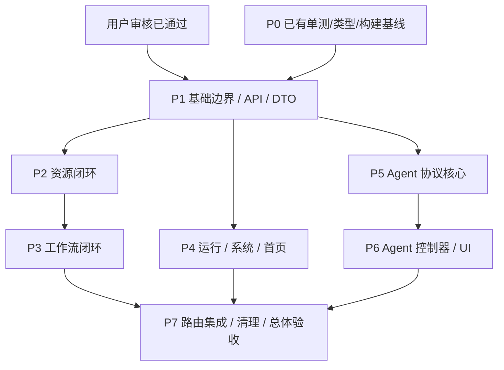

# 前端架构实施任务 DAG

状态：**用户已明确审核 tasks 并授权继续实施，可启动 P1。** 用户随后指定所有任务只在 `/mnt/d/code/LogAgent` 内执行，不再使用或新建其他文件夹/worktree。P0 已有单测、类型与构建证据；浏览器环境等缺口继续补齐，不将其写成已通过。

本文件是唯一执行清单；work-packages 仅写依据、交接和证据，不再维护复选框。架构真源为 [原设计](../design-frontend-architecture/design.md) §1–§12；本 change 的 [design.md](design.md) 是引用索引。原 proposal/design 均不修改。本轮审核事实和执行路径变更记录在本 tasks，覆盖旧 proposal/design 中与当前执行位置不一致的阶段说明；不修改原文，不改变架构决策。

## 执行边界与基线

- **当前唯一工作目录为 `/mnt/d/code/LogAgent`**，branch `refactor/frontend-architecture`；主代理已将该 branch/规划提交 `643e1b5` 接回本目录，原有后端未提交修改保留；接回时主代理已逐字节核对原前端未提交内容与已接纳基线一致。所有 worker 就地工作，不创建其他工作目录/worktree，旧 `/mnt/d/code/LogAgent-frontend-architecture` 已通过 `git worktree remove` 正常移除，不再使用。这是用户审核计划后的明确约束，取代原隔离工作区安排。
- 历史前端/设计快照为 `4e3c524f799edd079356f8c3975632b7968fccbd`，源 HEAD `cb01cd6` 加当时未提交的前端源码。P0 在旧独立工作区取得的结果保留原日期、路径和测试环境语义，不能据此声称当前目录或变化中的后端仍完全相同。旧清单 `/tmp/logagent-frontend-architecture-original-manifest.json` 仅作历史证据，不作为要求共享工作区保持全局不变的检查门槛。
- 后端正由另一任务重构双向 channel，本前端任务不修改、还原、复制、暂存或提交该任务的后端文件，也不要求后端总 hash/dirty 状态不变。主代理对本任务每一个 commit 审查暂存路径与 diff，明确排除后端和其他任务文件；不得用“工作区全局无变化”替代本任务提交边界检查。
- 真实契约/E2E 按测试当时的后端 HEAD、dirty 路径与相关协议状态记录，使用 `/mnt/d/code/LogAgent/src`、临时数据与受控模型/外网依赖。channel 接口若与已授权前端契约不兼容，明确报告端点/信封/事件差异及受影响用例，不干预后端任务，不添加静默 fallback；可继续的前端针对性测试照常推进，不能把协议不兼容写成已通过。
- 业务代码实施/复核委派 **GPT-6 Astra / xhigh**；GPT-5.5 / xhigh 可承担只读调查、测试与验证。所有 shell 命令前缀 `rtk`。共享目录按文件所有权并发：派工前锁定可写路径，公共文件交给唯一集成 worker 串行修改，不同 worker 不同时编辑同一文件；所有 worker **禁止切 branch、stash、reset、创建 worktree 或 commit**，遇到非本人修改保持原样并报告协调者。
- 每包完成针对性检查后由主代理审查、精确暂存并分批 commit；沿用仓库现有 post-commit 自动推送钩子，**不得通过覆盖 hooksPath 跳过**。worker 提交的是可审核 diff 和证据，不自行操作提交；`.venv`、运行数据及其他任务文件不得混入本任务提交。

## 根因、方案和规模

根因是页面/组件同时拥有请求、草稿、跨模块保存及展示，DTO 与接口边界平铺，Agent 路由 key 又会销毁输入拥有者。这属于原设计 §2、§3、§5 所述结构性问题。仅移动目录的最小方案会保留重复状态和双向依赖，因此采用工厂注入、唯一状态拥有者、公开模块边界和分职责 SFC；不新增后端规则、全局缓存或第二套产品。

每包预计阅读/实现/自检上下文为约 50k–180k token，均以小于 200k 为拆分目标，属于粒度估计而非完成承诺。超出时按现有编号拆为顺序子阶段并补任务依据，不让 worker 在失去上下文时继续盲写，也不复制新清单。完整测试结果和中途提交写在所属工作包的证据区，根框仅在证据成立后更新。

## DAG 与调度

| 包 | 前置条件 | 主要独占范围（frontend/ 下） | 交接出口 | 预计上下文 |
| --- | --- | --- | --- | --- |
| P0 | 历史基线快照 + 当前测试环境 | 无业务代码；work-packages/P0-baseline.md | 基线结果、测试时后端 HEAD/dirty、启动方式、已知失败 | 50k–90k |
| P1 | 用户审核已通过 + P0 单测/type/build 证据 | app、shared、全部模块 api/DTO/public 初建、基础查询、旧 API/type 过渡、构建/依赖/边界规则 | HttpClient、ApiError、模块工厂/DI、查询生命周期、DTO 唯一归属 | 130k–180k |
| P2 | P1 | modules/resources、pages/resources、资源 UI/模型/测试；pages/integrations/useSourceUsage.ts | SourceConfigEditor、保存目标联合类型、资源控制器；资源公开 API 冻结 | 100k–160k |
| P3 | P2 | modules/workflows、pages/workflows、工作流 UI/模型/测试 | 唯一草稿、来源操作、工作流列表/编辑控制器 | 100k–160k |
| P4 | P1 | modules/runs、modules/system、pages/runs、pages/plugins、pages/dashboard 及测试 | 运行上下文/操作、版本报告、诊断控制器、首页装配 | 120k–180k |
| P5 | P1 | modules/agents 的 api/model、useAgentSession 与流/投影测试 | 单一 stream transport/reducer、Web 命令/文件 API；锁定类型 | 100k–150k |
| P6 | P5 | modules/agents 的 commands/files/其他 composables 与 ui、pages/agents 及测试 | 稳定路由作用域、命令/输入/文件控制器、完整 Agent 页面 | 120k–180k |
| P7 | P3 + P4 + P6 | 中央 app/router/bootstrap、pages/integrations/ContinueInAgent.vue、剩余旧目录删除、E2E/README/最终检查 | 全路由切换、零过渡出口、验证报告与提交链 | 100k–170k |

P1 完成后最多同时运行 P2/P4/P5 三名实施 worker，在同一 `/mnt/d/code/LogAgent` 目录按独占文件范围并发；公共文件需要集成 worker 时由主代理调整槽位并串行交接；P2 完成即可启动 P3，P5 完成即可启动 P6，不必等待无依赖分支。P1 前不并行移动 DTO/API；P5 与 P6 不同时编辑 Agent 实现。P4 只消费 P1 已冻结的 workflows 列表公开接口，因此与 P3 无文件或实现依赖。

## 并发与公共接口交接

1. P1 一次建立 DTO 所有者：resources 拥有来源/供应商/渠道/凭据与资源侧 override 输入；workflows 拥有 WorkflowDefinition/编辑草稿/使用位置投影；runs 拥有 Session/Phase/Report；agents 拥有会话/命令/事件/文件；system 拥有能力/健康。shared/types 仅 JSON/错误等无业务类型。按 `workflows → resources/public.ts` 表达唯一允许的模块关系；移除把 workflows 混进资源 CRUD 的 ResourceMap。不得将同一 DTO 同时留在新旧目录。
2. P1 提供注入 HTTP 的 `createResourcesApi/createWorkflowsApi/createRunsApi/createAgentsApi/createSystemApi`、各模块 injection key/require hook、共享 Query 状态，并实现、测试和冻结 runs 的最小 `trigger/cancel` 页面动作控制器（触发输入为 Workflow ID/运行选项，取消输入为 session ID，输出为显式成功/失败/未知结果；具体 sessions 轮询、恢复和报告仍由 P4 实现）。名称可按实际统一，但交付时写明导出签名和调用样例。公开入口不得创建请求/可变单例；模块内部不反向 import 自己的 barrel。
3. P1 同时交付后续并行包需要的最小稳定接口：system 的能力查询控制器；workflows 的列表查询和来源使用位置纯投影；resources 自定义 `SourceUsageView` 与 API 无关编辑 gateway 类型。P2/P4 从这些公开出口消费，不私自从旧 domain 取跨模块事实。查询内部的进一步整理由其后续所有者负责，避免临时页面直调具体 API。
4. P1 选择显式 `useAsyncTask` 结果约定并迁移所有当时调用方，结果须区分成功（含 void）、失败与忙碌拒绝。Query 在最新响应被接纳时记录读取时间，身份变化清旧值，同身份失败保留旧值及错误。只演进既有原语，不另写同义 hook。旧路径只允许 re-export 或唯一已装配实例的临时别名，记录逐条删除责任；P7 必须清零。
5. P2 冻结 `SourceConfigEditor` 的只读值/命名动作、`shared-resource | workflow-draft` 区分联合及最小 gateway。P3 通过该契约组合，资源 UI 不能决定保存到哪里。P5 冻结 session/turn/event/request/file 类型及 transport/reducer/useAgentSession 接口后，P6 才实现命令/文件/UI 控制器；历史/快照/SSE 顺序与 generation 仅由 P5 提取的 useAgentSession 拥有，P6 直接复用。
6. `package.json`/锁文件、vite/tsconfig、全局样式、components.d.ts、app/router/bootstrap、统一架构规则由集成协调者持有；P1 首次创建，P2–P6 仅提交所需变更片段和依据。app/router/bootstrap、共享配置/规则和其他公共文件由 GPT-6 Astra xhigh 集成 worker 按锁定范围修改；主代理只负责协调、汇总各 worker 的就地 diff、审查和最终提交，不能直接代写公共文件。路由切换时协调者接入已完成 Page 并删除对应旧 View，未完成路由继续旧实现；不得维护 /v2 或两份运行状态。
7. 旧平铺测试随 P1 迁移传输/类型后交给所属包，P2–P6 仅修改自己列明的测试；共享 test helper、Playwright config 和最终 E2E 由 P7/协调者修改。每包交接记录导出、删除/保留的旧路径、测试命令、commit 与下游需要注意的限制。公共 API 调整必须先通知消费者，不能由并行 worker 各建兼容实现；共享目录中不得互相覆盖修改。

## 默认值与历史规范差异

| 决策 / 默认值 | 依据与执行方式 |
| --- | --- |
| Axios `/api`、timeout 0、无自动重试 | 原设计 §8.1、§12.2；继承同源与未设置统一浏览器期限，取消贯通 AbortSignal，不推导后台未执行 |
| 不引入 Pinia/TanStack Query/其他缓存库 | 用户已授权技术选择及原设计 §1、§5；页面唯一查询拥有者、显式 refresh 与稳定作用域 |
| 运行轮询 2000ms，请求完成后计时 | 原 useSession 与原设计 §12.2；保持非重叠和终态/错误停止 |
| SSE 500ms 指数退避，上限 5000ms | 原 useAgentStream 与原设计 §7/§12.2；关闭原连接后单一手动重连，不叠加原生重连 |
| 不增加 300 秒无消息取消 | 原设计 §12.2；浏览器连接不拥有后台 turn 终态，不凭心跳判断业务结束 |
| 来源 60s、渠道 30s、AI 600s/5 次重试、并发 4 | 原设计 §12.2、现有前端工厂及只读 src/logagent/models.py；显式工厂默认，不做第二层隐式补值 |
| 首页运行 limit 5 | 原设计 §3.3 与现有页面；保持展示范围 |
| 375px、44px 触控、AA/核心 AAA | 原设计 §9 与既有 frontend spec；实际浏览器验证，不用组件快照替代 |
| 后端单测每命令 60s 硬超时 | 用户 AGENTS.md；纯结构修改不跑无关后端全量测试 |
| 不恢复处理模板 CRUD | 原设计 §2.1 引用 production-integration 任务的后续用户决策；旧 redesign-collector-configuration spec 尚有相反表述，仅登记并以本增量说明已接受行为，不暗改旧文档 |
| sessions 与统一 Web 渠道 | 原设计 §2.1、§7.1；运行使用 /api/sessions，Agent 执行/SSE 使用 /api/channels/web；旧文档 /api/runs/直接消息执行入口不作为迁移目标 |

## 1. P0 — 基线与契约差异

依据和证据位置：[P0-baseline.md](work-packages/P0-baseline.md)。本包是只读调查；用户审核已通过，历史 P0 未完成项继续保留，不阻止已有证据支持的 P1 实施。

- [x] 1.1 记录前端快照 commit、历史独立工作区与当前就地执行边界、后端并行任务隔离；以本文件基线段及 `4e3c524`/`643e1b5` 核对。
- [ ] 1.2 记录基线单测、typecheck、format、build、适用 E2E/真实浏览器结果及已有失败；每项附命令、退出码和复现环境，不将未运行项写通过。
- [ ] 1.3 记录入口 JS/chunk、首屏请求数、长会话样本及每次真实契约测试的后端 HEAD/dirty/相关协议状态；验证后续可在同环境比较，并将历史规范差异与实际端点核对入证据，不要求变化中的后端保持全局 hash 不变。
- [x] 1.4 用户已明确审核本 tasks 并授权继续，随后指定仅在 `/mnt/d/code/LogAgent` 就地执行。P0 单测 28 文件/140 项、typecheck/build 已通过；浏览器因缺 `libnspr4.so` 尚未进入测试步骤，其他缺口留在 1.2/1.3 补齐。现有证据可支持 P1 启动，不将环境阻塞伪装为产品通过。

## 2. P1 — 基础边界、统一 API 与 DTO

依据和交接：[P1-foundation.md](work-packages/P1-foundation.md)；对应原设计 P1/P2。退出后允许 P2/P4/P5 并行。

- [ ] 2.1 建立 app/shared 及模块类型/API 所有权，迁移公共 UI/Schema/异步原语，保持旧路由可用；以类型检查和现有 Schema/Query 单测验证无重复 DTO 或第二实现。
- [ ] 2.2 安装 Axios 并实现单一 HTTP 工厂、注入式模块 API、严格 JSON/204/503/error/header/params/signal 契约；迁移所有 fetch mock 测试并用受控 Axios adapter 验证真实请求适配、一次序列化、取消和无自动重试。
- [ ] 2.3 一次迁移 async action 结果契约与调用方，完善 Query 身份/读取时间语义，拆分业务错误字段映射；用 void 成功、失败、忙碌、A 慢于 B/卸载/刷新失败用例验证。
- [ ] 2.4 提供能力查询、工作流列表/使用位置、runs 最小 trigger/cancel 页面动作控制器（含可运行实现）、资源 gateway 等并行前置公开接口和应用装配；输出签名/调用样例，以消费者类型检查及缺失注入明确报错验证。
- [ ] 2.5 建立覆盖 TS/Vue SFC、相对路径、type-only、动态 import 的单一架构规则；对新增结构执行边界检查，用故意违规样例验证 checker 能发现违反依赖方向与 model 纯度。
- [ ] 2.6 按单测→type/static→build→真实最小浏览器顺序验证，记录过渡出口/删除包号并提交基础批次；提交后旧入口仍可运行，才交接 P2/P4/P5。

## 3. P2 — 资源闭环

依据和交接：[P2-resources.md](work-packages/P2-resources.md)。

- [ ] 3.1 迁移 resources 模型、列表/编辑控制器和 ResourcesPage，将分类导航/筛选/列表/供应商/通知/编辑器拆为独立 SFC；用局部错误、同屏共享查询与切换实体测试验证状态所有权。
- [ ] 3.2 提取唯一 SourceConfigEditor、保存目标联合类型及 gateway，清除资源模块对 workflows/system 的导入；以同编辑器两种保存目标和 API 调用范围测试验证。
- [ ] 3.3 保留凭据保护、Schema/高级 JSON、模型目录、停用/旧引用语义，pages 组合使用位置；以保存失败留草稿、刷新不覆盖及引用未知状态测试验证。
- [ ] 3.4 按验证顺序完成资源窄屏烟测与提交，冻结 P3 编辑器/API 合同；记录公开签名、临时出口与移除的旧 View/组件，类型检查确保 P3 可直接消费。

## 4. P3 — 工作流闭环

依据和交接：[P3-workflows.md](work-packages/P3-workflows.md)。

- [ ] 4.1 建立唯一 useWorkflowEditor 与纯草稿动作，拆分基本信息/阶段导航/来源/分析/汇聚/通知和 SourceStepCard 内部子区块；以阶段切换、合法任务改名及引用更新用例验证。
- [ ] 4.2 将来源异步操作移出 UI，组合 P2 资源 gateway，实现共享/独立/resolve 脱离/恢复/发布；验证独立配置不调用资源 PUT，资源成功与工作流未保存分别展示。
- [ ] 4.3 将使用位置投影归 workflows，当前草稿替换服务端同 ID 快照，页面共享目录且返回窗口刷新清理监听；用查询失败、迟到响应、刷新保留草稿和绑定语义测试验证。
- [ ] 4.4 工作流列表只发运行意图，pages 消费 P1 已实现并冻结的 runs 最小 trigger/cancel 公开动作控制器（P4 再扩展 sessions/恢复/报告能力）；按验证顺序完成新增→编辑→保存回读烟测与提交，删除被替代旧实现。

## 5. P4 — 运行、系统与首页闭环

依据和交接：[P4-runs-system-dashboard.md](work-packages/P4-runs-system-dashboard.md)。

- [ ] 5.1 迁移 runs 列表/详情/阶段控制器、轮询和报告纯模型，SessionTable/状态/阶段面板只接结果和动作；验证固定 (session_id, version, stage)、迟到响应、非重叠轮询及分项失败。
- [ ] 5.2 迁移 system 诊断与重载控制器和 PluginsPage，维持 capabilities 唯一解释；验证合法健康 503 与错误信封、重载失败及查询独立性。
- [ ] 5.3 按原设计 §3.3 落地 DashboardMetrics/MetricCard、RecentRunsPanel 与健康/插件/组件面板，useDashboard 只组合模块控制器；验证 limit 5、一次健康请求、独立失败/读取时间与统一刷新。
- [ ] 5.4 暴露 runs 的运行操作及只读已加载上下文，续接只发页面事件；按验证顺序完成运行→报告/恢复资格→首页局部失败烟测和提交，不在 runs 导入 agents。

## 6. P5 — Agent 协议核心

依据和交接：[P5-agent-protocol.md](work-packages/P5-agent-protocol.md)。

- [ ] 6.1 从旧 useAgentStream/API 提取注入式 EventSource transport、信封解析、纯 session/transcript 投影；用同一事件样本对比迁移前后输出，验证事件去重和未知事件诊断。
- [ ] 6.2 提取 agents/composables/useAgentSession.ts 作为唯一会话生命周期实现，落实历史→当前快照→SSE 顺序、generation 隔离与单一重连，旧 turn 终态不结束当前轮；以断线回放、迟到回调、非法已知事件和游标接纳用例验证。
- [ ] 6.3 核对 Web 命令 envelope、request ID/payload、停止、分支和文件 ETag 真实契约，保持 API DTO 单一定义；使用受控模型/临时数据及 60s 后端测试超时验证所需契约。
- [ ] 6.4 记录 P6 所需的 transport/reducer/API 签名与状态语义，按验证顺序完成可运行旧 Agent 页烟测和提交；交接后才允许 P6 修改相同模块。

## 7. P6 — Agent 控制器、UI 与稳定会话作用域

依据和交接：[P6-agent-ui.md](work-packages/P6-agent-ui.md)。

- [ ] 7.1 复用 P5 的 useAgentSession，分离 commands/files 控制器，输入与未知请求按 session 保存，send/stop 状态独立；用修改后新 ID、同内容重试、切换迟到回执、失败保留输入测试验证。
- [ ] 7.2 拆分 AgentPage、侧栏/Header/Transcript/消息项/ToolCall/Composer/SlashMenu/分支/文件/设置及独立表单；验证组件命名动作落到唯一控制器，无第二消息数组或巨型 Content/usePage。
- [ ] 7.3 页面共享唯一配置查询，设置保存后刷新；文件控制器保留 ETag 冲突与草稿，默认模型缺失显式处理；用配置请求次数、冲突和未保存输入测试验证。
- [ ] 7.4 向协调者提交稳定 Agent route key 集成变更，在真实 App/router 验证 A→B→A 输入隔离与离开清理，补停止/分支/长消息/375px 烟测并按顺序提交；仅 mount 页面不足以验收。

## 8. P7 — 集成、清理与整体验收

依据和证据：[P7-integration-validation.md](work-packages/P7-integration-validation.md)。

- [ ] 8.1 串行完成 app/router/bootstrap 与 ContinueInAgent 页面集成，复用已加载运行记录，全部旧 URL/query/懒加载和 collector-demo 重定向保持；以跨模块流程和实际导航验证。
- [ ] 8.2 清零过渡 re-export/旧实现/总 DTO 桶/废弃目录与无引用 Demo，补前端 README；通过引用图、全量类型检查和架构规则验证无循环/深层 import、SFC 无具体 HTTP/SSE、model 无 Vue/UI/网络依赖。
- [ ] 8.3 顺序执行完整前端单测、typecheck/format/架构检查、build、Playwright 回归，核对应用普通 HTTP 无直接 fetch；只保留明确标注的 SSE 测试探针和框架 route.fetch 例外，记录退出码及基线差异。
- [ ] 8.4 用真实浏览器验证资源→工作流→运行→版本报告→Agent 续接、Agent 真路由切换、375px/触控/长会话；对照 P0 比较入口 chunk、首屏请求与交互，不凭目录变化宣称性能改善。
- [ ] 8.5 审查 diff 的重复事实/隐式 fallback/吞错/未声明行为变化，并逐个核验本任务 commit 的路径与 diff，排除后端及其他任务文件；不要求并行后端任务的 hash/dirty 不变。记录提交链、包级回退依赖、契约差异及剩余限制，运行 OpenSpec 严格校验后由主代理完成最终前端提交。其他 change 未整体验收时不得顺带归档。

## 规划验证记录

2026-09-24：`rtk proxy openspec validate refactor-frontend-architecture --strict --no-interactive` 通过；本 change 13 个 Markdown 文件的相对链接/行尾空白检查通过；`rtk git diff --check` 通过；原设计 proposal.md/design.md 与基线 4e3c524 内容逐字一致。历史原设计中的既有缺链不在本 change 修复范围。该记录为规划阶段验证，不能替代后续代码验收。用户随后已明确审核通过；当前执行目录、共享文件所有权和后端并行任务隔离按本 tasks 的最新执行边界实施。

2026-09-24 执行约束更新验证：在 `/mnt/d/code/LogAgent` 执行 OpenSpec strict 通过；本次指定文档的 `git diff --check` 通过。仅修改根 tasks、8 份工作包和原设计 tasks 的移交段，proposal/design 未修改；未操作 branch、stash、reset 或 commit。
